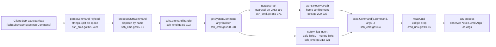

# SFTPGo SSH exec — security boundary audit (argv evidence)

## Scope & method

This document is a **read-only security audit** of SFTPGo's optional SSH exec support — the code path that executes client-supplied commands (such as `rsync` and the `git-*-pack` family) through the embedded SSH server and dispatches them via `processSSHCommand`. It proves or disproves three specific user suspicions with **reproducible runtime argv evidence**, not theory:

- **Suspicion A:** the server "ends up executing the command as a 'shell-like string'."
- **Suspicion B:** the path guardrails and safety flags are "more of a superficial patch than a real policy."
- **Suspicion C:** "the destination that reaches the process might still look a lot like what the client sent," even for weird/adversarial input.

Every behavioral claim below is paired with the **specific observed output line** that demonstrates it (one-claim-one-evidence), and every literal (function name, flag string, file path, line number, log string) is cited **exactly** with its `file:line` reference. The answer was authored from observed runtime output — **run-before-write** — not from reading alone. The source repository is left **unchanged**; the proof (a clean `git status` plus unchanged `sha256sum` of `go.mod`/`go.sum`) is in the "Repository left unchanged" section.

### Reproduction environment (observed exactly)

- **Repo (investigation copy):** `/tmp/blitzy/sftpgo/sftpgo_44634210287c_d62cba`, branch `sftpgo_44634210287c`.
- **Toolchain:** `go version go1.13.15 linux/amd64`, `GO111MODULE=on`. Declared: `go.mod:3` = `go 1.13`; `.travis.yml:8` = `- "1.13.x"`. Built at repo root with `go build` (there is no Makefile), producing the `sftpgo` binary (`SFTPGo version: 0.9.5-dev`). `GOFLAGS=-mod=readonly` was set so `go` could never edit `go.mod`/`go.sum`.
- **System tools installed for the OS-process path** (absent in the base image): `rsync  version 3.4.1  protocol version 32` and OpenSSH client `OpenSSH_10.0p2 Ubuntu-5ubuntu5.4, OpenSSL 3.5.3 16 Sep 2025`. The git `*-pack` binaries were already on `PATH`. (These are the exact `rsync`/OpenSSH versions observed in this reproduction environment. The tool versions do not affect any argv in this document, because the argv is constructed entirely by SFTPGo's Go code in `getSystemCommand` (`sftpd/ssh_cmd.go:288-331`) before `exec.Command` runs, not by `rsync` or `ssh`; the four-cell argv was re-observed byte-for-byte identical under this `rsync 3.4.1` — see the §2A cells, where `EXEC_PATH` resolves to `/usr/bin/rsync`.)

### Three observation techniques (all produced consistent argv)

1. **In-process `*exec.Cmd.Args`.** A throwaway in-package `sftpd` test (modeled on the existing `TestRsyncOptions` in `sftpd/internal_test.go:772-816`, which builds `sshCommand{command: "rsync", ...}`, calls `getSystemCommand()`, and inspects `cmd.cmd.Args`) constructed an `sshCommand`, called the unexported `getSystemCommand()`, and printed the resulting `*exec.Cmd.Args`. This reveals the exact argv the server hands to the OS, deterministically, without needing a real target binary.
2. **Process-boundary `os.Args`.** A fake executable named `rsync` (at `/tmp/fakebin/rsync`, placed first on `PATH`) recorded its own `os.Args`; the harness called `getSystemCommand()` then `cmd.Run()`, and compared the in-process `*exec.Cmd.Args` to the `os.Args` the child actually received. (`exec.Command` resolves `rsync`/`git-*-pack` via `PATH`/`LookPath`, which is exactly what this exploits.)
3. **Live end-to-end.** The real `sftpgo` binary was run in `portable` mode as two virtual users; a real OpenSSH client drove SSH `exec` requests; the same fake `rsync` (first on the server's `PATH`) captured `os.Args`.

**All three techniques AGREE.** Every harness/artifact lived **outside** the source tree (under `/tmp/...`) and was ephemeral; none was committed. The final `git status` proof is at the end.

---

## 1. The security boundary of SSH exec support (every mechanism, by name)

This section traces the argv-construction chain by name, each with its exact `file:line` and a verbatim code quote.

### 1.1 Dispatch — `processSSHCommand`

SSH `"exec"` requests are routed to `processSSHCommand`. The dispatch is at `sftpd/server.go:326-327`:

```go
case "exec":
    ok = processSSHCommand(req.Payload, &connection, channel, c.EnabledSSHCommands)
```

The gating list is the `EnabledSSHCommands []string` field, documented at `sftpd/server.go:97-99`:

```go
// The following SSH commands are enabled by default: "md5sum", "sha1sum", "cd", "pwd".
// "*" enables all supported SSH commands.
EnabledSSHCommands []string `json:"enabled_ssh_commands" mapstructure:"enabled_ssh_commands"`
```

The `"*"` wildcard is expanded by `checkSSHCommands` at `sftpd/server.go:396-400`:

```go
func (c *Configuration) checkSSHCommands() {
    if utils.IsStringInSlice("*", c.EnabledSSHCommands) {
        c.EnabledSSHCommands = GetSupportedSSHCommands()
        return
    }
```

### 1.2 The exec payload struct — `sshSubsystemExecMsg`

The client's command arrives as a single string field, `sshSubsystemExecMsg{ Command string }` at `sftpd/sftpd.go:126-128`:

```go
type sshSubsystemExecMsg struct {
    Command string
}
```

### 1.3 `parseCommandPayload` — the naive tokenizer (`sftpd/ssh_cmd.go:423-429`)

```go
func parseCommandPayload(command string) (string, []string, error) {
    parts := strings.Split(command, " ")
    if len(parts) < 2 {
        return parts[0], []string{}, nil
    }
    return parts[0], parts[1:], nil
}
```

This splits **only** on the ASCII space — `strings.Split(command, " ")` at `sftpd/ssh_cmd.go:424`. There is **no** quote handling, **no** escape handling, and **no** shell tokenization. `parts[0]` is the command name; `parts[1:]` are the args.

### 1.4 `processSSHCommand` — unmarshal, parse, log, gate, dispatch (`sftpd/ssh_cmd.go:45-81`)

```go
func processSSHCommand(payload []byte, connection *Connection, channel ssh.Channel, enabledSSHCommands []string) bool {
    var msg sshSubsystemExecMsg
    if err := ssh.Unmarshal(payload, &msg); err == nil {
        name, args, err := parseCommandPayload(msg.Command)
        connection.Log(logger.LevelDebug, logSenderSSH, "new ssh command: %#v args: %v user: %v, error: %v",
            name, args, connection.User.Username, err)
        if err == nil && utils.IsStringInSlice(name, enabledSSHCommands) {
```

It unmarshals the payload (`sftpd/ssh_cmd.go:46-47`), calls `parseCommandPayload` (`sftpd/ssh_cmd.go:48`), emits the `"new ssh command: %#v args: %v user: %v, error: %v"` debug line (`sftpd/ssh_cmd.go:49-50`), and — only if `utils.IsStringInSlice(name, enabledSSHCommands)` (`sftpd/ssh_cmd.go:51`) — dispatches. `scp` gets a `scpCommand`; everything else gets `sshCommand{...}.handle()` launched in a goroutine.

### 1.5 `sshCommand.handle` — route by command class (`sftpd/ssh_cmd.go:83-103`)

```go
func (c *sshCommand) handle() error {
    addConnection(c.connection)
    defer removeConnection(c.connection)
    updateConnectionActivity(c.connection.ID)
    if utils.IsStringInSlice(c.command, sshHashCommands) {
        return c.handleHashCommands()
    } else if utils.IsStringInSlice(c.command, systemCommands) {
        command, err := c.getSystemCommand()
        if err != nil {
            return c.sendErrorResponse(err)
        }
        return c.executeSystemCommand(command)
    } else if c.command == "cd" {
        c.sendExitStatus(nil)
    } else if c.command == "pwd" {
        // hard coded response to "/"
        c.connection.channel.Write([]byte("/\n"))
        c.sendExitStatus(nil)
    }
    return nil
}
```

`sshHashCommands` route to `handleHashCommands()` (`sftpd/ssh_cmd.go:87-88`); `systemCommands` route to `getSystemCommand()` then `executeSystemCommand()` (`sftpd/ssh_cmd.go:89-94`); `cd` is a no-op exit (`sftpd/ssh_cmd.go:95-96`); `pwd` writes a hard-coded `"/\n"` (`sftpd/ssh_cmd.go:97-100`).

The command classes are defined at `sftpd/sftpd.go:66-70`:

```go
supportedSSHCommands = []string{"scp", "md5sum", "sha1sum", "sha256sum", "sha384sum", "sha512sum", "cd", "pwd",
    "git-receive-pack", "git-upload-pack", "git-upload-archive", "rsync"}
defaultSSHCommands = []string{"md5sum", "sha1sum", "cd", "pwd"}
sshHashCommands    = []string{"md5sum", "sha1sum", "sha256sum", "sha384sum", "sha512sum"}
systemCommands     = []string{"git-receive-pack", "git-upload-pack", "git-upload-archive", "rsync"}
```

**Only the four `systemCommands`** (`git-receive-pack`, `git-upload-pack`, `git-upload-archive`, `rsync`) reach `exec.Command`. rsync and the git commands are **not** in `defaultSSHCommands` (`sftpd/sftpd.go:68`), so they must be explicitly enabled via `enabled_ssh_commands` (or the `"*"` wildcard). Hash commands and `cd`/`pwd` are handled purely in Go.

### 1.6 SCP bounds the OS-process surface (`sftpd/scp.go`)

`sftpd/scp.go` contains **no** `exec.Command` and does **not** import `os/exec` — verified by grep (no match):

```
$ grep -n 'os/exec\|exec\.Command' sftpd/scp.go
NO os/exec or exec.Command in scp.go
```

SCP is implemented entirely in-process. Therefore the OS-process surface is **exactly** the four `systemCommands`.

### 1.7 `sshCommand.getSystemCommand` — THE argv builder (`sftpd/ssh_cmd.go:288-331`)

```go
func (c *sshCommand) getSystemCommand() (systemCommand, error) {
    command := systemCommand{
        cmd:      nil,
        realPath: "",
    }
    args := make([]string, len(c.args))
    copy(args, c.args)
    var path string
    if len(c.args) > 0 {
        var err error
        sshPath := c.getDestPath()
        path, err = c.connection.fs.ResolvePath(sshPath)
        if err != nil {
            return command, err
        }
        args = args[:len(args)-1]
        args = append(args, path)
    }
    if c.command == "rsync" {
        // we cannot avoid that rsync create symlinks so if the user has the permission
        // to create symlinks we add the option --safe-links to the received rsync command if
        // it is not already set. This should prevent to create symlinks that point outside
        // the home dir.
        // If the user cannot create symlinks we add the option --munge-links, if it is not
        // already set. This should make symlinks unusable (but manually recoverable)
        if c.connection.User.HasPerm(dataprovider.PermCreateSymlinks, c.getDestPath()) {
            if !utils.IsStringInSlice("--safe-links", args) {
                args = append([]string{"--safe-links"}, args...)
            }
        } else {
            if !utils.IsStringInSlice("--munge-links", args) {
                args = append([]string{"--munge-links"}, args...)
            }
        }
    }
    c.connection.Log(logger.LevelDebug, logSenderSSH, "new system command %#v, with args: %v path: %v", c.command, args, path)
    cmd := exec.Command(c.command, args...)
    uid := c.connection.User.GetUID()
    gid := c.connection.User.GetGID()
    cmd = wrapCmd(cmd, uid, gid)
    command.cmd = cmd
    command.realPath = path
    return command, nil
}
```

Key facts:

- It copies the parsed args: `args := make([]string, len(c.args)); copy(args, c.args)` (`sftpd/ssh_cmd.go:293-294`).
- It rewrites **only the LAST token** as the destination path: `sshPath := c.getDestPath()` (`sftpd/ssh_cmd.go:298`) → `path, err = c.connection.fs.ResolvePath(sshPath)` (`sftpd/ssh_cmd.go:299`) → `args = args[:len(args)-1]` (`sftpd/ssh_cmd.go:303`) → `args = append(args, path)` (`sftpd/ssh_cmd.go:304`).
- The rsync-only safety flag (`sftpd/ssh_cmd.go:306-322`) is permission-dependent: `--safe-links` is prepended via `args = append([]string{"--safe-links"}, args...)` (`sftpd/ssh_cmd.go:315`) when `c.connection.User.HasPerm(dataprovider.PermCreateSymlinks, c.getDestPath())` (`sftpd/ssh_cmd.go:313`) is true, otherwise `--munge-links` is prepended via `args = append([]string{"--munge-links"}, args...)` (`sftpd/ssh_cmd.go:319`). Each is added only "if it is not already set" — the `!utils.IsStringInSlice(...)` guards at `sftpd/ssh_cmd.go:314` and `sftpd/ssh_cmd.go:318`.
- It emits the built-in debug line at `sftpd/ssh_cmd.go:323`: `"new system command %#v, with args: %v path: %v"`.
- **The actual spawn is `cmd := exec.Command(c.command, args...)` at `sftpd/ssh_cmd.go:324`** — a direct execve, **no shell**.
- Privilege wrap: `uid := c.connection.User.GetUID()` (`sftpd/ssh_cmd.go:325`), `gid := c.connection.User.GetGID()` (`sftpd/ssh_cmd.go:326`), `cmd = wrapCmd(cmd, uid, gid)` (`sftpd/ssh_cmd.go:327`).

### 1.8 `sshCommand.getDestPath` — the path guardrail on the LAST arg only (`sftpd/ssh_cmd.go:355-371`)

```go
// for the supported command, the path, if any, is the last argument
func (c *sshCommand) getDestPath() string {
    if len(c.args) == 0 {
        return ""
    }
    destPath := strings.Trim(c.args[len(c.args)-1], "'")
    destPath = strings.Trim(destPath, "\"")
    destPath = filepath.ToSlash(destPath)
    if !path.IsAbs(destPath) {
        destPath = "/" + destPath
    }
    result := path.Clean(destPath)
    if strings.HasSuffix(destPath, "/") && !strings.HasSuffix(result, "/") {
        result += "/"
    }
    return result
}
```

Each transform: it trims a single leading/trailing `'` (`sftpd/ssh_cmd.go:360`) then `"` (`sftpd/ssh_cmd.go:361`); `filepath.ToSlash` (`sftpd/ssh_cmd.go:362`); prepends `/` if not absolute (`sftpd/ssh_cmd.go:363-365`); `path.Clean` collapses `..`/`.` (`sftpd/ssh_cmd.go:366`); and preserves a trailing `/` (`sftpd/ssh_cmd.go:367-369`). The comment at `sftpd/ssh_cmd.go:355` states that **only the LAST argument** is treated as a path — OPTION tokens (leading-dash) are **never** touched.

### 1.9 `OsFs.ResolvePath` — the real path boundary (home confinement) (`vfs/osfs.go:200-223`)

```go
func (fs OsFs) ResolvePath(sftpPath string) (string, error) {
    if !filepath.IsAbs(fs.rootDir) {
        return "", fmt.Errorf("Invalid root path: %v", fs.rootDir)
    }
    r := filepath.Clean(filepath.Join(fs.rootDir, sftpPath))
    p, err := filepath.EvalSymlinks(r)
    if err != nil && !os.IsNotExist(err) {
        return "", err
    } else if os.IsNotExist(err) {
        // The requested path doesn't exist, so at this point we need to iterate up the
        // path chain until we hit a directory that _does_ exist and can be validated.
        _, err = fs.findFirstExistingDir(r, fs.rootDir)
        if err != nil {
            fsLog(fs, logger.LevelWarn, "error resolving not existent path: %#v", err)
        }
        return r, err
    }

    err = fs.isSubDir(p, fs.rootDir)
    if err != nil {
        fsLog(fs, logger.LevelWarn, "Invalid path resolution, dir: %#v outside user home: %#v err: %v", p, fs.rootDir, err)
    }
    return r, err
}
```

This joins the (cleaned) destination under the user's home root — `r := filepath.Clean(filepath.Join(fs.rootDir, sftpPath))` (`vfs/osfs.go:204`) — resolves symlinks with `filepath.EvalSymlinks(r)` (`vfs/osfs.go:205`), walks up via `findFirstExistingDir(r, fs.rootDir)` for a not-yet-existing path (`vfs/osfs.go:208-215`), and confines the result with `err = fs.isSubDir(p, fs.rootDir)` (`vfs/osfs.go:218`), logging `"Invalid path resolution, dir: %#v outside user home: %#v err: %v"` (`vfs/osfs.go:220`) if the resolved path escapes the home root.

### 1.10 `wrapCmd` — the uid/gid privilege drop (`sftpd/cmd_unix.go:10-16`, `sftpd/cmd_windows.go:7-9`)

Unix (`sftpd/cmd_unix.go:10-16`):

```go
func wrapCmd(cmd *exec.Cmd, uid, gid int) *exec.Cmd {
    if uid > 0 || gid > 0 {
        cmd.SysProcAttr = &syscall.SysProcAttr{}
        cmd.SysProcAttr.Credential = &syscall.Credential{Uid: uint32(uid), Gid: uint32(gid)}
    }
    return cmd
}
```

Windows — a no-op (`sftpd/cmd_windows.go:7-9`):

```go
func wrapCmd(cmd *exec.Cmd, uid, gid int) *exec.Cmd {
    return cmd
}
```

`GetUID` and `GetGID` (`dataprovider/user.go:236-250`) return `-1` when the uid/gid is unset/out-of-range:

```go
// GetUID returns a validate uid, suitable for use with os.Chown
func (u *User) GetUID() int {
    if u.UID <= 0 || u.UID > 65535 {
        return -1
    }
    return u.UID
}

// GetGID returns a validate gid, suitable for use with os.Chown
func (u *User) GetGID() int {
    if u.GID <= 0 || u.GID > 65535 {
        return -1
    }
    return u.GID
}
```

So when uid/gid are unset, `wrapCmd` (guard `if uid > 0 || gid > 0` at `sftpd/cmd_unix.go:11`) does **not** set `Credential` and the child runs as the SFTPGo server user (**not** dropped). This is the observed case — see the evidence lines `USER_GetUID: -1  USER_GetGID: -1` and `SYSPROCATTR_nil? true` in §2A.

### 1.11 `executeSystemCommand` — the permission gate before spawning (`sftpd/ssh_cmd.go:151-286`)

```go
func (c *sshCommand) executeSystemCommand(command systemCommand) error {
    if !vfs.IsLocalOsFs(c.connection.fs) {
        return c.sendErrorResponse(errUnsupportedConfig)
    }
    if c.connection.User.QuotaFiles > 0 && c.connection.User.UsedQuotaFiles > c.connection.User.QuotaFiles {
        return c.sendErrorResponse(errQuotaExceeded)
    }
    perms := []string{dataprovider.PermDownload, dataprovider.PermUpload, dataprovider.PermCreateDirs, dataprovider.PermListItems,
        dataprovider.PermOverwrite, dataprovider.PermDelete, dataprovider.PermRename}
    if !c.connection.User.HasPerms(perms, c.getDestPath()) {
        return c.sendErrorResponse(errPermissionDenied)
    }
    ...
    err = command.cmd.Start()
```

It requires the local filesystem — `if !vfs.IsLocalOsFs(c.connection.fs) { return c.sendErrorResponse(errUnsupportedConfig) }` (`sftpd/ssh_cmd.go:152-153`) — so the `OsFs` home-confinement is always the boundary in play for system commands. (A quota check intervenes at `sftpd/ssh_cmd.go:155-157`.) It then enforces the 7-permission gate (`sftpd/ssh_cmd.go:158-162`) and finally spawns via `err = command.cmd.Start()` (`sftpd/ssh_cmd.go:176`).

The permission helpers are `HasPerm` (`dataprovider/user.go:159-165`) and `HasPerms` (`dataprovider/user.go:168-179`):

```go
func (u *User) HasPerm(permission, path string) bool {
    perms := u.GetPermissionsForPath(path)
    if utils.IsStringInSlice(PermAny, perms) {
        return true
    }
    return utils.IsStringInSlice(permission, perms)
}

// HasPerms return true if the user has all the given permissions
func (u *User) HasPerms(permissions []string, path string) bool {
    perms := u.GetPermissionsForPath(path)
    if utils.IsStringInSlice(PermAny, perms) {
        return true
    }
    for _, permission := range permissions {
        if !utils.IsStringInSlice(permission, perms) {
            return false
        }
    }
    return true
}
```

Both short-circuit to `true` if the path grants `PermAny` (`"*"`, `dataprovider/user.go:19`). The permission constant used for the flag choice is `PermCreateSymlinks = "create_symlinks"` (`dataprovider/user.go:36`).

### 1.12 Flow diagram



---

## 2. The 2×2 argv evidence matrix (verbatim)

The evidence covers **two invocations** {Invocation 1 = normal-looking, Invocation 2 = adversarial-looking} × **two permission contexts** {Context A = user WITH `create_symlinks`, Context B = user WITHOUT `create_symlinks`}. For every cell we show the exact client command, the parsed args, the `getDestPath`/`ResolvePath` outputs, and the exact observed argv, then confirm the process-boundary `os.Args` and the live end-to-end `os.Args` AGREE with the in-process `*exec.Cmd.Args`.

| | Context A — WITH `create_symlinks` | Context B — WITHOUT `create_symlinks` |
|---|---|---|
| **Invocation 1 — normal** | Cell 1 → argv contains `--safe-links` | Cell 2 → argv contains `--munge-links` |
| **Invocation 2 — adversarial** | Cell 3 → argv contains `--safe-links` | Cell 4 → argv contains `--munge-links` |

### 2A — In-process `*exec.Cmd.Args`

Command and result:

```
$ go test -run TestObserveArgv -v ./sftpd/
--- PASS: TestObserveArgv (0.00s)
ok  	github.com/drakkan/sftpgo/sftpd	0.110s
```

All four cells observed `USER_GetUID: -1  USER_GetGID: -1` and `SYSPROCATTR_nil? true` (i.e. `wrapCmd` did not drop privileges; the child would run as the server user), and `EXEC_CMD_PATH: "/usr/bin/rsync"` (LookPath resolved the real rsync 3.4.1).

**Cell 1 — Invocation 1 (normal) / Context A (WITH `create_symlinks`):**

```
CLIENT_CMD: rsync --server -vlogDtprze.iLsfxC . uploads
PARSED_NAME: "rsync"
PARSED_ARGS(4): ["--server","-vlogDtprze.iLsfxC",".","uploads"]
USER_HasPerm(create_symlinks): true
GETDESTPATH: "/uploads"
RESOLVEPATH: "/tmp/sftpgo_harness_home/uploads"
ARGV(6): ["rsync","--safe-links","--server","-vlogDtprze.iLsfxC",".","/tmp/sftpgo_harness_home/uploads"]
```

- The permission-dependent flag `--safe-links` was prepended (`ARGV(6): ["rsync","--safe-links",...]`), consistent with `USER_HasPerm(create_symlinks): true` and `sftpd/ssh_cmd.go:315`.
- Only the last token (`uploads`) was rewritten: `GETDESTPATH: "/uploads"` then `RESOLVEPATH: "/tmp/sftpgo_harness_home/uploads"` (`sftpd/ssh_cmd.go:298-304`, `vfs/osfs.go:204`).

**Cell 2 — Invocation 1 (normal) / Context B (WITHOUT `create_symlinks`):**

```
CLIENT_CMD: rsync --server -vlogDtprze.iLsfxC . uploads
USER_HasPerm(create_symlinks): false
GETDESTPATH: "/uploads"
RESOLVEPATH: "/tmp/sftpgo_harness_home/uploads"
ARGV(6): ["rsync","--munge-links","--server","-vlogDtprze.iLsfxC",".","/tmp/sftpgo_harness_home/uploads"]
```

- With `USER_HasPerm(create_symlinks): false`, `--munge-links` was prepended instead (`ARGV(6): ["rsync","--munge-links",...]`), per `sftpd/ssh_cmd.go:319`.

**Cell 3 — Invocation 2 (adversarial) / Context A (WITH `create_symlinks`):**

```
CLIENT_CMD: rsync --server -vlogDtprze.iLsfxC --fake-option "two words" '../../../../etc/passwd'
PARSED_NAME: "rsync"
PARSED_ARGS(6): ["--server","-vlogDtprze.iLsfxC","--fake-option","\"two","words\"","'../../../../etc/passwd'"]
USER_HasPerm(create_symlinks): true
GETDESTPATH: "/etc/passwd"
RESOLVEPATH: "/tmp/sftpgo_harness_home/etc/passwd"
ARGV(8): ["rsync","--safe-links","--server","-vlogDtprze.iLsfxC","--fake-option","\"two","words\"","/tmp/sftpgo_harness_home/etc/passwd"]
```

Key observations (one claim, one evidence line):

- **The quoted `"two words"` was NOT kept together.** It became TWO separate argv tokens `"two` and `words"` with the double-quote characters retained **literally** — `ARGV[5]="\"two"` and `ARGV[6]="words\""`. Evidence: `PARSED_ARGS(6): [...,"\"two","words\"",...]`. This is the naive `strings.Split` at `sftpd/ssh_cmd.go:424`; a real shell would have merged them into one token and stripped the quotes.
- **`--fake-option` (a leading-dash option-looking token that is NOT the last arg) passed through VERBATIM and untouched.** Evidence: `ARGV[4]: "--fake-option"`.
- **The traversal destination `'../../../../etc/passwd'` was rewritten and confined.** `getDestPath` stripped the single-quotes and `path.Clean`'d it to `/etc/passwd` (`GETDESTPATH: "/etc/passwd"`), then `ResolvePath` confined it under the home root to `/tmp/sftpgo_harness_home/etc/passwd` (`RESOLVEPATH: "/tmp/sftpgo_harness_home/etc/passwd"`) — it did **not** escape to the real `/etc/passwd` (`sftpd/ssh_cmd.go:356-371`, `vfs/osfs.go:200-223`).

**Cell 4 — Invocation 2 (adversarial) / Context B (WITHOUT `create_symlinks`):**

```
CLIENT_CMD: rsync --server -vlogDtprze.iLsfxC --fake-option "two words" '../../../../etc/passwd'
USER_HasPerm(create_symlinks): false
GETDESTPATH: "/etc/passwd"
RESOLVEPATH: "/tmp/sftpgo_harness_home/etc/passwd"
ARGV(8): ["rsync","--munge-links","--server","-vlogDtprze.iLsfxC","--fake-option","\"two","words\"","/tmp/sftpgo_harness_home/etc/passwd"]
```

- Same adversarial input, `create_symlinks` absent → `--munge-links` prepended (`ARGV(8): ["rsync","--munge-links",...]`), and the destination is still confined to `/tmp/sftpgo_harness_home/etc/passwd`.

**Display-subtlety note (reported exactly as observed).** When the argv slice is printed space-joined (as Go's `%v` does), the two tokens `"two` and `words"` render as `"two words"`, which *looks* like one quoted token. The authoritative per-element (`%q`) printout proves they are two separate tokens: `ARGV[5]="\"two"`, `ARGV[6]="words\""`. This document relies on the per-element view, not the joined view.

### 2B — Built-in `getSystemCommand` debug line (`sftpd/ssh_cmd.go:323`)

These are the server's own evidence artifact (the `message` field of the JSON log). Note this log uses `%v` (space-joined), so the split-quote tokens appear as `"two words"`; the per-element proof is in §2A.

```
new system command "rsync", with args: [--safe-links --server -vlogDtprze.iLsfxC . /tmp/sftpgo_harness_home/uploads] path: /tmp/sftpgo_harness_home/uploads
new system command "rsync", with args: [--munge-links --server -vlogDtprze.iLsfxC . /tmp/sftpgo_harness_home/uploads] path: /tmp/sftpgo_harness_home/uploads
new system command "rsync", with args: [--safe-links --server -vlogDtprze.iLsfxC --fake-option "two words" /tmp/sftpgo_harness_home/etc/passwd] path: /tmp/sftpgo_harness_home/etc/passwd
new system command "rsync", with args: [--munge-links --server -vlogDtprze.iLsfxC --fake-option "two words" /tmp/sftpgo_harness_home/etc/passwd] path: /tmp/sftpgo_harness_home/etc/passwd
```

### 2C — Process-boundary `os.Args` (fake binary `/tmp/fakebin/rsync`)

Command and result:

```
$ go test -run TestObserveExecBoundary -v ./sftpd/
--- PASS: TestObserveExecBoundary (0.00s)
```

Normal / Context B — the in-process argv equals the child's recorded `os.Args`:

```
INPROC_EXEC_CMD_PATH: "/tmp/fakebin/rsync"
OS_ARGS_RECORDED_BY_PROCESS: {"argc":6,"argv":["rsync","--munge-links","--server","-vlogDtprze.iLsfxC",".","/tmp/sftpgo_harness_home/uploads"]}
MATCH(in-process argv == os.Args)? true
```

Adversarial / Context B:

```
OS_ARGS_RECORDED_BY_PROCESS: {"argc":8,"argv":["rsync","--munge-links","--server","-vlogDtprze.iLsfxC","--fake-option","\"two","words\"","/tmp/sftpgo_harness_home/etc/passwd"]}
MATCH(in-process argv == os.Args)? true
```

**Conclusion:** the `*exec.Cmd.Args` slice built inside SFTPGo is **exactly** the `os.Args` the child process receives — including the two literal-quote tokens `"two` and `words"` (`MATCH(in-process argv == os.Args)? true`). No shell re-interpretation happens at the boundary.

### 2D — Full LIVE end-to-end (real OpenSSH client → SFTPGo → fake `rsync` `os.Args`)

Two `sftpgo portable` servers were run with the fake `rsync` first on `PATH`; the real OpenSSH client drove the exec requests. All four SSH commands returned exit 0. Because OpenSSH_10.0p2 disables the `ssh-rsa` (SHA-1) host-key algorithm by default while SFTPGo 0.9.5 offers only an RSA host key, the client needed `-o HostKeyAlgorithms=+ssh-rsa`; this is an observed reproduction detail, evidenced by the `ssh -v` line:

```
Unable to negotiate ... no matching host key type found. Their offer: ssh-rsa
```

**Context A (userA, permissions INCLUDE `create_symlinks`, port 2101, home `/tmp/live/homeA`):**

```
# ssh ... userA@127.0.0.1 'rsync --server -vlogDtprze.iLsfxC . uploads'
{"argc":6,"argv":["rsync","--safe-links","--server","-vlogDtprze.iLsfxC",".","/tmp/live/homeA/uploads"]}
# ssh ... userA@127.0.0.1 'rsync --server -vlogDtprze.iLsfxC --fake-option "two words" ../../../../etc/passwd'
{"argc":8,"argv":["rsync","--safe-links","--server","-vlogDtprze.iLsfxC","--fake-option","\"two","words\"","/tmp/live/homeA/etc/passwd"]}
```

**Context B (userB, permissions EXCLUDE `create_symlinks`, port 2102, home `/tmp/live/homeB`):**

```
{"argc":6,"argv":["rsync","--munge-links","--server","-vlogDtprze.iLsfxC",".","/tmp/live/homeB/uploads"]}
{"argc":8,"argv":["rsync","--munge-links","--server","-vlogDtprze.iLsfxC","--fake-option","\"two","words\"","/tmp/live/homeB/etc/passwd"]}
```

Live SERVER debug log excerpts (Context A) that show the full chain verbatim (from the portable server log):

```
new ssh command: "rsync" args: [--server -vlogDtprze.iLsfxC . uploads] user: userA, error: <nil>
new system command "rsync", with args: [--safe-links --server -vlogDtprze.iLsfxC . /tmp/live/homeA/uploads] path: /tmp/live/homeA/uploads
new ssh command: "rsync" args: [--server -vlogDtprze.iLsfxC --fake-option "two words" ../../../../etc/passwd] user: userA, error: <nil>
new system command "rsync", with args: [--safe-links --server -vlogDtprze.iLsfxC --fake-option "two words" /tmp/live/homeA/etc/passwd] path: /tmp/live/homeA/etc/passwd
```

The Context B lines are identical in structure but show `--munge-links` and home `/tmp/live/homeB`.

**Conclusion:** the live `os.Args` for all four cells AGREES with the in-process matrix (§2A) and the boundary test (§2C). The permission-dependent flag is confirmed live: Context A → `--safe-links`, Context B → `--munge-links`. Destinations are confined to each user's home (`/tmp/live/homeA/...` or `/tmp/live/homeB/...`), never the real `/etc/passwd`.


---

## 3. Plain verdicts on the three suspicions

Observations are reported faithfully, even where they contradict a stated suspicion.

### Suspicion A — "the server ends up executing the command as a 'shell-like string'." → **WRONG**

- The server calls `exec.Command(c.command, args...)` at `sftpd/ssh_cmd.go:324` — a direct execve with an explicit argv slice, **not** a shell string.
- The process-boundary test proved the child's `os.Args` equals the in-process `*exec.Cmd.Args`: `MATCH(in-process argv == os.Args)? true` (§2C).
- The quoted `"two words"` was **not** treated as a shell would treat it: it stayed as TWO tokens `"two` and `words"` with literal quote characters — `PARSED_ARGS(6): [...,"\"two","words\"",...]` (§2A Cell 3/4) — because `parseCommandPayload` only does `strings.Split(command, " ")` (`sftpd/ssh_cmd.go:424`). A real shell would have merged the tokens and stripped the quotes.
- **Independent corroboration (web):** the Go `os/exec` package "intentionally does not invoke the system shell and does not expand any glob patterns" (pkg.go.dev/os/exec), and it "behaves more like C's 'exec' family of functions" (golang/go `src/os/exec/exec.go`). So there is no shell, and no glob/pipeline/redirection; args are passed to the process as-is.
- **Nuance to be exact about:** while it is **not** shell-like, the tokenizer **is** naive (space-only split, quotes not honored). That is a correctness limitation, not a shell-execution vector.

### Suspicion B — "the path guardrails and safety flags are more of a superficial patch than a real policy." → **PARTIALLY RIGHT / NUANCED**

Where the guardrails ARE real (evidence they are **not** merely superficial):

- The rsync safety flag is genuinely inserted into the argv every time, permission-dependent: `--safe-links` when the user has `create_symlinks` (Context A cells: `ARGV(6): ["rsync","--safe-links",...]`) and `--munge-links` when not (Context B cells: `ARGV(6): ["rsync","--munge-links",...]`), confirmed in-process (§2A), at the boundary (§2C), AND live (§2D). Cite `sftpd/ssh_cmd.go:313-320`. Web corroboration: `--safe-links` tells rsync to "ignore any symbolic links which point outside the destination tree" and "All absolute symlinks are also ignored" (ss64 / Ubuntu focal rsync manpage); `--munge-links` renders symlinks "unusable but recoverable" (Ubuntu focal rsync manpage) by prefixing each value with "/rsyncd-munged/" (man7.org rsync(1)). These are genuine, functioning mitigations.
- The destination is genuinely confined to the user's home by `OsFs.ResolvePath` (`vfs/osfs.go:200-223`, `isSubDir` at `vfs/osfs.go:218`): the traversal `../../../../etc/passwd` resolved to `<home>/etc/passwd`, **not** the system `/etc/passwd` (§2A Cell 3/4 `RESOLVEPATH`, and the live cells in §2D).
- Reaching `exec.Command` at all requires the full 7-permission set via `HasPerms` (`sftpd/ssh_cmd.go:158-162`) and a local filesystem (`vfs.IsLocalOsFs`, `sftpd/ssh_cmd.go:152`). This is a real gate.

Where the policy IS narrow (the kernel of truth in the suspicion):

- The path guardrail is applied to the **LAST token only** (`getDestPath` comment at `sftpd/ssh_cmd.go:355`; `args = args[:len(args)-1]; args = append(args, path)` at `sftpd/ssh_cmd.go:303-304`). All other tokens — including option-looking tokens like `--fake-option` — pass through **verbatim and unvalidated** (§2A Cell 3 `ARGV[4]: "--fake-option"`).
- The safety flags are scoped **specifically to symlink handling** (per the rsync manpages above); they do **not** sanitize rsync options generally, and they do **not** constrain what rsync options the client may pass.

**Verdict:** the guardrails are real, working mitigations (so "superficial patch" is too strong), but the policy is narrowly scoped (last-token path confinement + symlink-only flags). The suspicion is therefore **partially justified** — both halves are true.

### Suspicion C — "the destination that reaches the process might still look a lot like what the client sent, even for adversarial input." → **WRONG for the destination token; TRUE only for non-destination tokens**

- **Destination token:** the client-sent `'../../../../etc/passwd'` did **not** reach the process looking like what was sent — it was rewritten to `/tmp/sftpgo_harness_home/etc/passwd` (in-process, §2A Cell 3/4) and `/tmp/live/homeA|B/etc/passwd` (live, §2D). The single-quotes were stripped, `path.Clean` collapsed the `..`, and `ResolvePath` re-rooted it under the home. Cite `getDestPath` (`sftpd/ssh_cmd.go:356-371`) and `ResolvePath` (`vfs/osfs.go:200-223`).
- **Non-destination tokens:** those DO reach the process essentially verbatim — `--server`, `-vlogDtprze.iLsfxC`, `--fake-option`, and even the mangled `"two` / `words"` tokens are passed through unchanged (§2A / §2C / §2D). So the suspicion is **correct for options/args** but **incorrect for the destination path** (the one thing the guardrail actually rewrites).

### Verdict summary

| Suspicion | Verdict | Anchor evidence |
|---|---|---|
| **A** — executes as a "shell-like string" | **WRONG** | `exec.Command(c.command, args...)` `sftpd/ssh_cmd.go:324`; `MATCH(in-process argv == os.Args)? true` (§2C); `"two`/`words"` split tokens (§2A); `strings.Split(command, " ")` `sftpd/ssh_cmd.go:424` |
| **B** — guardrails/flags are a "superficial patch" | **PARTIALLY RIGHT / NUANCED** | Real: `--safe-links`/`--munge-links` inserted (`sftpd/ssh_cmd.go:313-320`), home confinement (`vfs/osfs.go:218`), 7-perm gate (`sftpd/ssh_cmd.go:158-162`). Narrow: last-token only (`sftpd/ssh_cmd.go:303-304,355`), `--fake-option` verbatim (§2A Cell 3), symlink-scoped flags |
| **C** — destination still looks like what the client sent | **WRONG (destination) / TRUE (other tokens)** | Destination rewritten & confined: `GETDESTPATH`→`RESOLVEPATH` (§2A Cell 3/4); options/args verbatim (§2A/§2C/§2D) |

---

## 4. The exact functions that produced the observed argv

- **`parseCommandPayload`** — `sftpd/ssh_cmd.go:423-429` — space-split tokenization; produced the `PARSED_ARGS`.
- **`sshCommand.getSystemCommand`** — `sftpd/ssh_cmd.go:288-331` — assembled the final argv; inserted `--safe-links`/`--munge-links`; called `exec.Command`.
- **`sshCommand.getDestPath`** — `sftpd/ssh_cmd.go:356-371` — produced `GETDESTPATH`, the last-token rewrite input.
- **`OsFs.ResolvePath`** — `vfs/osfs.go:200-223` — produced `RESOLVEPATH`, the home-confined destination.
- **`wrapCmd`** — `sftpd/cmd_unix.go:10-16` (would set `SysProcAttr.Credential`; observed no-op because uid/gid = -1) / `sftpd/cmd_windows.go:7-9` (always a no-op).
- **`exec.Command`** — `sftpd/ssh_cmd.go:324` — the direct OS-process spawn; its `Args` are the observed argv.
- **Supporting:** `processSSHCommand` (dispatch at `sftpd/server.go:327`; body at `sftpd/ssh_cmd.go:45-81`), `sshCommand.handle` (`sftpd/ssh_cmd.go:83-103`), `executeSystemCommand` (`sftpd/ssh_cmd.go:151-286`; `Start()` at `sftpd/ssh_cmd.go:176`).

---

## 5. Privilege-boundary implications

What the evidence does and does **not** imply about a privilege-boundary break:

- **The destination could NOT escape the home directory.** `../../../../etc/passwd` → `<home>/etc/passwd` via `ResolvePath` `isSubDir` confinement (`vfs/osfs.go:218`). So the argv evidence shows **no** path-traversal escape through the destination token (§2A Cell 3/4 `RESOLVEPATH: "/tmp/sftpgo_harness_home/etc/passwd"`; §2D `/tmp/live/homeA|B/etc/passwd`).
- **In these runs the child process would run as the SFTPGo SERVER user, NOT a dropped uid/gid.** Observed: `USER_GetUID: -1`, `USER_GetGID: -1`, `SYSPROCATTR_nil? true` (§2A). Why: `GetUID`/`GetGID` (`dataprovider/user.go:236-250`) return `-1` for unset uid/gid, and `wrapCmd` (`sftpd/cmd_unix.go:11`) sets `Credential` only when `uid > 0 || gid > 0`. Therefore, with default (0) uid/gid, no privilege drop occurs — the OS process inherits the server's privileges. This is a **configuration-dependent** property, not a code bug; if an admin sets a uid/gid, `wrapCmd` **would** drop to it on Unix (Windows `wrapCmd` is always a no-op, `sftpd/cmd_windows.go:7-9`).
- **Conclusion (stated plainly):** the observed argv does **not** demonstrate a privilege-boundary break — the destination stayed inside the home, and the execve is direct (not a shell). The residual risk surface is (1) whatever rsync itself does with the verbatim, unvalidated option tokens, and (2) the fact that, absent an explicit uid/gid, the spawned process runs with the server's privileges rather than a dropped identity. These are scoping/hardening observations, backed by the cited lines — **not** a demonstrated exploit.

---

## 6. Repository left unchanged (read-only confirmation)

The source repository is left exactly unchanged. Verbatim final proof from the source repo:

- Branch — `git rev-parse --abbrev-ref HEAD`:

```
sftpgo_44634210287c
```

- `sha256sum go.mod go.sum` (unchanged vs. the pre-investigation baseline):

```
5f0f3d3d4b837c7db9109058f95254b1236ca341b887a609e5d9129ba17d05e5  go.mod
a318aa80e27080dac8a785f445adf3845d8c3c5da147421c7262c0836375bce5  go.sum
```

- `git status --porcelain`:

```
```

(empty output)

- `git status`:

```
On branch sftpgo_44634210287c
nothing to commit, working tree clean
```

- `git diff --stat`:

```
```

(empty output)

All observation harnesses — the throwaway in-package test, the fake `rsync` at `/tmp/fakebin/rsync`, the two portable virtual users and their `/tmp/live/...` homes, and a throwaway repo copy at `/tmp/sftpgo_work` — lived **outside** the source tree and were removed / never committed. No source file was modified and no dependency was added, updated, or removed. The only change to the repository is **this answer document** under `blitzy/documentation/`.

---

## 7. External corroboration

Short, attributed quotes that corroborate the runtime observations:

- **Go `os/exec` (no shell)** — pkg.go.dev/os/exec: the package "intentionally does not invoke the system shell and does not expand any glob patterns". golang/go `src/os/exec/exec.go`: it "behaves more like C's 'exec' family of functions." — corroborates the Suspicion A verdict (direct execve, not a shell string).
- **rsync `--safe-links`** — ss64 (rsync options): it tells rsync to "ignore any symbolic links which point outside the destination tree". Ubuntu focal rsync(1) manpage: "All absolute symlinks are also ignored." — a genuine, symlink-scoped mitigation.
- **rsync `--munge-links`** — Ubuntu focal rsync(1) manpage: it makes symlinks "unusable but recoverable"; man7.org rsync(1): "The method that rsync uses to munge the symlinks is to prefix each one's value with the string '/rsyncd-munged/'." — a genuine, symlink-scoped mitigation (corroborates Suspicion B being real but narrow).

The project's **own** user-facing documentation describes exactly this behavior:

- `README.md:159` — the `rsync` command "need to be installed and in your system's `PATH`"; if the user has permission to create symlinks SFTPGo adds `--safe-links` "if it is not already set" (to "prevent to create symlinks that point outside the home dir"), otherwise it adds `--munge-links` to "make symlinks unusable (but manually recoverable)".
- `README.md:154` — `enabled_ssh_commands`: enabled by default are `md5sum`, `sha1sum`, `cd`, `pwd`; `*` enables all supported commands; system commands "need to be installed and in your system's `PATH`".
- `README.md:516` — the `create_symlinks` permission ("create symbolic links is allowed").

---

## 8. Coverage

Every named item was addressed by name:

- **Argv chain functions:** `processSSHCommand` (§1.1, §1.4), `parseCommandPayload` (§1.3), `sshCommand.handle` (§1.5), `getSystemCommand` (§1.7), `getDestPath` (§1.8), `OsFs.ResolvePath` (§1.9), `wrapCmd` (§1.10), `exec.Command` (§1.7), `executeSystemCommand` (§1.11).
- **Command lists:** `supportedSSHCommands`, `defaultSSHCommands`, `sshHashCommands`, `systemCommands` (§1.5, `sftpd/sftpd.go:66-70`).
- **Payload struct:** `sshSubsystemExecMsg` (§1.2, `sftpd/sftpd.go:126-128`).
- **Enablement:** `EnabledSSHCommands` and the `"*"` wildcard via `checkSSHCommands` (§1.1, `sftpd/server.go:97-99`, `sftpd/server.go:396-400`).
- **Permission gate:** the 7-permission `HasPerms` gate (§1.11, `sftpd/ssh_cmd.go:158-162`).
- **Permissions & uid/gid helpers:** `PermCreateSymlinks`, `HasPerm`, `HasPerms`, `GetUID`, `GetGID` (§1.10, §1.11, `dataprovider/user.go:36`, `:159-179`, `:236-250`).
- **Flags:** `--safe-links` and `--munge-links` (§2A/§2B/§2C/§2D, `sftpd/ssh_cmd.go:315`, `:319`).
- **SCP-in-process:** no `exec.Command`, no `os/exec` import (§1.6, `sftpd/scp.go`).
- **Two invocations:** normal + adversarial — including the leading-dash `--fake-option`, embedded quotes `"two words"`, and the `../` traversal (§2A).
- **Two permission contexts:** `create_symlinks` present (Context A) and absent (Context B) (§2A–§2D).
- **Three suspicions with plain verdicts:** A → WRONG, B → PARTIALLY RIGHT / NUANCED, C → WRONG (destination) / TRUE (other tokens) (§3).

Every factual claim in this document is backed by an embedded evidence line or a cited `file:line`; no claim is introduced without such backing.

