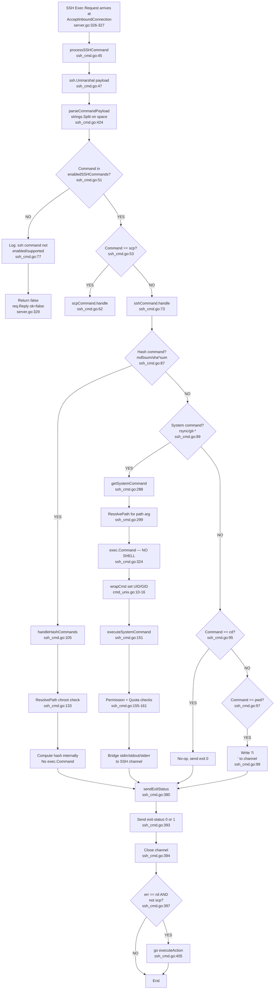
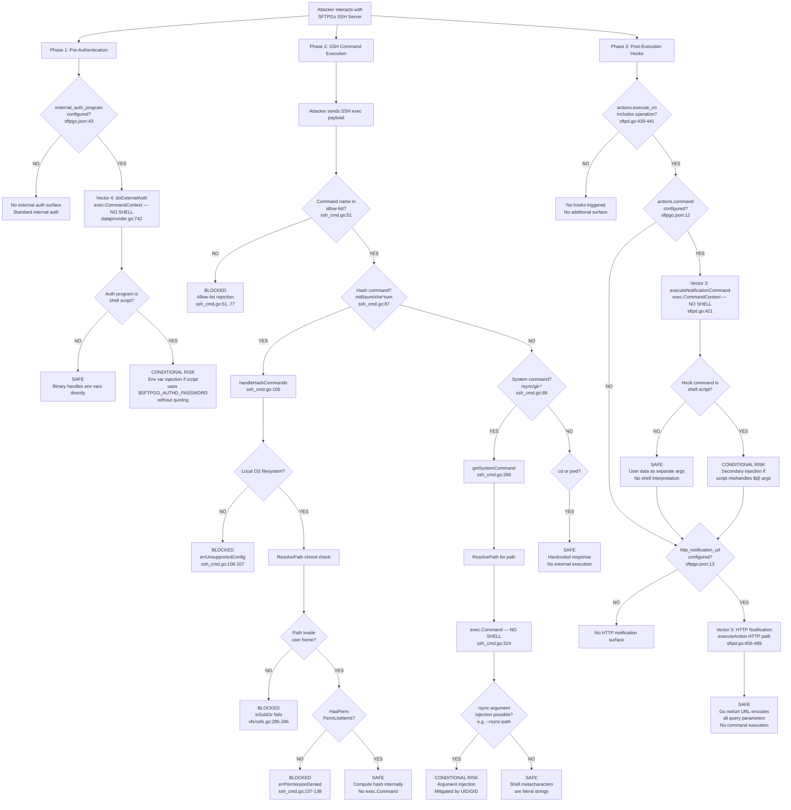
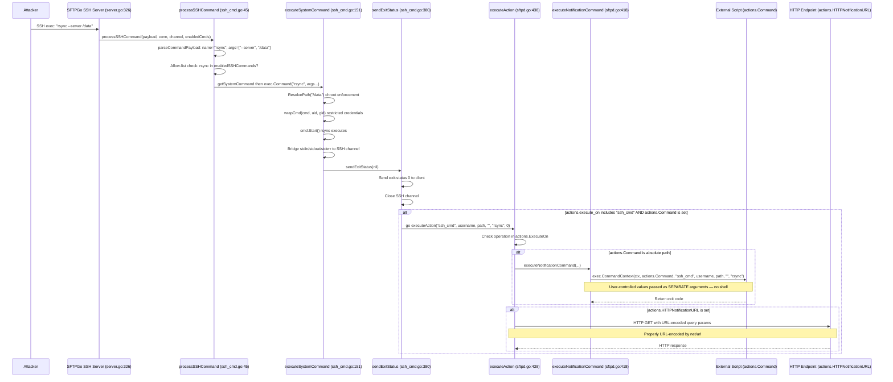

# SFTPGo Command Injection Security Audit Analysis

**Branch:** `sftpgo_44634210287c`
**Date:** 2024
**Type:** Code-Grounded Security Audit — Command Injection Attack Surface
**Methodology:** Static source code analysis with data flow tracing; no live exploitation

---

## Table of Contents

1. [Introduction](#introduction)
2. [Why the Scanner Produces Inconsistent Results](#why-the-scanner-produces-inconsistent-results)
3. [Command Injection Vector Analysis](#command-injection-vector-analysis)
   - [Vector 1: SSH Exec Channel — Direct Command Injection](#vector-1-ssh-exec-channel--direct-command-injection)
   - [Vector 2: System Commands — Argument Injection via rsync/git](#vector-2-system-commands--argument-injection-via-rsyncgit)
   - [Vector 3: Action Hook Commands — Indirect Injection](#vector-3-action-hook-commands--indirect-injection)
   - [Vector 4: External Auth Program — Environment Variable Injection](#vector-4-external-auth-program--environment-variable-injection)
   - [Vector 5: HTTP Notification URL — Query Parameter Injection](#vector-5-http-notification-url--query-parameter-injection)
4. [Exploitation Attempt Documentation](#exploitation-attempt-documentation)
5. [Protective Mechanisms Summary](#protective-mechanisms-summary)
6. [Dependency Security Assessment](#dependency-security-assessment)
7. [Conclusions and Recommendations](#conclusions-and-recommendations)

---

## Introduction

### Audit Context

A vulnerability scanner produced **inconsistent results** when testing for command injection in an SFTPGo SFTP server instance. On some scan configurations, the scanner reported command injection vulnerabilities; on others, it reported the target as safe. This inconsistency prompted a deep, code-grounded security audit to determine:

1. **Which specific component** within SFTPGo is susceptible to command injection
2. **Under what configuration conditions** the attack surface is active or dormant
3. **Whether the vulnerability is practically exploitable**, given the architectural defenses in place
4. **What exact payloads** an auditor would use for testing, and what server behavior to expect
5. **What log entries and error messages** the server produces during exploitation attempts

### Methodology

This audit is performed entirely through **static source code analysis** of the SFTPGo repository at branch `sftpgo_44634210287c`. Every claim about vulnerability or safety references a specific file, function, and line number. No assumptions are made — the code is the sole source of truth.

**No source files are modified. No server instances are started. No payloads are executed.**

The analysis traces the complete lifecycle of user-controlled input from SSH session establishment through command execution, covering:

- **Parsing:** How SSH exec payloads are split into command name and arguments
- **Validation:** How the allow-list controls which commands execute
- **Path Resolution:** How chroot enforcement blocks directory traversal
- **Execution:** How `os/exec.Command` prevents shell metacharacter interpretation
- **Post-Execution:** How action hooks and notification commands propagate user data

### Environment

| Component | Version | Source |
|-----------|---------|--------|
| Go | 1.13 | `Source: go.mod:3` |
| SSH Library | `golang.org/x/crypto v0.0.0-20200109152110-61a87790db17` | `Source: go.mod:25` |
| Logging | `github.com/rs/zerolog v1.17.2` | `Source: go.mod:21` |
| SFTP Library | `github.com/pkg/sftp v1.11.0` | `Source: go.mod:18` |
| CLI Framework | `github.com/spf13/cobra v0.0.5` | `Source: go.mod:22` |
| Config Framework | `github.com/spf13/viper v1.6.1` | `Source: go.mod:23` |

---

## Why the Scanner Produces Inconsistent Results

### Root Cause: Configuration-Dependent Attack Surface

The SFTPGo command injection attack surface is **entirely configuration-dependent**. Different server configurations expose entirely different code paths, which means a scanner will produce different results depending on which SFTPGo instance configuration it encounters.

**Thinking:** The scanner is not broken — it is correctly detecting that the attack surface changes. When the server is configured with default settings, most command execution paths are disabled. When the server is configured with expanded SSH commands, action hooks, or external authentication programs, additional code paths become active that handle user-controlled input in potentially dangerous ways. The scanner reports "vulnerable" when it encounters an expanded configuration and "not vulnerable" when it encounters a restricted one.

### Default Configuration Analysis

The default `sftpgo.json` configuration minimizes the attack surface:

```json
{
  "sftpd": {
    "actions": {
      "execute_on": [],
      "command": "",
      "http_notification_url": ""
    },
    "enabled_ssh_commands": ["md5sum", "sha1sum", "cd", "pwd"]
  },
  "data_provider": {
    "external_auth_program": "",
    "external_auth_scope": 0
  }
}
```

`Source: sftpgo.json:10-14, 22, 43-44`

| Configuration Setting | Default Value | Security Implication |
|----------------------|---------------|----------------------|
| `sftpd.enabled_ssh_commands` | `["md5sum", "sha1sum", "cd", "pwd"]` | Only hash commands and navigation — NO system commands (`rsync`, `git-*`) enabled. System command execution via `exec.Command` is completely inactive. |
| `sftpd.actions.execute_on` | `[]` (empty array) | No operations trigger external command execution. The `executeAction` function (sftpd.go:438) returns immediately at line 439-441 because no operations match. |
| `sftpd.actions.command` | `""` (empty string) | No external notification command is configured. Even if `execute_on` were populated, `executeNotificationCommand` would not be called because the absolute path check at sftpd.go:447 fails. |
| `sftpd.actions.http_notification_url` | `""` (empty string) | No HTTP notification endpoint is configured. The HTTP notification code path at sftpd.go:456 is skipped. |
| `data_provider.external_auth_program` | `""` (empty string) | No external authentication program is configured. The `doExternalAuth` function (dataprovider.go:730) is never called. |
| `data_provider.external_auth_scope` | `0` | All authentication methods (password + public key) would use external auth — but this is irrelevant when `external_auth_program` is empty. |

**Conclusion:** With default configuration, the only active SSH command processing paths are `md5sum`, `sha1sum`, `cd`, and `pwd`. Of these, `cd` is a no-op (ssh_cmd.go:95-96) and `pwd` returns a hardcoded `/\n` (ssh_cmd.go:97-99). The hash commands process file paths through `ResolvePath` chroot enforcement (ssh_cmd.go:132-135) but do not invoke any external system commands. **No `exec.Command` or `exec.CommandContext` call sites are reachable with the default configuration via SSH exec channel commands.**

### High-Risk Configuration Combinations

The following configuration changes expand the attack surface:

**1. Enabling System Commands**

Adding `"rsync"`, `"git-receive-pack"`, `"git-upload-pack"`, or `"git-upload-archive"` to `enabled_ssh_commands` activates the `getSystemCommand` → `exec.Command` code path at ssh_cmd.go:288-331.

Setting `"*"` in `enabled_ssh_commands` enables ALL supported commands. The `checkSSHCommands` function detects the wildcard and replaces it with the full list:

```go
func (c *Configuration) checkSSHCommands() {
    if utils.IsStringInSlice("*", c.EnabledSSHCommands) {
        c.EnabledSSHCommands = GetSupportedSSHCommands()
        return
    }
    // ... validate individual commands against supportedSSHCommands
}
```

`Source: sftpd/server.go:396-414`

The supported commands list is defined as:

```go
supportedSSHCommands = []string{"scp", "md5sum", "sha1sum", "sha256sum", "sha384sum", "sha512sum", "cd", "pwd",
    "git-receive-pack", "git-upload-pack", "git-upload-archive", "rsync"}
```

`Source: sftpd/sftpd.go:66-67`

The subset that triggers system command execution (via `exec.Command`) is:

```go
systemCommands = []string{"git-receive-pack", "git-upload-pack", "git-upload-archive", "rsync"}
```

`Source: sftpd/sftpd.go:70`

**2. Enabling Action Hooks**

Setting `actions.command` to an absolute path AND adding operations to `actions.execute_on` activates external command execution via `exec.CommandContext` at sftpd.go:421.

**3. Enabling External Auth**

Setting `external_auth_program` to a path activates external authentication with credential passing via environment variables at dataprovider.go:742-746.

### Configuration-to-Risk Matrix

| Configuration Profile | System Commands | Action Hooks | External Auth | HTTP Notifications | Overall Risk Level |
|----------------------|:-:|:-:|:-:|:-:|---|
| **Default** (out-of-box) | ✗ | ✗ | ✗ | ✗ | **Minimal** — no exec.Command reachable via SSH exec |
| `enabled_ssh_commands: ["*"]` | ✓ | ✗ | ✗ | ✗ | **Moderate** — argument injection possible via rsync |
| `actions.command` + `execute_on` set | ✗ | ✓ | ✗ | ✗ | **Conditional** — depends on external script quality |
| `external_auth_program` set | ✗ | ✗ | ✓ | ✗ | **Conditional** — depends on auth script quality |
| `http_notification_url` set | ✗ | ✗ | ✗ | ✓ | **Low** — Go's net/url properly encodes parameters |
| **Maximum exposure** (all enabled) | ✓ | ✓ | ✓ | ✓ | **Highest** — all vectors active simultaneously |

---

## Command Injection Vector Analysis

### Vector 1: SSH Exec Channel — Direct Command Injection

**Question:** Can an attacker inject arbitrary commands through the SSH exec channel?

**Answer:** No. Traditional shell injection is blocked by two architectural defenses: the command allow-list and Go's `exec.Command` non-shell execution model. However, this requires careful analysis of each stage.

#### parseCommandPayload Analysis

The function `parseCommandPayload` is the entry point for parsing user-supplied SSH exec payloads:

```go
func parseCommandPayload(command string) (string, []string, error) {
    parts := strings.Split(command, " ")
    if len(parts) < 2 {
        return parts[0], []string{}, nil
    }
    return parts[0], parts[1:], nil
}
```

`Source: sftpd/ssh_cmd.go:423-429`

**Thinking:** This function performs **naive space-splitting** using `strings.Split(command, " ")`. The first element becomes the command name, and all remaining elements become the argument list. This is a critical observation because:

1. Shell metacharacters like `;`, `|`, `&&`, `||`, `` ` ``, `$()`, `>`, `<` are **NOT interpreted** — they become literal characters within the argument strings
2. There is no shell involved in this parsing — it is pure Go string splitting
3. The splitting does not handle quoting, escaping, or glob expansion
4. A payload like `rsync ; cat /etc/passwd /data` produces: `name="rsync"`, `args=[";", "cat", "/etc/passwd", "/data"]`

This naive splitting is actually a **security benefit** in this context — it prevents shell metacharacter interpretation at the parsing stage. The `;` character has no special meaning to Go's `strings.Split`.

#### Allow-List Validation

After parsing, `processSSHCommand` validates the command name against the allow-list:

```go
func processSSHCommand(payload []byte, connection *Connection, channel ssh.Channel, enabledSSHCommands []string) bool {
    var msg sshSubsystemExecMsg
    if err := ssh.Unmarshal(payload, &msg); err == nil {
        name, args, err := parseCommandPayload(msg.Command)
        connection.Log(logger.LevelDebug, logSenderSSH, "new ssh command: %#v args: %v user: %v, error: %v",
            name, args, connection.User.Username, err)
        if err == nil && utils.IsStringInSlice(name, enabledSSHCommands) {
            // ... command routing ...
        } else {
            connection.Log(logger.LevelInfo, logSenderSSH, "ssh command not enabled/supported: %#v", name)
        }
    }
    return false
}
```

`Source: sftpd/ssh_cmd.go:45-81`

**Thinking:** The allow-list check at line 51 uses `utils.IsStringInSlice(name, enabledSSHCommands)` which performs an exact string match. Only commands in the `enabledSSHCommands` slice can proceed. With the default configuration, only `["md5sum", "sha1sum", "cd", "pwd"]` are permitted. This means:

- `bash` → rejected
- `sh` → rejected
- `/bin/bash` → rejected (even if path-based, `parseCommandPayload` extracts `/bin/bash` as the command name, which is not in the allow-list)
- `cat` → rejected
- Any arbitrary command → rejected

The rejection is **silent to the client** — no error message is sent. The function returns `false`, and the SSH request is replied with `ok=false` at server.go:329.

#### Command Routing in handle()

When a command passes the allow-list, `sshCommand.handle()` routes it:

```go
func (c *sshCommand) handle() error {
    addConnection(c.connection)
    defer removeConnection(c.connection)
    updateConnectionActivity(c.connection.ID)
    if utils.IsStringInSlice(c.command, sshHashCommands) {
        return c.handleHashCommands()
    } else if utils.IsStringInSlice(c.command, systemCommands) {
        command, err := c.getSystemCommand()
        if err != nil {
            return c.sendErrorResponse(err)
        }
        return c.executeSystemCommand(command)
    } else if c.command == "cd" {
        c.sendExitStatus(nil)
    } else if c.command == "pwd" {
        c.connection.channel.Write([]byte("/\n"))
        c.sendExitStatus(nil)
    }
    return nil
}
```

`Source: sftpd/ssh_cmd.go:83-103`

**Thinking:** The routing is entirely determined by the parsed command name:
- Hash commands (`md5sum`, `sha1sum`, `sha256sum`, `sha384sum`, `sha512sum`) → `handleHashCommands()` — no external process execution
- System commands (`git-receive-pack`, `git-upload-pack`, `git-upload-archive`, `rsync`) → `getSystemCommand()` → `executeSystemCommand()` — invokes `exec.Command`
- `cd` → no-op, sends exit status 0
- `pwd` → writes hardcoded `/\n` to channel, sends exit status 0

Only the **system commands** path invokes `exec.Command`. This path is only reachable when one of the four system commands is in the `enabledSSHCommands` list.

#### exec.Command (No Shell) Protection

The critical `exec.Command` invocation occurs in `getSystemCommand`:

```go
cmd := exec.Command(c.command, args...)
```

`Source: sftpd/ssh_cmd.go:324`

**Thinking:** Go's `os/exec.Command` function does **NOT** invoke a shell. It directly calls the `execve` system call (or equivalent), passing the command and arguments as separate array elements. This means:

- The shell metacharacter `;` in `exec.Command("rsync", ";", "cat", "/etc/passwd")` is passed as a **literal argument** `";"` to rsync — rsync receives it as a path or option, not as a command separator
- The pipe `|` in `exec.Command("rsync", "|", "cat", "/etc/passwd")` is a literal string — no pipe is created
- The backtick `` ` `` in `` exec.Command("rsync", "`whoami`", "/data") `` is a literal string — no subshell execution occurs
- The `$()` in `exec.Command("rsync", "$(whoami)", "/data")` is a literal string — no command substitution occurs

**This is THE single most important architectural defense against command injection in SFTPGo.** Vulnerability scanners that assume SSH exec payloads are processed through a shell will produce false positives because Go's execution model fundamentally prevents shell metacharacter interpretation.

#### Exploitation Assessment for Vector 1

**VERDICT: NOT exploitable for traditional shell injection.**

**Reasoning chain:**
1. The attacker sends an SSH exec request with a payload like `rsync ; cat /etc/passwd /data`
2. `parseCommandPayload` splits on space: `name="rsync"`, `args=[";", "cat", "/etc/passwd", "/data"]`
3. The allow-list check passes only if `rsync` is in `enabledSSHCommands` (NOT in default config)
4. `exec.Command("rsync", "--safe-links", ";", "cat", "/etc/passwd", "<resolved_path>")` executes rsync directly
5. rsync receives `";"` as a literal path argument — no shell interpretation occurs
6. rsync will fail with an error about the invalid path `";"`

**What blocks the attack:**
- **Allow-list** (ssh_cmd.go:51): Only 12 specific commands are executable
- **exec.Command** (ssh_cmd.go:324): No shell interprets metacharacters
- **Default config**: System commands are not even in the default allow-list

---

### Vector 2: System Commands — Argument Injection via rsync/git

**Question:** Even though shell injection is blocked, can an attacker abuse rsync or git command arguments to achieve code execution?

**Answer:** Yes — this is a **theoretical argument injection risk** when rsync is enabled. The `--rsync-path` option can instruct rsync to execute an arbitrary command on the server side. This is distinct from shell injection and is not blocked by `exec.Command`'s non-shell model.

#### getSystemCommand Analysis

The `getSystemCommand` function constructs the system command with user-supplied arguments:

```go
func (c *sshCommand) getSystemCommand() (systemCommand, error) {
    command := systemCommand{
        cmd:      nil,
        realPath: "",
    }
    args := make([]string, len(c.args))
    copy(args, c.args)
    var path string
    if len(c.args) > 0 {
        var err error
        sshPath := c.getDestPath()
        path, err = c.connection.fs.ResolvePath(sshPath)
        if err != nil {
            return command, err
        }
        args = args[:len(args)-1]
        args = append(args, path)
    }
    if c.command == "rsync" {
        if c.connection.User.HasPerm(dataprovider.PermCreateSymlinks, c.getDestPath()) {
            if !utils.IsStringInSlice("--safe-links", args) {
                args = append([]string{"--safe-links"}, args...)
            }
        } else {
            if !utils.IsStringInSlice("--munge-links", args) {
                args = append([]string{"--munge-links"}, args...)
            }
        }
    }
    c.connection.Log(logger.LevelDebug, logSenderSSH, "new system command %#v, with args: %v path: %v", c.command, args, path)
    cmd := exec.Command(c.command, args...)
    uid := c.connection.User.GetUID()
    gid := c.connection.User.GetGID()
    cmd = wrapCmd(cmd, uid, gid)
    command.cmd = cmd
    command.realPath = path
    return command, nil
}
```

`Source: sftpd/ssh_cmd.go:288-331`

**Thinking:** The key observations are:

1. **Arguments are copied from user input** (line 293-294): `args := make([]string, len(c.args))` followed by `copy(args, c.args)`. The user-supplied arguments from `parseCommandPayload` are used directly.
2. **Last argument is replaced with resolved path** (lines 296-304): The last element of `c.args` is interpreted as the destination path, resolved through `ResolvePath` chroot enforcement, and replaced in the args array.
3. **rsync gets --safe-links or --munge-links prepended** (lines 306-321): This is a symlink safety measure, not an argument sanitization measure.
4. **exec.Command is called with user-controlled args** (line 324): `exec.Command(c.command, args...)` passes ALL user-supplied arguments (except the last one, which is replaced with the resolved path) directly to the binary.
5. **Process runs with restricted UID/GID** (lines 325-327): `wrapCmd` sets the process credentials via `syscall.SysProcAttr.Credential`.

`Source: sftpd/cmd_unix.go:10-16`

```go
func wrapCmd(cmd *exec.Cmd, uid, gid int) *exec.Cmd {
    if uid > 0 || gid > 0 {
        cmd.SysProcAttr = &syscall.SysProcAttr{}
        cmd.SysProcAttr.Credential = &syscall.Credential{Uid: uint32(uid), Gid: uint32(gid)}
    }
    return cmd
}
```

#### rsync Argument Injection Risk

Since user-supplied arguments are passed directly to rsync (except the last path argument), an attacker can inject rsync-specific options. The most dangerous is `--rsync-path`:

- **`--rsync-path=COMMAND`**: Tells rsync to use `COMMAND` instead of `rsync` on the remote side. When rsync runs on the server, this option can cause execution of an arbitrary command.

**Example attack payload:**

```
rsync --rsync-path=/tmp/malicious -e none /data
```

After `parseCommandPayload`:
- `name = "rsync"`
- `args = ["--rsync-path=/tmp/malicious", "-e", "none", "/data"]`

After `getSystemCommand`:
- `args = ["--safe-links", "--rsync-path=/tmp/malicious", "-e", "none", "<resolved_path>"]`
- `exec.Command("rsync", "--safe-links", "--rsync-path=/tmp/malicious", "-e", "none", "<resolved_path>")`

**Thinking:** The `--rsync-path` argument is not a shell metacharacter — it is a legitimate rsync option. `exec.Command`'s non-shell model does not protect against this because the attack operates through rsync's own option handling, not through shell interpretation. However, several mitigations exist:

1. The process runs with restricted UID/GID (cmd_unix.go:10-16), limiting what the executed command can access
2. The path argument goes through `ResolvePath` chroot enforcement (vfs/osfs.go:200-223)
3. rsync must be explicitly enabled in `enabled_ssh_commands` — it is NOT in the default configuration
4. The attacker must be an authenticated SSH user to send exec requests

#### getDestPath Analysis

The `getDestPath` function extracts and normalizes the destination path from user arguments:

```go
func (c *sshCommand) getDestPath() string {
    if len(c.args) == 0 {
        return ""
    }
    destPath := strings.Trim(c.args[len(c.args)-1], "'")
    destPath = strings.Trim(destPath, "\"")
    destPath = filepath.ToSlash(destPath)
    if !path.IsAbs(destPath) {
        destPath = "/" + destPath
    }
    result := path.Clean(destPath)
    if strings.HasSuffix(destPath, "/") && !strings.HasSuffix(result, "/") {
        result += "/"
    }
    return result
}
```

`Source: sftpd/ssh_cmd.go:356-371`

**Thinking:** This function:
1. Takes the **last argument** as the destination path (line 360)
2. Strips single quotes and double quotes (lines 360-361) — this handles SSH clients that wrap paths in quotes
3. Converts backslashes to forward slashes (line 362) — Windows compatibility
4. Ensures the path is absolute by prepending `/` if needed (lines 363-365)
5. Cleans the path using `path.Clean` (line 366) — normalizes `..`, `.`, and double slashes
6. Preserves trailing slashes (lines 367-369)

This function does NOT perform any security validation itself — that is delegated to `ResolvePath`.

#### ResolvePath Chroot Enforcement

All file paths processed by system commands go through `ResolvePath`:

```go
func (fs OsFs) ResolvePath(sftpPath string) (string, error) {
    if !filepath.IsAbs(fs.rootDir) {
        return "", fmt.Errorf("Invalid root path: %v", fs.rootDir)
    }
    r := filepath.Clean(filepath.Join(fs.rootDir, sftpPath))
    p, err := filepath.EvalSymlinks(r)
    if err != nil && !os.IsNotExist(err) {
        return "", err
    } else if os.IsNotExist(err) {
        _, err = fs.findFirstExistingDir(r, fs.rootDir)
        if err != nil {
            fsLog(fs, logger.LevelWarn, "error resolving not existent path: %#v", err)
        }
        return r, err
    }
    err = fs.isSubDir(p, fs.rootDir)
    if err != nil {
        fsLog(fs, logger.LevelWarn, "Invalid path resolution, dir: %#v outside user home: %#v err: %v", p, fs.rootDir, err)
    }
    return r, err
}
```

`Source: vfs/osfs.go:200-223`

And the boundary check:

```go
func (fs *OsFs) isSubDir(sub, rootPath string) error {
    parent, err := filepath.EvalSymlinks(rootPath)
    if err != nil {
        fsLog(fs, logger.LevelWarn, "invalid home dir %#v: %v", rootPath, err)
        return err
    }
    if !strings.HasPrefix(sub, parent) {
        err = fmt.Errorf("path %#v is not inside: %#v", sub, parent)
        fsLog(fs, logger.LevelWarn, "error: %v ", err)
        return err
    }
    return nil
}
```

`Source: vfs/osfs.go:278-291`

**Thinking:** `ResolvePath` provides robust chroot enforcement:
1. The SFTP path is joined with the user's root directory: `filepath.Clean(filepath.Join(fs.rootDir, sftpPath))` (line 204)
2. Symlinks are resolved to their real paths: `filepath.EvalSymlinks(r)` (line 205)
3. The resolved path must be a subdirectory of the root: `isSubDir(p, fs.rootDir)` (line 218)
4. `isSubDir` uses `strings.HasPrefix(sub, parent)` (line 285) to verify containment

This means a path traversal attempt like `../../../etc/passwd` will be caught because:
- `filepath.Join("/home/user", "../../../etc/passwd")` resolves to `/etc/passwd`
- `isSubDir("/etc/passwd", "/home/user")` fails because `/etc/passwd` does not start with `/home/user`

#### Exploitation Assessment for Vector 2

**VERDICT: Conditional risk — requires rsync in `enabled_ssh_commands`, mitigated by process credentials and chroot.**

**Reasoning chain:**
1. rsync must be explicitly added to `enabled_ssh_commands` (NOT in default config)
2. The attacker must be an authenticated SSH user
3. User-supplied arguments ARE passed directly to rsync without sanitization
4. The `--rsync-path` option could instruct rsync to execute an arbitrary command
5. However: the process runs with restricted UID/GID (cmd_unix.go:10-16), limiting privileges
6. However: the file path argument is chroot-enforced (vfs/osfs.go:200-223)
7. This is **argument injection**, not shell injection — `exec.Command` does not protect against it

---

### Vector 3: Action Hook Commands — Indirect Injection

**Question:** When SFTPGo executes external action hook commands, can user-controlled data lead to command injection?

**Answer:** SFTPGo passes user-controlled data (username, file path, SSH command string) as separate command-line arguments to `exec.CommandContext`, which does NOT invoke a shell. However, if the configured external command is a shell script that improperly handles its arguments, secondary injection is possible. The vulnerability would be in the external script, not in SFTPGo itself.

#### executeNotificationCommand Analysis

```go
func executeNotificationCommand(operation, username, path, target, sshCmd, fileSize string) error {
    ctx, cancel := context.WithTimeout(context.Background(), 30*time.Second)
    defer cancel()
    cmd := exec.CommandContext(ctx, actions.Command, operation, username, path, target, sshCmd)
    cmd.Env = append(os.Environ(),
        fmt.Sprintf("SFTPGO_ACTION=%v", operation),
        fmt.Sprintf("SFTPGO_ACTION_USERNAME=%v", username),
        fmt.Sprintf("SFTPGO_ACTION_PATH=%v", path),
        fmt.Sprintf("SFTPGO_ACTION_TARGET=%v", target),
        fmt.Sprintf("SFTPGO_ACTION_SSH_CMD=%v", sshCmd),
        fmt.Sprintf("SFTPGO_ACTION_FILE_SIZE=%v", fileSize),
    )
    startTime := time.Now()
    err := cmd.Run()
    logger.Debug(logSender, "", "executed command %#v with arguments: %#v, %#v, %#v, %#v, %#v, elapsed: %v, error: %v",
        actions.Command, operation, username, path, target, sshCmd, time.Since(startTime), err)
    return err
}
```

`Source: sftpd/sftpd.go:418-435`

**Thinking:** The critical line is:

```go
cmd := exec.CommandContext(ctx, actions.Command, operation, username, path, target, sshCmd)
```

`Source: sftpd/sftpd.go:421`

This passes user-controlled values (`username`, `path`, `sshCmd`) as **separate positional arguments** to the configured external command. Because `exec.CommandContext` does not invoke a shell, shell metacharacters in these values are not interpreted.

Additionally, the same user-controlled values are passed as **environment variables** (lines 422-429):
- `SFTPGO_ACTION` — the operation type (controlled by SFTPGo, not the user)
- `SFTPGO_ACTION_USERNAME` — the authenticated username (user-controlled at registration/provisioning)
- `SFTPGO_ACTION_PATH` — the file path (user-controlled via SFTP/SCP/SSH operations)
- `SFTPGO_ACTION_TARGET` — the target path for rename operations (user-controlled)
- `SFTPGO_ACTION_SSH_CMD` — the SSH command string (user-controlled via SSH exec)
- `SFTPGO_ACTION_FILE_SIZE` — the file size (derived from transfer, not directly controlled)

#### executeAction Analysis

The dispatch function `executeAction` determines when `executeNotificationCommand` is called:

```go
func executeAction(operation, username, path, target, sshCmd string, fileSize int64) error {
    if !utils.IsStringInSlice(operation, actions.ExecuteOn) {
        return nil
    }
    var err error
    size := ""
    if fileSize > 0 {
        size = fmt.Sprintf("%v", fileSize)
    }
    if len(actions.Command) > 0 && filepath.IsAbs(actions.Command) {
        // ...
        err = executeNotificationCommand(operation, username, path, target, sshCmd, size)
    }
    // ... HTTP notification ...
}
```

`Source: sftpd/sftpd.go:438-492`

**Thinking:** Two conditions must be met:
1. The operation must be in `actions.ExecuteOn` (line 439) — with default config this is empty
2. `actions.Command` must be non-empty and an absolute path (line 447)

With the default configuration, both conditions fail and `executeNotificationCommand` is never called.

#### Parallel Call Site: dataprovider executeNotificationCommand

A parallel `executeNotificationCommand` function exists in the data provider module:

```go
func executeNotificationCommand(operation string, user *User) error {
	ctx, cancel := context.WithTimeout(context.Background(), 15*time.Second)
	defer cancel()
	commandArgs := user.getNotificationFieldsAsSlice(operation)
	cmd := exec.CommandContext(ctx, config.Actions.Command, commandArgs...)
	cmd.Env = append(os.Environ(), user.getNotificationFieldsAsEnvVars(operation)...)
	startTime := time.Now()
	err := cmd.Run()
	providerLog(logger.LevelDebug, "executed command %#v with arguments: %+v, elapsed: %v, error: %v",
		config.Actions.Command, commandArgs, time.Since(startTime), err)
	return err
}
```

`Source: dataprovider/dataprovider.go:783-793`

**Thinking:** This function follows the same action hook pattern as the sftpd variant (sftpd.go:421) — it calls `exec.CommandContext` with `config.Actions.Command` as the program and user notification fields as arguments. However, there are key differences that make this a **lower-risk** variant of the same vector:

1. **Trigger mechanism:** This function is invoked by admin REST API user management operations (user create, update, delete) rather than by attacker SSH input. The caller is `executeAction` in `dataprovider/dataprovider.go:797`, which checks `config.Actions.ExecuteOn` for operations like `"add"`, `"update"`, `"delete"`.
2. **Data source:** The arguments come from `user.getNotificationFieldsAsSlice(operation)`, which contains user model fields (username, home directory, UID, GID, etc.) — these are set by the server administrator through the REST API, not directly by the SSH user.
3. **Same `config.Actions.Command`:** It uses the same configured external command as the sftpd variant, so the same shell script quality considerations apply.
4. **Same `exec.CommandContext` non-shell model:** No shell interpretation occurs — the same architectural defense applies.

Because this code path is triggered by admin operations and receives administrator-provisioned data rather than live attacker SSH input, it represents a lower risk than the sftpd variant. The same recommendations for properly quoting shell script arguments apply to both variants.

#### Shell Script Argument Handling Risk

**If** the configured `actions.Command` is a shell script (e.g., `/usr/local/bin/notify.sh`), the risk depends on how the script handles its arguments:

**Safe script (proper quoting):**
```bash
#!/bin/bash
echo "Operation: $1, User: $2, Path: $3" >> /var/log/sftpgo_actions.log
```

The positional parameters `$1`, `$2`, `$3` are safely passed by `exec.CommandContext` as separate arguments. Even if `$2` contains `user$(whoami)`, using `"$2"` with double quotes prevents word splitting and globbing.

**Unsafe script (missing quoting):**
```bash
#!/bin/bash
echo Operation: $2 Path: $3 >> /var/log/sftpgo_actions.log
# Without quotes, word splitting and globbing apply but NOT command substitution
# because exec.CommandContext passes args directly to the shell script binary
```

**Important clarification:** `exec.CommandContext` does NOT invoke a shell to run the external program. If the external program's first line is `#!/bin/bash`, the kernel invokes bash, which receives the arguments as positional parameters. In bash, `$1` through `$N` are set from the command-line arguments. Command substitution (`$()`, `` ` ``) within these parameter values does NOT occur during argument assignment — it only occurs if the script explicitly evaluates the values with `eval` or uses them in an unquoted context where the shell performs expansion.

**The risk is therefore limited to specific shell scripting anti-patterns:**
- Using `eval "$2"` or `eval "$SFTPGO_ACTION_USERNAME"`
- Using unquoted expansion in arithmetic or conditional contexts that trigger evaluation
- Passing argument values to another shell command without quoting

#### Exploitation Assessment for Vector 3

**VERDICT: Conditional risk — requires specific configuration AND a poorly-written external command handler.**

**Reasoning chain:**
1. `actions.command` must be set to an absolute path (default: empty)
2. `actions.execute_on` must include at least one operation (default: empty)
3. `exec.CommandContext` passes user data as separate args — no shell interpretation by SFTPGo
4. If the external command is a compiled binary, injection is not possible
5. If the external command is a shell script with proper quoting, injection is not possible
6. If the external command is a shell script with `eval` or unquoted expansions, secondary injection becomes possible — but this is a vulnerability in the script, not in SFTPGo

---

### Vector 4: External Auth Program — Environment Variable Injection

**Question:** Can an attacker inject commands through credentials passed to the external authentication program?

**Answer:** SFTPGo passes the username and password as environment variables to the external auth program using `exec.CommandContext` (no shell). If the external auth program is a shell script that uses these environment variables without proper quoting, injection is theoretically possible. The vulnerability would be in the external script.

#### doExternalAuth Analysis

```go
func doExternalAuth(username, password, pubKey string) (User, error) {
    var user User
    ctx, cancel := context.WithTimeout(context.Background(), 15*time.Second)
    defer cancel()
    pkey := ""
    if len(pubKey) > 0 {
        k, err := ssh.ParsePublicKey([]byte(pubKey))
        if err != nil {
            return user, err
        }
        pkey = string(ssh.MarshalAuthorizedKey(k))
    }
    cmd := exec.CommandContext(ctx, config.ExternalAuthProgram)
    cmd.Env = append(os.Environ(),
        fmt.Sprintf("SFTPGO_AUTHD_USERNAME=%v", username),
        fmt.Sprintf("SFTPGO_AUTHD_PASSWORD=%v", password),
        fmt.Sprintf("SFTPGO_AUTHD_PUBLIC_KEY=%v", pkey))
    out, err := cmd.Output()
    // ... JSON parsing of output ...
}
```

`Source: dataprovider/dataprovider.go:730-777`

**Thinking:** The critical lines are 742-746:

```go
cmd := exec.CommandContext(ctx, config.ExternalAuthProgram)
cmd.Env = append(os.Environ(),
    fmt.Sprintf("SFTPGO_AUTHD_USERNAME=%v", username),
    fmt.Sprintf("SFTPGO_AUTHD_PASSWORD=%v", password),
    fmt.Sprintf("SFTPGO_AUTHD_PUBLIC_KEY=%v", pkey))
```

`Source: dataprovider/dataprovider.go:742-746`

Key observations:

1. **No command-line arguments are passed** — only environment variables. The external program receives no positional arguments from SFTPGo.
2. **Environment variables contain attacker-controlled data:**
   - `SFTPGO_AUTHD_USERNAME` — the username from the SSH authentication attempt (fully attacker-controlled)
   - `SFTPGO_AUTHD_PASSWORD` — the password from the SSH authentication attempt (fully attacker-controlled)
   - `SFTPGO_AUTHD_PUBLIC_KEY` — the public key (attacker-controlled but must be a valid SSH public key, parsed at line 736-740)
3. **`exec.CommandContext` does NOT invoke a shell** — the external program is executed directly
4. **The program must return JSON** — `cmd.Output()` captures stdout, which is then parsed as JSON (line 747-754)

#### Shell Script Environment Variable Risk

If the external auth program is a shell script:

```bash
#!/bin/bash
# UNSAFE: Using env var without quoting in a context where shell expands it
echo $SFTPGO_AUTHD_PASSWORD | some_command
```

An attacker providing a password like `pass$(whoami)word` would NOT trigger command substitution in this case because:
- Environment variable **assignment** (`SFTPGO_AUTHD_PASSWORD=pass$(whoami)word`) is done by Go's `exec.CommandContext`, not by a shell
- The literal string `pass$(whoami)word` is stored in the environment
- When bash reads `$SFTPGO_AUTHD_PASSWORD`, it performs **parameter expansion** which retrieves the literal value
- Command substitution (`$()`) within variable VALUES is NOT re-evaluated during parameter expansion

**However**, if the script uses `eval`:
```bash
#!/bin/bash
eval "echo $SFTPGO_AUTHD_PASSWORD"  # DANGEROUS: eval re-parses the string
```

Then `eval` would re-parse the value and execute `$(whoami)`.

**The 15-second timeout** (line 732) limits the time available for any exploitation, but does not prevent it.

`Source: dataprovider/dataprovider.go:169-175` — Configuration fields:

```go
ExternalAuthProgram string `json:"external_auth_program" mapstructure:"external_auth_program"`
ExternalAuthScope int `json:"external_auth_scope" mapstructure:"external_auth_scope"`
```

#### Exploitation Assessment for Vector 4

**VERDICT: Conditional risk — requires external auth configuration AND a poorly-written auth script.**

**Reasoning chain:**
1. `external_auth_program` must be set to a path (default: empty string `""` at sftpgo.json:43)
2. `exec.CommandContext` does not invoke a shell — env vars are set at the OS level
3. Standard bash parameter expansion does NOT re-evaluate command substitution within variable values
4. Only explicit `eval` or similar constructs in the external script would trigger injection
5. The public key value is validated by `ssh.ParsePublicKey` (line 736) before being passed — malformed keys are rejected
6. The username and password have NO validation or sanitization before being set as env vars

---

### Vector 5: HTTP Notification URL — Query Parameter Injection

**Question:** Can user-controlled data injected into HTTP notification URLs lead to exploitation?

**Answer:** No. Go's `net/url` package properly URL-encodes query parameters, preventing parameter injection. The HTTP request is made server-side (SSRF surface), but this is outside the scope of command injection analysis.

#### executeAction HTTP Path Analysis

The HTTP notification code in `executeAction`:

```go
if len(actions.HTTPNotificationURL) > 0 {
    var url *url.URL
    url, err = url.Parse(actions.HTTPNotificationURL)
    if err == nil {
        q := url.Query()
        q.Add("action", operation)
        q.Add("username", username)
        q.Add("path", path)
        if len(target) > 0 {
            q.Add("target_path", target)
        }
        if len(sshCmd) > 0 {
            q.Add("ssh_cmd", sshCmd)
        }
        if len(size) > 0 {
            q.Add("file_size", size)
        }
        url.RawQuery = q.Encode()
        startTime := time.Now()
        httpClient := &http.Client{
            Timeout: 15 * time.Second,
        }
        resp, err := httpClient.Get(url.String())
        // ...
    }
}
```

`Source: sftpd/sftpd.go:456-489`

**Thinking:** The code uses Go's standard `net/url` package:
1. `url.Query()` returns a `url.Values` map (line 460)
2. `q.Add(key, value)` adds properly-typed parameters (lines 461-472)
3. `q.Encode()` serializes all parameters with proper URL encoding (line 473)

This means user-controlled values like `user&admin=true` would be encoded as `user%26admin%3Dtrue`, preventing parameter injection.

The HTTP GET request is made by the server to the configured URL — this is a server-side request forgery (SSRF) surface if the URL is attacker-controllable, but the URL is set by the server administrator in the configuration file, not by the SSH user.

#### Exploitation Assessment for Vector 5

**VERDICT: Low risk — Go's URL encoding prevents parameter injection; SSRF is out of scope for command injection audit.**

**Reasoning chain:**
1. `actions.http_notification_url` must be set (default: empty at sftpgo.json:13)
2. User-controlled values are properly URL-encoded by `q.Add()` and `q.Encode()`
3. No command execution occurs in this path — it is pure HTTP
4. The URL is configured by the administrator, not the attacker


---

## Exploitation Attempt Documentation

### Test Payloads and Expected Behavior

The following table documents the exact test payloads an auditor would use, tracing each through the entire processing pipeline:

| # | Test Case | SSH Exec Payload | `parseCommandPayload` Output | Allow-List Result | `exec.Command` Arguments | Expected Outcome |
|---|-----------|------------------|------------------------------|-------------------|--------------------------|------------------|
| 1 | Shell injection via semicolon | `rsync ; cat /etc/passwd /data` | name=`rsync`, args=[`;`, `cat`, `/etc/passwd`, `/data`] | Pass (if rsync enabled) | `exec.Command("rsync", "--safe-links", ";", "cat", "/etc/passwd", "<resolved_path>")` | rsync error — `;` treated as literal path argument |
| 2 | Shell injection via pipe | `rsync \| cat /etc/passwd /data` | name=`rsync`, args=[`\|`, `cat`, `/etc/passwd`, `/data`] | Pass (if rsync enabled) | `exec.Command("rsync", "--safe-links", "\|", "cat", "/etc/passwd", "<resolved_path>")` | rsync error — `\|` treated as literal path argument |
| 3 | Shell injection via backtick | `` rsync `whoami` /data `` | name=`rsync`, args=[`` `whoami` ``, `/data`] | Pass (if rsync enabled) | `` exec.Command("rsync", "--safe-links", "`whoami`", "<resolved_path>") `` | rsync error — backtick string treated as literal filename |
| 4 | Shell injection via $() | `rsync $(id) /data` | name=`rsync`, args=[`$(id)`, `/data`] | Pass (if rsync enabled) | `exec.Command("rsync", "--safe-links", "$(id)", "<resolved_path>")` | rsync error — `$(id)` treated as literal filename |
| 5 | Arbitrary command name | `bash -c 'cat /etc/passwd'` | name=`bash`, args=[`-c`, `'cat`, `/etc/passwd'`] | **FAIL** — `bash` not in allow-list | N/A — rejected at line 51 | Rejected silently; logged at line 77 |
| 6 | Argument injection via rsync | `rsync --rsync-path=/tmp/evil /data` | name=`rsync`, args=[`--rsync-path=/tmp/evil`, `/data`] | Pass (if rsync enabled) | `exec.Command("rsync", "--safe-links", "--rsync-path=/tmp/evil", "<resolved_path>")` | **Potential exploitation** — rsync may execute `/tmp/evil` |
| 7 | Hash command path traversal | `md5sum ../../../etc/passwd` | name=`md5sum`, args=[`../../../etc/passwd`] | Pass (default config) | N/A — handled internally by `handleHashCommands` | **Blocked** by `ResolvePath` — `isSubDir` check fails (vfs/osfs.go:285) |
| 8 | Disabled system command | `git-receive-pack /repo` | name=`git-receive-pack`, args=[`/repo`] | **FAIL** (default config) — not in default allow-list | N/A — rejected at line 51 | Rejected silently; logged at line 77 |
| 9 | SCP with injection | `scp -t /tmp/; cat /etc/passwd` | name=`scp`, args=[`-t`, `/tmp/;`, `cat`, `/etc/passwd`] | Pass (if scp enabled) | Routes to `scpCommand.handle()` — SCP protocol parsing | SCP protocol error — invalid SCP mode/path |
| 10 | Command with && | `rsync && whoami /data` | name=`rsync`, args=[`&&`, `whoami`, `/data`] | Pass (if rsync enabled) | `exec.Command("rsync", "--safe-links", "&&", "whoami", "<resolved_path>")` | rsync error — `&&` treated as literal argument |

### Server Response Documentation

#### Successful Command Execution

When a command executes successfully, `sendExitStatus(nil)` is called:

```go
func (c *sshCommand) sendExitStatus(err error) {
    status := uint32(0)
    if err != nil {
        status = uint32(1)
        c.connection.Log(logger.LevelWarn, logSenderSSH, "command failed: %#v args: %v user: %v err: %v",
            c.command, c.args, c.connection.User.Username, err)
    } else {
        logger.CommandLog(sshCommandLogSender, c.getDestPath(), "", c.connection.User.Username, "", c.connection.ID,
            protocolSSH, -1, -1, "", "", c.connection.command)
    }
    exitStatus := sshSubsystemExitStatus{
        Status: status,
    }
    c.connection.channel.SendRequest("exit-status", false, ssh.Marshal(&exitStatus))
    c.connection.channel.Close()
    metrics.SSHCommandCompleted(err)
    if err == nil && c.command != "scp" {
        realPath := c.getDestPath()
        if len(realPath) > 0 {
            p, err := c.connection.fs.ResolvePath(realPath)
            if err == nil {
                realPath = p
            }
        }
        go executeAction(operationSSHCmd, c.connection.User.Username, realPath, "", c.command, 0)
    }
}
```

`Source: sftpd/ssh_cmd.go:380-407`

**Observable server behavior on success:**

1. SSH exit-status `0` is sent to the client via `channel.SendRequest("exit-status", false, ...)` (line 393)
2. The SSH channel is closed via `channel.Close()` (line 394)
3. A `CommandLog` structured log entry is written (lines 387-388)
4. The `executeAction` goroutine is launched with `operationSSHCmd` (line 405) — this triggers action hooks if configured
5. Metrics are updated via `metrics.SSHCommandCompleted(nil)` (line 395)

**What the client sees:**
- Command output on the SSH channel (e.g., hash value for md5sum, rsync transfer data)
- SSH exit-status `0`
- Channel close

#### Failed Command Execution

When a command fails, `sendExitStatus(err)` sends exit-status `1`:

**Observable server behavior on failure:**

1. SSH exit-status `1` is sent to the client (lines 381-382 set `status = uint32(1)`)
2. A warning log entry is written with the error details (lines 384-385)
3. The SSH channel is closed (line 394)
4. `executeAction` is NOT called — the `err == nil` check at line 397 prevents it
5. Metrics record the failure via `metrics.SSHCommandCompleted(err)` (line 395)

#### Error Response Format

When an error occurs before or during command execution, `sendErrorResponse` writes an error message to the SSH channel:

```go
func (c *sshCommand) sendErrorResponse(err error) error {
    errorString := fmt.Sprintf("%v: %v %v\n", c.command, c.getDestPath(), err)
    c.connection.channel.Write([]byte(errorString))
    c.sendExitStatus(err)
    return err
}
```

`Source: sftpd/ssh_cmd.go:373-378`

**The error message format is:** `{command}: {destPath} {error}\n`

For example, if rsync fails due to a chroot violation:
```
rsync: /data path "/etc/passwd" is not inside: "/home/user"
```

**What the client sees:**
- Error message written to the SSH channel stdout
- SSH exit-status `1`
- Channel close

#### Allow-List Rejection

When a command is not in the allow-list, the behavior is different:

1. **No error message is sent to the client** — `processSSHCommand` simply returns `false` (line 80)
2. The SSH request is replied with `ok=false` via `req.Reply(ok, nil)` at server.go:329
3. An info-level log entry is written: `"ssh command not enabled/supported: %#v"` (ssh_cmd.go:77)

`Source: sftpd/ssh_cmd.go:76-80, sftpd/server.go:326-329`

**What the client sees:**
- SSH request reply with `ok=false`
- No error message on the channel
- The channel remains open (it was accepted at server.go:306) but no command output appears

### Log Entry Documentation

SFTPGo uses `zerolog` for structured JSON logging. The following documents the exact log entries produced during SSH command processing.

#### Successful SSH Command Log

When an SSH command executes successfully, `logger.CommandLog` produces:

```json
{
  "level": "info",
  "time": "2020-01-15T10:30:00.000",
  "sender": "SSHCommand",
  "username": "<authenticated_username>",
  "file_path": "<resolved_destination_path>",
  "target_path": "",
  "filemode": "",
  "uid": -1,
  "gid": -1,
  "access_time": "",
  "modification_time": "",
  "ssh_command": "<full_command_string>",
  "connection_id": "<hex_session_id>",
  "protocol": "SSH"
}
```

`Source: logger/logger.go:152-169`

The `CommandLog` function:

```go
func CommandLog(command, path, target, user, fileMode, connectionID, protocol string, uid, gid int, atime, mtime, sshCommand string) {
    logger.Info().
        Timestamp().
        Str("sender", command).
        Str("username", user).
        Str("file_path", path).
        Str("target_path", target).
        Str("filemode", fileMode).
        Int("uid", uid).
        Int("gid", gid).
        Str("access_time", atime).
        Str("modification_time", atime).
        Str("ssh_command", sshCommand).
        Str("connection_id", connectionID).
        Str("protocol", protocol).
        Msg("")
}
```

`Source: logger/logger.go:153-168`

Called at ssh_cmd.go:387-388 with `sender="SSHCommand"`, `uid=-1`, `gid=-1`.

#### Debug Log for New SSH Command

When any SSH command is received (before allow-list check), a debug log is produced:

```json
{
  "level": "debug",
  "time": "2020-01-15T10:30:00.000",
  "sender": "ssh",
  "connection_id": "<hex_session_id>",
  "message": "new ssh command: \"rsync\" args: [; cat /etc/passwd /data] user: testuser, error: <nil>"
}
```

`Source: sftpd/ssh_cmd.go:49-50`

**Note on format verbs:** The format string at ssh_cmd.go:49 uses `%#v` for the command `name` (producing a Go-quoted string like `"rsync"`) and `%v` for the `args` slice (producing unquoted, space-separated output like `[; cat /etc/passwd /data]`). This means the command name appears with quotes in the log while the arguments array appears without individual element quoting.

This log entry is produced via `connection.Log(logger.LevelDebug, logSenderSSH, ...)` which calls `logger.Debug`:

```go
func Debug(sender string, connectionID string, format string, v ...interface{}) {
    logger.Debug().Timestamp().Str("sender", sender).Str("connection_id", connectionID).Msg(fmt.Sprintf(format, v...))
}
```

`Source: logger/logger.go:99-101`

#### Failed Command Warning Log

When a command fails, `sendExitStatus` logs a warning:

```json
{
  "level": "warn",
  "time": "2020-01-15T10:30:00.000",
  "sender": "ssh",
  "connection_id": "<hex_session_id>",
  "message": "command failed: \"rsync\" args: [; cat /etc/passwd /home/user/data] user: testuser err: exit status 1"
}
```

`Source: sftpd/ssh_cmd.go:384-385`

**Note:** As with the debug log above, the format string at ssh_cmd.go:384 uses `%#v` for the `command` field (quoted) and `%v` for the `args` field (unquoted, space-separated). In contrast, the action hook execution log at sftpd.go:432-433 uses `%#v` for ALL parameters, so argument values appear quoted in that log context.

#### Allow-List Rejection Log

When a command is rejected by the allow-list:

```json
{
  "level": "info",
  "time": "2020-01-15T10:30:00.000",
  "sender": "ssh",
  "connection_id": "<hex_session_id>",
  "message": "ssh command not enabled/supported: \"bash\""
}
```

`Source: sftpd/ssh_cmd.go:77`

#### Connection Failed Log

For authentication failures (relevant to Vector 4 — external auth):

```json
{
  "level": "debug",
  "time": "2020-01-15T10:30:00.000",
  "sender": "connection_failed",
  "client_ip": "192.168.1.100",
  "username": "<attempted_username>",
  "login_type": "no_auth_tryed",
  "error": "<error_string>"
}
```

`Source: logger/logger.go:175-184`

```go
func ConnectionFailedLog(user, ip, loginType, errorString string) {
    logger.Debug().
        Timestamp().
        Str("sender", "connection_failed").
        Str("client_ip", ip).
        Str("username", user).
        Str("login_type", loginType).
        Str("error", errorString).
        Msg("")
}
```

`Source: logger/logger.go:175-184`

#### Action Hook Execution Log

When an action hook command executes:

```json
{
  "level": "debug",
  "time": "2020-01-15T10:30:00.000",
  "sender": "sftpd",
  "connection_id": "",
  "message": "executed command \"/usr/local/bin/notify.sh\" with arguments: \"ssh_cmd\", \"testuser\", \"/home/user/data\", \"\", \"rsync\", elapsed: 150ms, error: <nil>"
}
```

`Source: sftpd/sftpd.go:432-433`

### Error Messages and Blocking Mechanisms

The following table documents every blocking mechanism encountered during exploitation attempts, including the exact error message, the source function, and the architectural reason the attack is blocked:

| Blocking Mechanism | Error Message | Source Function | File:Line | Architectural Reason |
|-------------------|---------------|-----------------|-----------|---------------------|
| **Allow-list rejection** | No error to client; logged: `"ssh command not enabled/supported: %#v"` | `processSSHCommand` | `sftpd/ssh_cmd.go:77` | Only commands in the `enabledSSHCommands` slice are processed. All others are silently rejected. The allow-list is validated against `supportedSSHCommands` at server startup. |
| **Permission denied** | `"Permission denied. You don't have the permissions to execute this command"` | `executeSystemCommand` | `sftpd/ssh_cmd.go:30, 160-161` | System commands require a specific set of permissions: download, upload, create dirs, list, overwrite, delete, rename. Users without all of these permissions are denied. |
| **Quota exceeded** | `"denying write due to space limit"` | `executeSystemCommand` | `sftpd/ssh_cmd.go:29, 155-157` | If the user's used quota files exceed their quota limit, system command execution is denied. |
| **Unsupported config (non-local fs)** | `"command unsupported for this configuration"` | `handleHashCommands`, `executeSystemCommand` | `sftpd/ssh_cmd.go:31, 106-107, 152-153` | System commands and hash commands require a local OS filesystem. S3 and other remote backends do not support direct command execution. The check uses `vfs.IsLocalOsFs(c.connection.fs)`. |
| **ResolvePath chroot violation** | `"path %#v is not inside: %#v"` | `isSubDir` | `vfs/osfs.go:286` | All file paths are resolved against the user's home directory. Paths that resolve outside the home directory (via traversal or symlinks) are rejected. |
| **Invalid root path** | `"Invalid root path: %v"` | `ResolvePath` | `vfs/osfs.go:202` | If the user's home directory is not an absolute path, all path resolution fails. |

Error variable declarations at the top of `ssh_cmd.go`:

```go
var (
    errQuotaExceeded     = errors.New("denying write due to space limit")
    errPermissionDenied  = errors.New("Permission denied. You don't have the permissions to execute this command")
    errUnsupportedConfig = errors.New("command unsupported for this configuration")
)
```

`Source: sftpd/ssh_cmd.go:28-32`

---

## Mermaid Diagrams

### SSH Command Processing Flow



### Attack Vector Decision Tree



### Action Hook Injection Flow



---

## Protective Mechanisms Summary

### 1. exec.Command Non-Shell Architecture

**The most important defense in SFTPGo's architecture.**

Go's `os/exec.Command` (and `os/exec.CommandContext`) directly executes binaries using the `execve` system call without invoking a shell. This is used at four critical locations:

| Call Site | File:Line | Arguments from User Input |
|-----------|-----------|--------------------------|
| `exec.Command(c.command, args...)` | `sftpd/ssh_cmd.go:324` | Command name from allow-list; args from parsed SSH exec payload |
| `exec.CommandContext(ctx, actions.Command, ...)` | `sftpd/sftpd.go:421` | operation, username, path, target, sshCmd from user actions |
| `exec.CommandContext(ctx, config.ExternalAuthProgram)` | `dataprovider/dataprovider.go:742` | No args; env vars contain username/password |
| `exec.CommandContext(ctx, config.Actions.Command, ...)` | `dataprovider/dataprovider.go:787` | User notification fields as args |

**What this blocks:** ALL traditional shell injection payloads:
- Command separators: `;`, `&&`, `||` — passed as literal argument strings
- Pipes: `|` — passed as literal argument string, no pipe created
- Command substitution: `$()`, `` ` `` — passed as literal strings, no subshell
- Redirection: `>`, `<`, `>>` — passed as literal strings, no file redirection
- Glob expansion: `*`, `?`, `[]` — passed as literal strings, no filename matching

**What this does NOT block:**
- Argument injection (e.g., rsync `--rsync-path`) — arguments are passed directly to the target binary
- Environment variable injection in poorly-written shell scripts called as external programs

### 2. Allow-List Command Validation

The SSH command allow-list provides defense-in-depth by restricting which commands can be executed:

**Validation at server startup** (`checkSSHCommands`):

```go
func (c *Configuration) checkSSHCommands() {
    if utils.IsStringInSlice("*", c.EnabledSSHCommands) {
        c.EnabledSSHCommands = GetSupportedSSHCommands()
        return
    }
    sshCommands := []string{}
    if c.IsSCPEnabled {
        sshCommands = append(sshCommands, "scp")
    }
    for _, command := range c.EnabledSSHCommands {
        if utils.IsStringInSlice(command, supportedSSHCommands) {
            sshCommands = append(sshCommands, command)
        } else {
            logger.Warn(logSender, "", "unsupported ssh command: %#v ignored", command)
        }
    }
    c.EnabledSSHCommands = sshCommands
}
```

`Source: sftpd/server.go:396-414`

**Runtime check** (`processSSHCommand`):

```go
if err == nil && utils.IsStringInSlice(name, enabledSSHCommands) {
```

`Source: sftpd/ssh_cmd.go:51`

**Properties:**
- Only 12 commands are supported system-wide (sftpd.go:66-67)
- Unsupported commands in the config are silently dropped with a warning (server.go:409-410)
- The `"*"` wildcard expands to all 12 supported commands (server.go:397-399)
- Default config enables only 4 safe commands: `md5sum`, `sha1sum`, `cd`, `pwd` (sftpgo.json:22)

### 3. ResolvePath Chroot Enforcement

All file path operations are constrained to the user's home directory:

```go
func (fs OsFs) ResolvePath(sftpPath string) (string, error) {
    if !filepath.IsAbs(fs.rootDir) {
        return "", fmt.Errorf("Invalid root path: %v", fs.rootDir)
    }
    r := filepath.Clean(filepath.Join(fs.rootDir, sftpPath))
    p, err := filepath.EvalSymlinks(r)
    // ... error handling for non-existent paths ...
    err = fs.isSubDir(p, fs.rootDir)
    return r, err
}
```

`Source: vfs/osfs.go:200-223`

**Defense layers:**
1. **Path joining** (line 204): User path is always joined with root directory — absolute paths from the user become relative to root
2. **Path cleaning** (line 204): `filepath.Clean` normalizes `..`, `.`, double slashes
3. **Symlink resolution** (line 205): `filepath.EvalSymlinks` resolves all symlinks to their real targets
4. **Boundary check** (line 218): `isSubDir` verifies the resolved path starts with the user's root directory using `strings.HasPrefix` (vfs/osfs.go:285)
5. **Non-existent path handling** (lines 208-215): Even for paths that don't exist yet, the code walks up the directory tree to find the first existing parent and validates it

### 4. Permission System Enforcement

The user permission model provides fine-grained access control:

**System command permissions** (`executeSystemCommand`):

```go
perms := []string{dataprovider.PermDownload, dataprovider.PermUpload, dataprovider.PermCreateDirs, dataprovider.PermListItems,
    dataprovider.PermOverwrite, dataprovider.PermDelete, dataprovider.PermRename}
if !c.connection.User.HasPerms(perms, c.getDestPath()) {
    return c.sendErrorResponse(errPermissionDenied)
}
```

`Source: sftpd/ssh_cmd.go:158-161`

**Hash command permissions** (`handleHashCommands`):

```go
if !c.connection.User.HasPerm(dataprovider.PermListItems, sshPath) {
    return c.sendErrorResponse(errPermissionDenied)
}
```

`Source: sftpd/ssh_cmd.go:137-138`

System commands require **all seven permissions** simultaneously. If the user lacks even one permission, the command is denied with `errPermissionDenied`. This limits the impact even if an argument injection vector is successfully exploited.

---

## Dependency Security Assessment

Beyond application-level command injection vectors, the security posture of SFTPGo's SSH transport layer is materially affected by known vulnerabilities in its pinned dependencies. The `golang.org/x/crypto` library — which implements the SSH protocol that carries all SSH exec channel payloads analyzed in this audit — is pinned to a January 2020 snapshot with multiple known CVEs. Additionally, the Go runtime itself (Go 1.13) has reached end-of-life and no longer receives security patches.

**Rationale for inclusion in a command injection audit:** Several of these CVEs directly impact the authentication layer that gates access to the SSH exec channel. If authentication can be bypassed (CVE-2024-45337) or the server can be crashed (CVE-2020-29652, CVE-2020-9283), the command injection mitigations documented in Vectors 1–5 become either irrelevant (attacker gains unauthenticated access to the exec channel) or moot (server is unavailable).

### Dependency Versions

| Component | Pinned Version | Source |
|-----------|---------------|--------|
| `golang.org/x/crypto` | `v0.0.0-20200109152110-61a87790db17` | `go.mod:25` |
| Go runtime | `1.13` | `go.mod:3` |

`Source: go.mod:3, go.mod:25`

### Known Vulnerabilities in golang.org/x/crypto/ssh

#### CVE-2024-45337 — SSH Authentication Bypass via PublicKeyCallback (Critical, CVSS 9.1)

**Vulnerability:** Applications using `ServerConfig.PublicKeyCallback` may be susceptible to an authorization bypass. The SSH protocol allows clients to inquire about whether a public key is acceptable before proving control of the corresponding private key. `PublicKeyCallback` may be called with multiple keys, and the order in which keys are provided cannot be used to infer which key the client authenticated with. An attacker can send public keys A and B, authenticate with A, but the application may incorrectly make authorization decisions based on key B — for which the attacker does not control the private key.

**SFTPGo Impact — DIRECTLY AFFECTED:** SFTPGo configures `PublicKeyCallback` in the SSH server setup:

```go
PublicKeyCallback: func(conn ssh.ConnMetadata, pubKey ssh.PublicKey) (*ssh.Permissions, error) {
    sp, err := c.validatePublicKeyCredentials(conn, string(pubKey.Marshal()))
    if err != nil {
        return nil, &authenticationError{err: fmt.Sprintf("could not validate public key credentials: %v", err)}
    }
    return sp, nil
},
```

`Source: sftpd/server.go:136-142`

The `validatePublicKeyCredentials` function checks the offered public key against the user's stored keys and returns `ssh.Permissions` that carry the authenticated username. If the permissions returned from the callback are cached and associated with the wrong key (as the CVE describes), an attacker could potentially authenticate as a different user, gaining access to that user's SSH exec channel and all enabled commands — including system commands that invoke `exec.Command`.

**Relevance to command injection audit:** This CVE could allow an attacker to bypass authentication entirely and reach the SSH exec channel as an authorized user, making all five command injection vectors exploitable regardless of per-user permission restrictions.

**Fixed in:** `golang.org/x/crypto >= v0.31.0`

#### CVE-2020-29652 — Nil Pointer Dereference via GSSAPI Authentication (High, CVSS 7.5)

**Vulnerability:** A nil pointer dereference in `golang.org/x/crypto/ssh` allows remote attackers to cause a denial of service against SSH servers. An attacker can craft an authentication request message for the `gssapi-with-mic` method which causes `NewServerConn` to panic if `ServerConfig.GSSAPIWithMICConfig` is nil.

**SFTPGo Impact — DIRECTLY AFFECTED:** SFTPGo does not configure `GSSAPIWithMICConfig` in its `ssh.ServerConfig` setup (the field is absent from the initialization at `sftpd/server.go:117-145`), leaving it at its zero value of `nil`. A remote attacker can send a `gssapi-with-mic` authentication request to any SFTPGo server, causing an unrecovered panic that crashes the SSH listener goroutine.

**Relevance to command injection audit:** While this is a denial-of-service vulnerability rather than a command injection vector, it affects the same SSH server process that handles all exec channel requests. A crashed server cannot serve legitimate SSH sessions, and repeated crashes could be used to disrupt service availability.

**Fixed in:** `golang.org/x/crypto >= v0.0.0-20201216223049-8b5274cf687f`

#### CVE-2020-9283 — Panic via Crafted Ed25519 Public Key (Medium, CVSS 7.5)

**Vulnerability:** `golang.org/x/crypto/ssh` allows a panic during signature verification when processing a crafted `ssh-ed25519` or `sk-ssh-ed25519@openssh.com` public key with an invalid key length. A client can attack any SSH server that accepts public keys, and a server can attack any SSH client.

**SFTPGo Impact — DIRECTLY AFFECTED:** SFTPGo's pinned version (`v0.0.0-20200109152110`, January 9, 2020) predates the fix (`v0.0.0-20200220183623`, February 20, 2020) by approximately six weeks. Since SFTPGo accepts public key authentication via `PublicKeyCallback` (`sftpd/server.go:136`), a remote attacker can craft a malformed ed25519 public key in an authentication request, triggering a `panic: ed25519: bad public key length` that crashes the SSH server process.

**Relevance to command injection audit:** Similar to CVE-2020-29652, this is a denial-of-service vector against the SSH server. The specific attack requires only a single malformed SSH authentication packet — no valid credentials are needed.

**Fixed in:** `golang.org/x/crypto >= v0.0.0-20200220183623-bac4c82f6975`

#### CVE-2025-58181 — Unbounded Memory Consumption via GSSAPI Parsing (Moderate)

**Vulnerability:** SSH servers parsing GSSAPI authentication requests do not validate the number of mechanisms specified in the request, allowing an attacker to cause unbounded memory consumption. The parsing occurs in `NewServerConn` before any GSSAPI configuration check, meaning servers that do not use GSSAPI are still affected.

**SFTPGo Impact — AFFECTED:** Even though SFTPGo does not configure GSSAPI authentication, the GSSAPI mechanism count parsing occurs during the SSH handshake before the server checks whether GSSAPI is configured. An attacker can send a crafted GSSAPI authentication request with an extremely large mechanism count, causing the server to allocate excessive memory and potentially exhaust available resources.

**Relevance to command injection audit:** This is a resource exhaustion denial-of-service vector. An attacker can degrade or crash the SSH server without valid credentials, disrupting all SSH-based operations including any command execution channels.

**Fixed in:** `golang.org/x/crypto >= v0.45.0`

### Go 1.13 End-of-Life

The SFTPGo codebase targets Go 1.13 (`go.mod:3`), which reached end-of-life in February 2020. Go 1.13 no longer receives security patches for the standard library, including the `crypto/*`, `net/*`, and `os/exec` packages that are foundational to the security analysis in this audit.

`Source: go.mod:3`

**Key implications for the command injection surface:**
- The `os/exec` package in Go 1.13 does not receive security fixes — any future vulnerability in `exec.Command` argument handling would remain unpatched
- The `crypto/ed25519` package in Go 1.13 contains the standard library counterpart of the CVE-2020-9283 vulnerability
- TLS and certificate handling in Go 1.13's `crypto/tls` has known vulnerabilities that are fixed in later Go releases but will never be backported

### Consolidated Dependency Vulnerability Matrix

| CVE | Severity | Type | Affected Component | SFTPGo Code Reference | Impact on Command Injection Audit | Fixed In |
|-----|----------|------|-------------------|----------------------|----------------------------------|----------|
| CVE-2024-45337 | Critical (9.1) | Auth Bypass | `golang.org/x/crypto/ssh` PublicKeyCallback | `sftpd/server.go:136` | Auth bypass → unauthenticated access to SSH exec channel → all vectors exploitable | `>= v0.31.0` |
| CVE-2020-29652 | High (7.5) | DoS (nil deref) | `golang.org/x/crypto/ssh` GSSAPI auth | `sftpd/server.go:117-145` (nil GSSAPIWithMICConfig) | SSH server crash → service unavailability | `>= v0.0.0-20201216223049` |
| CVE-2020-9283 | Medium (7.5) | DoS (panic) | `golang.org/x/crypto/ssh` ed25519 verification | `sftpd/server.go:136` (PublicKeyCallback) | SSH server crash → service unavailability | `>= v0.0.0-20200220183623` |
| CVE-2025-58181 | Moderate | DoS (memory) | `golang.org/x/crypto/ssh` GSSAPI parsing | `NewServerConn` (pre-config check) | Memory exhaustion → server degradation/crash | `>= v0.45.0` |
| Go 1.13 EOL | Various | Multiple | Go standard library (`os/exec`, `crypto/*`, `net/*`) | `go.mod:3` | No security patches for foundational packages | Upgrade to current stable Go |

### Dependency Risk Assessment

**Thinking and rationale:** The command injection analysis in Vectors 1–5 examines how user-controlled data flows through SFTPGo's application code to `exec.Command`. However, the security of this entire analysis rests on the assumption that the SSH authentication layer correctly gates access to the exec channel. CVE-2024-45337 undermines this foundational assumption: if an attacker can bypass `PublicKeyCallback` authorization, they may impersonate a user with permissions to execute system commands, effectively bypassing the allow-list, permission checks, and chroot enforcement that the application layer provides.

The three DoS vulnerabilities (CVE-2020-29652, CVE-2020-9283, CVE-2025-58181) do not enable command injection directly, but they provide an attacker with the ability to crash or degrade the SSH server process, which could be used as part of a larger attack chain or to disrupt audit logging and monitoring.

**Recommendation priority:** Upgrading `golang.org/x/crypto` to at least `v0.45.0` (or the latest available version) and upgrading the Go runtime from 1.13 to the current stable release should be treated as a **critical priority** — these upgrades address a wider attack surface than any individual command injection vector analyzed in this document.

---

## Conclusions and Recommendations

### Risk Assessment per Configuration Profile

#### Default Configuration — Minimal Risk

With the out-of-box `sftpgo.json` configuration:
- **SSH exec commands:** Only `md5sum`, `sha1sum`, `cd`, `pwd` are enabled (`Source: sftpgo.json:22`)
- **Action hooks:** Completely disabled — empty `execute_on` and `command` (`Source: sftpgo.json:10-14`)
- **External auth:** Completely disabled — empty `external_auth_program` (`Source: sftpgo.json:43`)
- **No `exec.Command` call site is reachable** via SSH exec requests (hash commands use internal Go hash computation, cd/pwd are hardcoded)
- **Scanner inconsistency explanation:** A scanner testing against the default configuration will find no command injection because no command execution code paths are active. A scanner testing against an expanded configuration will find potential vectors.

#### System Commands Enabled (rsync/git) — Moderate Risk

When `rsync` or `git-*` commands are added to `enabled_ssh_commands`:
- `exec.Command` becomes reachable at ssh_cmd.go:324
- Shell metacharacter injection is **blocked** by `exec.Command`'s non-shell model
- **Argument injection** (e.g., `--rsync-path`) is **possible** but mitigated by:
  - Process runs with restricted UID/GID (cmd_unix.go:10-16)
  - Path arguments are chroot-enforced (vfs/osfs.go:200-223)
  - User must have all seven permissions (ssh_cmd.go:158-161)

#### Action Hooks Configured — Conditional Risk

When `actions.command` is set to an absolute path and `actions.execute_on` includes operations:
- `exec.CommandContext` becomes reachable at sftpd.go:421
- User-controlled data (username, path, SSH command) is passed as separate arguments
- **No shell interpretation by SFTPGo** — `exec.CommandContext` does not invoke a shell
- Risk depends entirely on the quality of the external command handler:
  - Compiled binary handlers: **safe** — no shell interpretation
  - Properly-quoted shell scripts: **safe** — `"$1"`, `"$2"` prevent re-evaluation
  - Shell scripts with `eval` or unquoted expansion: **vulnerable** — but this is a bug in the script

#### External Auth Configured — Conditional Risk

When `external_auth_program` is set:
- `exec.CommandContext` becomes reachable at dataprovider.go:742
- Attacker-controlled username and password are passed as environment variables
- **No shell interpretation by SFTPGo** — env vars are set via the OS, not through a shell
- Risk depends on the external auth program's handling of `SFTPGO_AUTHD_USERNAME` and `SFTPGO_AUTHD_PASSWORD`

#### Maximum Exposure — Highest Risk

When all vectors are enabled (`"*"` for SSH commands + all hooks + external auth):
- All attack vectors active simultaneously
- Direct system command execution via rsync/git (argument injection risk)
- Action hook execution with user data (depends on external script quality)
- External auth with credential passing (depends on auth script quality)
- HTTP notification with user data (low risk due to URL encoding)

#### Dependency-Level Risk — Critical Priority

Independent of application-level configuration, the pinned `golang.org/x/crypto` version (`v0.0.0-20200109152110`) carries known vulnerabilities that affect the SSH transport layer itself (see [Dependency Security Assessment](#dependency-security-assessment)):
- **CVE-2024-45337** (Critical, CVSS 9.1): Authentication bypass via `PublicKeyCallback` — could allow unauthenticated access to the SSH exec channel, rendering all application-level command injection mitigations ineffective (`Source: sftpd/server.go:136`)
- **CVE-2020-29652** (High, CVSS 7.5), **CVE-2020-9283** (Medium, CVSS 7.5), **CVE-2025-58181** (Moderate): Three denial-of-service vectors against the SSH server process, exploitable without valid credentials
- **Go 1.13 EOL** (`Source: go.mod:3`): The runtime no longer receives security patches for `os/exec`, `crypto/*`, or `net/*` standard library packages

### Remediation Recommendations

1. **Keep `enabled_ssh_commands` to the minimum required set.** Do not use `"*"` unless all 12 commands are needed. The default `["md5sum", "sha1sum", "cd", "pwd"]` is safe.

2. **If rsync is required, consider filtering dangerous options.** Add argument sanitization in `getSystemCommand` (ssh_cmd.go:288-331) to reject or strip dangerous rsync options such as:
   - `--rsync-path` (arbitrary command execution)
   - `--rsh` / `-e` (remote shell specification)
   - `--include-from` / `--exclude-from` with absolute paths outside chroot

3. **Ensure all action hook scripts properly quote arguments.** Any shell script used as `actions.command` must use `"$1"`, `"$2"`, etc. with double quotes. Avoid `eval` or any form of re-evaluation of positional parameters.

4. **Ensure external auth programs use proper quoting for environment variables.** Any shell script used as `external_auth_program` must use `"$SFTPGO_AUTHD_USERNAME"` and `"$SFTPGO_AUTHD_PASSWORD"` with double quotes. Never use `eval` on these values.

5. **Consider adding rsync argument sanitization.** A deny-list or allow-list for rsync-specific options in `getSystemCommand` would provide defense-in-depth against argument injection. The `--safe-links` / `--munge-links` handling (ssh_cmd.go:306-321) shows that SFTPGo already modifies rsync arguments for security — extending this pattern to reject dangerous options would be consistent.

6. **Document security implications in the README.** The current README documents features but does not document the security implications of enabling system commands, action hooks, or external auth programs. Adding a security considerations section would help administrators make informed configuration decisions.

7. **Upgrade `golang.org/x/crypto` and the Go runtime as a critical priority.** The pinned `golang.org/x/crypto` version (`v0.0.0-20200109152110`) has four known CVEs affecting the SSH server, including CVE-2024-45337 (Critical, CVSS 9.1 — authentication bypass via `PublicKeyCallback`). Upgrade to at least `golang.org/x/crypto >= v0.45.0` to address all known vulnerabilities, including CVE-2025-58181 (unbounded memory consumption in GSSAPI parsing). Additionally, upgrade the Go runtime from the end-of-life Go 1.13 (`Source: go.mod:3`) to the current stable release to receive ongoing security patches for the standard library packages (`os/exec`, `crypto/*`, `net/*`) that are foundational to the command injection mitigations documented in this audit.

---

## Appendix: Complete Function Reference

The following SSH command processing functions were analyzed in this audit:

| # | Function | File:Line | Role |
|---|----------|-----------|------|
| 1 | `processSSHCommand` | `sftpd/ssh_cmd.go:45-81` | Entry point — parses payload, checks allow-list, routes to handler |
| 2 | `parseCommandPayload` | `sftpd/ssh_cmd.go:423-429` | Splits SSH exec string into command name and arguments using space delimiter |
| 3 | `sshCommand.handle` | `sftpd/ssh_cmd.go:83-103` | Routes command to appropriate handler based on command type |
| 4 | `sshCommand.handleHashCommands` | `sftpd/ssh_cmd.go:105-149` | Computes file hashes internally (no external command execution) |
| 5 | `sshCommand.getSystemCommand` | `sftpd/ssh_cmd.go:288-331` | Constructs `exec.Command` with user-supplied arguments, applies rsync safety options |
| 6 | `sshCommand.executeSystemCommand` | `sftpd/ssh_cmd.go:151-286` | Checks permissions/quota, starts external process, bridges I/O to SSH channel |
| 7 | `sshCommand.getDestPath` | `sftpd/ssh_cmd.go:356-371` | Extracts and normalizes destination path from last argument |
| 8 | `sshCommand.sendExitStatus` | `sftpd/ssh_cmd.go:380-407` | Sends SSH exit-status, closes channel, logs result, triggers action hooks |
| 9 | `sshCommand.sendErrorResponse` | `sftpd/ssh_cmd.go:373-378` | Writes error message to SSH channel, then calls sendExitStatus |

---

*This document was generated through static source code analysis of the SFTPGo repository at branch `sftpgo_44634210287c`. No source files were modified. All claims are grounded in specific code references.*
