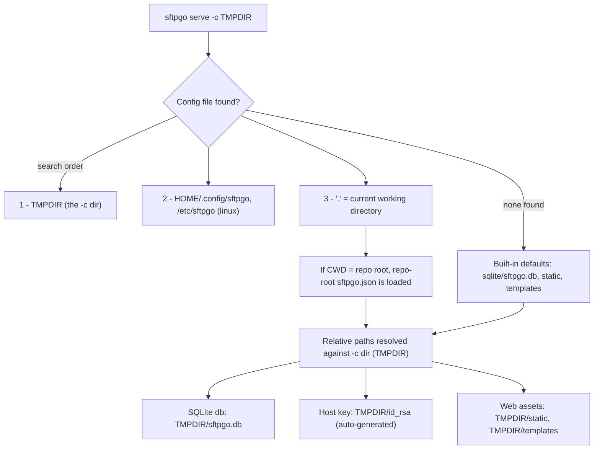
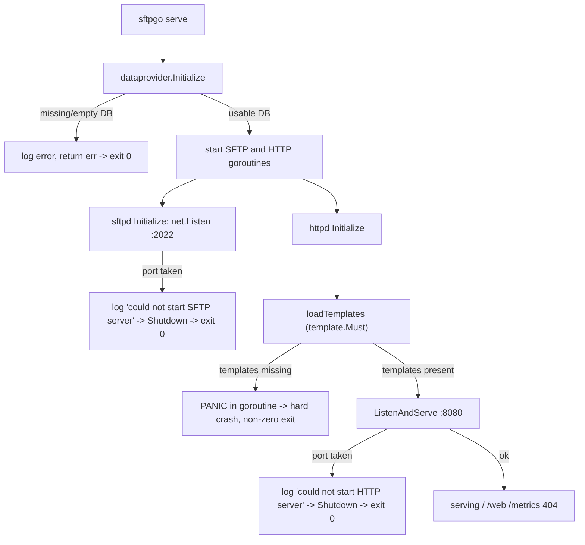

# SFTPGo (`sftpgo_44634210287c`) — Startup & Reverse-Proxy Behavior: A Code-Grounded Analysis

> **Scope.** This document answers two practical questions about running this checkout of
> [SFTPGo](https://github.com/drakkan/sftpgo) behind a TLS-terminating reverse proxy:
> (1) what really happens on a *clean / first start* — does a temporary `--config-dir` isolate
> *everything*, and does the directory you launch from matter? — and (2) when requests arrive
> carrying `Forwarded`, `X-Forwarded-For`, and `X-Real-IP`, *which* client address and *which*
> scheme does SFTPGo actually log, what happens with a multi-IP chain, and does the working
> directory influence any of it?

**Repository under analysis**

| Property | Value |
|---|---|
| Project | SFTPGo (`github.com/drakkan/sftpgo`) |
| Source branch | `sftpgo_44634210287c` (this document's filename equals the branch name) |
| HEAD commit | `44634210287cb192f2a53147eafb84a33a96826b` ("S3: add support for serving virtual folders") |
| Binary version string | `SFTPGo version: 0.9.5-dev` |
| Layout | flat top-level Go packages (`cmd/`, `config/`, `dataprovider/`, `sftpd/`, `httpd/`, `metrics/`, `logger/`, `service/`) |

**Empirical method (code as the source of truth).** Every conclusion below was derived two ways and
cross-checked: by **reading the governing Go source** (inline `[path:line]` citations point at the
exact lines in this checkout) and by **building and running the binary** under a controlled
experiment matrix. The toolchain used for the build/run — entirely under `/tmp`, never inside the
repository — was **Go 1.13.15** (matching `go.mod`'s `go 1.13` `[go.mod:3]` and `.travis.yml`'s
`1.13.x`), a system **gcc** C compiler (CGO is required by `mattn/go-sqlite3`), the **sqlite3** CLI
(to seed/inspect the database), and `curl` (to probe HTTP). The build command
`CGO_ENABLED=1 go build` exits `0` and produces a working `sftpgo` binary.

**Non-mutation guarantee.** Nothing in the SFTPGo source tree was created, modified, or deleted to
produce this analysis. `git status --porcelain` was empty before and after every experiment and the
HEAD commit was unchanged; all fixtures (compiled binary, seeded databases, port occupiers, probe
scripts, temporary config directories) lived under `/tmp` and were removed afterward. This document
is the only new file, and it adds no code to the project.

**Evidence conventions.** In the captured log/header snippets below, volatile fields are masked as
`<REDACTED>` (specifically the zerolog `time` field and the `request_id`); stable, meaningful fields
(`remote_addr`, `uri`, `method`, `resp_status`, `resp_size`) are shown verbatim. For readability,
the temporary `--config-dir` is shown as `/tmp/cfg`, a neutral launch directory as `/tmp/work`, and
the repository root as `<repo>`; each experiment actually used its own throwaway directory under
`/tmp`.

---

## 1. Executive Answer (TL;DR)

1. **A temporary `--config-dir` isolates *relative-path state* but *not* *config-file discovery* —
   so the working directory absolutely does matter.** Relative runtime paths (the SQLite database,
   the auto-generated SSH host key, the web `static`/`templates` directories) are resolved against
   the `-c` directory `[dataprovider/sqlite.go:23-26; sftpd/server.go:417-429; httpd/httpd.go:78-88]`,
   so those land *inside* your temp dir. **But** `LoadConfig` adds the temp dir, then the OS dirs,
   then `"."` (the current working directory) to Viper's config-file search path
   `[config/config.go:147-149]`. Because the repository root ships an `sftpgo.json`
   `[sftpgo.json:24-51]`, **launching from the repo root with a temp `-c` that has no config file
   causes the repo-root `sftpgo.json` to be loaded** — that is the "state/defaults from somewhere
   else" your teammate is seeing.

2. **Most first-start failures are logged and the process exits `0` (graceful) — except a missing
   web template, which `panic`s and exits *non-zero* (code 2).** `serve` uses Cobra's `Run`
   (not `RunE`) `[cmd/serve.go:17]`, and the SFTP/HTTP servers run in goroutines that log and push to
   a shutdown channel on failure `[service/service.go:91-109]`, so provider errors and port-bind
   conflicts end with status `0`. A missing template is different: `template.Must` panics inside the
   HTTP goroutine during initialization, before any request is served, so the per-request
   `Recoverer` never sees it and the whole process crashes `[httpd/web.go:95-98]`.

3. **Behind a TLS-terminating proxy, SFTPGo logs the scheme `http` and the *leftmost*
   `X-Forwarded-For` IP** (else `X-Real-IP`, else the real TCP peer), and **ignores the RFC 7239
   `Forwarded` header entirely.** Address selection is done by the `go-chi/chi` v4.0.2 `RealIP`
   middleware `[middleware/realip.go:40-53]`; the scheme is taken *only* from `r.TLS`
   `[logger/request_logger.go:36-39]`, and the proxy→SFTPGo hop is plain HTTP, so `r.TLS == nil` and
   the logged scheme is `http`. A multi-IP `X-Forwarded-For` yields the leftmost entry — with a quirk:
   `chi` splits on `", "` (comma **and** space), so a comma with **no** space makes it log the whole
   header string. The working directory has **no** effect on any of this.

4. **The `/metrics` `sftpgo_http_*` counters are header-independent.** `HTTPRequestServed(status)`
   keys only on the response status class `[metrics/metrics.go:220-229]`, and it is invoked from the
   very same `Write()` that emits the access log `[logger/request_logger.go:57-66]`. Repeating an
   identical request with and without forwarded headers moves the counters *identically* — the
   headers change the logged IP, not the metrics.

---

## 2. R1 — Clean-start / state-discovery: `--config-dir` vs. the working directory

The crux of the disagreement is that **two different mechanisms** are at play, and a temporary
`--config-dir` only governs one of them.

### 2.1 Mechanism (a): config-*file discovery* is CWD-sensitive

When the `serve` command runs, `service.Start()` calls
`config.LoadConfig(s.ConfigDir, s.ConfigFile)` `[service/service.go:65]`. `LoadConfig` builds
Viper's search path in this exact order and then reads the first match:

```go
// config/config.go:147-156
viper.AddConfigPath(configDir)            // 1. the -c / --config-dir directory
setViperAdditionalConfigPaths()           // 2. (linux) $HOME/.config/sftpgo, then /etc/sftpgo
viper.AddConfigPath(".")                  // 3. "." = the current working directory
viper.SetConfigName(configName)           //    default config name = "sftpgo"
if err = viper.ReadInConfig(); err != nil {
    logger.Warn(logSender, "", "error loading configuration file: %v. Default configuration will be used: %+v", ...)
    ...
    return err                            //    not fatal: built-in defaults remain in effect
}
```

The Linux search additions are literally `$HOME/.config/sftpgo` then `/etc/sftpgo`
`[config/config_linux.go:8-11]`. The `--config-dir` flag defaults to `"."` `[cmd/root.go:33]`, may be
overridden by `SFTPGO_CONFIG_DIR` `[cmd/root.go:78]`, and its help text documents it as "the base for
files with a relative path (eg. the private keys for the SFTP server, the SQLite database…)"
`[cmd/root.go:79-82]` — note that this describes mechanism (b), **not** config-file discovery. The
config *name* defaults to `"sftpgo"` (`DefaultConfigName` `[config/config.go:25]`), and Viper tries
every supported extension (`.json`, `.yaml`, `.toml`, …) in each search directory.

**Consequence:** entry 3 is the current working directory. If you launch from the repository root —
which ships an `sftpgo.json` `[sftpgo.json:24-51]` — and your temp `-c` directory has no config file,
discovery falls through to `"."` and **silently loads the repo's `sftpgo.json`**. If config-file
discovery were truly isolated by `-c`, the launch directory could not change which configuration is
loaded; it can, and it does.

### 2.2 Mechanism (b): relative-path *resolution* is anchored to `--config-dir` (not the CWD)

Whatever configuration ends up in effect, each *relative* runtime path is resolved against the
`--config-dir` via `filepath.Join(configDir, …)` — never against the CWD:

| Runtime artifact | Resolution | Citation |
|---|---|---|
| SQLite database file | `dbPath := config.Name; if !filepath.IsAbs(dbPath) { dbPath = filepath.Join(basePath, dbPath) }` (`basePath` == `ConfigDir`) | `[dataprovider/sqlite.go:23-26]` |
| SSH host key (`id_rsa`) | `autoFile := filepath.Join(configDir, defaultPrivateKeyName)` where `defaultPrivateKeyName = "id_rsa"` | `[sftpd/server.go:417-429; :27]` |
| Web `backups` / `static` / `templates` | each `filepath.Join(configDir, …)` when not absolute | `[httpd/httpd.go:78-88]` |

So the database, the auto-generated host key, and the web assets all land *inside* the temp `-c`
directory — that part of your teammate's mental model is correct.

### 2.3 Built-in defaults (used only when no config file is found)

When discovery finds nothing, the compiled-in defaults `[config/config.go:41-94]` apply:

| Area | Default | 
|---|---|
| SFTP bind port | `2022` |
| Data provider | `Driver "sqlite"`, `Name "sftpgo.db"`, `UsersTable "users"`, `TrackQuota 1` |
| HTTP server | `BindPort 8080`, `BindAddress "127.0.0.1"`, `TemplatesPath "templates"`, `StaticFilesPath "static"`, `BackupsPath "backups"` |
| Default config name | `"sftpgo"` |

The bundled repo-root `sftpgo.json` mirrors the driver/name/ports/paths above
(`sqlite`/`sftpgo.db`, httpd `8080`/`127.0.0.1`/`templates`/`static`/`backups`, sftpd `2022`)
`[sftpgo.json:2-3,24-51]`. It does, however, differ in at least one value — `track_quota` is `2` in the
file `[sftpgo.json:35]` versus the built-in default of `1` — which turns out to be a convenient way to
*prove* which configuration was loaded (see §2.5).

### 2.4 The model, visualized



### 2.5 Evidence

**The search path is printed in the open.** When no config file is found, the warning line literally
enumerates the four search directories in order — direct proof of mechanism (a). This is the
`SQLite missing` run launched from a neutral directory (`/tmp/work`) with `-c /tmp/cfg`:

```json
{"level":"warn","time":"<REDACTED>","sender":"config","connection_id":"","message":"error loading configuration file: Config File \"sftpgo\" Not Found in \"[/tmp/cfg /root/.config/sftpgo /etc/sftpgo /tmp/work]\". Default configuration will be used: {...}"}
```

The bracketed list `[/tmp/cfg /root/.config/sftpgo /etc/sftpgo /tmp/work]` is exactly
`[ -c dir, $HOME/.config/sftpgo, /etc/sftpgo, CWD ]` — the last entry is the working directory.

**The launch directory changes which config is loaded — but never moves the database.** Running with
a temp `-c /tmp/cfg` that contains no config file, from three different working directories:

| Run | Working directory | `-f` (config name) | Config-file outcome | `TrackQuota` in effect | Provider error (DB path) | Exit |
|---|---|---|---|---|---|---|
| E6a | `/tmp/work` (neutral) | `sftpgo` (default) | **"Not Found" warning** → built-in defaults | `1` (default) | `stat /tmp/cfg/sftpgo.db: no such file or directory` | `0` |
| E6b | `<repo>` (repo root) | `sftpgo` (default) | **no warning** → loaded `<repo>/sftpgo.json` | `2` (from the file) | `stat /tmp/cfg/sftpgo.db: no such file or directory` | `0` |
| E6c | `<repo>` (repo root) | `doesnotexist` | **"Not Found" warning** → built-in defaults | `1` (default) | `stat /tmp/cfg/sftpgo.db: no such file or directory` | `0` |

E6b is the smoking gun: from the repo root, discovery silently picks up `<repo>/sftpgo.json` (no
warning; the binary instead logs a debug line `config file used: '<repo>/sftpgo.json'`), and the
`TrackQuota:2` value proves the *file* — not the defaults — was used. **Yet the provider still looks
for the database at `/tmp/cfg/sftpgo.db`** (the `-c` dir), not in the repo root — demonstrating both
mechanisms in a single run. E6c is the control: keep the CWD at the repo root but ask for a config
name that does not exist there, and the warning returns — confirming E6b's silence was specifically
because the repo ships `sftpgo.json`.

### 2.6 Correcting the teammate's model

> "A temp config directory isolates everything, and it shouldn't matter whether I start from the
> repo root or some other folder."

This is **half right**. A temp `--config-dir` *does* isolate relative-path **state** — the SQLite DB,
the host key, and the web assets are all created/looked-up inside it. But it does **not** isolate
config-**file discovery**, which still searches `$HOME/.config/sftpgo`, `/etc/sftpgo`, and the current
working directory. Launching from the repo root therefore loads the bundled `sftpgo.json` even when
the temp `-c` dir is empty — which is exactly the "process is quietly finding state/defaults from
somewhere else" symptom. To get a genuinely clean start, run from a neutral directory (or one with no
`sftpgo.{json,yaml,…}`), ensure `$HOME/.config/sftpgo` and `/etc/sftpgo` are absent, and place an
explicit config file inside the `-c` directory if you want deterministic configuration.

---

## 3. R2 — First-start scenario matrix: startup behavior, exit status, HTTP responses

A first start can go wrong in several distinct ways. The table compares the named situations
side by side; the per-row evidence is collected in the appendix (§5). All runs used a temporary
`-c /tmp/cfg`; "usable" runs seeded the `users` table with the exact DDL from `.travis.yml`
`[.travis.yml:14]` (this SFTPGo version does **not** auto-create the schema — `sql/sqlite/*.sql`
ships the migrations and CI creates the table manually).

| # | Scenario | Startup behavior | Exit status | HTTP responses |
|---|---|---|---|---|
| E1 | **SQLite missing** | `os.Stat` on the DB fails; logs `sqlite database file does not exists, please be sure to create and initialize a database before starting sftpgo`; `dataprovider.Initialize` returns the error and `Start()` aborts before any server goroutine `[dataprovider/sqlite.go:27-32; service/service.go:69-74]` | **`0`** (graceful) | none — no server ever binds |
| E2 | **SQLite empty** (0-byte file) | DB exists but `fi.Size() == 0`; returns `errors.New("sqlite database file is invalid, please be sure to create and initialize a database before starting sftpgo")`; provider-init aborts `[dataprovider/sqlite.go:33-36]` | **`0`** (graceful) | none |
| E3 | **SQLite usable** (seeded) | provider opens `file:/tmp/cfg/sftpgo.db?cache=shared`, `SetMaxOpenConns(1)` `[dataprovider/sqlite.go:37-45]`; SFTP + HTTP goroutines start; `id_rsa` auto-created (mode `600`) in `-c` dir | runs (until stopped) | `/`→`301`, `/web`→`301`, `/metrics`→`200`, unknown→`404` (JSON) |
| E4 | **SFTP port `:2022` taken** | `checkHostKeys` creates `id_rsa` first, then `net.Listen` fails; logs `error starting listener on address :2022: ... address already in use` and `could not start SFTP server: …`; the SFTP goroutine pushes to `Shutdown` `[sftpd/server.go:147,178-182; service/service.go:91-98]` | **`0`** (graceful) | HTTP still bound `:8080` (but process exits when the SFTP goroutine signals shutdown) |
| E5a | **Templates missing** | HTTP goroutine calls `Conf.Initialize` → `loadTemplates` → `template.Must(template.ParseFiles(...))` **panics** on the first missing file (`base.html`), uncaught `[httpd/httpd.go:89; httpd/web.go:95-98]` | **`2`** (hard crash) | none — the process dies during init, before serving |
| E5b | **Static missing** (templates present) | server binds normally; pages render, but files under `/static/*` 404 via Go's `http.FileServer` `[httpd/router.go:127-130,146-158]` | runs (until stopped) | `/web/users`→`200`; `/static/...`→`404` (plain text) |

### 3.1 Why the exit status diverges (the subtle part)

The contrast between "graceful exit `0`" and "hard crash exit `2`" comes down to *where* the failure
happens and *how* the command is wired:

- **`serve` uses Cobra's `Run`, not `RunE`** `[cmd/serve.go:17]`. Its body is
  `if err := service.Start(); err == nil { service.Wait() }` `[cmd/serve.go:29-31]`. When `Start()`
  returns an error, `Wait()` is simply skipped, the command's `Run` returns normally, and the process
  exits `0`. `Execute()` only calls `os.Exit(1)` if the *Cobra command itself* returns an error
  `[cmd/root.go:69-74]`, which `Run` (being error-less) never does.
- **Provider-init failure (E1/E2)** returns an error straight out of `Start()`
  `[service/service.go:69-74]`, so `Wait()` is skipped → exit `0`.
- **Port-bind failure (E4, and the analogous HTTP-port case)** happens *inside a goroutine*. That
  goroutine logs the error and pushes `s.Shutdown <- true` `[service/service.go:91-98,103-109]`;
  `Start()` had already returned `nil`, so `Wait()` is running and simply unblocks → the process
  exits `0`.
- **A missing template (E5a) is the lone exception.** `template.Must` panics
  `[httpd/web.go:95-98]` *inside the HTTP goroutine during `Conf.Initialize`*
  `[httpd/httpd.go:89]` — i.e., **before** any request is handled. The `Recoverer` middleware only
  protects *per-request* handlers `[httpd/router.go:26]`, so it never sees this panic. An unrecovered
  panic in a goroutine takes down the whole process, which exits with the Go runtime's panic status,
  `2`.



### 3.2 The two flavors of `404`

It is worth distinguishing them, because they look different on the wire:

- **Unknown *route*** (e.g. `/nope`, `/api/v1/missing`) → handled by the chi router's `NotFound`
  hook, which emits a JSON body `[httpd/router.go:28-30]`:
  `{"error":"","message":"Not Found","status":404}` (`Content-Type: application/json`,
  `Content-Length: 48`).
- **Missing *file* under `/static/*`** → handled by Go's `http.FileServer`
  `[httpd/router.go:146-158]`, which emits plain text `404 page not found`
  (`Content-Type: text/plain`, `X-Content-Type-Options: nosniff`, `Content-Length: 19`).

(One more nuance: `/` and `/web` are registered with `router.Get(...)` — **GET-only**. A `HEAD`
request to them, such as `curl -sI` sends, returns `405 Method Not Allowed` via the router's
`MethodNotAllowed` hook, not `301`. Use an actual `GET` to observe the redirect.)


---

## 4. R3 — Reverse-proxy header logging: which address, which scheme, multi-IP, and CWD

### 4.1 The middleware chain

The HTTP router installs middleware in this order `[httpd/router.go:23-26]`:

```go
router.Use(middleware.RequestID)                          // assigns request_id
router.Use(middleware.RealIP)                             // rewrites r.RemoteAddr from proxy headers
router.Use(logger.NewStructuredLogger(logger.GetLogger())) // emits the access log + bumps metrics
router.Use(middleware.Recoverer)                          // recovers per-request panics
```

Because `RealIP` runs *before* the structured logger, whatever it writes into `r.RemoteAddr` is what
the access log records.

### 4.2 Which *address* is logged — precedence

`RealIP` is `go-chi/chi` v4.0.2's middleware. Its documentation and code make the precedence explicit:
it consults **only** `X-Forwarded-For` `[middleware/realip.go:11]` and `X-Real-IP`
`[middleware/realip.go:12]` — there is **no** handling of the RFC 7239 `Forwarded` header (nor of
`True-Client-IP`). The selection logic is:

```go
// middleware/realip.go:40-53
func realIP(r *http.Request) string {
    var ip string
    if xff := r.Header.Get(xForwardedFor); xff != "" {
        i := strings.Index(xff, ", ")   // NOTE: comma-AND-space
        if i == -1 {
            i = len(xff)                 // no ", " found → take the WHOLE header
        }
        ip = xff[:i]                     // leftmost token
    } else if xrip := r.Header.Get(xRealIP); xrip != "" {
        ip = xrip                        // fall back to X-Real-IP
    }
    return ip
}
```

`RealIP` then sets `r.RemoteAddr = rip` **only when `rip` is non-empty**; otherwise the real TCP peer
is left in place `[middleware/realip.go:29-38]`. So the precedence the access log records is:

> **leftmost `X-Forwarded-For` entry → else `X-Real-IP` → else the real TCP peer.**

The access log then reads `r.RemoteAddr` straight into the `remote_addr` field
`[logger/request_logger.go:42]`.

**The `", "` quirk (multi-IP chains).** A standards-style `X-Forwarded-For: a, b, c` (comma-space)
splits cleanly and the leftmost `a` is logged. But because the split token is literally `", "`, an
`X-Forwarded-For: a,b` written with a comma but **no space** never matches, so
`i = len(xff)` and the **entire string `"a,b"` is logged** as the address. This is a real, observable
artifact of this exact `chi` version, not a typo.

> **Security / trust boundary — the logged `remote_addr` is client-spoofable.** `chi`'s `RealIP`
> middleware explicitly warns you should *"only use this middleware if you can trust the headers passed
> to you"* — i.e. only when a reverse proxy such as HAProxy or nginx sits in front of `chi` — because
> otherwise *"malicious clients will be able to make you very sad"* `[middleware/realip.go:22-28]`.
> Since `remote_addr` is taken **verbatim** from the leftmost `X-Forwarded-For` entry (else `X-Real-IP`)
> `[middleware/realip.go:43-50]`, any client that can reach SFTPGo's HTTP listener directly — rather than
> only through the proxy — can forge those headers and write an arbitrary address into the access log.
> **Only trust `remote_addr` when a trusted reverse proxy is the sole ingress and is configured to
> overwrite/strip inbound `X-Forwarded-For`/`X-Real-IP` before forwarding;** otherwise treat it as
> attacker-controlled.

### 4.3 Which *scheme* is logged — `r.TLS` only

The scheme in the logged `uri` is derived solely from the TLS state of the connection *to SFTPGo*,
never from any header `[logger/request_logger.go:36-39]`:

```go
scheme := "http"
if r.TLS != nil {
    scheme = "https"
}
// ...
"uri": fmt.Sprintf("%s://%s%s", scheme, r.Host, r.RequestURI)
```

Behind a TLS-terminating reverse proxy, the proxy speaks HTTPS to the client but forwards plain HTTP
to SFTPGo (the project's own README shows `ProxyPass … http://127.0.0.1:8080/…`). On that hop
`r.TLS == nil`, so **SFTPGo logs `http://…` even when the client used HTTPS** and even when the
request carries `X-Forwarded-Proto: https` or `Forwarded: …;proto=https`. Neither header is consulted.

### 4.4 Does the working directory matter? No.

Header handling is pure per-request logic in the middleware and logger — it touches no files, no
config, and no `--config-dir`/CWD-relative path. The directory you launch from has **zero** effect on
which address or scheme is logged.

### 4.5 Evidence — one endpoint, every header permutation

All requests below are `GET /web/connections` (which returns `200`); only the proxy-style headers
differ. The value shown is the resulting `remote_addr` in the access log:

```text
(no forwarded headers)                                   -> remote_addr = 127.0.0.1:<port>   (real TCP peer)
X-Forwarded-For: 1.2.3.4                                 -> remote_addr = 1.2.3.4
X-Forwarded-For: 1.2.3.4, 5.6.7.8, 9.10.11.12 (comma+sp) -> remote_addr = 1.2.3.4            (LEFTMOST wins)
X-Forwarded-For: 1.2.3.4,5.6.7.8 (comma, NO space)       -> remote_addr = 1.2.3.4,5.6.7.8    (WHOLE STRING - quirk)
X-Real-IP: 9.9.9.9 (no XFF)                              -> remote_addr = 9.9.9.9
X-Forwarded-For: 1.2.3.4  +  X-Real-IP: 9.9.9.9          -> remote_addr = 1.2.3.4            (XFF BEATS X-Real-IP)
Forwarded: for=192.0.2.60;proto=https;by=203.0.113.43    -> remote_addr = 127.0.0.1:<port>   (Forwarded IGNORED)
```

One representative access-log line (the `X-Forwarded-For: 1.2.3.4` case), with `time` and
`request_id` redacted and all other fields verbatim:

```json
{"level":"info","time":"<REDACTED>","sender":"httpd","method":"GET","proto":"HTTP/1.1","remote_addr":"1.2.3.4","request_id":"<REDACTED>","uri":"http://127.0.0.1:8080/web/connections","user_agent":"curl/8.14.1","resp_status":200,"resp_size":7752,"elapsed_ms":0}
```

Note the `uri` scheme is `http://` here — and it stays `http://` in *every* permutation above,
including the `Forwarded: …;proto=https` case — because the scheme comes from `r.TLS`, and the
connection to SFTPGo was plain HTTP.

> **Standards framing (one line, for context only):** RFC 7239 `Forwarded` is the IETF-standardized,
> structured header, whereas `X-Forwarded-For`/`X-Real-IP` are the de-facto conventions — and this
> SFTPGo (via `chi` v4.0.2) honors only the latter two, ignoring `Forwarded` entirely. The code above
> is the authority; this note only situates it against what a typical proxy emits.


---

## 5. R4 — Evidence appendix

All snippets are real captured output (`time` and `request_id` masked as `<REDACTED>`; paths
normalized as described at the top). Each log line in this build also carries a `connection_id` field,
which is empty (`""`) for startup/service/config lines; it is shown as-is.

### 5.1 Startup log lines

**SQLite missing (E1)** — graceful exit `0`. Note the startup line, the search-path warning
(mechanism (a) in the open), the SQLite warning, and the provider-init abort:

```json
{"level":"info","time":"<REDACTED>","sender":"service","connection_id":"","message":"starting SFTPGo 0.9.5-dev, config dir: /tmp/cfg, config file: sftpgo, log max size: 10 log max backups: 5 log max age: 28 log verbose: true, log compress: false"}
{"level":"warn","time":"<REDACTED>","sender":"config","connection_id":"","message":"error loading configuration file: Config File \"sftpgo\" Not Found in \"[/tmp/cfg /root/.config/sftpgo /etc/sftpgo /tmp/work]\". Default configuration will be used: {...}"}
{"level":"warn","time":"<REDACTED>","sender":"sqlite","connection_id":"","message":"sqlite database file does not exists, please be sure to create and initialize a database before starting sftpgo"}
{"level":"error","time":"<REDACTED>","sender":"service","connection_id":"","message":"error initializing data provider: stat /tmp/cfg/sftpgo.db: no such file or directory"}
```

**SQLite empty (E2)** — graceful exit `0`; same startup + search-path warning precede this line:

```json
{"level":"error","time":"<REDACTED>","sender":"service","connection_id":"","message":"error initializing data provider: sqlite database file is invalid, please be sure to create and initialize a database before starting sftpgo"}
```

**SFTP port `:2022` taken (E4)** — graceful exit `0`; `id_rsa` is created *before* the failed bind:

```json
{"level":"info","time":"<REDACTED>","sender":"sftpd","connection_id":"","message":"No host keys configured and \"/tmp/cfg/id_rsa\" does not exist; creating new private key for server"}
{"level":"info","time":"<REDACTED>","sender":"sftpd","connection_id":"","message":"Loading private key: /tmp/cfg/id_rsa"}
{"level":"warn","time":"<REDACTED>","sender":"sftpd","connection_id":"","message":"error starting listener on address :2022: listen tcp :2022: bind: address already in use"}
{"level":"error","time":"<REDACTED>","sender":"service","connection_id":"","message":"could not start SFTP server: listen tcp :2022: bind: address already in use"}
```

**Templates missing (E5a)** — the only **non-zero** exit (code `2`); unrecovered panic in the HTTP
goroutine (stack abbreviated; the file:line references are exact for this checkout):

```text
panic: open /tmp/cfg/templates/base.html: no such file or directory

goroutine [running]:
html/template.Must(...)
	/usr/local/go/src/html/template/template.go:372
github.com/drakkan/sftpgo/httpd.loadTemplates(...)
	<repo>/httpd/web.go:95
github.com/drakkan/sftpgo/httpd.Conf.Initialize(...)
	<repo>/httpd/httpd.go:89
github.com/drakkan/sftpgo/service.(*Service).Start.func2(...)
	<repo>/service/service.go:104
created by github.com/drakkan/sftpgo/service.(*Service).Start
	<repo>/service/service.go:103
```

### 5.2 HTTP response-header slices (usable server, E3)

Captured with an actual `GET` (`curl -s -D -`), since `/` and `/web` are GET-only (a `HEAD` via
`curl -sI` returns `405`):

```text
GET /                -> HTTP/1.1 301 Moved Permanently | Location: /web/users | Content-Type: text/html; charset=utf-8 | Content-Length: 45
GET /web             -> HTTP/1.1 301 Moved Permanently | Location: /web/users | Content-Type: text/html; charset=utf-8 | Content-Length: 45
GET /metrics         -> HTTP/1.1 200 OK | Content-Type: text/plain; version=0.0.4; charset=utf-8 | Transfer-Encoding: chunked
GET /nope            -> HTTP/1.1 404 Not Found | Content-Type: application/json; charset=utf-8 | Content-Length: 48
GET /api/v1/missing  -> HTTP/1.1 404 Not Found | Content-Type: application/json; charset=utf-8 | Content-Length: 48
```

Body of an unknown route (exact):

```json
{"error":"","message":"Not Found","status":404}
```

Missing static file (E5b) — distinct, plain-text `404` from Go's `http.FileServer`:

```text
GET /web/users            -> HTTP/1.1 200 OK | Content-Type: text/html; charset=utf-8        (page renders)
GET /static/css/style.css -> HTTP/1.1 404 Not Found | Content-Type: text/plain; charset=utf-8 | X-Content-Type-Options: nosniff | Content-Length: 19
body: "404 page not found"
```

### 5.3 One access-log line for a proxy-style request (redacted)

```json
{"level":"info","time":"<REDACTED>","sender":"httpd","method":"GET","proto":"HTTP/1.1","remote_addr":"1.2.3.4","request_id":"<REDACTED>","uri":"http://127.0.0.1:8080/web/connections","user_agent":"curl/8.14.1","resp_status":200,"resp_size":7752,"elapsed_ms":0}
```

### 5.4 `/metrics` `sftpgo_http_*` counters and the status-class logic

Four counters are defined `[metrics/metrics.go:130-148]`, and `HTTPRequestServed(status)` increments
them purely by status class `[metrics/metrics.go:220-229]`:

| Counter | Bumped when | 
|---|---|
| `sftpgo_http_req_total` | **always** (every served request) |
| `sftpgo_http_req_ok_total` | status in `200..299` |
| `sftpgo_http_client_errors_total` | status in `400..499` |
| `sftpgo_http_server_errors_total` | status `>= 500` |

There is no `3xx` branch — so a redirect bumps **only** `req_total`. After the E3 probe sequence
(`GET /`, `/web`, `/metrics`, `/nope`, `/api/v1/missing`, and one more 404), the snapshot read of
`/metrics` shows exactly:

```text
sftpgo_http_req_total 6
sftpgo_http_req_ok_total 1
sftpgo_http_client_errors_total 3
sftpgo_http_server_errors_total 0
```

That is `2×301 (/ and /web) + 1×200 (/metrics) + 3×404` = `6` total; the two `301` redirects bumped
`req_total` but **not** `req_ok` — confirming the missing `3xx` branch.

**Header independence (the "undeniable" proof).** Repeating an identical `GET /metricprobe`
(a `404` path) five times — once *without* any forwarded headers, once *with*
`X-Forwarded-For` + `X-Real-IP` + `Forwarded` — moved the counters **identically** (deltas measured
between `/metrics` snapshots that bracket each round):

```text
counter                            Δ without headers   Δ with headers
sftpgo_http_req_total                    +6                 +6
sftpgo_http_req_ok_total                 +1                 +1
sftpgo_http_client_errors_total          +5                 +5
sftpgo_http_server_errors_total          +0                 +0
```

The `+5` on `client_errors` is the five `404`s; the `+1 ok` (and the extra `+1` on `req_total`) is the
`/metrics` snapshot request itself — a `200` — counted within the interval. Both rounds are identical
because the counters key on status only: **the forwarded headers change the logged IP, not the
metrics.**

---

## 6. Rationale & a direct correction of the teammate's mental model

**On the clean start (R1).** The belief that "a temp config dir isolates everything and the launch
directory doesn't matter" is *incomplete*. There are two separate mechanisms:

- *Relative-path state* **is** isolated to the temp `--config-dir`: the SQLite database, the
  auto-generated `id_rsa` host key, and the `static`/`templates` directories are all created or
  looked up via `filepath.Join(configDir, …)` `[dataprovider/sqlite.go:23-26; sftpd/server.go:417-429;
  httpd/httpd.go:78-88]`. So far, so good.
- *Config-file discovery* is **not** isolated. `LoadConfig` searches the `-c` dir, then
  `$HOME/.config/sftpgo` and `/etc/sftpgo`, then `"."` — the current working directory
  `[config/config.go:147-149]`. Launch from the repository root and the bundled `sftpgo.json`
  `[sftpgo.json:24-51]` is picked up automatically (proven by the `TrackQuota:2` value and the absence
  of the "Not Found" warning in run E6b). **That** is the "process is quietly finding state/defaults
  from somewhere else" symptom — it is the *configuration* arriving from the CWD, while the *database
  path* still points inside the temp `-c` dir. The fix for a deterministic clean start is to launch
  from a neutral directory (or one without an `sftpgo.{json,yaml,…}`), confirm
  `$HOME/.config/sftpgo` and `/etc/sftpgo` are empty, and put an explicit config file inside the `-c`
  dir.

**On exit status (R2).** Don't equate "it logged an error and stopped" with a failed exit code. Because
`serve` uses Cobra `Run` (not `RunE`) `[cmd/serve.go:17]` and the servers fail inside goroutines that
push to a shutdown channel `[service/service.go:91-109]`, a missing/empty database (E1/E2) and a
taken SFTP/HTTP port (E4) all end with status **`0`**. The single exception is a **missing template**
(E5a): `template.Must` panics during HTTP initialization, outside the per-request `Recoverer`, so the
process crashes with status **`2`** `[httpd/web.go:95-98]`. If you wire up health checks or
supervisors, only the template case will be visible as a non-zero exit; the rest must be detected from
the logs.

**On proxy headers (R3/R4).** Behind a TLS-terminating proxy, expect SFTPGo to log scheme `http`
(from `r.TLS` only `[logger/request_logger.go:36-39]`) and the **leftmost `X-Forwarded-For`** IP, with
`X-Real-IP` as the fallback and the RFC 7239 `Forwarded` header **ignored**
`[middleware/realip.go:40-53]`. Crucially, that logged `remote_addr` is **client-spoofable** — rely on
it only behind a trusted proxy that overwrites/strips inbound `X-Forwarded-For`/`X-Real-IP`, since `chi`
warns these headers are forgeable when the server is reachable directly `[middleware/realip.go:22-28]`.
Mind the `", "` split quirk: a comma-without-space `X-Forwarded-For`
is logged whole. And none of this depends on the working directory — header handling is pure
per-request logic. Finally, the `sftpgo_http_*` metrics are driven solely by the response status
class `[metrics/metrics.go:220-229]`, so they are identical with or without forwarded headers.

**Bottom line.** A temporary `--config-dir` is a good way to isolate *state*, but to isolate
*configuration* you must also control the working directory (and the OS config directories). For the
reverse-proxy deployment, plan around SFTPGo logging `http` and the leftmost `X-Forwarded-For` — and
rely on the `sftpgo_http_*` counters as a header-independent, working-directory-independent signal.

---

*This analysis was produced by reading the source at HEAD `44634210287cb192f2a53147eafb84a33a96826b`
and by building (`Go 1.13.15` + CGO) and running the binary under an isolated experiment matrix in
`/tmp`. No file in the SFTPGo source tree was modified; the repository remained byte-for-byte
unchanged throughout.*

