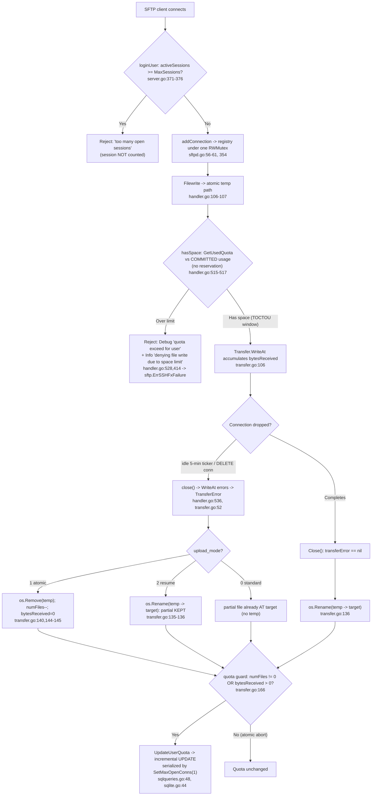

# SFTPGo Under Contention: Connection Handling, Quota Enforcement, Atomic Uploads, and the Idle Checker — an Evidence‑Grounded Investigation

> **Repository:** `github.com/drakkan/sftpgo` · **Commit under investigation:** `44634210287cb192f2a53147eafb84a33a96826b` · **Build identity:** `SFTPGo version: 0.9.5-dev`
>
> **Methodology (per rule `SWE-AtlasQnA-Repo`):** This document was written **from running code, not code reading alone**. The relevant paths were built and executed first; a strict‑quota, session‑limited user was provisioned; concurrent uploads were driven against it; transfers were killed mid‑stream; and the idle checker was allowed to fire. Every observed value — JSON log lines (with their level and exact message string), HTTP status/body, `sqlite3` query results, and filesystem listings — is quoted **verbatim** together with the exact command that produced it. Every factual claim carries an exact literal and a `file:line` citation. Where a claim is derived from reading code rather than runtime it is marked **(by code inspection)**; where an expected observation could not be forced it is **flagged** rather than asserted. All runtime artifacts lived in an isolated `/tmp` workspace and were removed afterward; the repository is left unchanged except for this one document.

---

## 1. The question and the scenario

### 1.1 The six sub‑questions

The investigation answers, explicitly, how SFTPGo coordinates **connection handling, per‑user session limits, quota enforcement, atomic uploads, and the periodic idle‑connection checker** when a strict‑quota user opens multiple sessions near `max_sessions` and launches concurrent uploads that collectively threaten to exceed **both** `quota_files` and `quota_size`, while the idle checker runs in the background:

- **Q1 — Burst under contention.** What happens when a strict‑quota user opens sessions near `max_sessions` and starts concurrent uploads collectively exceeding *both* `quota_files` and `quota_size`, while the idle checker terminates connections in the background.
- **Q2 — Quota coordination (race vs. serialize).** How quota updates are coordinated across simultaneous transfers — do the quota checks race or serialize cleanly, and *where* does that decision first manifest as runtime evidence.
- **Q3 — Atomic partial‑file accounting.** When an upload is partway through writing to a temporary file in atomic mode and the connection is dropped, what happens to the partial temp file and its quota accounting — is it cleaned up and reversed, or does it linger.
- **Q4 — Observable burst evidence.** What the actual logged messages, file states, and quota values look like during a burst — sessions accepted vs. rejected, how the quota numbers change at each step, and whether temp files survived that should not have.
- **Q5 — Kill‑mid‑stream vs. clean completion.** What gaps or inconsistencies appear when a transfer is deliberately killed mid‑stream compared with completing normally — the concrete signs in logs and on the filesystem that reveal which path was taken.
- **Q6 — Coordination under stress.** How the pieces coordinate under stress, where the handoffs happen, and the observable differences between a clean run and a contended run.

### 1.2 The scenario as provisioned

A single strict‑quota, session‑limited user named `strict` was created with **`max_sessions: 2`**, **`quota_files: 2`**, and **`quota_size: 4096`** (bytes). A second user `bulk` (`quota_files: 1000`, `quota_size: 10485760`) was used where a large quota budget was needed to isolate the write‑serialization and atomic‑abort behaviors from the quota‑denial behavior. Concurrent SFTP sessions and uploads were driven from a temporary `github.com/pkg/sftp` client harness. Transfers were dropped mid‑stream deterministically via the REST endpoint `DELETE /api/v1/connection/{connectionID}`, because — as shown in Q1/Q6 — the genuine idle path is intentionally coarse (minute‑granularity threshold, hard‑coded 5‑minute ticker).

### 1.3 How the pieces fit together (map of the coordination)



---

## 2. Environment and build

### 2.1 Toolchain and build

The server was built from the repository root with the Go 1.13.15 toolchain and CGO enabled (the default `github.com/mattn/go-sqlite3` provider requires CGO). The module declares `module github.com/drakkan/sftpgo` and `go 1.13` (`go.mod:1,3`), with the relevant pinned dependencies `github.com/pkg/sftp v1.11.0` (`go.mod:18`), `github.com/mattn/go-sqlite3 v2.0.2+incompatible` (`go.mod:15`), `github.com/rs/xid v1.2.1` (`go.mod:20`), and `github.com/rs/zerolog v1.17.2` (`go.mod:21`).

```console
$ source /etc/profile.d/go.sh   # sets GO111MODULE=on, CGO_ENABLED=1, GOPATH=/root/go
$ cd /tmp/blitzy/sftpgo/blitzy-81dc959f-ec96-4f45-bd09-9ea4c4f3318c_193ae4
$ GOPROXY=off go build -o /tmp/sftpgo_obs/sftpgo
# exit 0; only output is a harmless CGO warning from go-sqlite3's bundled C:
#   sqlite3-binding.c:125801:10: warning: function may return address of local variable [-Wreturn-local-addr]
# resulting binary: 31882120 bytes
```

The build identity was verified verbatim:

```console
$ /tmp/sftpgo_obs/sftpgo -v
SFTPGo version: 0.9.5-dev
```

This matches the version constant `version = "0.9.5-dev"` (`utils/version.go:3`) rendered through the template `"SFTPGo version: {{.Version}}"` (`cmd/root.go:63`).

An optional race‑detector binary was also built for Q2/Q6 characterization: `GOPROXY=off go build -race -o /tmp/sftpgo_obs/sftpgo_race` (exit 0, same harmless CGO warning).

### 2.2 Isolated runtime workspace and configuration overrides

All runtime state lived under `/tmp/sftpgo_obs/` (`config/`, `home/`, `db/`, `logs/`, `harness/`). The harness wrote its own `sftpgo.json` there, **overriding** the repository defaults. The repository default is `sftpd.upload_mode: 0` (standard) and `sftpd.idle_timeout: 15` — so atomic mode and a short idle timeout had to be set explicitly. The overrides used were:

| Key | Repo default | Harness override | Why |
|-----|--------------|------------------|-----|
| `sftpd.bind_port` | 2022 | 2022 | SFTP listener |
| `sftpd.idle_timeout` | 15 | **1** | Exercise the genuine idle path faster (still coarse — see Q1) |
| `sftpd.upload_mode` | **0** (standard) | **1** (atomic) | Observe the atomic temp‑file lifecycle; modes 2 and 0 contrasted later |
| `data_provider.driver` | sqlite | sqlite | Default provider; home of the write‑serialization point |
| `data_provider.track_quota` | 2 | 2 | Quota tracked for users *with* restrictions |
| `data_provider.name` | sftpgo.db | `/tmp/sftpgo_obs/db/sftpgo.db` | Keep the DB out of the repo |
| `httpd.bind_port` | 8080 | 8080 | REST control plane |
| `httpd.bind_address` | 127.0.0.1 | 127.0.0.1 | REST control plane |

The SQLite database file must be pre‑initialized before first run: `initializeSQLiteProvider` rejects an empty database file, so the `users` table DDL (taken from `.travis.yml`) was applied with the `sqlite3` CLI before starting the server **(by code inspection: `dataprovider/sqlite.go:18,33`)**.

### 2.3 Server startup (verbatim)

```console
$ nohup /tmp/sftpgo_obs/sftpgo serve -c /tmp/sftpgo_obs/config \
       -l /tmp/sftpgo_obs/logs/sftpgo.log --log-verbose \
       > /tmp/sftpgo_obs/logs/stdout.log 2>&1 &
```

Startup log lines (verbatim, from `/tmp/sftpgo_obs/logs/sftpgo.log`):

```json
{"level":"info","time":"2026-07-01T05:06:43.046","sender":"service","connection_id":"","message":"starting SFTPGo 0.9.5-dev, config dir: /tmp/sftpgo_obs/config, config file: sftpgo, log max size: 10 log max backups: 5 log max age: 28 log verbose: true, log compress: false"}
{"level":"debug","time":"2026-07-01T05:06:43.047","sender":"sqlite","connection_id":"","message":"sqlite database handle created, connection string: \"file:/tmp/sftpgo_obs/db/sftpgo.db?cache=shared\""}
{"level":"info","time":"2026-07-01T05:06:43.047","sender":"sftpd","connection_id":"","message":"No host keys configured and \"/tmp/sftpgo_obs/config/id_rsa\" does not exist; creating new private key for server"}
{"level":"info","time":"2026-07-01T05:06:45.374","sender":"sftpd","connection_id":"","message":"server listener registered address: 127.0.0.1:2022"}
```

The `sqlite` line confirms the DSN `file:/tmp/sftpgo_obs/db/sftpgo.db?cache=shared` at runtime, matching the format string `"file:%v?cache=shared"` (`dataprovider/sqlite.go:37`). The host key was created under `/tmp`, not in the repository. Logs are structured JSON via `rs/zerolog` with the fields `level`, `time`, `sender`, `connection_id`, `message` (`logger/logger.go:99,104,109`).

### 2.4 REST control plane and user provisioning (verbatim)

The REST API answered on `127.0.0.1:8080`:

```console
$ curl -s -i http://127.0.0.1:8080/api/v1/version
HTTP/1.1 200 OK
...
{"version":"0.9.5-dev","build_date":"","commit_hash":""}
```

The strict user was created via `POST /api/v1/user` (path constant `userPath = "/api/v1/user"`, `httpd/httpd.go:24`; route `router.Post(userPath, ...)`, `httpd/router.go:79`). Note that in `0.9.5-dev` the REST router installs no authentication middleware, so the `POST` succeeds directly **(by code inspection: `httpd/router.go`)**.

```console
$ curl -s -i -X POST http://127.0.0.1:8080/api/v1/user \
       -H "Content-Type: application/json" --data @user.json
HTTP/1.1 200 OK
Content-Type: application/json
Content-Length: 401
...
{"id":1,"status":1,"username":"strict",...,"max_sessions":2,"quota_size":4096,"quota_files":2,"permissions":{"/":["*"]},"used_quota_size":0,"used_quota_files":0,...}
```

Confirmed in the database:

```console
$ sqlite3 /tmp/sftpgo_obs/db/sftpgo.db \
    'SELECT username,max_sessions,quota_files,quota_size,used_quota_size,used_quota_files FROM users;'
strict|2|2|4096|0|0
```

Because `track_quota` is `2` and the user has quota restrictions, its quota **is** tracked — `UpdateUserQuota` only short‑circuits for `config.TrackQuota == 2 && !reset && !user.HasQuotaRestrictions()` (`dataprovider/dataprovider.go:315`), and `HasQuotaRestrictions` returns true when `QuotaFiles > 0 || QuotaSize > 0` (`dataprovider/user.go:258`).

---

## 3. Answers

### Q1 — Burst under contention

**Summary.** Under a burst, SFTPGo enforces the two limits at two *different* gates. Session admission is enforced at login in `loginUser`; per‑write quota admission is enforced at each upload‑open in `hasSpace`. The idle checker runs on a separate, coarse timer and closes connections whose idle time exceeds the threshold. In the contended run, some sessions were **accepted** and some **rejected**, some writes **succeeded** and some were **denied**, and the connection registries were mutated under a single lock.

**Session admission (near `max_sessions`).** When a new session authenticates, `loginUser` checks the *current* active‑session count against the user's limit: `if user.MaxSessions > 0 { activeSessions := getActiveSessions(user.Username); if activeSessions >= user.MaxSessions { ... } }` (`sftpd/server.go:371-373`). On rejection it logs at **Debug** level the exact string `"authentication refused for user: %#v, too many open sessions: %v/%v"` (`sftpd/server.go:374`) and returns the error `fmt.Errorf("too many open sessions: %v", activeSessions)` (`sftpd/server.go:376`).

Observed, with `max_sessions: 2` and four sessions opened **staggered** (800 ms apart) so that earlier sessions were already registered:

```
session 0: ACCEPTED wd="/"
session 1: ACCEPTED wd="/"
session 2: REJECTED after 79ms err="ssh: handshake failed: ssh: unable to authenticate, attempted methods [none password], no supported methods remain"
session 3: REJECTED after 111ms err="ssh: handshake failed: ..."
```

Server logs, verbatim (`/tmp/sftpgo_obs/logs/sftpgo.log`):

```json
{"level":"debug","time":"2026-07-01T05:10:22.839","sender":"sftpd","connection_id":"","message":"authentication refused for user: \"strict\", too many open sessions: 2/2"}
{"level":"warn","time":"2026-07-01T05:10:22.839","sender":"sftpd","connection_id":"","message":"failed to accept an incoming connection: [ssh: no auth passed yet, Authentication error: could not validate password credentials: too many open sessions: 2]"}
```

So the accepted/rejected boundary is exactly `2/2`: two sessions accepted, the third and fourth rejected. (The subtle timing window that makes staggering necessary is analyzed in Q6.)

**Write admission (exceeding both quotas).** Each upload‑open routes through `Filewrite` (`sftpd/handler.go:98`) and, for a new file, `handleSFTPUploadToNewFile`, which calls `if !c.hasSpace(true)` and on failure logs **Info** `"denying file write due to space limit"` and returns `sftp.ErrSSHFxFailure` (`sftpd/handler.go:413-415`). The existing‑file path is symmetric at `sftpd/handler.go:453-455`. Inside `hasSpace`, when the user is over limit it logs **Debug** `"quota exceed for user %#v, num files: %v/%v, size: %v/%v check files: %v"` (`sftpd/handler.go:528`).

Observed, uploading 2048‑byte files one per step against `quota_files: 2`, `quota_size: 4096` (see the per‑step table in Q4): steps 1 and 2 succeeded and filled the quota to `2/4096`; steps 3 and 4 were denied with the client receiving `sftp: "Failure" (SSH_FX_FAILURE)`. The two server log lines appear in this order — the Debug `quota exceed` emitted *inside* `hasSpace`, then the Info `denying file write`:

```json
{"level":"debug","time":"2026-07-01T05:11:39.749","sender":"sftpd","connection_id":"e974e834d47aa86fcd6471b1b79a6b4d996c46ff8be200d4046774532c0fe093","message":"quota exceed for user \"strict\", num files: 2/2, size: 4096/4096 check files: true"}
{"level":"info","time":"2026-07-01T05:11:39.749","sender":"sftpd","connection_id":"e974e834d47aa86fcd6471b1b79a6b4d996c46ff8be200d4046774532c0fe093","message":"denying file write due to space limit"}
```

The message reports **both** dimensions at once — `num files: 2/2` (file‑count limit reached) and `size: 4096/4096` (size limit reached) — which is exactly the "collectively exceed both `quota_files` and `quota_size`" condition the question asks about.

**Idle checker in the background.** The idle checker is a separate goroutine driven by a ticker. Its threshold is `idle_timeout`, documented in code as `"Maximum idle timeout as minutes"` (`sftpd/server.go:39`) and applied as `startIdleTimer(time.Duration(c.IdleTimeout) * time.Minute)` (`sftpd/server.go:189`). When a connection's idle time exceeds the threshold it is closed and logged at **Info**: `"close idle connection, idle time: %v, close error: %v"` (`sftpd/sftpd.go:348`). A genuine idle close was observed (full analysis and the verbatim line are in Q5/Q6 and the appendix). Crucially the ticker cadence is **hard‑coded to 5 minutes** — `idleConnectionTicker = time.NewTicker(5 * time.Minute)` (`sftpd/sftpd.go:132`) — so the idle path is coarse and is analyzed separately from the deterministic mid‑stream drop.

### Q2 — Quota coordination: the check races, the write serializes

**The check races.** The pre‑upload admission test `hasSpace` reads **committed** usage and decides without reserving anything: `numFile, size, err := dataprovider.GetUsedQuota(dataProvider, c.User.Username)` (`sftpd/handler.go:517`), then compares those committed numbers against the configured limits (`sftpd/handler.go:526-527`). There is no reservation, no in‑flight accounting, and no lock spanning the check‑then‑write. This is a classic **time‑of‑check/time‑of‑use (TOCTOU)** window: two concurrent uploads can both read the same committed usage, both pass, and then both commit — collectively overshooting the quota.

This was **reproduced on the first attempt.** After resetting `strict` to `0/0` via a quota scan, four uploads of 2048 bytes were launched **concurrently** against limits `quota_files: 2`, `quota_size: 4096`:

```console
$ sqlite3 .../sftpgo.db 'SELECT used_quota_files, used_quota_size FROM users WHERE username="strict";'
# before burst:
0|0
# after 4 concurrent 2048-byte uploads (limits 2 files / 4096 bytes):
4|8192
```

All four uploads succeeded, **zero** denials were logged, and the final usage `4|8192` **overshot both limits by 2×** — because all four `hasSpace` calls read the committed `0/0` before any transfer's `Close()` committed its increment. This is a **logical** race, not a memory race (see the `-race` result below).

**Where it first serializes at runtime.** The commit side is different. After a successful upload, `Transfer.Close()` calls `dataprovider.UpdateUserQuota(dataProvider, t.user, numFiles, t.bytesReceived, false)` (`sftpd/transfer.go:167`), which for the non‑reset path issues the **incremental** statement:

```
UPDATE %v SET used_quota_size = used_quota_size + %v,used_quota_files = used_quota_files + %v,last_quota_update = %v WHERE username = %v
```

(`dataprovider/sqlqueries.go:48`). This statement is atomic at the SQL‑statement level (it reads‑and‑adds inside the database, not in Go), so it cannot lose an update to a concurrent increment. For SQLite specifically, **all** writes are additionally serialized by `dbHandle.SetMaxOpenConns(1)` (`dataprovider/sqlite.go:44`) over the shared‑cache DSN `"file:%v?cache=shared"` (`dataprovider/sqlite.go:37`). **This is the runtime serialization point.**

This was verified with a no‑lost‑updates test on user `bulk` (large quota budget so nothing is denied): **30 concurrent** 1024‑byte uploads produced an exact final total, not a smaller racy one:

```console
$ sqlite3 .../sftpgo.db 'SELECT used_quota_files, used_quota_size FROM users WHERE username="bulk";'
30|30720          # exactly 30 files and 30 * 1024 = 30720 bytes; 30 files present on disk
```

An independent, unplanned corroboration of the single‑writer serialization appeared during the mode‑2 test: an external `sqlite3` CLI read issued while the server was mid‑write failed with `Error: in prepare, database is locked (5)`, and a re‑read after a one‑second wait returned the correct value. The external reader lost the single connection slot to the server's in‑flight `UPDATE` — exactly what `SetMaxOpenConns(1)` implies.

**`-race` confirms: no data race, but a logical race remains.** The optional race binary drove 4 concurrent sessions, 30 concurrent uploads, and a burst; the race detector reported **zero data races** (`race_stderr.log` had 0 lines). This is consistent, not contradictory: the in‑memory registries are correctly guarded by one `sync.RWMutex` (`sftpd/sftpd.go:56`), so there is no unsynchronized shared‑memory access for the happens‑before detector to flag. The quota overshoot is a *logical* TOCTOU across two separate committed‑usage reads, which involves no shared‑memory data race and is therefore invisible to `-race`. In short: **the check races logically; the write serializes; and the two facts coexist without any memory data race.**

### Q3 — Atomic partial‑file accounting when a connection is dropped mid‑stream

**Summary.** In atomic mode (`upload_mode: 1`), when the connection is dropped mid‑write, SFTPGo **deletes the temporary file and reverses the accounting so no quota is charged**. The partial upload leaves *no* footprint: no temp file and no quota delta. This is the exact opposite of standard mode, and different again from atomic‑with‑resume.

**The decision tree** in `Transfer.Close()` (`sftpd/transfer.go:121`): a file count `numFiles` is set to 1 for a new file. The atomic branch is taken only when a temp file exists distinct from the target — `if t.transferType == transferUpload && t.file != nil && t.file.Name() != t.path` (`sftpd/transfer.go:134`). Within it:

- If there was **no error** *or* the mode is atomic‑with‑resume — `if t.transferError == nil || uploadMode == uploadModeAtomicWithResume` (`sftpd/transfer.go:135`) — it **renames** temp → target via `os.Rename(t.file.Name(), t.path)` and logs **Debug** `"atomic upload completed, rename: %#v -> %#v, error: %v"` (`sftpd/transfer.go:136-137`).
- Otherwise (error, plain atomic) it **deletes** the temp file via `os.Remove(...)` and logs **Warn** `"atomic upload completed with error: \"%v\", delete temporary file: %#v, deletion error: %v"` (`sftpd/transfer.go:140-141`); and *if the delete succeeded*, it reverses the accounting: `numFiles--` and `t.bytesReceived = 0` (`sftpd/transfer.go:144-145`).

The quota update is then **guarded**: `if t.transferType == transferUpload && (numFiles != 0 || t.bytesReceived > 0)` (`sftpd/transfer.go:166`). After an atomic abort, `numFiles` has been decremented to `0` and `bytesReceived` zeroed, so the guard is **false** and `UpdateUserQuota` is **skipped** — the quota is untouched.

**Observed (mode 1, atomic).** A large upload to `abort_target.dat` on user `bulk` (before state `30|30720`) was started, its connection listed, then force‑closed mid‑stream. The temp file used the naming scheme `.sftpgo-upload.<xid>.<name>` — `filepath.Join(dir, ".sftpgo-upload."+guid+"."+filepath.Base(name))` where `guid := xid.New().String()` (`vfs/osfs.go:177-178`):

```console
# DURING the transfer — temp present, target absent:
$ ls -la /tmp/sftpgo_obs/home/bulk/
-rw-------  63488  .sftpgo-upload.d92a3us6ct9h6a92c3ng.abort_target.dat
# (no abort_target.dat yet)

# force-close mid-stream:
$ curl -s -i -X DELETE "http://127.0.0.1:8080/api/v1/connection/d33c0acb47b71d4800442912f01d7ff13903314cb5d48f9aab6df36fcbe00197"
HTTP/1.1 200 OK
{"error":"","message":"Connection closed","status":200}

# AFTER — temp GONE, target ABSENT:
$ ls -la /tmp/sftpgo_obs/home/bulk/ | grep -E 'abort_target|sftpgo-upload'
# (nothing)

# quota UNCHANGED:
$ sqlite3 .../sftpgo.db 'SELECT used_quota_files, used_quota_size FROM users WHERE username="bulk";'
30|30720
```

The verbatim log sequence proves the delete‑and‑reverse path ran:

```json
{"level":"warn","time":"2026-07-01T05:13:32.957","sender":"sftpd","connection_id":"d33c0acb47b71d4800442912f01d7ff13903314cb5d48f9aab6df36fcbe00197","message":"Unexpected error for transfer, path: \"/tmp/sftpgo_obs/home/bulk/abort_target.dat\", error: \"EOF\" bytes sent: 0, bytes received: 63488 transfer running since 1933 ms"}
{"level":"warn","time":"2026-07-01T05:13:32.957","sender":"sftpd","connection_id":"d33c0acb47b71d4800442912f01d7ff13903314cb5d48f9aab6df36fcbe00197","message":"atomic upload completed with error: \"EOF\", delete temporary file: \"/tmp/sftpgo_obs/home/bulk/.sftpgo-upload.d92a3us6ct9h6a92c3ng.abort_target.dat\", deletion error: <nil>"}
{"level":"warn","time":"2026-07-01T05:13:32.957","sender":"sftpd","connection_id":"d33c0acb47b71d4800442912f01d7ff13903314cb5d48f9aab6df36fcbe00197","message":"transfer error: EOF, path: \"/tmp/sftpgo_obs/home/bulk/abort_target.dat\""}
```

`deletion error: <nil>` confirms the `os.Remove` succeeded, so `numFiles--`/`bytesReceived = 0` ran and the quota guard suppressed the update. **In atomic mode, the partial temp file is cleaned up and the quota accounting is reversed — nothing lingers.**

**Contrast — the three modes, same interrupted upload.** (Full listings in Q5.)

| `upload_mode` | Temp file used? | On mid‑stream drop | Leftover at target? | Quota after abort | Governing code |
|---|---|---|---|---|---|
| `0` standard | No (`t.file.Name() == t.path`) | partial written directly to target | **partial LINGERS** | **applied** (+file, +partial bytes) | atomic branch skipped (`transfer.go:134`) |
| `1` atomic | Yes | `os.Remove(temp)`; `numFiles--`; `bytesReceived=0` | **none** | **unchanged** | `transfer.go:140,144-145,166` |
| `2` atomic‑with‑resume | Yes | `os.Rename(temp → target)` | **partial KEPT** (renamed) | **applied** | `transfer.go:135-136` |

### Q4 — Observable burst evidence (logs, file states, quota values)

This section collects the concrete, verbatim observables for a burst.

**Sessions accepted vs. rejected.** With `max_sessions: 2`, staggered opens gave exactly two accepted and the rest rejected, with the Debug `too many open sessions: 2/2` line and the Warn `failed to accept an incoming connection` line quoted in Q1. (When four sessions were opened *simultaneously*, all four were briefly accepted — the timing window explained in Q6.)

**How the quota numbers change at each step.** Uploading 2048‑byte files sequentially against `quota_files: 2`, `quota_size: 4096`:

| Step | Result | Client error | `used_quota_files\|used_quota_size` after | File on disk? |
|---|---|---|---|---|
| baseline | — | — | `0\|0` | — |
| 1 | OK | — | `1\|2048` | `step_1.dat` yes |
| 2 | OK | — | `2\|4096` | `step_2.dat` yes |
| 3 | FAILED | `sftp: "Failure" (SSH_FX_FAILURE)` | `2\|4096` (unchanged) | `step_3.dat` **no** |
| 4 | FAILED | `sftp: "Failure" (SSH_FX_FAILURE)` | `2\|4096` (unchanged) | `step_4.dat` **no** |

Each denied step emitted the Debug `quota exceed ... num files: 2/2, size: 4096/4096 check files: true` and the Info `denying file write due to space limit` (quoted verbatim in Q1). The client error `sftp: "Failure" (SSH_FX_FAILURE)` is the surface form of the server returning `sftp.ErrSSHFxFailure` (`sftpd/handler.go:415`).

**Whether temp files survived that should not have.** For **denied** new‑file uploads there is no temp file to survive: `hasSpace` fails *before* `Filewrite` opens the atomic temp path (`sftpd/handler.go:106-107` runs only after admission), so no `.sftpgo-upload.*` file is ever created for a denied write — confirmed by the absence of `step_3.dat`/`step_4.dat` (and any temp) on disk. For an **aborted in‑flight** atomic upload, the temp file is created and then deleted — confirmed by the before/after listings in Q3 (`.sftpgo-upload.d92a3us6ct9h6a92c3ng.abort_target.dat` present during, absent after). The one mode in which a partial file *does* survive is standard mode (Q3/Q5 table), and that is by design, not an anomaly.

**The burst overshoot.** The concurrent burst on `strict` moved usage from `0|0` to `4|8192` with zero denials (Q2) — the observable signature of the racing check.

### Q5 — Kill‑mid‑stream vs. clean completion

**Summary.** The two paths are distinguishable by both **logs** and **filesystem**. A killed transfer produces **Warn**‑level error/cleanup lines and (in atomic mode) leaves nothing behind; a clean completion produces a **Debug** rename line plus an **Info** `Upload` transfer‑log line and leaves the finished file at the target with the quota incremented.

**Clean completion (mode 1, atomic).** A 4096‑byte upload to `clean_done.dat` on `bulk` finished normally. The file appears at the target with no temp file, and the quota increments from `30|30720` to `31|34816` (+1 file, +4096 bytes):

```json
{"level":"debug","time":"2026-07-01T05:13:56.227","sender":"sftpd","connection_id":"b4f8f3c840e9767f6c503ccedd466f001d8dfc49d8ea286db68881cd3d58df23","message":"atomic upload completed, rename: \"/tmp/sftpgo_obs/home/bulk/.sftpgo-upload.d92a4546ct9h6a92c3o0.clean_done.dat\" -> \"/tmp/sftpgo_obs/home/bulk/clean_done.dat\", error: <nil>"}
{"level":"info","time":"2026-07-01T05:13:56.227","sender":"Upload","elapsed_ms":0,"size_bytes":4096,"username":"bulk","file_path":"/tmp/sftpgo_obs/home/bulk/clean_done.dat","connection_id":"b4f8f3c840e9767f6c503ccedd466f001d8dfc49d8ea286db68881cd3d58df23","protocol":"SFTP"}
```

The second line is the `TransferLog` emitter with `sender` = the operation (`"Upload"`) and fields `elapsed_ms`, `size_bytes`, `username`, `file_path`, `connection_id`, `protocol` (`logger/logger.go:139`). **Its presence is the positive signal of a clean completion** — an aborted transfer never emits an `Upload` transfer‑log line; instead it emits `transfer error: %v, path: %#v` at Warn (`sftpd/transfer.go:159`).

**Killed mid‑stream — atomic (mode 1).** As shown in Q3: Warn `Unexpected error for transfer ... error: "EOF" bytes sent: 0, bytes received: 63488`, Warn `atomic upload completed with error: "EOF", delete temporary file: ... deletion error: <nil>`, Warn `transfer error: EOF`. No `Upload` line. Filesystem: temp deleted, target absent. Quota: unchanged. (One subtle field to note: the Warn line reports `bytes sent: 0` even for an upload because `bytes sent` is the *download* counter `t.bytesSent`; the uploaded byte count is carried by `bytes received` = `t.bytesReceived` — `sftpd/transfer.go:63-64`.)

**Killed mid‑stream — atomic‑with‑resume (mode 2).** The temp file is **renamed to the target and kept** even though there was an error, because the branch condition includes `uploadMode == uploadModeAtomicWithResume` (`sftpd/transfer.go:135`). Verbatim (`mode2.log`):

```json
{"level":"warn","time":"2026-07-01T05:14:36.775","sender":"sftpd","connection_id":"0406097bf00ba8be9f9ff7be35d784659b50148a485ab53ab9256f58c49d8008","message":"Unexpected error for transfer, path: \"/tmp/sftpgo_obs/home/bulk/resume_target.dat\", error: \"EOF\" bytes sent: 0, bytes received: 62464 transfer running since 1834 ms"}
{"level":"debug","time":"2026-07-01T05:14:36.775","sender":"sftpd","connection_id":"0406097bf00ba8be9f9ff7be35d784659b50148a485ab53ab9256f58c49d8008","message":"atomic upload completed, rename: \"/tmp/sftpgo_obs/home/bulk/.sftpgo-upload.d92a4ek6ct9jqoo6rs70.resume_target.dat\" -> \"/tmp/sftpgo_obs/home/bulk/resume_target.dat\", error: <nil>"}
{"level":"warn","time":"2026-07-01T05:14:36.775","sender":"sftpd","connection_id":"0406097bf00ba8be9f9ff7be35d784659b50148a485ab53ab9256f58c49d8008","message":"transfer error: EOF, path: \"/tmp/sftpgo_obs/home/bulk/resume_target.dat\""}
```

Here the **Debug rename line appears despite the error** — the key distinguishing sign from mode 1. Filesystem after: `resume_target.dat` present at 62464 bytes (the partial), temp gone. Quota: `31|34816` → `32|97280` (+1 file, +62464 bytes) — the partial *is* charged.

**Killed mid‑stream — standard (mode 0).** No temp file is used (`t.file.Name() == t.path`), so the atomic branch at `sftpd/transfer.go:134` is skipped entirely. The partial bytes are written **directly to the target**, which therefore lingers, and the quota is still applied. Verbatim (`mode0.log`) — note the **absence** of any `atomic upload completed` line:

```json
{"level":"warn","time":"2026-07-01T05:15:19.181","sender":"sftpd","connection_id":"6324c21f765f8c3c7b7828ef0d13caceb2e02e91d3ea4cd08c5e1ef144916c08","message":"Unexpected error for transfer, path: \"/tmp/sftpgo_obs/home/bulk/standard_target.dat\", error: \"EOF\" bytes sent: 0, bytes received: 62464 transfer running since 1841 ms"}
{"level":"warn","time":"2026-07-01T05:15:19.181","sender":"sftpd","connection_id":"6324c21f765f8c3c7b7828ef0d13caceb2e02e91d3ea4cd08c5e1ef144916c08","message":"transfer error: EOF, path: \"/tmp/sftpgo_obs/home/bulk/standard_target.dat\""}
```

Filesystem after: `standard_target.dat` **lingers** at 62464 bytes. Quota: `32|97280` → `33|159744` (+1 file, +62464 bytes).

**The concrete "which path was taken" signs, side by side:**

| Signal | Clean completion | Killed (atomic 1) | Killed (resume 2) | Killed (standard 0) |
|---|---|---|---|---|
| `Unexpected error for transfer` (Warn) | absent | present | present | present |
| `atomic upload completed, rename` (Debug) | present | absent | **present** | absent |
| `atomic upload completed with error ... delete temporary file` (Warn) | absent | **present** | absent | absent |
| `transfer error: EOF` (Warn) | absent | present | present | present |
| `Upload` transfer log (Info) | **present** | absent | absent | absent |
| File at target | final file | **none** | partial | partial |
| `.sftpgo-upload.*` temp | none (renamed away) | **none (deleted)** | none (renamed away) | never existed |
| Quota delta | **+full** | **0** | +partial | +partial |

### Q6 — Coordination under stress: handoffs and clean‑vs‑contended differences

**Where the handoffs happen.** All shared connection state lives in package‑level registries guarded by a **single** `sync.RWMutex`: `mutex sync.RWMutex`, `openConnections map[string]Connection`, `activeTransfers []*Transfer`, and `activeQuotaScans []ActiveQuotaScan` (`sftpd/sftpd.go:56-61`). Connections are added/removed through `addConnection` (`sftpd/sftpd.go:354`) and looked up by `getActiveSessions` (`sftpd/sftpd.go:200`); the REST force‑close path `CloseActiveConnection` (`sftpd/sftpd.go:262`) takes the same lock and calls the connection's `close()`. The REST `GET /api/v1/connection` surfaces these registries directly, which is how the harness obtained the live `connection_id` (a 64‑hex‑char string from `hex.EncodeToString(sconn.SessionID())`, `sftpd/server.go:267`) to target the `DELETE`.

**The login‑before‑register window.** There is a subtle race in session admission: `loginUser` reads the count with `getActiveSessions` (`sftpd/server.go:372`) *before* the new connection is registered by `addConnection` (`sftpd/sftpd.go:354`). Concurrent logins can therefore all observe a stale, lower count and all pass. This was **reproduced**: four sessions opened simultaneously against `max_sessions: 2` were **all accepted** (zero rejections), whereas the same four opened 800 ms apart produced exactly two acceptances and two rejections (Q1). The limit is enforced correctly once earlier sessions are registered; the window is only open for near‑simultaneous logins. This is the session‑admission analogue of the quota TOCTOU in Q2 — a check that races because it reads state that is committed slightly later.

**The deterministic drop lever vs. the genuine idle path.** Because `idle_timeout` is expressed in **minutes** (`sftpd/server.go:39,189`) and the ticker is **hard‑coded to 5 minutes** (`sftpd/sftpd.go:132`), the natural idle path is too coarse for repeatable mid‑stream evidence. The repeatable lever is REST `DELETE /api/v1/connection/{connectionID}` → `CloseActiveConnection` → `close()` (route `router.Delete(activeConnectionsPath+"/{connectionID}", ...)`, `httpd/router.go:63`; `activeConnectionsPath = "/api/v1/connection"`, `httpd/httpd.go:22`). The genuine idle path was nonetheless observed end‑to‑end: with `idle_timeout: 1`, a connection opened at ~05:16:03 was **not** closed at the ~1‑minute mark but only at the next 5‑minute tick:

```json
{"level":"info","time":"2026-07-01T05:21:00.722","sender":"sftpd","connection_id":"00cde1561a7c0bad0a08a0b30b0816418424f25339b8d0de5c6ea45f20401992","message":"close idle connection, idle time: 4m56.845499739s, close error: <nil>"}
{"level":"debug","time":"2026-07-01T05:21:00.722","sender":"sftpd","connection_id":"","message":"check idle connections ended"}
```

The `idle time: 4m56.845499739s` value — far past the 1‑minute threshold — is direct evidence that the threshold sets *eligibility* while the **5‑minute ticker sets the cadence**.

**Clean run vs. contended run, side by side.**

| Aspect | Clean run (1 session, upload completes) | Contended run (burst near limits, mid‑stream aborts) |
|---|---|---|
| Session admission | accepted | some accepted, some rejected (`too many open sessions: 2/2`, Debug) |
| Write admission | passes `hasSpace` | some denied (`quota exceed ...` Debug + `denying file write ...` Info → `SSH_FX_FAILURE`) |
| Quota check | reads committed, no contention | **races** (TOCTOU): concurrent reads of committed usage can both pass |
| Quota write | one incremental `UPDATE` | **serialized** by `SetMaxOpenConns(1)`; increments additive/exact (30 → `30|30720`), can *overshoot* limits (`4|8192`) but never *loses* updates |
| Transfer end | `os.Rename` + `Upload` transfer log + quota increment | Warn `Unexpected error` + Warn `transfer error`; atomic → temp deleted + quota unchanged; standard → partial lingers + quota applied |
| Filesystem | final files only | temp files appear then (mode 1) vanish; (mode 0) partials linger |
| Data races (`-race`) | none | **none** (registries correctly locked) — overshoot is logical, not a memory race |


---

## 4. Evidence appendix

Every artifact below is quoted verbatim and paired with the command or code location that produced it. Timestamps are UTC as emitted by the server. Connection IDs are the server's own `hex.EncodeToString(sconn.SessionID())` values (`sftpd/server.go:267`).

### 4.1 Commands used

```console
# Build + identity
$ GOPROXY=off go build -o /tmp/sftpgo_obs/sftpgo          # exit 0
$ /tmp/sftpgo_obs/sftpgo -v                                # -> SFTPGo version: 0.9.5-dev

# Start server (verbose = Debug-level JSON logs)
$ nohup /tmp/sftpgo_obs/sftpgo serve -c /tmp/sftpgo_obs/config \
        -l /tmp/sftpgo_obs/logs/sftpgo.log --log-verbose &

# REST control plane
$ curl -s -i http://127.0.0.1:8080/api/v1/version
$ curl -s -i -X POST http://127.0.0.1:8080/api/v1/user   -H "Content-Type: application/json" --data @user.json
$ curl -s -i      http://127.0.0.1:8080/api/v1/connection
$ curl -s -i -X POST http://127.0.0.1:8080/api/v1/quota_scan -H "Content-Type: application/json" --data '{"username":"strict"}'
$ curl -s -i -X DELETE "http://127.0.0.1:8080/api/v1/connection/<connectionID>"

# Quota inspection
$ sqlite3 /tmp/sftpgo_obs/db/sftpgo.db 'SELECT used_quota_files, used_quota_size FROM users WHERE username="strict";'

# Concurrency driven from a temporary pkg/sftp client harness (/tmp/sftpgo_obs/harness):
#   sessions N holdMs staggerMs   — open N sessions, report ACCEPTED/REJECTED
#   put remote sizeBytes          — single upload
#   burst count sizeBytes         — `count` concurrent uploads
#   bigupload remote totalKB delayMs — one slow upload for mid-stream abort
```

### 4.2 HTTP responses (verbatim)

```http
GET /api/v1/version
HTTP/1.1 200 OK
{"version":"0.9.5-dev","build_date":"","commit_hash":""}
```

```http
POST /api/v1/user   (strict user)
HTTP/1.1 200 OK
Content-Length: 401
{"id":1,"status":1,"username":"strict",...,"max_sessions":2,"quota_size":4096,"quota_files":2,"permissions":{"/":["*"]},"used_quota_size":0,"used_quota_files":0,...}
```

```http
POST /api/v1/quota_scan   (reset strict to recompute usage)
HTTP/1.1 201 Created
{"error":"","message":"Scan started","status":201}
```

```http
DELETE /api/v1/connection/d33c0acb47b71d4800442912f01d7ff13903314cb5d48f9aab6df36fcbe00197
HTTP/1.1 200 OK
{"error":"","message":"Connection closed","status":200}
```

### 4.3 Active-connection listing during a transfer (verbatim, abbreviated)

```console
$ curl -s http://127.0.0.1:8080/api/v1/connection | python3 -m json.tool
[
  {
    "connection_id": "d33c0acb47b71d4800442912f01d7ff13903314cb5d48f9aab6df36fcbe00197",
    "username": "bulk",
    "active_transfers": [
      { "operation_type": "upload", "path": "/abort_target.dat", "size": 61440 }
    ]
  }
]
```

### 4.4 Session rejection (verbatim, `sftpgo.log`)

```json
{"level":"debug","time":"2026-07-01T05:10:22.839","sender":"sftpd","connection_id":"","message":"authentication refused for user: \"strict\", too many open sessions: 2/2"}
{"level":"warn","time":"2026-07-01T05:10:22.839","sender":"sftpd","connection_id":"","message":"failed to accept an incoming connection: [ssh: no auth passed yet, Authentication error: could not validate password credentials: too many open sessions: 2]"}
```

### 4.5 Quota denial (verbatim, `sftpgo.log`)

```json
{"level":"debug","time":"2026-07-01T05:11:39.749","sender":"sftpd","connection_id":"e974e834d47aa86fcd6471b1b79a6b4d996c46ff8be200d4046774532c0fe093","message":"quota exceed for user \"strict\", num files: 2/2, size: 4096/4096 check files: true"}
{"level":"info","time":"2026-07-01T05:11:39.749","sender":"sftpd","connection_id":"e974e834d47aa86fcd6471b1b79a6b4d996c46ff8be200d4046774532c0fe093","message":"denying file write due to space limit"}
```

### 4.6 Per-step quota values (verbatim `sqlite3` output)

```console
$ sqlite3 .../sftpgo.db 'SELECT used_quota_files, used_quota_size FROM users WHERE username="strict";'
0|0        # baseline
1|2048     # after step 1 (OK)
2|4096     # after step 2 (OK) — quota now full on both dimensions
2|4096     # after step 3 (DENIED, unchanged)
2|4096     # after step 4 (DENIED, unchanged)
```

### 4.7 TOCTOU overshoot and no-lost-updates (verbatim `sqlite3` output)

```console
# strict, 4 CONCURRENT 2048-byte uploads, limits 2 files / 4096 bytes:
0|0    -> 4|8192      # OVERSHOOT of both limits (0 denials logged)

# bulk (large budget), 30 CONCURRENT 1024-byte uploads:
       -> 30|30720    # EXACT (= 30 * 1024); no lost updates
```

### 4.8 Atomic-abort filesystem transitions (verbatim `ls`)

```console
# MODE 1 (atomic) — DURING:
-rw-------  63488  .sftpgo-upload.d92a3us6ct9h6a92c3ng.abort_target.dat
# MODE 1 — AFTER DELETE: (temp deleted, target absent — no matching entries)

# MODE 2 (resume) — AFTER DELETE:
-rw-------  62464  resume_target.dat            # partial KEPT (temp renamed to target)

# MODE 0 (standard) — AFTER DELETE:
-rw-------  62464  standard_target.dat          # partial LINGERS (written directly to target)
```

### 4.9 Transfer-completion logs by mode (verbatim)

Mode 1 atomic abort (`sftpgo.log`), clean completion (`sftpgo.log`), mode 2 abort (`mode2.log`), and mode 0 abort (`mode0.log`) are all quoted in full in Q3 and Q5 above.

### 4.10 Genuine idle-close (verbatim, `idle.log`)

```json
{"level":"info","time":"2026-07-01T05:21:00.722","sender":"sftpd","connection_id":"00cde1561a7c0bad0a08a0b30b0816418424f25339b8d0de5c6ea45f20401992","message":"close idle connection, idle time: 4m56.845499739s, close error: <nil>"}
{"level":"debug","time":"2026-07-01T05:21:00.722","sender":"sftpd","connection_id":"","message":"check idle connections ended"}
```

### 4.11 `-race` result

```console
$ GOPROXY=off go build -race -o /tmp/sftpgo_obs/sftpgo_race   # exit 0
# drove 4 concurrent sessions + 30 concurrent uploads + a burst; then:
$ wc -l /tmp/sftpgo_obs/logs/race_stderr.log
0                     # zero DATA RACE reports
```

### 4.12 Key `file:line` citations used above

| Claim | Location |
|---|---|
| `idle_timeout` is "as minutes"; applied as `* time.Minute` | `sftpd/server.go:39`, `sftpd/server.go:189` |
| Max-sessions check + Debug/error strings | `sftpd/server.go:371-376` |
| Connection ID = `hex.EncodeToString(sconn.SessionID())` | `sftpd/server.go:267` |
| One `RWMutex` over `openConnections`/`activeTransfers`/`activeQuotaScans` | `sftpd/sftpd.go:56-61` |
| Idle ticker hard-coded to 5 minutes | `sftpd/sftpd.go:132` |
| `getActiveSessions` / `addConnection` / `CloseActiveConnection` | `sftpd/sftpd.go:200,354,262` |
| Idle-close Info string | `sftpd/sftpd.go:348` |
| `isAtomicUploadEnabled` (modes 1 and 2) | `sftpd/sftpd.go:414-415` |
| Atomic temp-path routing in `Filewrite` | `sftpd/handler.go:106-107` |
| `denying file write due to space limit` + `sftp.ErrSSHFxFailure` | `sftpd/handler.go:414-415,454-455` |
| `hasSpace` reads committed usage via `GetUsedQuota` (no reservation) | `sftpd/handler.go:515-517` |
| `quota exceed for user ...` Debug string | `sftpd/handler.go:528` |
| `close()` closes channel then netConn | `sftpd/handler.go:536,539,541` |
| `TransferError` Warn string; `bytes sent`=`bytesSent`, `bytes received`=`bytesReceived` | `sftpd/transfer.go:52,63-64` |
| `WriteAt` accumulates `bytesReceived` | `sftpd/transfer.go:106` |
| `Close()` atomic branch: rename vs. delete | `sftpd/transfer.go:134-137,140-141` |
| Atomic-abort reversal: `numFiles--`, `bytesReceived = 0` | `sftpd/transfer.go:144-145` |
| `transfer error: %v, path: %#v` Warn | `sftpd/transfer.go:159` |
| Conditional quota-update guard | `sftpd/transfer.go:166` |
| `UpdateUserQuota` call on success | `sftpd/transfer.go:167` |
| `UpdateUserQuota` `track_quota==2` gating | `dataprovider/dataprovider.go:315` |
| `GetUsedQuota` entry point | `dataprovider/dataprovider.go:326` |
| `HasQuotaRestrictions` = `QuotaFiles>0 || QuotaSize>0` | `dataprovider/user.go:258` |
| Incremental quota `UPDATE ... + ?` | `dataprovider/sqlqueries.go:48` |
| `SetMaxOpenConns(1)` + `cache=shared` DSN | `dataprovider/sqlite.go:44,37` |
| Empty-DB rejection (pre-init required) | `dataprovider/sqlite.go:18,33` |
| Atomic temp name `.sftpgo-upload.<xid>.<name>` | `vfs/osfs.go:177-178` |
| Atomic/resume capabilities | `vfs/osfs.go:118,123`, `vfs/vfs.go:33-34,40` |
| REST path constants | `httpd/httpd.go:22-25` |
| REST routes (GET/DELETE connection, POST user/quota_scan) | `httpd/router.go:59,63,71,79` |
| `TransferLog` fields | `logger/logger.go:139` |
| Version constant / template | `utils/version.go:3`, `cmd/root.go:63` |
| Module + Go baseline + deps | `go.mod:1,3,15,18,20,21` |

---

## 5. Web-search corroboration (confirmatory only — the code is the source of truth)

The following external sources corroborate the observation methodology and the configuration semantics. Where any source could conflict with the code under investigation, the code and its observed behavior prevail.

- **Concurrent `pkg/sftp` client usage.** The official package documentation confirms that a `Client` <cite index="4-16">"can be called concurrently from multiple goroutines"</cite>, and that multiple clients may share one SSH connection. This validates the harness design of launching many concurrent uploads from goroutines. (`pkg.go.dev/github.com/pkg/sftp`)
- **SFTPGo configuration semantics.** The published configuration reference confirms that `idle_timeout` is measured in minutes — <cite index="11-2">"Time in minutes after which an idle client will be disconnected"</cite> (default 15, 0 disables) — matching the minute granularity seen in code (`sftpd/server.go:39,189`). The same reference describes `upload_mode` `0` as uploading files directly to the requested path, `1` (atomic) as uploading to a temporary path and renaming it to the target when the upload ends (deleting the temporary file on error so no partial file remains at the target), and `2` (atomic with resume) as instead renaming the temporary file to the target on error so a client can resume — matching the observed mode 0/1/2 behavior and the `Transfer.Close()` branch exactly. The reference also documents SQLite's "database is locked" scenario, corroborating the transient single‑writer lock observed during a concurrent quota write. (`docs.sftpgo.com`)
- **Go race detector.** The official Go documentation (`go.dev/doc/articles/race_detector`) describes the `-race` flag as a dynamic, happens‑before detector enabled on `go test`/`go run`/`go build` that reports only races actually executed at runtime, with no false positives, at the cost of increased CPU and memory. This is consistent with the empirical result here — **zero** data races on the RWMutex‑guarded registries, even though the quota still overshoots — because the overshoot is a *logical* time‑of‑check/time‑of‑use race that involves no unsynchronized shared‑memory access and is therefore not a data race.

**Version note.** The SFTPGo documentation pages describe a newer release line (2.6) in which `upload_mode` also accepts additional/combinable flag values; the `0/1/2` meanings relied on here are unchanged and match the `0.9.5-dev` code under investigation. The code remains authoritative.

---

## 6. Final coverage pass

Each sub‑question is answered explicitly, from observed runtime behavior, with exact literals and `file:line` citations:

- [x] **Q1 — Burst under contention** → §3/Q1. Sessions accepted vs. rejected at the `2/2` boundary (Debug `too many open sessions: 2/2`, `sftpd/server.go:374`), writes denied when both quotas are full (Info `denying file write due to space limit`, `sftpd/handler.go:414`), idle checker running on a coarse timer (`sftpd/sftpd.go:132,348`).
- [x] **Q2 — Quota coordination (race vs. serialize)** → §3/Q2. The **check races** (`hasSpace` → `GetUsedQuota`, no reservation, `sftpd/handler.go:515-517`; overshoot `0|0 → 4|8192`); the **write serializes** at `SetMaxOpenConns(1)` (`dataprovider/sqlite.go:44`) via the incremental `UPDATE` (`dataprovider/sqlqueries.go:48`; exact `30|30720`, no lost updates). `-race` shows no memory data race.
- [x] **Q3 — Atomic partial‑file accounting** → §3/Q3. Atomic abort **deletes** the temp file (`sftpd/transfer.go:140`) and **reverses** accounting (`numFiles--`, `bytesReceived=0`, `sftpd/transfer.go:144-145`), so the quota guard (`sftpd/transfer.go:166`) skips the update — quota **unchanged**, temp **gone**. Contrasted with modes 0 and 2.
- [x] **Q4 — Observable burst evidence** → §3/Q4 + appendix. Verbatim session/quota logs, per‑step `sqlite3` values (`0|0 → 2|4096`), and filesystem listings of `.sftpgo-upload.<xid>.<name>` temp files (`vfs/osfs.go:178`).
- [x] **Q5 — Kill‑mid‑stream vs. clean completion** → §3/Q5. The distinguishing signals: clean completion emits Debug `atomic upload completed, rename` + Info `Upload` transfer log + quota increment; a kill emits Warn `Unexpected error`/`transfer error` and, per mode, deletes (1) / renames‑keeps (2) / lingers (0), with the quota reversed only in mode 1.
- [x] **Q6 — Coordination under stress** → §3/Q6. Single `RWMutex` over the registries (`sftpd/sftpd.go:56-61`); the login‑before‑register window (concurrent logins all accepted vs. staggered enforced); the deterministic `DELETE` lever vs. the genuine 5‑minute idle path (`idle time: 4m56.845499739s`); clean‑vs‑contended table.

**Values the question asked for, given as exact literals (not paraphrased):** session boundary `2/2`; quota fill `2/4096`; concurrent overshoot `4|8192`; no‑lost‑update total `30|30720`; atomic‑abort received bytes `63488` with `deletion error: <nil>` and quota unchanged `30|30720`; clean‑completion increment to `31|34816` (`size_bytes: 4096`); mode‑2 kept partial `62464` (quota `32|97280`); mode‑0 lingering partial `62464` (quota `33|159744`); idle time `4m56.845499739s`; temp‑name example `.sftpgo-upload.d92a3us6ct9h6a92c3ng.abort_target.dat`.

---

## 7. Cleanup confirmation

All runtime artifacts were confined to `/tmp/sftpgo_obs/` (binary, `config/` including the auto‑generated `id_rsa` host key, `db/sftpgo.db`, `home/`, `logs/`, and the `harness/` temporary Go module) and were removed after evidence capture. No runtime artifact was written inside the repository at any point.

```console
# stop the server, then remove the entire isolated workspace and any scratch
$ kill "$(cat /tmp/sftpgo_obs/sftpgo.pid)" 2>/dev/null
$ rm -rf /tmp/sftpgo_obs

# verify the repository is unchanged except for this one document
# (-uall expands untracked entries; plain --porcelain collapses the whole
#  untracked blitzy/ directory to a single "?? blitzy/" line)
$ cd /tmp/blitzy/sftpgo/blitzy-81dc959f-ec96-4f45-bd09-9ea4c4f3318c_193ae4
$ git status --porcelain -uall
?? blitzy/documentation/sftpgo_44634210287c.md
```

The only repository change is the addition of this document (before it is committed). No existing source, test, configuration, build, or CI file was modified, added, or deleted — consistent with the read‑only scope of the task. After the commit, `git status --porcelain` reports a clean tree.

