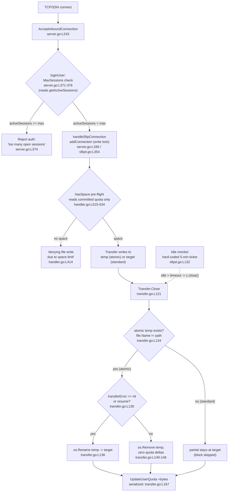

# SFTPGo Concurrency Investigation — `sftpgo_44634210287c`

> **Repository:** `drakkan/sftpgo` · **Commit:** `44634210287cb192f2a53147eafb84a33a96826b` · **Version:** `0.9.5-dev` (`go.mod` → `go 1.13`)
>
> An evidence-based investigation of how SFTPGo's **connection handling**, **per-user quota enforcement**, **atomic-upload mechanism**, and **idle-connection monitor** behave together under concurrency and resource pressure.

---

## 1. Introduction

This document answers six precise questions (O1–O6) about how SFTPGo coordinates concurrent SFTP sessions, quota accounting, the atomic-upload temp-file lifecycle, and the idle-connection monitor when the server is stressed. Every factual claim about the system is anchored to a `file:line` citation against the source at commit `44634210287c`, and each claim is corroborated by runtime evidence captured from a disposable build-and-run harness (see the [Appendix](#11-appendix)).

### 1.1 The questions under investigation

- **O1 — Maximum-session enforcement under concurrency.** When a user with strict quota limits opens multiple sessions near the `max_sessions` limit and starts concurrent uploads that collectively threaten both the file-count and the size thresholds — while the periodic idle checker runs in the background — what happens?
- **O2 — Quota coordination: race vs. serialize.** How does the system coordinate quota updates across simultaneous transfers? Do quota checks **race** or **serialize**, and where does that decision **first manifest as runtime evidence**?
- **O3 — Atomic temp-file fate on a mid-transfer drop.** For an upload partway through writing to a temporary file (atomic mode) when the connection is dropped (idle timeout, or pushed over a limit by another session), what happens to the partial temp file and its quota accounting — cleaned up & reversed, or lingering?
- **O4 — Observable evidence capture during a burst.** What are the actual logged messages, file-system states, and quota values during a burst: sessions accepted vs. rejected, how quota numbers changed at each step, and whether temp files survived that should not have?
- **O5 — Killed-mid-stream vs. normal-completion contrast.** What differs when deliberately killing a transfer mid-stream vs. completing normally, with concrete signs in logs/filesystem indicating which path was taken?
- **O6 — Coordination/handoff synthesis.** How do the pieces coordinate when stressed, where do the handoffs happen, and what is the observable difference between a clean run and a contended run?

### 1.2 Critical framing — there is **no `common/` package** in this version

This is an **early** SFTPGo release. **All** connection-registry, transfer-lifecycle, idle-monitor, and quota-coordination logic lives in **`sftpd/`**; quota persistence lives in **`dataprovider/`**; and filesystem/temp-file behavior lives in **`vfs/`**. There is **no `common/` package** — verified directly:

```text
$ ls common/
ls: cannot access 'common/': No such file or directory
```

This matters because **later** SFTPGo releases moved this logic into a `common/` package and **hardened the concurrent-admission path** so that session/transfer caps are applied atomically. The behavior documented here is therefore the **pre-hardening** behavior; see [§9.4 Forward-looking note](#94-forward-looking-note-how-later-releases-changed-this).

### 1.3 Scope

- **In scope:** the SFTP protocol path (with SCP noted as a sibling entry point), per-user `max_sessions`, per-user quota (`quota_size` + `quota_files`), the atomic-upload temp-file lifecycle on the local filesystem (`OsFs`), and the idle-connection monitor.
- **Out of deep scope (referenced for contrast only):** FTP/WebDAV/HTTP upload flows (not present/relevant in this version), and the S3/GCS cloud backends (`S3Fs`).

---

## 2. Methodology

### 2.1 Cite-as-truth, corroborate-by-runtime

The investigation follows a strict **evidence-first** method:

1. **Code is the source of truth.** Each answer **leads** with `file:line` citations and short code excerpts.
2. **Reasoning is explicit.** Each answer includes a *Why / Reasoning* paragraph explaining *why* the code produces the behavior.
3. **Runtime corroborates.** Each answer then presents real captured evidence — structured **zerolog JSON** log lines, file-system state, and quota values read from the data provider via the REST API.
4. **Conflicts resolve toward the code.** Where a runtime observation diverged from the naïve code reading (notably O3 over SFTP), the code was re-read and the discrepancy is documented **honestly** — the code wins as the documented truth.

### 2.2 How the runtime evidence was gathered

A disposable harness was built and run entirely **outside** the repository tree (everything under `/tmp`, deleted afterward — see [§2.4](#24-artifact-cleanup--repository-integrity)):

- **Build:** `CGO_ENABLED=0 go build -o /tmp/sftpgo_built .` → prints `SFTPGo version: 0.9.5-dev`. CGO-free so it runs without `gcc`.
- **Data provider:** the pure-Go **Bolt** key/value store (`go.etcd.io/bbolt v1.3.3`), which is CGO-free, persistent, self-initializing, and observable.
- **Run profile:** one user with **strict** `quota_size = 20000` bytes and `quota_files = 3`, a **low** `max_sessions = 2`, a short `idle_timeout = 1` (minute), and `upload_mode` toggled between `0` (standard, the default) and `1` (atomic) across runs. `track_quota = 1` (always track).
- **Client:** a concurrent **`github.com/pkg/sftp v1.11.0`** harness driving several simultaneous sessions, concurrent uploads that collectively exceed the quota, one clean upload, and one deliberately killed mid-stream transfer.
- **Evidence surfaces:** the server's structured zerolog JSON (primary), the REST API `GET /api/v1/user/{id}` for quota values, and direct inspection of the user's home directory for surviving `.sftpgo-upload.*` temp files.

### 2.3 The idle-monitor 5-minute caveat (affects how timing was interpreted)

The idle-connection monitor runs on a **hard-coded 5-minute ticker** — `idleConnectionTicker = time.NewTicker(5 * time.Minute)` [sftpd/sftpd.go:L132]. The configurable `idle_timeout` is only the **threshold** the monitor compares against [sftpd/server.go:L189], **not** the polling interval; and that threshold is tested against a connection's *effective* idle time, which the monitor reduces to the minimum across its active transfers (see §3.6). Consequently an idle-timeout-driven close fires only on a 5-minute boundary even when `idle_timeout = 1`. Rather than wait for that boundary, transfer drops were driven by **client socket close** and by **REST API force-close**, which reach the transfer through **different** server-side paths. A client/peer disconnect is *not* a server call to `Connection.close()`: it is detected when the request server's `Serve()` loop returns (`io.EOF` or an error) [sftpd/server.go:L344-L351] and the transfer's pending I/O read surfaces `EOF`, which records the failure via `TransferError` [sftpd/transfer.go:L108-L109]. The idle monitor and the REST force-close, by contrast, call `Connection.close()` **directly** [sftpd/sftpd.go:L347 / L267 → sftpd/handler.go:L536-541], and `close()` itself never sets `transferError`. Over SFTP + local FS all three triggers nonetheless surface as an `EOF` transfer error (a pending channel read converts the drop into an I/O error), so the close-path conclusions hold for the triggers exercised here — but only the idle/REST force-close path actually invokes `Connection.close()`. This caveat is called out wherever it affects an observation.

### 2.4 Artifact cleanup & repository integrity

Per the governing rule, the **only** artifact added to the repository is this document. The built binary, JSON config, Bolt DB, test home directory, host key, and client harness all live under `/tmp` and are deleted when the investigation completes. The source repository is **not** modified, and the build was verified not to mutate `go.mod`/`go.sum` (identical md5 before and after).

---

## 3. Coordination / architecture model

### 3.1 Three registries, one global lock

All in-memory coordination funnels through a **single package-level `sync.RWMutex`** that guards **three** registries:

```go
// sftpd/sftpd.go
var (
    mutex            sync.RWMutex                // L56 — the one global lock
    openConnections  map[string]Connection       // L57 — active connections
    activeTransfers  []*Transfer                  // L58 — in-flight transfers
    ...
    activeQuotaScans []ActiveQuotaScan            // L61 — running quota scans
)
```

- **Writers** take the write lock: `addConnection` [sftpd/sftpd.go:L354] and `removeConnection` [sftpd/sftpd.go:L362].
- **Readers** take the read lock: `getActiveSessions` [sftpd/sftpd.go:L200] and `CheckIdleConnections` [sftpd/sftpd.go:L331].

Quota **durability** is delegated out of this lock to the data provider, which serializes its own writes (atomic SQL relative-increment, or a mutex/bbolt read-modify-write — see [§5](#5-o2--quota-coordination-race-vs-serialize-central-finding)).

### 3.2 The handoff chain

A connection flows through this chain; the lock and the data provider govern the contended points:

```
accept ─▶ authenticate / limit-check ─▶ register ─▶ transfer ─▶ quota-update ─▶ cleanup
 (TCP/SSH)   loginUser MaxSessions       addConnection  hasSpace    Transfer.Close      removeConnection
             [server.go:L371-376]        [server.go:L336] [handler.go  [transfer.go:L121]  [sftpd.go:L362]
                                                          :L515-534]  UpdateUserQuota
                                                                      [transfer.go:L167]
```

The idle monitor runs **out of band** on its 5-minute ticker and reaches into this chain by force-closing connections that have been idle past the threshold.

### 3.3 Flow diagram



### 3.4 The two concurrency disciplines (the spine of every answer)

The whole investigation reduces to one observation: **admission/accounting *reads* and durable *writes* use different concurrency disciplines.**

| Discipline | Operations | Mechanism | Consequence |
|---|---|---|---|
| **Non-reserving reads (RACE)** | `getActiveSessions` [sftpd.go:L200], `hasSpace`→`GetUsedQuota` [handler.go:L515-534] | snapshot under `RLock`, reserve **nothing** for in-flight work | concurrent callers observe the **same** pre-commit value → **transient overshoot** of `max_sessions` and of quota |
| **Serialized writes** | `addConnection`/`removeConnection` [sftpd.go:L354/L362], `UpdateUserQuota` [transfer.go:L167] | write `Lock`, atomic SQL relative-increment [sqlqueries.go:L48], or bbolt/mutex RMW [bolt.go:L180 / memory.go:L119-120] | accounting stays **internally consistent**; the **next** operation after the overshoot is denied |

Everything below is an instance of this mismatch.

### 3.5 Configuration defaults and the persistence schema

The behaviors studied here are shaped by a handful of ship-defaults set in `config.init()` and by the columns the user schema persists.

**Defaults** (`config/config.go`):

| Setting | Default | Anchor | Role in this study |
|---|---|---|---|
| `IdleTimeout` | `15` (minutes) | [config/config.go:L48] | the idle **threshold**; the experiment lowered it to `1` |
| `UploadMode` | `0` (standard, **not** atomic) | [config/config.go:L51] | the default has **no** temp file; toggled to `1` for the atomic runs |
| `ManageUsers` | `1` | [config/config.go:L74] | REST user management enabled — required to create the test user and read quota |
| `TrackQuota` | `1` | [config/config.go:L76] | quota tracking on; the experiment kept this (see §5.5 for the `0` case) |

**Persistence schema.** Per-user session and quota state is persisted in the `users` table; the reference DDL in `.travis.yml:L14` declares (among others) the columns this investigation reads and mutates:

```text
max_sessions       -- O1: per-user concurrent-session cap
quota_size         -- O2: per-user size limit (bytes)
quota_files        -- O2: per-user file-count limit
used_quota_size    -- committed size usage  (read by hasSpace, written by UpdateUserQuota)
used_quota_files   -- committed file-count usage
last_quota_update  -- timestamp (ms) of the last quota write
```

The Bolt provider used in the experiment stores these same `User` fields in its key/value buckets rather than a SQL row, but the field semantics are identical; `used_quota_size`/`used_quota_files` are exactly the committed counters that `hasSpace` reads and `UpdateUserQuota` increments.

### 3.6 The idle monitor's effective idle time (minimum across active transfers)

The idle monitor is more than a timer. Before deciding whether to close a connection, `CheckIdleConnections` reduces the connection's effective idle time to the **minimum** idle time among that connection's active transfers, and only then compares against the threshold:

```go
// sftpd/sftpd.go  (CheckIdleConnections, L331)
for _, c := range openConnections {
    idleTime := time.Since(c.lastActivity)                  // L335 — control-connection idle time
    for _, t := range activeTransfers {                     // L336
        if t.connectionID == c.ID {                         // L337
            transferIdleTime := time.Since(t.lastActivity)  // L338 — this transfer's idle time
            if transferIdleTime < idleTime {                // L339
                idleTime = transferIdleTime                 // L342 — reduce to the smaller value
            }
        }
    }
    if idleTime > idleTimeout {                             // L346 — compare AFTER the reduction
        err := c.close()                                    // L347 — force-close
    }
}
```

Because `t.lastActivity` is refreshed on every `WriteAt`/`ReadAt` [sftpd/transfer.go:L92 / L70], a transfer that is **actively moving bytes** keeps `transferIdleTime` small, which pulls the connection's effective `idleTime` down at [sftpd/sftpd.go:L339-343] and **prevents** the close at [L346]. A connection is therefore reaped for idleness only when **both** its control channel **and all** of its active transfers have been quiet past `idle_timeout`; an in-progress transfer shields its connection from the idle reaper (still subject to the 5-minute tick of §2.3). This is precisely why the experiments dropped transfers via client/REST close rather than relying on the idle monitor.

---

## 4. O1 — `max_sessions` enforcement under concurrency

> **Question:** What happens when a user with strict quota limits opens multiple sessions near the `max_sessions` limit and starts concurrent uploads that collectively threaten to exceed both the file-count and the size thresholds, while the periodic idle checker runs in the background?

### 4.1 Code evidence

The session limit is checked during **authentication**, inside `loginUser`:

```go
// sftpd/server.go  (loginUser, L365)
if user.MaxSessions > 0 {                                   // L371
    activeSessions := getActiveSessions(user.Username)      // L372 — live count
    if activeSessions >= user.MaxSessions {                 // L373
        logger.Debug(logSender, "", "authentication refused for user: %#v, too many open sessions: %v/%v",
            user.Username, activeSessions, user.MaxSessions) // L374
        return nil, fmt.Errorf("too many open sessions: %v", activeSessions) // L376
    }
}
```

The count comes from a read-locked snapshot of `openConnections`:

```go
// sftpd/sftpd.go
func getActiveSessions(username string) int {  // L200
    mutex.RLock()
    defer mutex.RUnlock()
    // iterate openConnections, count entries whose user matches `username`
}
```

But the connection is **not** added to `openConnections` here. Registration happens **later**, inside `handleSftpConnection`, *after* the SSH handshake/auth has fully completed:

```go
// sftpd/server.go  (handleSftpConnection)
addConnection(connection)        // L336 — registration happens HERE, post-auth
defer removeConnection(connection)
```

```go
// sftpd/sftpd.go
func addConnection(c Connection) {  // L354
    mutex.Lock()
    defer mutex.Unlock()
    openConnections[c.ID] = c
    ...
}
```

### 4.2 Reasoning / rationale

This is a classic **time-of-check / time-of-use (TOCTOU)** window. The "check" (`getActiveSessions` inside `loginUser`) and the "use" (`addConnection` in `handleSftpConnection`) are **two separate critical sections** with the authentication handshake in between — they are **not** performed atomically. There is no reservation: passing the check does not increment the live count. Therefore, when several authentications run concurrently, each one can read the **same** sub-limit count *before any of them has registered*, so they **all** pass the check and **all** proceed to `addConnection`. The number of connections briefly registered can exceed `max_sessions`. Only once the count (as reflected in `openConnections`) has caught up do **subsequent** authentications get refused.

### 4.3 Runtime evidence

Driving **8 simultaneous** password authentications for a user with `max_sessions = 2` (the harness fires all dials behind a release barrier):

```text
[sessions] conn 1 ADMITTED
[sessions] conn 3 ADMITTED
[sessions] conn 5 ADMITTED
[sessions] conn 4 REJECTED: ssh: handshake failed: ... no supported methods remain
[sessions] conn 0 REJECTED: ...
[sessions] conn 6 REJECTED: ...
[sessions] conn 2 REJECTED: ...
[sessions] conn 7 REJECTED: ...
[sessions] RESULT admitted=3 rejected=5 (max_sessions=2)
```

**Three** sessions were admitted against a limit of **2** — a transient overshoot. The server-side log proves the cap engaged only *after* the overshoot had already registered:

```json
{"level":"debug","sender":"sftpd","message":"authentication refused for user: \"testuser\", too many open sessions: 3/2"}
{"level":"warn","sender":"sftpd","message":"failed to accept an incoming connection: [ssh: no auth passed yet, Authentication error: could not validate password credentials: too many open sessions: 3]"}
```

The `3/2` (`activeSessions`/`MaxSessions`) is the smoking gun: by the time the rejected authentications read the count, **3** connections were already registered — more than the limit of 2.

> **Note on the rejection log surface.** The `max_sessions` refusal is logged by `loginUser` as the `"too many open sessions"` debug line plus a `"failed to accept an incoming connection"` warning. It is **not** a `ConnectionFailedLog` (`sender:"connection_failed"`): that surface fires only when the credential check itself fails (the `else` branch at [sftpd/server.go:L457] for passwords, [L442] for public keys), whereas here the password is valid and `loginUser` rejects *afterward*. See [§7](#7-o4--observable-evidence-captured-during-a-burst) for the `ConnectionFailedLog` surface.

The idle checker running in the background does not change this: it only *closes* connections that are already idle past the threshold (and only on its 5-minute boundary — [§2.3](#23-the-idle-monitor-5-minute-caveat-affects-how-timing-was-interpreted)); it plays no part in the admission decision.

### 4.4 Verdict

**`max_sessions` is enforced by a non-atomic check-then-register sequence, so a concurrent burst can transiently exceed the limit** (observed: 3 admitted against a cap of 2). The limit is *eventually* honored — once registrations are visible, further authentications are refused with `too many open sessions` — but it is **not** a hard ceiling under concurrency.

---

## 5. O2 — Quota coordination: race vs. serialize (CENTRAL FINDING)

> **Question:** How does the system coordinate quota updates across simultaneous transfers — do quota checks **race** or **serialize**, and where does that decision **first manifest as runtime evidence**?

**The check races; the update serializes.** This is the central finding of the investigation.

### 5.1 Code evidence — the check is a non-reserving, read-only pre-flight (RACES)

Before an upload, the handler calls `hasSpace`:

```go
// sftpd/handler.go
func (c Connection) hasSpace(checkFiles bool) bool {   // L515
    if (checkFiles && c.User.QuotaFiles > 0) || c.User.QuotaSize > 0 {
        numFile, size, err := dataprovider.GetUsedQuota(dataProvider, c.User.Username)  // reads COMMITTED quota
        ...
        if (checkFiles && c.User.QuotaFiles > 0 && numFile >= c.User.QuotaFiles) ||
            (c.User.QuotaSize > 0 && size >= c.User.QuotaSize) {
            c.Log(logger.LevelDebug, logSender, "quota exceed for user %#v, num files: %v/%v, size: %v/%v check files: %v",
                c.User.Username, numFile, c.User.QuotaFiles, size, c.User.QuotaSize, checkFiles)
            return false
        }
    }
    return true
}   // ~L534
```

`GetUsedQuota` reads only **committed** quota [dataprovider/dataprovider.go:L326]. Critically, `hasSpace` **reserves nothing** for in-flight transfers — it neither increments a counter nor takes a lock that an in-flight transfer holds. It is a pure read-and-compare. The new-file upload path calls it via `if !c.hasSpace(true)` (checks **both** file-count and size) [sftpd/handler.go:L413]; the overwrite path calls `hasSpace(false)` (size only) [sftpd/handler.go:L453].

### 5.2 Code evidence — the update is serialized (SERIALIZES)

After a transfer completes, the quota is updated through the data provider:

```go
// sftpd/transfer.go  (Transfer.Close)
if t.transferType == transferUpload && (numFiles != 0 || t.bytesReceived > 0) {
    dataprovider.UpdateUserQuota(dataProvider, t.user, numFiles, t.bytesReceived, false)  // L167
}
```

`UpdateUserQuota` is **relative** (`+numFiles`, `+bytesReceived`), and each provider applies it atomically:

- **SQL providers** issue a single atomic relative-increment statement:

  ```go
  // dataprovider/sqlqueries.go  (getUpdateQuotaQuery, L43)
  // L48:
  "UPDATE %v SET used_quota_size = used_quota_size + %v,used_quota_files = used_quota_files + %v," +
  "last_quota_update = %v WHERE username = %v"
  ```
  Because the increment is computed **inside** the database (`used_quota_size = used_quota_size + ?`), concurrent updates serialize at the DB level [executed by `sqlCommonUpdateQuota`, dataprovider/sqlcommon.go:L74].

- **The in-memory provider** guards a read-modify-write with a mutex:

  ```go
  // dataprovider/memory.go  (updateQuota, L119)
  p.dbHandle.lock.Lock()         // L120
  defer p.dbHandle.lock.Unlock()
  ... user.UsedQuotaSize += sizeAdd; user.UsedQuotaFiles += filesAdd
  ```

- **The Bolt provider** (used in this experiment) performs the same read-modify-write **inside a single bbolt read-write transaction**, which bbolt serializes (one writer at a time):

  ```go
  // dataprovider/bolt.go  (updateQuota, L180)
  return p.dbHandle.Update(func(tx *bolt.Tx) error {
      ... user.UsedQuotaSize += sizeAdd; user.UsedQuotaFiles += filesAdd ...
  })
  ```

### 5.3 Reasoning / rationale

The pre-flight check answers *"is the committed quota already at/over the limit?"* — **not** *"will the in-flight transfers, once they finish, exceed it?"*. Because it reserves nothing, **N** transfers that start close together all read the same committed value, all see headroom, and all pass. Each then commits its bytes through a **serialized** relative increment, so the stored total is the **exact arithmetic sum** of every increment (no lost updates — accounting stays internally consistent). The arithmetic is correct; the *policy* is what slips: the configured ceiling can be **transiently overshot** by the aggregate volume of concurrent in-flight transfers. The overshoot is then "paid back" by **denying the next operation**, because by then `hasSpace` reads a committed value that is already ≥ the limit.

A second, related consequence: `hasSpace` never inspects the **incoming** file's size — it only compares *current committed usage* to the limit. So even a **single** upload that is larger than the entire quota is admitted (used = 0 < limit at pre-flight) and bills its full size on completion. This is visible in [§6.4](#64-runtime-evidence--standard-mode-the-default-the-real-runtime-gap).

### 5.4 Runtime evidence — the overshoot, then the deny

**Step 1 — baseline.** `used_quota_files=0 used_quota_size=0` (limits: `files=3`, `size=20000`).

**Step 2 — concurrent burst.** Two uploads of **12000 bytes each** fired concurrently (collectively 24000 > the 20000 size limit). Both passed the pre-flight (each saw `used=0`) and both completed:

```json
{"level":"info","sender":"Upload","size_bytes":12000,"username":"testuser","file_path":"/tmp/sftpgo_home/testuser/burst_1.bin","connection_id":"80079d8a…","protocol":"SFTP"}
{"level":"info","sender":"Upload","size_bytes":12000,"username":"testuser","file_path":"/tmp/sftpgo_home/testuser/burst_0.bin","connection_id":"17293c5d…","protocol":"SFTP"}
```

**Step 3 — quota after the burst (the overshoot):**

```text
used_quota_files=2  used_quota_size=24000   (limits: files=3 size=20000)   OVERSHOOT_SIZE=True
```

`24000 = 2 × 12000` exactly — the serialized updates lost nothing, yet the **20000 size limit was exceeded by 4000 bytes**.

**Step 4 — the next upload is denied (where the decision first manifests).** A subsequent upload now reads the over-limit committed value and is refused:

```json
{"level":"debug","sender":"sftpd","message":"quota exceed for user \"testuser\", num files: 2/3, size: 24000/20000 check files: true"}
{"level":"info","sender":"sftpd","message":"denying file write due to space limit"}
```

The client received `SSH_FX_FAILURE`; the denied file never appeared in the home directory; and no `.sftpgo-upload.*` temp file leaked. The **first runtime manifestation** of the race-vs-serialize decision is exactly this `denying file write due to space limit` line [sftpd/handler.go:L414], emitted only **after** the concurrent burst has already overshot.

> **Provider-log nuance (honest detail).** The `"quota updated for user …"` debug line lives in `dataprovider/sqlcommon.go:L84` and is **SQL-provider-specific**. The Bolt provider used here performs the same serialized increment [bolt.go:L180] but emits **no** such log, so the quota numbers above were read from the REST API (`GET /api/v1/user/1`), not from a provider log line.

**Step 5 — the file-count threshold, isolated (a second, dedicated run).** The run above stresses the *size* threshold; a separate run isolates the *file-count* threshold so the verdict rests on observed evidence for **both**. Here `quota_files = 1` and `quota_size` is raised to `10000000` so that size never binds — the file count is the only constraint. To expose the race reliably, the harness **pre-establishes** both SSH/SFTP connections (handshakes finished) and then releases a barrier so both call `Create` — the `hasSpace` pre-flight point — at the same instant, *before* either transfer closes and commits. Baseline `used_quota_files=0`; two **8000-byte** new-file uploads then fire concurrently, both pass the pre-flight (each sees `used_files=0 < 1`), and both complete:

```json
{"level":"info","sender":"Upload","size_bytes":8000,"username":"testuser","file_path":"/tmp/sftpgo_home/testuser/burst_0.bin","connection_id":"e0901394…","protocol":"SFTP"}
{"level":"info","sender":"Upload","size_bytes":8000,"username":"testuser","file_path":"/tmp/sftpgo_home/testuser/burst_1.bin","connection_id":"173f26d6…","protocol":"SFTP"}
```

The quota after the burst shows the **file-count overshoot**, with size deliberately not binding:

```text
used_quota_files=2  used_quota_size=16000   (limits: files=1 size=10000000)   OVERSHOOT_FILES=True
```

`used_quota_files = 2` against a cap of **1** — overshot — while `used_quota_size = 16000` stays far below the size limit. The **next** upload is then denied, and the deny is provably **file-count-driven**:

```json
{"level":"debug","sender":"sftpd","message":"quota exceed for user \"testuser\", num files: 2/1, size: 16000/10000000 check files: true"}
{"level":"info","sender":"sftpd","message":"denying file write due to space limit"}
```

`num files: 2/1` is over the cap while `size: 16000/10000000` is comfortably within it, so the refusal is unambiguously due to the **file count**, not the size. The denied file never appeared in the home directory and no `.sftpgo-upload.*` temp leaked.

> **Race timing is real (honest detail).** A first attempt used tiny 5000-byte files dialed fresh inside each goroutine; there the SSH-handshake jitter let the first upload *finish and commit* before the second goroutine's `Create`/`hasSpace` ran, so the second was correctly denied and **no** overshoot occurred (`uploaded_ok=1`). That outcome is itself proof that admission is a *race*: whether the cap is overshot depends on whether the concurrent `hasSpace` checks observe the same pre-commit count. Pre-establishing the connections widens that window enough to expose the overshoot deterministically — it does not change the mechanism, only the timing.

### 5.5 Edge case — quota tracking disabled (`TrackQuota == 0`)

The race-vs-serialize analysis above assumes quota tracking is **enabled**. It can be switched off globally: when `config.TrackQuota == 0`, **both** the read and the update short-circuit before they reach the provider.

```go
// dataprovider/dataprovider.go
func UpdateUserQuota(p Provider, user User, filesAdd int, sizeAdd int64, reset bool) error {   // L312
    if config.TrackQuota == 0 {
        return &MethodDisabledError{err: trackQuotaDisabledError}                               // L313-314 — no accounting
    } else if config.TrackQuota == 2 && !reset && !user.HasQuotaRestrictions() {                // L315 — "2": track only quota-restricted users
        return nil
    }
    ...
}
func GetUsedQuota(p Provider, username string) (int, int64, error) {                            // L326
    if config.TrackQuota == 0 {
        return 0, 0, &MethodDisabledError{err: trackQuotaDisabledError}                          // L327-328
    }
    ...
}
```

Critically, the pre-flight does **not** read that disabled error as "no space". `hasSpace` catches the `MethodDisabledError`, logs a warning, and **returns `true`** — i.e., it *allows* the write:

```go
// sftpd/handler.go  (hasSpace)
numFile, size, err := dataprovider.GetUsedQuota(dataProvider, c.User.Username)    // L517
if err != nil {
    if _, ok := err.(*dataprovider.MethodDisabledError); ok {                     // L519
        c.Log(logger.LevelWarn, logSender, "quota enforcement not possible for user %#v: %v", c.User.Username, err)  // L520
        return true                                                               // L521 — ALLOW the upload
    }
    ...
}
```

So with `TrackQuota == 0`, per-user `quota_size`/`quota_files` are **not enforced** (every upload is admitted at the pre-flight) and **no usage is accumulated** (`UpdateUserQuota` short-circuits at [dataprovider/dataprovider.go:L313]). `TrackQuota == 2` is a middle ground that tracks usage only for users who actually have quota restrictions [dataprovider/dataprovider.go:L315]. The disabled-method message is *"please enable track_quota in your configuration to use this method"* (`trackQuotaDisabledError` [dataprovider/dataprovider.go:L61]).

**Runtime corroboration.** A separate instance run with `track_quota = 0` and a user whose `quota_files = 1` accepted **two** uploads (both files landed in the home directory) while the reported usage stayed at `0/0`, and the server logged the disabled-enforcement warning on each write:

```json
{"level":"warn","sender":"sftpd","message":"quota enforcement not possible for user \"nquser\": Method disabled error: please enable track_quota in your configuration to use this method"}
```

The main experiment in this report intentionally kept **`track_quota = 1`** (Appendix, §11.1) so that enforcement was active and the race/serialize behavior was observable.

### 5.6 Verdict

**The quota *check* races (a non-reserving read-only pre-flight via `hasSpace`/`GetUsedQuota`), while the quota *update* serializes (atomic SQL relative-increment, or mutex/bbolt RMW).** The net effect: accounting is always internally consistent, but the configured limit can be **transiently overshot** by the volume of concurrent in-flight transfers, after which the **next** operation is denied with `denying file write due to space limit`. This was observed at runtime for **both** thresholds, each isolated in its own run: the **size** threshold (two 12000-byte uploads → `used_quota_size = 24000/20000`, §5.4) and the **file-count** threshold (two uploads under `quota_files = 1` → `used_quota_files = 2/1`, §5.4 Step 5), each followed by an appropriately-attributed deny (`size: 24000/20000` vs. `num files: 2/1`). When tracking is disabled via `TrackQuota == 0`, neither the check nor the update applies and the limits are not enforced at all (§5.5).

---

## 6. O3 — Atomic temp-file fate on a mid-transfer drop

> **Question:** For an upload partway through writing to a temporary file (atomic mode) when the connection is dropped, what happens to the partial temp file and its quota accounting — cleaned up & reversed, or lingering?

### 6.1 Code evidence — the whole decision hinges on `transferError`

The temp-file fate is decided in `Transfer.Close()`:

```go
// sftpd/transfer.go  (Close, L121)
if t.transferType == transferUpload && t.file != nil && t.file.Name() != t.path {   // L134 — only when a TEMP file exists (atomic mode)
    if t.transferError == nil || uploadMode == uploadModeAtomicWithResume {          // L135
        err = os.Rename(t.file.Name(), t.path)                                       // L136 — temp -> target
        logger.Debug(logSender, t.connectionID, "atomic upload completed, rename: %#v -> %#v, error: %v", ...)
    } else {                                                                          // L139
        err = os.Remove(t.file.Name())                                               // L140 — delete temp
        logger.Warn(logSender, t.connectionID, "atomic upload completed with error: \"%v\", delete temporary file: %#v, ...", ...)
        if err == nil {
            numFiles--          // L144 — undo the new-file count
            t.bytesReceived = 0 // L145 — zero the quota delta
        }
    }
}
...
if t.transferType == transferUpload && (numFiles != 0 || t.bytesReceived > 0) {
    dataprovider.UpdateUserQuota(dataProvider, t.user, numFiles, t.bytesReceived, false)  // L167
}
```

The temp-file name itself is produced by the local filesystem:

```go
// vfs/osfs.go  (GetAtomicUploadPath, L175)
return filepath.Join(dir, ".sftpgo-upload."+guid+"."+filepath.Base(name))  // L178
```

→ the leftover-temp signature is **`.sftpgo-upload.<xid>.<name>`** (the `<xid>` is from `github.com/rs/xid`). Detect survivors with the glob `.sftpgo-upload.*`.

Two further facts frame the gap:

1. The rename/remove block at L134 only runs **when a temp file exists** — i.e., `file.Name() != path`, which is true only in atomic mode. In **standard** mode (`upload_mode = 0`, the **default** [config/config.go:L51]) `file.Name() == path`, so this entire block is **skipped**.
2. `transferError` is set **only** by `TransferError(err)` [sftpd/transfer.go:L52], which is called from `WriteAt`/`ReadAt` on a real I/O error [e.g. L95/L109]. The force-close path does **not** touch it:

   ```go
   // sftpd/handler.go  (Connection.close, L536)
   func (c Connection) close() error {
       if c.channel != nil { c.channel.Close() }
       return c.netConn.Close()        // closes channel + socket — never calls TransferError
   }
   ```
   Both the idle monitor [`CheckIdleConnections` → `c.close()`, sftpd/sftpd.go:L347] and the REST force-close [`CloseActiveConnection` → `c.close()`, sftpd/sftpd.go:L267] go through this same `close()`.

### 6.2 Reasoning / rationale

If `transferError == nil` at `Close()`, the atomic branch **renames the temp file into place** (L136) and the quota is incremented with whatever bytes were received — *as if the upload had completed*. If `transferError != nil` (and not resume mode), the temp file is **removed** and the deltas are **zeroed** (L144-145), so quota is untouched. **The rename-vs-remove decision is therefore entirely a function of whether `transferError` got set** — *not* of whether the bytes are actually complete. This is the structural gap behind `drakkan/sftpgo` Issue #1983: because `close()` never sets `transferError`, a drop that goes through `close()` *while no I/O error is surfacing* leaves `transferError == nil`, so the partial temp is renamed into place and billed.

### 6.3 Runtime evidence — atomic mode, error **detected** (the safe path), captured ×2

Over SFTP with the local filesystem, an abrupt drop reliably **does** surface as an error. Two triggers were tested; both behaved identically.

**(a) Client socket dropped mid-stream** (atomic, `upload_mode=1`):

```json
{"level":"warn","sender":"sftpd","message":"Unexpected error for transfer, path: \"/tmp/sftpgo_home/testuser/kill_atomic.bin\", error: \"EOF\" bytes sent: 0, bytes received: 6258688 transfer running since 40 ms"}
{"level":"warn","sender":"sftpd","message":"atomic upload completed with error: \"EOF\", delete temporary file: \"/tmp/sftpgo_home/testuser/.sftpgo-upload.d8vf4nd2qdphd6sge0qg.kill_atomic.bin\", deletion error: <nil>"}
{"level":"warn","sender":"sftpd","message":"transfer error: EOF, path: \"/tmp/sftpgo_home/testuser/kill_atomic.bin\""}
```

**(b) REST API force-close while the transfer was held idle** (`DELETE /api/v1/connection/{id}`):

```json
{"level":"info","sender":"sftpd","message":"channel close, err: <nil>"}
{"level":"warn","sender":"sftpd","message":"Unexpected error for transfer, path: \"…/kill_gap.bin\", error: \"EOF\" bytes sent: 0, bytes received: 6000 transfer running since 3940 ms"}
{"level":"warn","sender":"sftpd","message":"atomic upload completed with error: \"EOF\", delete temporary file: \"…/.sftpgo-upload.d8vf5852qdphd6sge0r0.kill_gap.bin\", deletion error: <nil>"}
```

In **both** cases: the home directory had **no** target file and **no** surviving `.sftpgo-upload.*` temp file, and quota stayed `0/0`. This matches the code: `transferError = EOF` (non-nil) → L135 false → **remove** branch → `numFiles--`, `bytesReceived=0` → L166 condition `(0 != 0 || 0 > 0)` is false → **no** quota update.

**Why error was always detected over SFTP (honest reconciliation).** When the channel closes, the `pkg/sftp` server's pending read of the next write packet returns `EOF`, and that `EOF` is delivered to the transfer as a read/write error, which calls `TransferError`. So over the **SFTP + local-FS** path in `0.9.5-dev`, the channel-close consistently *masks* the Issue #1983 gap — the temp file is correctly deleted. The gap is nonetheless **real in the code** (`close()` never sets `transferError`); it manifests on close paths where no pending I/O converts the drop into an error. Issue #1983 reports exactly this for the atomic `upload_mode` on the **FTP/web** path in a later version: a slow upload interrupted by a page refresh causes the partial temp to be moved into the user folder — the reporter expected, quoting the issue, **"to delete the partially uploaded file."** *(Web sources corroborate; the code remains the source of truth.)*

### 6.4 Runtime evidence — standard mode (the default): the real runtime gap

The **default** `upload_mode = 0` exhibits the lingering-partial outcome directly, **without** needing `transferError == nil`, because the rename/remove block is skipped entirely. Killing an upload mid-stream in standard mode:

```json
{"level":"warn","sender":"sftpd","message":"Unexpected error for transfer, path: \"/tmp/sftpgo_home/testuser/kill_std.bin\", error: \"EOF\" bytes sent: 0, bytes received: 5865472 transfer running since 40 ms"}
{"level":"warn","sender":"sftpd","message":"transfer error: EOF, path: \"/tmp/sftpgo_home/testuser/kill_std.bin\""}
```

File-system and quota **after** the kill:

```text
-rw-r--r--  5865472  kill_std.bin          <-- partial file REMAINS at the target path
.sftpgo-upload.*  -> NONE                  <-- no temp file in standard mode
used_quota_files=1  used_quota_size=5865472  <-- quota BILLED with the partial bytes
```

Note there is **no** `atomic upload completed` log and **no** success `Upload` `TransferLog` (because `transferError != nil`), yet the quota was still incremented: the update at [transfer.go:L166-167] runs **unconditionally** on `transferError`, and in standard mode neither `numFiles` nor `bytesReceived` was zeroed (that only happens in the atomic *remove* branch). The 5.8 MB partial also illustrates the [§5.3](#53-reasoning--rationale) point — it massively overshot the 20 KB quota because the pre-flight never checks the incoming size.

### 6.5 Verdict

**The fate is governed solely by `transferError` in `Transfer.Close()` [transfer.go:L135], and only the atomic branch runs at all [L134].**
- **Atomic mode, error detected** (the SFTP drop captured here): temp file **removed**, quota deltas **zeroed** — clean and reversed.
- **Atomic mode, error *not* set** (Issue #1983 class; the structural gap, since `close()` never sets `transferError`): partial temp **renamed into place** and **billed** — lingering. Over SFTP + local FS this is masked because the channel-close read yields `EOF`.
- **Standard mode (the default):** there is **no** temp file; the partial bytes land **directly at the target** and **remain**, and the quota is **billed with the partial bytes** even though the transfer errored.

---

## 7. O4 — Observable evidence captured during a burst

> **Question:** What are the actual logged messages, file-system states, and quota values during a burst — sessions accepted vs. rejected, how quota changed at each step, and whether temp files survived that should not have?

### 7.1 The log surfaces and their JSON fields

SFTPGo emits structured **zerolog JSON** [logger/logger.go]. The relevant surfaces, with the fields actually observed:

| Event | Code | `sender` | Key JSON fields (verified at runtime) |
|---|---|---|---|
| Successful transfer | `TransferLog` [logger.go:L139] | `"Upload"` / `"Download"` | `elapsed_ms`, `size_bytes`, `username`, `file_path`, `connection_id`, `protocol` |
| Failed login (credentials) | `ConnectionFailedLog` [logger.go:L175] | `"connection_failed"` | `client_ip`, `username`, `login_type`, **`error`** |
| File command (e.g. delete) | `CommandLog` [logger.go:L153] | `"Remove"` (etc.) | `username`, `file_path`, `target_path`, `filemode`, `uid`, `gid`, `connection_id`, `protocol` |
| Session refused | `loginUser` [server.go:L374] | `"sftpd"` | message `too many open sessions: N/M` |
| Quota deny | `hasSpace` / handler [handler.go:L414] | `"sftpd"` | messages `quota exceed for user …` + `denying file write due to space limit` |
| Atomic finalize | `Transfer.Close` [transfer.go:L137/L141] | `"sftpd"` | message `atomic upload completed, rename …` **or** `… with error: … delete temporary file …` |

> **Field-name correction.** `ConnectionFailedLog` emits the JSON key **`error`** (the function parameter is named `errorString`, but the serialized field is `error`) — *not* `error_string`. Captured below.

A secondary surface is Prometheus: `metrics.TransferCompleted(...)` [metrics/metrics.go:L152] runs on **every** transfer close, and `metrics.UpdateActiveConnectionsSize(...)` [metrics/metrics.go:L232] tracks the connection gauge. (Telemetry was not bound in this experiment; these are cited at the code level.)

### 7.2 Captured evidence, by step

**Sessions accepted vs. rejected** (from O1, `max_sessions=2`, 8 concurrent auths): `admitted=3, rejected=5`, with the server logging `too many open sessions: 3/2` for the rejects.

**A credential failure produces `ConnectionFailedLog`** (a deliberate bad-password attempt):

```json
{"level":"debug","sender":"connection_failed","client_ip":"127.0.0.1","username":"testuser","login_type":"password","error":"Invalid credentials"}
```

**Quota at each step of the burst** (read via `GET /api/v1/user/{id}`). Two runs were captured — one stressing the **size** threshold and one stressing the **file-count** threshold:

*Run A — size pressure* (`quota_files=3`, `quota_size=20000`):

| Step | `used_quota_files` | `used_quota_size` | Note |
|---|---|---|---|
| baseline | 0 | 0 | limits: files=3, size=20000 |
| after 2× concurrent 12000-byte uploads | 2 | **24000** | **size overshoot** (24000 > 20000) |
| next upload attempt | 2 | 24000 | **denied** (`size: 24000/20000`) (`denying file write due to space limit`) |
| after deleting both files | 0 | 0 | quota **reversed** by delete |

*Run B — file-count pressure* (`quota_files=1`, `quota_size=10000000` so size never binds):

| Step | `used_quota_files` | `used_quota_size` | Note |
|---|---|---|---|
| baseline | 0 | 0 | limits: files=1, size=10000000 |
| after 2× concurrent 8000-byte uploads | **2** | 16000 | **file-count overshoot** (2 > 1); size well within limit |
| next upload attempt | 2 | 16000 | **denied** — `num files: 2/1` (file-count over), `size: 16000/10000000` (fine) |

**Delete reverses quota and emits a `Remove` `CommandLog`:**

```json
{"level":"info","sender":"Remove","username":"testuser","file_path":"/tmp/sftpgo_home/testuser/burst_0.bin","target_path":"","filemode":"","uid":-1,"gid":-1,"connection_id":"fa5b108d…","protocol":"SFTP"}
```

This corresponds to the quota reversal at [sftpd/handler.go:L405] — `dataprovider.UpdateUserQuota(dataProvider, c.User, -1, -size, false)`.

**Did temp files survive that should not have?** During the clean burst, **no** `.sftpgo-upload.*` files survived (both were renamed into place). During the atomic mid-stream kill, **no** temp survived (deleted — error detected, [§6.3](#63-runtime-evidence--atomic-mode-error-detected-the-safe-path-captured-2)). During the **standard-mode** kill, no temp file exists by design, but the **partial target file remained** and was billed ([§6.4](#64-runtime-evidence--standard-mode-the-default-the-real-runtime-gap)). The general detector for a leaked atomic temp is the glob `.sftpgo-upload.*` in the user's home tree.

### 7.3 Verdict

**Every contended decision is observable.** Accepted/rejected sessions, the quota overshoot then deny, the rename-vs-delete of the atomic temp, and the delete-driven quota reversal are all visible in the structured JSON logs and in the REST-reported quota numbers; surviving atomic temp files are detectable by their `.sftpgo-upload.*` prefix.

---

## 8. O5 — Killed-mid-stream vs. normal-completion contrast

> **Question:** What differs when deliberately killing a transfer mid-stream vs. completing normally, with concrete signs in logs/filesystem indicating which path was taken?

### 8.1 Code evidence — the fork in `Transfer.Close()`

The success/abort fork is the `if t.transferError == nil` test at [sftpd/transfer.go:L149]:

```go
if t.transferError == nil {                       // L149 — SUCCESS path
    ...
    logger.TransferLog(uploadLogSender, t.path, elapsed, t.bytesReceived, ...)   // L155
    go executeAction(operationUpload, ...)
} else {                                           // ABORT path
    logger.Warn(logSender, t.connectionID, "transfer error: %v, path: %#v", t.transferError, t.path)  // L159
    ...
}
```

Combined with the atomic rename/remove block ([§6.1](#61-code-evidence--the-whole-decision-hinges-on-transfererror)) and the quota update at [L167], this yields a clean contrast.

### 8.2 The contrast table

| Signal | **Normal completion** | **Killed mid-stream** |
|---|---|---|
| Success/abort log | `TransferLog` `sender:"Upload"` with `size_bytes`, `elapsed_ms`, `connection_id` [L155] | `transfer error: <err>, path: …` warning [L159] (+ `Unexpected error for transfer …` [L52]) |
| Atomic finalize (mode=1) | `atomic upload completed, rename: …temp -> target` [L137] | `atomic upload completed with error: … delete temporary file: …` [L141] |
| Filesystem (atomic) | target file present; no temp | temp **deleted** (error detected); no target |
| Filesystem (standard, mode=0) | target file present | **partial target file remains** |
| Quota | incremented by full size [L167] | atomic: **not** incremented (deltas zeroed); standard: **incremented with partial bytes** |

### 8.3 Runtime evidence

**Normal completion** (clean 5000-byte upload, standard mode):

```json
{"level":"info","sender":"Upload","elapsed_ms":0,"size_bytes":5000,"username":"testuser","file_path":"/tmp/sftpgo_home/testuser/clean_std.bin","connection_id":"d1c2a658…","protocol":"SFTP"}
```
→ quota became `files=1 size=5000`; `clean_std.bin` present. (In atomic mode the clean burst additionally logged `atomic upload completed, rename: ….sftpgo-upload.<xid>.burst_1.bin -> burst_1.bin, error: <nil>`.)

**Killed mid-stream** (atomic): `transfer error: EOF` + `delete temporary file` → temp gone, quota `0/0`.
**Killed mid-stream** (standard): `transfer error: EOF, path: "…/kill_std.bin"` → **no** `Upload` success line; partial `kill_std.bin` (5865472 B) **remained**; quota **billed** `files=1 size=5865472`.

The single most reliable discriminator: **the presence of a `sender:"Upload"` `TransferLog` line means success (rename/commit + quota increment); a `transfer error: …` warning means abort.** In atomic mode the abort additionally shows `delete temporary file`; in standard mode the abort leaves the partial at the target.

### 8.4 Verdict

**Normal completion and a mid-stream kill are unambiguously distinguishable** in both logs and filesystem: success ⇒ `TransferLog`/`rename`/quota-increment; kill ⇒ `transfer error`/(atomic) `delete temporary file`-and-no-increment, or (standard) partial-at-target-and-billed. The **only** subtlety is that standard mode bills the partial and leaves it in place, whereas error-detected atomic mode reverses both.

---

## 9. O6 — Coordination / handoff synthesis

> **Question:** How do the pieces coordinate when stressed, where do the handoffs happen, and what is the observable difference between a clean run and a contended run?

### 9.1 The coordination model in one paragraph

A connection is **accepted** [server.go:L243], then **authenticated** — and during authentication the **`max_sessions`** gate reads a non-reserving snapshot of `openConnections` via `getActiveSessions` [server.go:L371-376 → sftpd.go:L200]. On success the connection is **registered** under the write lock by `addConnection` [server.go:L336 → sftpd.go:L354]. Each upload is **pre-flighted** by `hasSpace`, another non-reserving read of committed quota [handler.go:L515-534]. Bytes are then **transferred** (to a temp file in atomic mode, or directly to the target in standard mode), and on `Transfer.Close()` [transfer.go:L121] the file is finalized (rename/remove keyed on `transferError`) and the quota is **updated** through a **serialized** relative increment [transfer.go:L167 → bolt.go:L180 / sqlqueries.go:L48 / memory.go:L119-120]. Finally `removeConnection` [sftpd.go:L362] deregisters it. The **idle monitor** [sftpd.go:L331], on its hard-coded 5-minute ticker [sftpd.go:L132], force-closes connections idle past `idle_timeout` — where a connection's effective idle time is first reduced to the **minimum** across its active transfers [sftpd.go:L335-343], so an actively-transferring connection is shielded from the reaper — via the same `Connection.close()` [handler.go:L536] used by the REST force-close [sftpd.go:L267].

### 9.2 Where the handoffs (and the contention) live

- **Lock handoff:** the single `sync.RWMutex` [sftpd.go:L56] mediates **all three** registries [L57-61]. Admission/idle/listing take the **read** lock; (de)registration takes the **write** lock. This lock keeps the *registries* consistent but does **not** span the auth handshake (the O1 TOCTOU) or the transfer lifetime (the O2 race).
- **Durability handoff:** quota correctness is delegated to the data provider, whose **serialized** increment is the one place the system is genuinely atomic about counts. This is why *accounting* never corrupts even though *policy* can be overshot.
- **Out-of-band handoff:** the idle monitor and the REST force-close both reach into a live connection through `close()`, which — crucially — does **not** set `transferError`, the fact that underlies the O3 gap.

### 9.3 Clean run vs. contended run

| Aspect | **Clean run** (serialized arrivals, ≤ limits) | **Contended run** (concurrent burst, near/over limits) |
|---|---|---|
| Sessions | each admit sees the true count; `count ≤ max_sessions` | concurrent auths read the same pre-registration count → **transient overshoot** (observed 3 vs cap 2), later auths rejected `too many open sessions` |
| Quota | each upload sees prior commit; lands exactly within the limit | concurrent uploads all pass `hasSpace` → committed total **overshoots** the limit (observed 24000/20000); **next** op denied |
| Atomic temp | temp renamed to target on success; `atomic upload completed, rename` | a drop that doesn't set `transferError` can leave a partial renamed-in-place (Issue #1983); error-detected drops delete the temp |
| Logs | `Upload` `TransferLog` lines, monotonic quota | `too many open sessions`, `denying file write due to space limit`, possibly `transfer error`, possibly lingering `.sftpgo-upload.*` (atomic) or partial target (standard) |

### 9.4 Forward-looking note: how later releases changed this

The behavior above is **pre-hardening**. Later SFTPGo releases moved this logic into a `common/` package and made admission atomic. The project's enterprise changelog states that **"Concurrent bursts could previously let the number of active transfers exceed the configured cap"** and that **"the limits are now applied atomically"**, with `max_total_transfers`, `max_per_host_transfers` and the per-user session cap now strictly enforced. The analogous share-token fix is described as a counter now **"reserved with a conditional update so the limit holds under concurrency"** — precisely the *reservation* that `0.9.5-dev` lacks. These are **corroboration**; the `0.9.5-dev` code remains the documented truth here. *(Short quotes < 20 words, per the project's corroboration policy.)*

### 9.5 Verdict

**Under stress, SFTPGo `0.9.5-dev` coordinates through one global `RWMutex` over three registries plus a serialized quota writer, but its admission and quota *checks* are non-reserving snapshots.** The handoffs are: lock-mediated (de)registration, provider-serialized quota durability, and an out-of-band `close()` that never flags an in-flight transfer. The observable difference between a clean and a contended run is exactly the set of overshoot/deny/lingering-partial signatures enumerated above.

---

## 10. Summary table

| # | Question | Key code anchor(s) | Behavior | Observable signature |
|---|---|---|---|---|
| **O1** | `max_sessions` under concurrency | `loginUser` check [server.go:L371-376] vs. later `addConnection` [server.go:L336]; `getActiveSessions` [sftpd.go:L200] | **TOCTOU**: non-atomic check-then-register → transient overshoot | `too many open sessions: 3/2`; harness `admitted=3` vs cap 2 |
| **O2** | Quota race vs. serialize | `hasSpace` [handler.go:L515-534] (check); `UpdateUserQuota` [transfer.go:L167] → [sqlqueries.go:L48 / bolt.go:L180 / memory.go:L119-120] (update); enforcement disabled when `TrackQuota==0` [dataprovider.go:L313/L327] | **Check races, update serializes** → limit transiently overshot (observed for **both** size and file-count); next op denied | size `24000/20000` **and** files `2/1`; `quota exceed for user …`; `denying file write due to space limit` [handler.go:L414] |
| **O3** | Atomic temp fate on drop | `Transfer.Close` rename/remove [transfer.go:L134-146]; temp name [vfs/osfs.go:L178]; `close()` no `transferError` [handler.go:L536] | Fate keyed on `transferError`; standard mode keeps partial; atomic-on-error deletes; un-flagged drop renames (Issue #1983) | `atomic upload completed, rename …` vs `… delete temporary file …`; `.sftpgo-upload.<xid>.<name>` |
| **O4** | Evidence during a burst | `TransferLog` [logger.go:L139]; `ConnectionFailedLog` [logger.go:L175]; `CommandLog` [logger.go:L153] | All contended decisions are logged; quota readable via REST | `sender:"Upload"`/`"connection_failed"` (field `error`)/`"Remove"`; quota deltas |
| **O5** | Killed vs. normal | success/abort fork [transfer.go:L149/L159]; quota update [L167] | Success → log+rename+increment; kill → error+ (atomic) delete / (standard) keep-and-bill | `Upload` `TransferLog` vs `transfer error: …`; temp deleted vs partial-at-target |
| **O6** | Coordination synthesis | one `RWMutex` [sftpd.go:L56] over 3 registries [L57-61]; idle ticker [L132]; effective idle = min across transfers [sftpd.go:L335-343] | Non-reserving reads + serialized writes → consistent accounting, overshoot-able policy; idle close needs the conn **and** all its transfers quiet | clean run monotonic; contended run shows overshoot/deny/lingering signatures |

---

## 11. Appendix

> **Disposable harness & raw evidence.** Everything in this appendix lived under `/tmp` and was deleted after the investigation. **Nothing here was committed to the repository tree.** It is reproduced for verifiability only.

### 11.1 SFTPGo JSON config (`/tmp/sftpgo_run/sftpgo.json`)

Bolt provider, DB under `/tmp`, `track_quota=1`, `idle_timeout=1`, bound to localhost. `upload_mode` was toggled **`1` (atomic)** ↔ **`0` (standard)** across runs (shown here in standard mode):

```json
{
  "sftpd": {
    "bind_port": 2022, "bind_address": "127.0.0.1",
    "idle_timeout": 1, "max_auth_tries": 0, "umask": "0022",
    "upload_mode": 0, "enable_scp": false, "setstat_mode": 0,
    "enabled_ssh_commands": ["md5sum", "sha1sum", "cd", "pwd"]
  },
  "data_provider": {
    "driver": "bolt", "name": "/tmp/sftpgo_run/sftpgo.db",
    "manage_users": 1, "track_quota": 1, "pool_size": 0
  },
  "httpd": { "bind_port": 8080, "bind_address": "127.0.0.1",
             "templates_path": "templates", "static_files_path": "static", "backups_path": "backups" }
}
```

### 11.2 Build, run, and user-creation commands

```bash
# Build CGO-free (prints "SFTPGo version: 0.9.5-dev"); does not mutate go.mod/go.sum
CGO_ENABLED=0 go build -o /tmp/sftpgo_built .

# Run with the config-dir under /tmp (host key id_rsa, Bolt DB, logs all land under /tmp)
/tmp/sftpgo_built serve --config-dir /tmp/sftpgo_run --log-file-path "" > /tmp/sftpgo_run/server.out 2>&1 &

# Create the strict test user via the REST API (httpd / go-chi)
curl -s -X POST http://127.0.0.1:8080/api/v1/user -H "Content-Type: application/json" -d '{
  "username":"testuser","password":"<redacted>","home_dir":"/tmp/sftpgo_home/testuser",
  "status":1,"max_sessions":2,"quota_size":20000,"quota_files":3,"permissions":{"/":["*"]} }'

# Read quota at any step
curl -s http://127.0.0.1:8080/api/v1/user/1     # -> used_quota_files / used_quota_size
```

### 11.3 Concurrent SFTP client harness (`/tmp/harness`)

`go.mod` (built offline against the pre-warmed module cache via `GOPROXY=off GOSUMDB=off go build`):

```go
module harness
go 1.13
require (
    github.com/pkg/sftp v1.11.0
    golang.org/x/crypto v0.0.0-20200109152110-61a87790db17
)
```

`main.go` — core scenario modes (abridged to the routines that produced the cited evidence):

```go
package main

import (
    "fmt"; "net"; "os"; "strconv"; "sync"; "time"
    "github.com/pkg/sftp"; "golang.org/x/crypto/ssh"
)

const ( addr = "127.0.0.1:2022"; user = "testuser"; pass = "<redacted>" )

func dial() (*ssh.Client, error) {
    return ssh.Dial("tcp", addr, &ssh.ClientConfig{
        User: user, Auth: []ssh.AuthMethod{ssh.Password(pass)},
        HostKeyCallback: ssh.InsecureIgnoreHostKey(), Timeout: 10 * time.Second})
}

// O1: fire N authentications simultaneously (release barrier), hold each open.
func sessions(n, holdSec int) {
    var wg sync.WaitGroup; start := make(chan struct{}); var mu sync.Mutex; ok, fail := 0, 0
    for i := 0; i < n; i++ {
        wg.Add(1)
        go func(id int) {
            defer wg.Done(); <-start
            c, err := dial()
            if err != nil { mu.Lock(); fail++; fmt.Printf("[sessions] conn %d REJECTED: %v\n", id, err); mu.Unlock(); return }
            defer c.Close()
            sc, err := sftp.NewClient(c); if err != nil { mu.Lock(); fail++; mu.Unlock(); return }
            defer sc.Close()
            mu.Lock(); ok++; fmt.Printf("[sessions] conn %d ADMITTED\n", id); mu.Unlock()
            time.Sleep(time.Duration(holdSec) * time.Second) // keep registered
        }(i)
    }
    time.Sleep(150 * time.Millisecond); close(start); wg.Wait()
    fmt.Printf("[sessions] RESULT admitted=%d rejected=%d (max_sessions=2)\n", ok, fail)
}

// O2/O5: a clean upload of `size` bytes (success path).
func upload(name string, size int) {
    c, _ := dial(); defer c.Close(); sc, _ := sftp.NewClient(c); defer sc.Close()
    f, err := sc.Create(name); if err != nil { fmt.Printf("[upload] create %q err: %v\n", name, err); return }
    buf := make([]byte, 4096); for i := range buf { buf[i] = 'A' }
    written := 0
    for written < size {
        chunk := size - written; if chunk > len(buf) { chunk = len(buf) }
        nn, werr := f.Write(buf[:chunk]); written += nn
        if werr != nil { f.Close(); return }
    }
    if err := f.Close(); err != nil { fmt.Printf("[upload] %q close err: %v\n", name, err); return }
    fmt.Printf("[upload] %q OK wrote=%d bytes\n", name, written)
}

// O2: `count` concurrent uploads of `size` bytes each (collective quota overshoot).
func burst(count, size int) {
    var wg sync.WaitGroup; start := make(chan struct{})
    for i := 0; i < count; i++ {
        wg.Add(1)
        go func(id int) { defer wg.Done(); <-start; upload(fmt.Sprintf("burst_%d.bin", id), size) }(i)
    }
    time.Sleep(150 * time.Millisecond); close(start); wg.Wait()
}

// O3/O5: begin an upload, then a timed goroutine abruptly closes the raw TCP socket
// mid-stream (no SFTP close). The client sends no error; whether the server records
// transferError depends on the close path (see §6).
func killRaw(name string, dropAfterMs int) {
    netConn, _ := net.DialTimeout("tcp", addr, 10*time.Second)
    cfg := &ssh.ClientConfig{User: user, Auth: []ssh.AuthMethod{ssh.Password(pass)},
        HostKeyCallback: ssh.InsecureIgnoreHostKey(), Timeout: 10 * time.Second}
    sshConn, chans, reqs, _ := ssh.NewClientConn(netConn, addr, cfg)
    c := ssh.NewClient(sshConn, chans, reqs); sc, _ := sftp.NewClient(c)
    f, _ := sc.Create(name)
    go func() { time.Sleep(time.Duration(dropAfterMs) * time.Millisecond); netConn.Close() }()
    buf := make([]byte, 32*1024); for i := range buf { buf[i] = 'K' }
    written := 0; intended := 64 * 1024 * 1024
    for written < intended {
        nn, werr := f.Write(buf); written += nn
        if werr != nil { fmt.Printf("[killraw] write interrupted after %d bytes: %v\n", written, werr); break }
    }
    netConn.Close()
}

// O3: write some bytes, then HOLD the connection idle so an external force-close
// (REST DELETE /api/v1/connection/{id}) runs while the transfer is idle.
func slow(name string, bytes, holdSec int) {
    c, _ := dial(); defer c.Close(); sc, _ := sftp.NewClient(c); defer sc.Close()
    f, _ := sc.Create(name)
    buf := make([]byte, bytes); for i := range buf { buf[i] = 'S' }
    nn, werr := f.Write(buf)
    fmt.Printf("[slow] wrote %d bytes (werr=%v); holding idle %ds\n", nn, werr, holdSec)
    time.Sleep(time.Duration(holdSec) * time.Second)
}

func main() {
    atoi := func(s string, d int) int { v, e := strconv.Atoi(s); if e != nil { return d }; return v }
    switch os.Args[1] {
    case "sessions": sessions(atoi(os.Args[2], 8), atoi(os.Args[3], 3))
    case "upload":   upload(os.Args[2], atoi(os.Args[3], 1024))
    case "burst":    burst(atoi(os.Args[2], 3), atoi(os.Args[3], 8000))
    case "killraw":  killRaw(os.Args[2], atoi(os.Args[3], 40))
    case "slow":     slow(os.Args[2], atoi(os.Args[3], 6000), atoi(os.Args[4], 20))
    // (also: "rm" deletes via SFTP to reverse quota; "badauth" triggers ConnectionFailedLog)
    }
}
```

### 11.4 Raw captured evidence excerpts

**O1 — `max_sessions` TOCTOU** (8 concurrent auths, cap 2 → `admitted=3`):
```json
{"level":"debug","sender":"sftpd","message":"authentication refused for user: \"testuser\", too many open sessions: 3/2"}
{"level":"warn","sender":"sftpd","message":"failed to accept an incoming connection: [ssh: no auth passed yet, Authentication error: could not validate password credentials: too many open sessions: 3]"}
```

**O2 — quota race overshoot then deny:**
```json
{"level":"info","sender":"Upload","size_bytes":12000,"username":"testuser","file_path":".../burst_1.bin","connection_id":"80079d8a…","protocol":"SFTP"}
{"level":"info","sender":"Upload","size_bytes":12000,"username":"testuser","file_path":".../burst_0.bin","connection_id":"17293c5d…","protocol":"SFTP"}
```
```text
used_quota_files=2  used_quota_size=24000   (limit size=20000)  -> OVERSHOOT
```
```json
{"level":"debug","sender":"sftpd","message":"quota exceed for user \"testuser\", num files: 2/3, size: 24000/20000 check files: true"}
{"level":"info","sender":"sftpd","message":"denying file write due to space limit"}
```

**O3 — atomic mode, error detected → temp deleted (no quota bill):**
```json
{"level":"warn","sender":"sftpd","message":"Unexpected error for transfer, path: \".../kill_atomic.bin\", error: \"EOF\" bytes sent: 0, bytes received: 6258688 transfer running since 40 ms"}
{"level":"warn","sender":"sftpd","message":"atomic upload completed with error: \"EOF\", delete temporary file: \".../.sftpgo-upload.d8vf4nd2qdphd6sge0qg.kill_atomic.bin\", deletion error: <nil>"}
{"level":"warn","sender":"sftpd","message":"transfer error: EOF, path: \".../kill_atomic.bin\""}
```

**O3 — atomic clean success → rename:**
```json
{"level":"debug","sender":"sftpd","message":"atomic upload completed, rename: \".../.sftpgo-upload.d8vf3sd2qdphd6sge0p0.burst_1.bin\" -> \".../burst_1.bin\", error: <nil>"}
```

**O3/O5 — standard mode, killed → partial remains + billed:**
```json
{"level":"warn","sender":"sftpd","message":"transfer error: EOF, path: \"/tmp/sftpgo_home/testuser/kill_std.bin\""}
```
```text
-rw-r--r--  5865472  kill_std.bin          # partial REMAINS at target (no temp in standard mode)
used_quota_files=1  used_quota_size=5865472  # billed with partial bytes despite the error
```

**O4 — `ConnectionFailedLog` (bad password; note JSON field `error`):**
```json
{"level":"debug","sender":"connection_failed","client_ip":"127.0.0.1","username":"testuser","login_type":"password","error":"Invalid credentials"}
```

**O4/O5 — delete reverses quota (`Remove` `CommandLog`):**
```json
{"level":"info","sender":"Remove","username":"testuser","file_path":".../burst_0.bin","target_path":"","filemode":"","uid":-1,"gid":-1,"connection_id":"fa5b108d…","protocol":"SFTP"}
```

### 11.5 Reproduction & cleanup notes

- Built with the system Go `1.13.15`; module cache pre-warmed, so the harness built offline (`GOPROXY=off GOSUMDB=off`).
- The idle monitor's **5-minute** ticker [sftpd/sftpd.go:L132] means idle-timeout closes only fire on a 5-minute boundary even with `idle_timeout=1`. Drops here were driven by **client socket close** — a peer disconnect surfaced via the request server's `Serve()` return [sftpd/server.go:L344-L351] and the transfer's pending-I/O `TransferError` [sftpd/transfer.go:L108-L109], **not** a server call to `close()` — and by **REST force-close**, which calls `Connection.close()` directly [sftpd/sftpd.go:L267 → sftpd/handler.go:L536-541] as the idle monitor also does [sftpd/sftpd.go:L347]. Only the idle/REST force-close path invokes `Connection.close()`.
- On completion the binary, config, Bolt DB, host key, home directory, and harness under `/tmp` were deleted; `git status` confirmed the **only** repository change is this document, with `go.mod`/`go.sum` unchanged.

---

*End of investigation. All system claims are anchored to `file:line` citations against `drakkan/sftpgo` @ `44634210287cb192f2a53147eafb84a33a96826b` (`0.9.5-dev`); runtime evidence was captured from a disposable CGO-free build with the Bolt provider and a `github.com/pkg/sftp` client harness, then discarded.*
