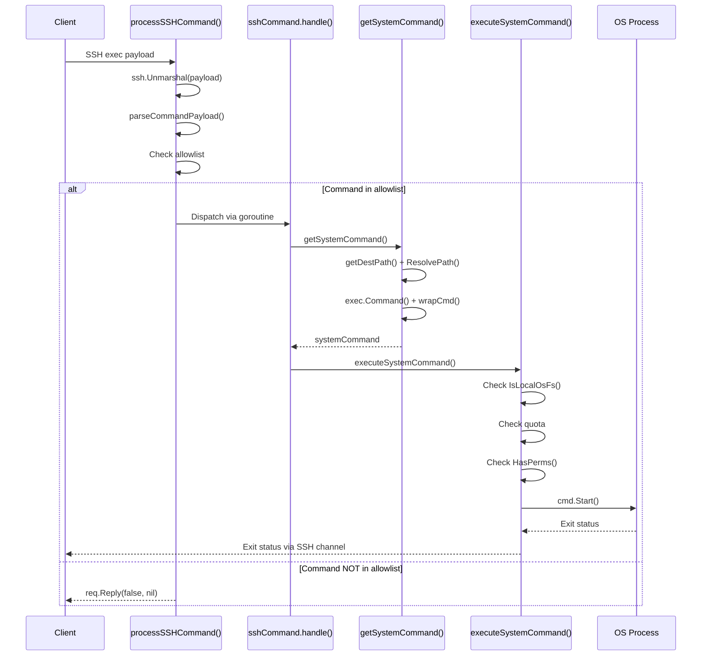
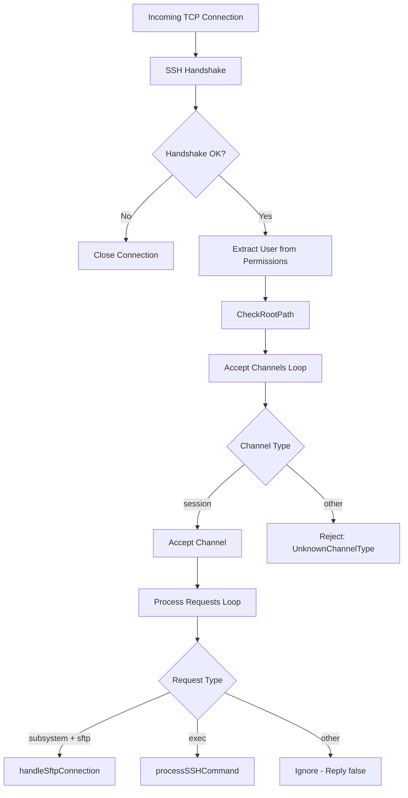
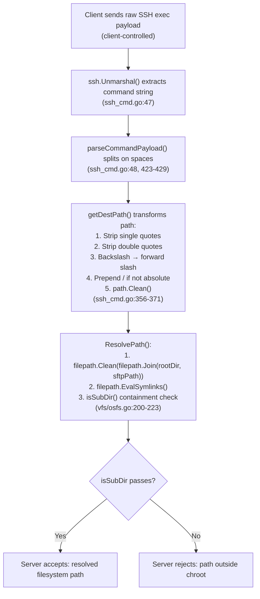
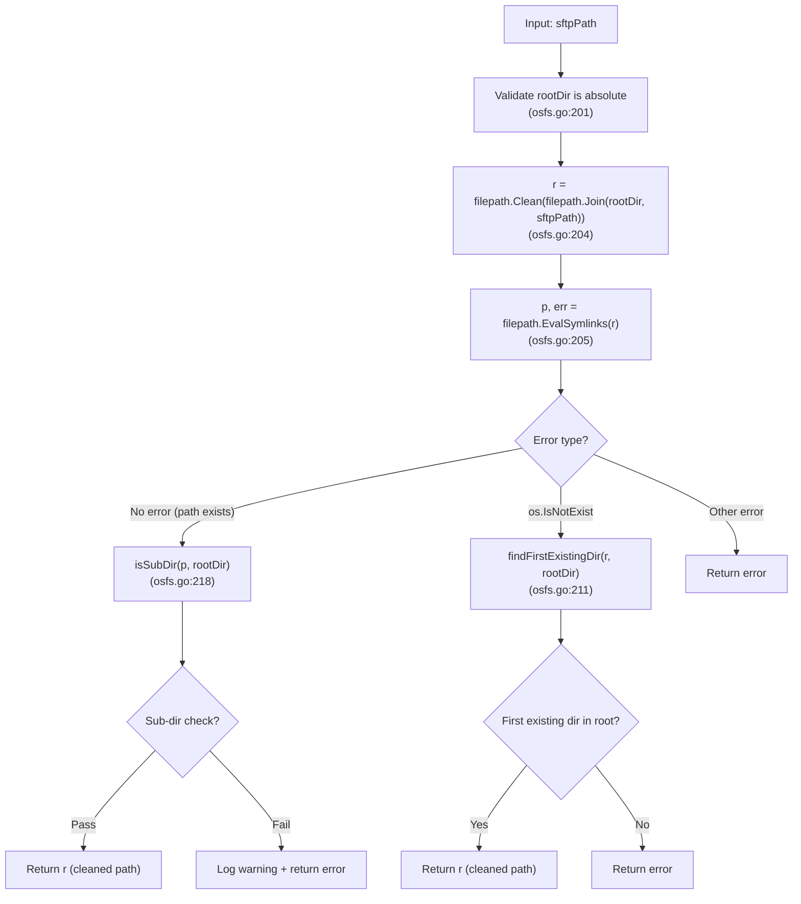

# SFTPGo Security Architecture: Code-Level Analysis

## Methodology

This analysis is based **exclusively on code evidence** from the SFTPGo repository (version 0.9.5-dev). Every claim herein cites specific source file paths and line numbers from the codebase. No theoretical explanations are provided — only evidence of what the code actually does.

**Citation format:** `Source: path/to/file.go:LineNumber` or inline as `(file.go:NN-MM)`.

**Scope:** This document answers five interrelated questions about SFTPGo's internal security mechanisms:

1. How does SFTPGo's security model govern the invocation of external system commands?
2. What is the precise boundary between what the client controls and what the server decides?
3. How does the system handle inputs with unusual delimiters, formatting, or structure?
4. Where in the processing chain are directory-level permission restrictions enforced?
5. What path traversal and chroot protections exist, and is coverage comprehensive?

---

## Table of Contents

- [1. External Utility Invocation Security](#1-external-utility-invocation-security)
  - [1.1 Command Allowlist Mechanism](#11-command-allowlist-mechanism)
  - [1.2 SSH Exec Payload Processing](#12-ssh-exec-payload-processing)
  - [1.3 System Command Preparation and Execution](#13-system-command-preparation-and-execution)
  - [1.4 Credential Wrapping (UID/GID)](#14-credential-wrapping-uidgid)
  - [1.5 Rsync Symlink Hardening](#15-rsync-symlink-hardening)
- [2. Client vs. Server Decision Boundary](#2-client-vs-server-decision-boundary)
  - [2.1 Session Routing: Channel Types and Request Types](#21-session-routing-channel-types-and-request-types)
  - [2.2 Command Parsing: What the Client Controls](#22-command-parsing-what-the-client-controls)
  - [2.3 Allowlist Filtering: What the Server Decides](#23-allowlist-filtering-what-the-server-decides)
  - [2.4 Path Transformation Chain](#24-path-transformation-chain)
  - [2.5 Post-Operation Action Hooks](#25-post-operation-action-hooks)
- [3. Input Validation and Protocol Parsing](#3-input-validation-and-protocol-parsing)
  - [3.1 SSH Exec Payload Parsing](#31-ssh-exec-payload-parsing)
  - [3.2 SCP Protocol Message Parsing](#32-scp-protocol-message-parsing)
  - [3.3 SFTP Request Path Handling](#33-sftp-request-path-handling)
  - [3.4 Edge Cases and Parsing Assumptions](#34-edge-cases-and-parsing-assumptions)
- [4. Permission Enforcement Ordering](#4-permission-enforcement-ordering)
  - [4.1 SFTP Handler Enforcement Order](#41-sftp-handler-enforcement-order)
  - [4.2 SSH Command Enforcement Order](#42-ssh-command-enforcement-order)
  - [4.3 SCP Handler Enforcement Order](#43-scp-handler-enforcement-order)
  - [4.4 Comparative Analysis Across Protocols](#44-comparative-analysis-across-protocols)
- [5. Filesystem Protection Mechanisms](#5-filesystem-protection-mechanisms)
  - [5.1 ResolvePath() — The Chroot Gate](#51-resolvepath--the-chroot-gate)
  - [5.2 Symlink Evaluation and Containment](#52-symlink-evaluation-and-containment)
  - [5.3 Non-Existent Path Handling](#53-non-existent-path-handling)
  - [5.4 Coverage Across Access Paths](#54-coverage-across-access-paths)
  - [5.5 String-Prefix Containment: Limitations](#55-string-prefix-containment-limitations)
- [Summary and Key Findings](#summary-and-key-findings)

---

## 1. External Utility Invocation Security

**Summary answer:** SFTPGo employs a strict, server-side allowlist to control which external commands can be invoked through SSH exec requests. Only commands present in the `supportedSSHCommands` list — and further filtered to the administrator-configured `EnabledSSHCommands` — are permitted. By default, only hash commands (`md5sum`, `sha1sum`) and navigation commands (`cd`, `pwd`) are enabled. Git and rsync commands are supported but disabled by default. System commands undergo additional path resolution, comprehensive permission checks, and UID/GID credential wrapping before execution.

### 1.1 Command Allowlist Mechanism

The command allowlist is defined as a set of compile-time constants in the `sftpd` package:

**Supported commands (the full universe of allowable commands):**

Source: `sftpd/sftpd.go:66-67`
```go
supportedSSHCommands = []string{"scp", "md5sum", "sha1sum", "sha256sum", "sha384sum", "sha512sum", "cd", "pwd",
    "git-receive-pack", "git-upload-pack", "git-upload-archive", "rsync"}
```

**Default commands (enabled when no explicit configuration is provided):**

Source: `sftpd/sftpd.go:68`
```go
defaultSSHCommands = []string{"md5sum", "sha1sum", "cd", "pwd"}
```

**Hash commands (handled internally, not as OS processes):**

Source: `sftpd/sftpd.go:69`
```go
sshHashCommands = []string{"md5sum", "sha1sum", "sha256sum", "sha384sum", "sha512sum"}
```

**System commands (executed as OS-level child processes):**

Source: `sftpd/sftpd.go:70`
```go
systemCommands = []string{"git-receive-pack", "git-upload-pack", "git-upload-archive", "rsync"}
```

**Configuration validation** is performed by `checkSSHCommands()` at server startup:

Source: `sftpd/server.go:396-414`

- If the configuration contains `"*"`, it expands to all supported commands (`server.go:397-399`).
- Each configured command is validated against `supportedSSHCommands`; any unknown command is silently discarded with a warning log (`server.go:405-411`).
- The legacy `IsSCPEnabled` (deprecated) flag injects `"scp"` into the enabled list (`server.go:402-404`).

**Default runtime configuration** from the shipped config file:

Source: `sftpgo.json:16`
```json
"enable_scp": false
```

Source: `sftpgo.json:22`
```json
"enabled_ssh_commands": ["md5sum", "sha1sum", "cd", "pwd"]
```

**Key finding:** The git commands (`git-receive-pack`, `git-upload-pack`, `git-upload-archive`) and `rsync` are NOT enabled by default. An administrator must explicitly opt in by adding them to `enabled_ssh_commands`. SCP is also disabled by default.

### 1.2 SSH Exec Payload Processing

The primary security gate for SSH exec requests is `processSSHCommand()`:

Source: `sftpd/ssh_cmd.go:45-81`

The function processes an SSH exec request through these steps:

1. **Payload unmarshalling** (`ssh_cmd.go:47`): The raw SSH payload is unmarshalled via `ssh.Unmarshal(payload, &msg)` to extract the command string.

2. **Command parsing** (`ssh_cmd.go:48`): `parseCommandPayload(msg.Command)` splits the command string into a name and arguments array.

3. **Allowlist check** (`ssh_cmd.go:51`): The critical security gate:
   ```go
   if err == nil && utils.IsStringInSlice(name, enabledSSHCommands) {
   ```
   This is a simple string-in-slice comparison. If the command name is NOT in the enabled list, execution falls through to rejection.

4. **SCP dispatch** (`ssh_cmd.go:53-63`): If the command is `"scp"` and has at least 2 arguments, a `scpCommand` struct is created and dispatched via a goroutine.

5. **SSH command dispatch** (`ssh_cmd.go:65-74`): If the command is NOT `"scp"` but passed the allowlist, an `sshCommand` struct is created and dispatched via a goroutine.

6. **Rejection** (`ssh_cmd.go:76-78`): If the command is not in the allowlist:
   ```go
   connection.Log(logger.LevelInfo, logSenderSSH, "ssh command not enabled/supported: %#v", name)
   ```
   The function returns `false`.

The boolean return value flows back to `req.Reply(ok, nil)` at `sftpd/server.go:329`, which informs the SSH client whether the request was accepted.

### 1.3 System Command Preparation and Execution

System commands (git, rsync) undergo a two-stage preparation and execution pipeline.

**Stage 1 — `getSystemCommand()`:**

Source: `sftpd/ssh_cmd.go:288-331`

1. A copy of the args array is made to avoid mutating the original (`ssh_cmd.go:293-294`).
2. If arguments exist, `getDestPath()` normalizes the SSH path and `ResolvePath()` converts it to a filesystem path (`ssh_cmd.go:296-304`). The resolved filesystem path replaces the last argument — this is how the chroot is enforced for system commands.
3. An `exec.Command` is created (`ssh_cmd.go:324`).
4. The user's UID/GID are retrieved and `wrapCmd(cmd, uid, gid)` is called to set process credentials (`ssh_cmd.go:325-327`).

**Stage 2 — `executeSystemCommand()`:**

Source: `sftpd/ssh_cmd.go:151-286`

1. **Filesystem type check** (`ssh_cmd.go:152-154`): `vfs.IsLocalOsFs()` verifies the user is on a local filesystem. System commands do NOT work on S3-backed filesystems — they immediately return `errUnsupportedConfig`.

2. **Quota check** (`ssh_cmd.go:155-156`): If the user has a file quota and has exceeded it, the command is denied with `errQuotaExceeded`.

3. **Permission check** (`ssh_cmd.go:158-161`): A comprehensive permission gate requires ALL of the following permissions:
   ```go
   perms := []string{dataprovider.PermDownload, dataprovider.PermUpload, dataprovider.PermCreateDirs,
       dataprovider.PermListItems, dataprovider.PermOverwrite, dataprovider.PermDelete, dataprovider.PermRename}
   ```
   The check uses `HasPerms(perms, c.getDestPath())` — requiring every permission simultaneously.

4. **Process I/O setup** (`ssh_cmd.go:164-176`): stdin, stdout, and stderr pipes are created. The process is started with `cmd.Start()`.

5. **Three goroutines** (`ssh_cmd.go:190-279`) bridge the SSH channel to the process's stdin/stdout/stderr with transfer tracking.

6. **Completion** (`ssh_cmd.go:281-285`): After the command finishes, the exit status is sent to the client, and the home directory is rescanned for quota updates.



### 1.4 Credential Wrapping (UID/GID)

Source: `sftpd/cmd_unix.go:1-16`

The `wrapCmd()` function is build-tagged for non-Windows systems (`// +build !windows` at line 1):

```go
func wrapCmd(cmd *exec.Cmd, uid, gid int) *exec.Cmd {
    if uid > 0 || gid > 0 {
        cmd.SysProcAttr = &syscall.SysProcAttr{}
        cmd.SysProcAttr.Credential = &syscall.Credential{Uid: uint32(uid), Gid: uint32(gid)}
    }
    return cmd
}
```

**Rationale:** This ensures that spawned system processes (rsync, git) run under the SFTP user's configured UID/GID, not the SFTPGo server's process identity. This provides OS-level isolation: the child process can only access files that the user's UID/GID are permitted to access at the filesystem level.

**Condition:** Credential wrapping is only applied if `uid > 0` OR `gid > 0`. If both are zero (the default for users created without UID/GID), the process inherits the SFTPGo server's credentials.

### 1.5 Rsync Symlink Hardening

Source: `sftpd/ssh_cmd.go:306-321`

When the command is `"rsync"`, the server **injects** symlink protection flags into the command arguments:

```go
if c.command == "rsync" {
    if c.connection.User.HasPerm(dataprovider.PermCreateSymlinks, c.getDestPath()) {
        if !utils.IsStringInSlice("--safe-links", args) {
            args = append([]string{"--safe-links"}, args...)
        }
    } else {
        if !utils.IsStringInSlice("--munge-links", args) {
            args = append([]string{"--munge-links"}, args...)
        }
    }
}
```

**Behavior:**

- **User HAS `PermCreateSymlinks`:** The server injects `--safe-links`, which causes rsync to skip symlinks that point outside the transfer destination tree. This prevents symlink-based escapes from the home directory.
- **User does NOT have `PermCreateSymlinks`:** The server injects `--munge-links`, which mangles symlink targets to make them unusable (but manually recoverable by an administrator).

**Critical security property:** Both flags are **prepended** to the argument array (not appended). They are only injected if NOT already present in the client-supplied arguments (`ssh_cmd.go:314, 318`). This is a **server-side injection** — the client cannot override or remove these flags because the server adds them unconditionally. Even if a malicious client deliberately omits these flags, the server will add them.

---

## 2. Client vs. Server Decision Boundary

**Summary answer:** The client controls only the raw SSH exec payload string — the command name and its arguments. The server controls everything else: which commands are permitted (via the allowlist), how paths are interpreted (via quote-stripping, normalization, and chroot resolution), what additional arguments are injected (e.g., rsync symlink flags), what permissions are required, and what credentials the spawned process runs under. The boundary is sharp and well-defined.

### 2.1 Session Routing: Channel Types and Request Types

The entry point for all SSH connections is `AcceptInboundConnection()`:

Source: `sftpd/server.go:243-333`

1. **Handshake** (`server.go:247-249`): A 2-minute deadline is set for the SSH handshake. `ssh.NewServerConn()` performs the handshake.

2. **User extraction** (`server.go:264`): The authenticated user is extracted from `sconn.Permissions.Extensions["user"]` — this was stored by the server during the authentication callback, NOT controlled by the client.

3. **Root path verification** (`server.go:289`): `fs.CheckRootPath()` ensures the user's home directory exists and is accessible.

4. **Channel type filtering** (`server.go:297-304`): The server iterates over incoming channels. **Only `"session"` channel types are accepted.** All other channel types are rejected:
   ```go
   if newChannel.ChannelType() != "session" {
       newChannel.Reject(ssh.UnknownChannelType, "unknown channel type")
       continue
   }
   ```

5. **Request type dispatch** (`server.go:314-331`): Within each session channel, a goroutine processes requests:
   - `"subsystem"` with payload `"sftp"` → dispatches to `handleSftpConnection()` (`server.go:319-324`)
   - `"exec"` → dispatches to `processSSHCommand()` (`server.go:326-327`)
   - All other request types → silently ignored (`ok` remains `false`)

6. **Reply** (`server.go:329`): `req.Reply(ok, nil)` informs the client whether the request was accepted.



### 2.2 Command Parsing: What the Client Controls

The client's raw SSH exec payload undergoes `parseCommandPayload()`:

Source: `sftpd/ssh_cmd.go:423-429`

```go
func parseCommandPayload(command string) (string, []string, error) {
    parts := strings.Split(command, " ")
    if len(parts) < 2 {
        return parts[0], []string{}, nil
    }
    return parts[0], parts[1:], nil
}
```

**What the client controls:**
- The raw command string in the SSH exec payload (the only client-controlled input)
- Which command name they request (but the server decides whether to accept it)
- The arguments to the command (but the server transforms and may inject additional ones)

**What the client CANNOT control:**
- Which commands the server will accept (controlled by `enabledSSHCommands` — server config)
- Path transformations applied by the server (quote-stripping, normalization, chroot resolution)
- Additional arguments injected by the server (e.g., `--safe-links` for rsync)
- Permission enforcement (server-side, based on user's permission model)
- Process credentials (server-side UID/GID wrapping)

The `getDestPath()` function further transforms the client's path argument:

Source: `sftpd/ssh_cmd.go:356-371`

1. Strips single quotes from the last argument (`ssh_cmd.go:360`): `strings.Trim(c.args[len(c.args)-1], "'")`
2. Strips double quotes (`ssh_cmd.go:361`): `strings.Trim(destPath, "\"")`
3. Converts backslashes to forward slashes (`ssh_cmd.go:362`): `filepath.ToSlash(destPath)`
4. Prepends `"/"` if not absolute (`ssh_cmd.go:363-364`)
5. Normalizes via `path.Clean()` (`ssh_cmd.go:366`)
6. Preserves trailing slash if originally present (`ssh_cmd.go:367-369`)

### 2.3 Allowlist Filtering: What the Server Decides

After the allowlist check at `ssh_cmd.go:51`, the `handle()` method provides further routing:

Source: `sftpd/ssh_cmd.go:83-101`

- If command is in `sshHashCommands` → `handleHashCommands()` (`ssh_cmd.go:87-88`)
- If command is in `systemCommands` → `getSystemCommand()` + `executeSystemCommand()` (`ssh_cmd.go:89-94`)
- `"cd"` is a no-op (`ssh_cmd.go:95-96`)
- `"pwd"` always returns `"/"` — hardcoded (`ssh_cmd.go:97-100`)

Even **after** passing the allowlist, system commands undergo four additional server-side checks:

1. **Filesystem type validation** — system commands only work on local OS filesystems (`ssh_cmd.go:152-154`)
2. **Path resolution via `ResolvePath()`** — enforces chroot containment (`ssh_cmd.go:298-299`)
3. **Comprehensive permission check via `HasPerms()`** — requires 7 simultaneous permissions (`ssh_cmd.go:158-161`)
4. **UID/GID credential wrapping** — constrains the child process identity (`ssh_cmd.go:325-327`)

### 2.4 Path Transformation Chain

The complete transformation from client-supplied input to server-resolved path follows this chain:



### 2.5 Post-Operation Action Hooks

After file operations complete, SFTPGo can execute external commands and send HTTP notifications. User-controlled data flows into these hooks.

**`executeAction()`:**

Source: `sftpd/sftpd.go:438-492`

- Only fires for operations listed in `actions.ExecuteOn` (`sftpd.go:439`)
- If `actions.Command` is set and is an absolute path, it executes the command with operation, username, path, target, and sshCmd as arguments (`sftpd.go:447-454`)
- If `actions.HTTPNotificationURL` is set, it sends an HTTP GET with user-controlled data in query parameters (`sftpd.go:456-489`)

**`executeNotificationCommand()`:**

Source: `sftpd/sftpd.go:418-435`

```go
cmd := exec.CommandContext(ctx, actions.Command, operation, username, path, target, sshCmd)
cmd.Env = append(os.Environ(),
    fmt.Sprintf("SFTPGO_ACTION=%v", operation),
    fmt.Sprintf("SFTPGO_ACTION_USERNAME=%v", username),
    fmt.Sprintf("SFTPGO_ACTION_PATH=%v", path),
    fmt.Sprintf("SFTPGO_ACTION_TARGET=%v", target),
    fmt.Sprintf("SFTPGO_ACTION_SSH_CMD=%v", sshCmd),
    fmt.Sprintf("SFTPGO_ACTION_FILE_SIZE=%v", fileSize),
)
```

**Security concern:** The environment variables contain user-controlled data (paths, usernames, filenames). The external auth documentation explicitly warns about this:

Source: `dataprovider/dataprovider.go:156-157`
> "The content of these variables is _not_ quoted. They may contain special characters. They are under the control of a possibly malicious remote user."

This warning applies to the external authentication program, but the same pattern exists in the action hooks: user-controlled strings are passed unquoted to environment variables and command arguments. A malicious filename or path could inject special characters into these values.

---

## 3. Input Validation and Protocol Parsing

**Summary answer:** SFTPGo uses simple, non-shell parsing for all protocol inputs. SSH exec payloads are split on spaces with no escape handling. SCP protocol messages are newline-terminated with no maximum length enforcement and space-delimited with a fixed 3-part expectation. SFTP paths are parsed by the external `pkg/sftp` library. The simplicity of the parsing is a double-edged sword: it prevents shell-injection attacks but creates edge cases around filenames containing spaces or unusual characters.

### 3.1 SSH Exec Payload Parsing

Source: `sftpd/ssh_cmd.go:423-429`

```go
func parseCommandPayload(command string) (string, []string, error) {
    parts := strings.Split(command, " ")
    if len(parts) < 2 {
        return parts[0], []string{}, nil
    }
    return parts[0], parts[1:], nil
}
```

**Parsing characteristics:**

- **Delimiter:** Single space character — `strings.Split(command, " ")` — no multi-space collapsing
- **Quoting:** No shell-style quoting support. Arguments containing spaces are split into multiple separate arguments.
- **Escaping:** No escape sequence handling whatsoever.
- **Maximum length:** No maximum command length enforced.

**Security implications:**

- **No shell injection:** Because there is no shell involved — no glob expansion, no variable substitution, no backtick execution, no pipeline operators. The command name must exactly match an allowlist entry. This is **safer** than shell parsing.
- **Space-in-path limitation:** A client cannot pass a single argument containing spaces. The path `"/my dir/file"` would be split into `["/my", "dir/file"]`. However, `getDestPath()` only processes the **last** argument (`ssh_cmd.go:360`), so intermediate space-split fragments are ignored for path resolution. This means the last segment of a space-separated path is what gets used.

### 3.2 SCP Protocol Message Parsing

The SCP protocol uses a custom text-based protocol over the SSH channel.

**`readProtocolMessage()`:**

Source: `sftpd/scp.go:542-563`

```go
func (c *scpCommand) readProtocolMessage() (string, error) {
    var command strings.Builder
    var err error
    buf := make([]byte, 1)
    for {
        var n int
        n, err = c.connection.channel.Read(buf)
        if err != nil {
            break
        }
        if n > 0 {
            readed := buf[:n]
            if n == 1 && readed[0] == newLine[0] {
                break
            }
            command.WriteString(string(readed))
        }
    }
    ...
}
```

Where `newLine` is defined at `sftpd/scp.go:25` as `[]byte{0x0A}`.

**Parsing characteristics:**

- Reads **one byte at a time** from the SSH channel (`scp.go:545-548`)
- Accumulates bytes until a newline (`0x0A`) is encountered (`scp.go:554`)
- **No maximum message length check** — a malicious client could send an arbitrarily long line without a newline, causing unbounded memory growth in the `strings.Builder`
- On error, the channel is closed immediately (`scp.go:560-561`)

**`parseUploadMessage()`:**

Source: `sftpd/scp.go:631-663`

This function parses SCP protocol messages in the format documented at `scp.go:626-630`:
- File: `C0644 6 testfile`
- Directory: `D0755 0 testdir`

Parsing steps:

1. **Prefix validation** (`scp.go:635-641`): The first character must be `"C"` or `"D"`. Anything else is rejected.

2. **Space split** (`scp.go:642`): `strings.Split(command, " ")` splits on spaces.

3. **Part count validation** (`scp.go:643, 657-661`): Exactly 3 parts are required. If not exactly 3 parts, an error is returned.

4. **Size parsing** (`scp.go:644`): The second part is parsed as `int64` via `strconv.ParseInt(parts[1], 10, 64)`.

5. **Name extraction** (`scp.go:650-655`): The third part is the filename. An empty filename is rejected.

**Edge cases and assumptions:**

- **Filename with spaces:** If a filename contains spaces (e.g., `C0644 6 my file.txt`), the split produces 4 parts: `["C0644", "6", "my", "file.txt"]`. The 3-part validation fails, and the upload is rejected. This means SCP cannot handle filenames with spaces.
- **Permission mode string:** The first part (e.g., `C0644`) is not validated as a proper octal permission mode. The `C` or `D` prefix is checked, but the remaining digits (`0644`) are not parsed or validated.
- **Integer overflow:** Size must be a valid `int64`. Overflow is caught by `strconv.ParseInt`.

**`getNextUploadProtocolMessage()`:**

Source: `sftpd/scp.go:595-613`

This function wraps `readProtocolMessage()` and silently skips `"T"` (timestamp) commands (`scp.go:603-607`). Timestamps sent by the client are acknowledged with a confirmation message but **not applied** — the server uses its own timestamps.

**SCP experimental status warning:**

Source: `sftpd/server.go:81-88`

The server's configuration comments explicitly state:

> "SCP is an experimental feature... We may not handle some borderline cases or have sneaky bugs. Please do accurate tests yourself before enabling SCP."

This is a candid acknowledgment by the developers that the SCP protocol implementation may have edge cases.

### 3.3 SFTP Request Path Handling

For SFTP operations, SFTPGo does **not** parse the SFTP protocol itself. The external `pkg/sftp` library (v1.11.0) handles SFTP protocol parsing and delivers already-parsed paths to SFTPGo's handlers:

- `Fileread()` (`handler.go:47`): Receives `request.Filepath` from the SFTP library, passes to `ResolvePath()` at line 54.
- `Filewrite()` (`handler.go:98`): Receives `request.Filepath`, passes to `ResolvePath()` at line 100.
- `Filecmd()` (`handler.go:138`): Receives `request.Filepath` AND `request.Target`, both resolved at lines 141 and 145.
- `Filelist()` (`handler.go:195`): Receives `request.Filepath`, resolved at line 197.

This delegation means that SFTP binary protocol parsing, including length-prefixed strings and packet framing, is handled by the well-tested `pkg/sftp` library — not by SFTPGo's own code.

### 3.4 Edge Cases and Parsing Assumptions

| Protocol | Parser Function | Delimiter | Max Length | Validation |
|----------|----------------|-----------|------------|------------|
| SSH exec | `parseCommandPayload()` (`ssh_cmd.go:423`) | Space | None | Allowlist check on command name |
| SCP upload msg | `parseUploadMessage()` (`scp.go:631`) | Space | None | C/D prefix, exactly 3 parts, non-empty name |
| SCP transport | `readProtocolMessage()` (`scp.go:542`) | Newline (0x0A) | **None** | None |
| SFTP | `pkg/sftp` library | SFTP binary protocol | Per-spec | Library-handled |

**The `getDestPath()` quote-stripping** at `ssh_cmd.go:360-361` is a defensive measure against shell-quoting artifacts. SCP and SSH clients often wrap paths in single or double quotes when sending them over the exec channel. The server strips these before processing. This also means that if a path legitimately contains quote characters as part of the filename, those characters would be stripped.

---

## 4. Permission Enforcement Ordering

**Summary answer:** The ordering of `ResolvePath()` (path resolution/chroot enforcement) and `HasPerm()` (permission checking) varies across handlers. `Fileread()` is the **only** handler that checks permissions BEFORE resolving the path. All other handlers — `Filewrite()`, `Filecmd()`, `Filelist()`, `handleHashCommands()`, `executeSystemCommand()`, and `handleUpload()` — resolve the path first. This inconsistency means that for most operations, a `ResolvePath()` error (e.g., for non-existent or out-of-chroot paths) is returned before the permission check runs.

### 4.1 SFTP Handler Enforcement Order

**`Fileread()` — Permission FIRST:**

Source: `sftpd/handler.go:47-95`

```
Line 50: HasPerm(PermDownload, path.Dir(request.Filepath))  ← permission check FIRST
Line 54: ResolvePath(request.Filepath)                       ← path resolution SECOND
```

Order: **HasPerm → ResolvePath → Stat → Open**

**`Filewrite()` — ResolvePath FIRST:**

Source: `sftpd/handler.go:98-134`

```
Line 100: ResolvePath(request.Filepath)                      ← path resolution FIRST
Line 110: Stat(p)                                            ← check existence
Line 112: HasPerm(PermUpload, ...) [new file]                ← permission check SECOND
Line 129: HasPerm(PermOverwrite, ...) [existing file]        ← permission check SECOND
```

Order: **ResolvePath → Stat → HasPerm → Open**

**`Filecmd()` — ResolvePath FIRST:**

Source: `sftpd/handler.go:138-191`

```
Line 141: ResolvePath(request.Filepath)                      ← path resolution FIRST
Line 145: getSFTPCmdTargetPath(request.Target)               ← also resolves target
Lines 154-176: Per-method permission checks                  ← permission check SECOND
```

Individual method permission checks:
- `handleSFTPRename`: `HasPerm(PermRename, ...)` at `handler.go:309`
- `handleSFTPRmdir`: `HasPerm(PermDelete, ...)` at `handler.go:326`
- `handleSFTPMkdir`: `HasPerm(PermCreateDirs, ...)` at `handler.go:368`
- `handleSFTPSymlink`: `HasPerm(PermCreateSymlinks, ...)` at `handler.go:355`
- `handleSFTPRemove`: `HasPerm(PermDelete, ...)` at `handler.go:382`
- `handleSFTPSetstat`: `HasPerm(PermChmod/PermChown/PermChtimes, ...)` at `handler.go:261-284`

Order: **ResolvePath → Method-specific HasPerm**

**`Filelist()` — ResolvePath FIRST:**

Source: `sftpd/handler.go:195-233`

```
Line 197: ResolvePath(request.Filepath)                      ← path resolution FIRST
Line 204: HasPerm(PermListItems, request.Filepath) [List]    ← permission check SECOND
Line 218: HasPerm(PermListItems, ...) [Stat]                 ← permission check SECOND
```

Order: **ResolvePath → HasPerm → ReadDir/Stat**

### 4.2 SSH Command Enforcement Order

**`handleHashCommands()` — ResolvePath FIRST:**

Source: `sftpd/ssh_cmd.go:105-149`

```
Line 132: sshPath := c.getDestPath()                         ← path normalization
Line 133: fsPath, err := c.connection.fs.ResolvePath(sshPath) ← path resolution FIRST
Line 137: HasPerm(PermListItems, sshPath)                     ← permission check SECOND
```

Order: **ResolvePath → HasPerm → computeHash**

**`executeSystemCommand()` — ResolvePath in getSystemCommand(), then HasPerms:**

The path resolution happens in `getSystemCommand()` (called before `executeSystemCommand()`):

Source: `sftpd/ssh_cmd.go:288-331`

```
Line 298: sshPath := c.getDestPath()                         ← path normalization
Line 299: path, err = c.connection.fs.ResolvePath(sshPath)   ← path resolution FIRST
```

Then in `executeSystemCommand()`:

Source: `sftpd/ssh_cmd.go:151-286`

```
Line 158-160: HasPerms([7 permissions], c.getDestPath())     ← permission check SECOND
```

Order: **ResolvePath (in getSystemCommand) → HasPerms (in executeSystemCommand) → cmd.Start()**

Note: The `HasPerms()` check at line 160 uses `c.getDestPath()` — the SFTP-level path — not the resolved filesystem path. This is correct for permission checking because permissions are defined against SFTP paths, not filesystem paths.

### 4.3 SCP Handler Enforcement Order

**`handleUpload()` — ResolvePath FIRST:**

Source: `sftpd/scp.go:226-285`

```
Line 231: ResolvePath(uploadFilePath)                        ← path resolution FIRST
Line 241: Stat(p)                                            ← check existence
Line 243: HasPerm(PermUpload, ...) [new file]                ← permission check SECOND
Line 265: HasPerm(PermOverwrite, ...) [existing file]        ← permission check SECOND
```

Order: **ResolvePath → Stat → HasPerm → handleUploadFile**

**`handleDownload()` — ResolvePath FIRST:**

Source: `sftpd/scp.go:420-498`

```
Line 425: ResolvePath(filePath)                              ← path resolution FIRST
Line 434: Stat(p)                                            ← check existence
Line 441: HasPerm(PermDownload, filePath) [directory]        ← permission check SECOND
Line 451: HasPerm(PermDownload, ...) [file]                  ← permission check SECOND
```

Order: **ResolvePath → Stat → HasPerm → Open/handleRecursiveDownload**

**`handleCreateDir()` — ResolvePath FIRST:**

Source: `sftpd/scp.go:117-138`

```
Line 119: ResolvePath(dirPath)                               ← path resolution FIRST
Line 125: HasPerm(PermCreateDirs, path.Dir(dirPath))         ← permission check SECOND
```

Order: **ResolvePath → HasPerm → createDir**

### 4.4 Comparative Analysis Across Protocols

| Handler | ResolvePath First? | HasPerm First? | Security Implication |
|---------|-------------------|----------------|---------------------|
| `Fileread()` | No — HasPerm first | **Yes** | Permission denied before any filesystem interaction |
| `Filewrite()` | **Yes** | No | Path resolved before permission check |
| `Filecmd()` | **Yes** | No | Path resolved before per-method permission checks |
| `Filelist()` | **Yes** | No | Path resolved before permission check |
| `handleHashCommands()` | **Yes** | No | Path resolved before permission check |
| `executeSystemCommand()` | **Yes** (in getSystemCommand) | No | Path resolved before permission check |
| `handleUpload()` (SCP) | **Yes** | No | Path resolved before permission check |
| `handleDownload()` (SCP) | **Yes** | No | Path resolved before permission check |
| `handleCreateDir()` (SCP) | **Yes** | No | Path resolved before permission check |

**Analysis:**

`Fileread()` is the **only** handler that checks permissions before resolving the path. This is possible because `Fileread()` uses `path.Dir(request.Filepath)` for its permission check (`handler.go:50`) — the SFTP-level directory path — which does not require filesystem resolution. All other handlers resolve the path first because they need the filesystem path to determine whether the target exists (for the `Stat` check that decides between upload vs. overwrite permissions).

**Implication of ResolvePath-first ordering:** When `ResolvePath()` runs before `HasPerm()`, a `ResolvePath()` error (e.g., path resolves to a location outside the chroot) is returned to the client before the permission check executes. This means:

1. A user without download permission who requests a path outside the chroot will receive a "path not allowed" error (from `ResolvePath`) rather than a "permission denied" error (from `HasPerm`). This is arguably a minor information leak — the error type reveals something about the server's path resolution behavior.
2. However, this does not compromise security: `ResolvePath()` is itself a security check (chroot enforcement), so the operation is still blocked.

---

## 5. Filesystem Protection Mechanisms

**Summary answer:** SFTPGo uses `ResolvePath()` as a universal chroot gate. Every file-access code path calls `ResolvePath()`, which joins the SFTP path with the user's root directory, resolves all symlinks via `filepath.EvalSymlinks()`, and validates containment via `isSubDir()`. For non-existent paths, the system walks up the directory tree to find the first existing ancestor and validates that. Symlinks pointing outside the root are detected and rejected. However, the containment check uses `strings.HasPrefix()` — a string-prefix comparison — which has a known limitation with directory names sharing prefixes.

### 5.1 ResolvePath() — The Chroot Gate

Source: `vfs/osfs.go:200-223`

```go
func (fs OsFs) ResolvePath(sftpPath string) (string, error) {
    if !filepath.IsAbs(fs.rootDir) {
        return "", fmt.Errorf("Invalid root path: %v", fs.rootDir)
    }
    r := filepath.Clean(filepath.Join(fs.rootDir, sftpPath))
    p, err := filepath.EvalSymlinks(r)
    if err != nil && !os.IsNotExist(err) {
        return "", err
    } else if os.IsNotExist(err) {
        _, err = fs.findFirstExistingDir(r, fs.rootDir)
        if err != nil {
            fsLog(fs, logger.LevelWarn, "error resolving not existent path: %#v", err)
        }
        return r, err
    }

    err = fs.isSubDir(p, fs.rootDir)
    if err != nil {
        fsLog(fs, logger.LevelWarn, "Invalid path resolution, dir: %#v outside user home: %#v err: %v", p, fs.rootDir, err)
    }
    return r, err
}
```

**Algorithm:**

1. **Absolute path validation** (`osfs.go:201`): Rejects if `rootDir` is not an absolute path.

2. **Path construction** (`osfs.go:204`): `filepath.Clean(filepath.Join(fs.rootDir, sftpPath))` — the SFTP path is joined with the user's root directory and cleaned. The `filepath.Clean()` resolves `.` and `..` segments.

3. **Symlink resolution** (`osfs.go:205`): `filepath.EvalSymlinks(r)` resolves ALL symlinks in the constructed path to their real targets.

4. **Error handling** (`osfs.go:206-216`):
   - If the path exists (no error): proceeds to containment check.
   - If the path does not exist (`os.IsNotExist`): calls `findFirstExistingDir()` to walk up until an existing directory is found and validates that directory.
   - If any other error: returns immediately.

5. **Containment check** (`osfs.go:218`): `isSubDir(p, fs.rootDir)` verifies the resolved path is within the user's root.

6. **Return value** (`osfs.go:222`): Returns the **cleaned** path `r` (NOT the symlink-resolved path `p`). This is significant — subsequent operations use the original cleaned path, which may contain symlinks that resolve within the root.



### 5.2 Symlink Evaluation and Containment

Source: `vfs/osfs.go:278-291`

```go
func (fs *OsFs) isSubDir(sub, rootPath string) error {
    parent, err := filepath.EvalSymlinks(rootPath)
    if err != nil {
        fsLog(fs, logger.LevelWarn, "invalid home dir %#v: %v", rootPath, err)
        return err
    }
    if !strings.HasPrefix(sub, parent) {
        err = fmt.Errorf("path %#v is not inside: %#v", sub, parent)
        fsLog(fs, logger.LevelWarn, "error: %v ", err)
        return err
    }
    return nil
}
```

**How symlinks are evaluated:**

1. `filepath.EvalSymlinks()` is called on **both** the target path (in `ResolvePath` at line 205) **and** the root path (in `isSubDir` at line 280). This ensures both sides of the comparison are canonicalized.

2. If a symlink target resolves to a path **outside** the root directory → `strings.HasPrefix(sub, parent)` fails → error returned → access denied.

3. If a symlink target resolves to a path **inside** the root directory → `strings.HasPrefix(sub, parent)` passes → access allowed.

**Example: Symlink escape detection**
- User root: `/home/alice`
- Symlink: `/home/alice/link` → `/etc/passwd`
- `EvalSymlinks("/home/alice/link")` resolves to `/etc/passwd`
- `isSubDir("/etc/passwd", "/home/alice")` → `strings.HasPrefix("/etc/passwd", "/home/alice")` → `false` → **Blocked**

### 5.3 Non-Existent Path Handling

When a requested path does not exist, `ResolvePath()` calls `findFirstExistingDir()` to validate the closest existing ancestor.

**`findFirstExistingDir()`:**

Source: `vfs/osfs.go:250-276`

1. Calls `findNonexistentDirs()` to get a list of non-existent directories in the path (`osfs.go:251`).
2. Gets the parent of the last non-existent directory — this must be an existing directory (`osfs.go:257-261`).
3. Resolves symlinks on the existing parent via `filepath.EvalSymlinks(parent)` (`osfs.go:263`).
4. Verifies the resolved path is actually a directory (`osfs.go:267-272`).
5. Validates containment with `isSubDir(p, rootPath)` (`osfs.go:274`).

**`findNonexistentDirs()`:**

Source: `vfs/osfs.go:225-248`

1. Walks up the directory tree using `filepath.Dir()` until an existing directory is found (`osfs.go:231-234`).
2. Resolves symlinks on the found existing parent (`osfs.go:239`).
3. Validates the existing parent is within the root via `isSubDir()` (`osfs.go:243`).

**Rationale:** For paths like `/root/user/new/deep/path` where `new/deep/path` does not exist, the system walks up to find `/root/user/` (which exists), resolves its symlinks, and validates it is within the chroot root. This prevents an attacker from creating a path traversal that exploits the fact that `EvalSymlinks` cannot resolve symlinks in non-existent path components.

### 5.4 Coverage Across Access Paths

`ResolvePath()` is called in every file-access code path:

**SFTP handlers:**
- `Fileread()` at `handler.go:54`
- `Filewrite()` at `handler.go:100`
- `Filecmd()` at `handler.go:141` (and target at `handler.go:241` via `getSFTPCmdTargetPath`)
- `Filelist()` at `handler.go:197`

**SSH command handlers:**
- `getSystemCommand()` at `ssh_cmd.go:299`
- `handleHashCommands()` at `ssh_cmd.go:133`

**SCP handlers:**
- `handleUpload()` at `scp.go:231`
- `handleDownload()` at `scp.go:425`
- `handleCreateDir()` at `scp.go:119`

**Conclusion:** All file-access code paths go through `ResolvePath()` as the universal chroot gate. There are no file-access operations that bypass this check.

**Note:** System commands (`executeSystemCommand()` at `ssh_cmd.go:151`) additionally verify `vfs.IsLocalOsFs()` before proceeding — system commands do not work on S3-backed filesystems, which have their own path model.

### 5.5 String-Prefix Containment: Limitations

Source: `vfs/osfs.go:285`

The containment check is:
```go
if !strings.HasPrefix(sub, parent) {
```

This is a **string-prefix comparison**, not a path-component-level comparison. This creates a known limitation:

**The vulnerability:** If the user's root directory is `/home/user`, the string prefix check would consider `/home/user2/secret` as a valid subdirectory because `"/home/user2/secret"` has the string prefix `"/home/user"`.

**Attack scenario:**
1. User's `rootDir` = `/home/user`
2. Attacker provides SFTP path `../user2/secret`
3. `filepath.Join("/home/user", "../user2/secret")` → `filepath.Clean(...)` → `/home/user2/secret`
4. `filepath.EvalSymlinks("/home/user2/secret")` → `/home/user2/secret` (if it exists)
5. `isSubDir("/home/user2/secret", "/home/user")`:
   - `parent = filepath.EvalSymlinks("/home/user")` → `/home/user`
   - `strings.HasPrefix("/home/user2/secret", "/home/user")` → **TRUE** (because the string starts with `/home/user`)
6. Access is **incorrectly allowed** to `/home/user2/secret`

**Mitigation factors:**
- `filepath.EvalSymlinks()` on both paths normalizes to canonical absolute paths, which reduces the risk in most deployment scenarios.
- In practice, the vulnerability requires specific directory naming patterns (e.g., `/home/user` and `/home/user2` on the same system) combined with path traversal input.
- A correct implementation would check `strings.HasPrefix(sub, parent + string(os.PathSeparator))` or use path-component comparison.

**This is a limitation of the implementation, backed by code evidence at `vfs/osfs.go:278-291`.**

---

## Summary and Key Findings

### Critical Security Mechanisms

| Mechanism | Location | Purpose |
|-----------|----------|---------|
| Command Allowlist | `sftpd/sftpd.go:66-70`, `ssh_cmd.go:51` | Restricts which SSH commands can execute |
| ResolvePath Chroot | `vfs/osfs.go:200-223` | Confines all file access to user's home directory |
| Permission Enforcement | `dataprovider/user.go:159-179` | Per-directory, per-operation permission checks |
| Credential Wrapping | `sftpd/cmd_unix.go:10-16` | Runs child processes under user's UID/GID |
| Rsync Symlink Hardening | `sftpd/ssh_cmd.go:306-321` | Server-side injection of symlink protection flags |
| SCP Disabled by Default | `sftpgo.json:16` | Experimental SCP not enabled by default |
| Git/Rsync Disabled by Default | `sftpgo.json:22` | System commands require explicit opt-in |

### Areas of Concern

| Concern | Evidence | Severity |
|---------|----------|----------|
| String-prefix containment limitation | `vfs/osfs.go:285` — `strings.HasPrefix(sub, parent)` allows escape when directory names share prefixes | **High** — potential path traversal |
| Permission enforcement ordering inconsistency | `Fileread()` checks HasPerm first; all other handlers check ResolvePath first | **Low** — minor information leak |
| No maximum length on SCP protocol messages | `sftpd/scp.go:542-563` — `readProtocolMessage()` has no length limit | **Medium** — potential memory exhaustion |
| SCP experimental status | `sftpd/server.go:81-88` — developers acknowledge potential "borderline cases" and "sneaky bugs" | **Medium** — acknowledged instability |
| Unquoted environment variables in action hooks | `sftpd/sftpd.go:418-429` — user-controlled data in env vars | **Medium** — potential injection in external programs |
| External auth env var warning | `dataprovider/dataprovider.go:156-157` — explicitly warns about malicious input | **Medium** — documented risk |
| Space-delimited parsing of filenames | `scp.go:642`, `ssh_cmd.go:424` — filenames with spaces are mishandled | **Low** — functional limitation |

### Question-to-Answer Map

| Question | Primary Answer | Key Evidence |
|----------|---------------|--------------|
| 1. External utility invocation security | Strict allowlist gate + path resolution + permission checks + credential wrapping | `sftpd/sftpd.go:66-70`, `ssh_cmd.go:45-81`, `ssh_cmd.go:288-331` |
| 2. Client vs. server decision boundary | Client controls only the raw exec payload; server controls allowlisting, path transformation, argument injection, permissions, and credentials | `server.go:243-333`, `ssh_cmd.go:423-429`, `ssh_cmd.go:356-371` |
| 3. Input validation for protocol data | Simple space-split parsing with no shell features; SCP has no max length; SFTP delegated to pkg/sftp | `ssh_cmd.go:423-429`, `scp.go:542-563`, `scp.go:631-663` |
| 4. Permission enforcement ordering | ResolvePath runs first in all handlers except Fileread(); varies by protocol | `handler.go:47-233`, `ssh_cmd.go:105-286`, `scp.go:226-498` |
| 5. Filesystem protections | Universal ResolvePath chroot gate with symlink evaluation; string-prefix containment has a known limitation | `vfs/osfs.go:200-291` |
