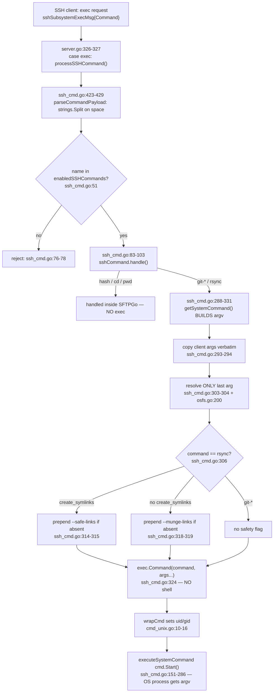

# SFTPGo SSH `exec` System-Command `argv` — Runtime Security Investigation

**Subject:** SFTPGo's optional SSH "system command" execution — the SSH session `"exec"` request path — in **SFTPGo v0.9.5-dev**, commit **`44634210`**, Go module `github.com/drakkan/sftpgo`, declared toolchain `go 1.13` (`go.mod:3`). This document proves, with **captured runtime evidence**, exactly what argument vector (`argv`) the server hands to an operating-system process when an authenticated SSH client requests a system command, and uses that evidence to rule plainly on three suspicions.

The three suspicions under test, restated crisply:

- **S1 — shell-like execution.** The server executes the command as a shell-like string, re-parsed by `/bin/sh -c` (with the attendant glob/pipe/redirection/metacharacter expansion).
- **S2 — superficial safety flags.** The path guardrails / safety flags (`--safe-links` / `--munge-links`) are a superficial patch that a client can neutralize, rather than a real enforced policy.
- **S3 — client-controlled destination.** The destination (and the wider argument string) that reaches the OS process still looks a lot like what the client sent — i.e., client-controlled `argv` survives sanitization largely intact.

**Method (one sentence):** build the checkout in its **default, canonical** configuration, drive the **real** SSH `"exec"` request path (`sftpd/server.go:326-327`) from a Go SSH client, and capture the child-process `argv` at the OS boundary **three independent ways** — a `PATH`-placed logging shim that prints its own `os.Args`, SFTPGo's own DEBUG log line at `sftpd/ssh_cmd.go:323`, and `strace -f -e trace=execve` on the daemon — across a **2×2 matrix** (normal-looking / adversarial-looking × two permission contexts), running each cell **at least twice** to confirm the `argv` is stable.

## Verdict preview

| Suspicion | Plain verdict | One-line reason |
|-----------|---------------|-----------------|
| **S1** — shell-like execution | **FALSE** (suspicion **wrong**) | No shell; the terminal call is a direct `exec.Command(c.command, args...)` (`sftpd/ssh_cmd.go:324`); `strace` shows a single `execve` of the target binary and **no** `/bin/sh`. |
| **S2** — safety flags are a superficial patch | **CONFIRMED** (suspicion **right**, for this version) | Insertion is guarded by an exact-string membership test (`sftpd/ssh_cmd.go:314,318`) with **no** rsync option allow-list; a client that pre-supplies the literal token neutralizes or makes the flag incoherent. |
| **S3** — destination looks like what the client sent | **CONFIRMED** (suspicion **right**) | `getSystemCommand` copies **all** client tokens verbatim (`sftpd/ssh_cmd.go:293-294`) and resolves **only the last** token (`:303-304`); every other token reaches `argv` byte-identical. |

## Summary of findings (final coverage)

- **S1 = FALSE.** There is no shell re-parse. The command is launched by a direct `exec.Command(c.command, args...)` at `sftpd/ssh_cmd.go:324`; every capture shows `argv[0]` is the client command token (`rsync` / `git-upload-pack`), never `/bin/sh`, and `strace` records exactly one `execve` of the target binary with zero shell invocations.
- **S2 = CONFIRMED.** The `--safe-links` / `--munge-links` insertion is a per-flag, exact-string check (`sftpd/ssh_cmd.go:314` and `:318`) inside the `if c.command == "rsync"` block (`:306`), branched on `HasPerm(PermCreateSymlinks, ...)` (`:313`). There is **no** rsync option allow-list or format validation in this version. A client that includes the literal token suppresses insertion (CELL 3 / CELL 4), and supplying the *wrong* flag yields an incoherent `--safe-links --munge-links` pair (PROBE 5).
- **S3 = CONFIRMED.** All client tokens are copied verbatim (`sftpd/ssh_cmd.go:293-294`); only the final token is chroot-resolved (`:303-304` via `getDestPath` `:356-371` + `OsFs.ResolvePath` `vfs/osfs.go:200`). In CELL 3, eight of nine tokens (including a non-final `/etc/passwd` and `--config=/root/.ssh/id_rsa`) reach the process byte-identical.
- **Function that produced the `argv`:** `sshCommand.getSystemCommand()` at **`sftpd/ssh_cmd.go:288-331`**; the exact syscall was emitted by `exec.Command(c.command, args...)` at **`sftpd/ssh_cmd.go:324`**.
- **Privilege boundary:** the evidence proves the `argv` is **client-controlled** and runs at the **daemon's** privilege (observed: a **root** child, because the daemon ran as root and the test users were unmapped). It does **not**, by itself, prove a privilege *escalation* across a uid boundary — whether the child is "elevated" depends entirely on daemon/user configuration. The drop-to-uid for a mapped user is **INFERRED** from `wrapCmd` (`sftpd/cmd_unix.go:11-13`), not exercised at runtime; on Windows `wrapCmd` is a no-op (`sftpd/cmd_windows.go:7-9`).
- **Repository unchanged:** `git status --porcelain` shows only the new untracked `?? blitzy/` tree; `go.mod` / `go.sum` SHA-256 are identical before and after; all temporary runtime artifacts lived under `/tmp` outside the checkout and were removed.

> **Evidence provenance.** All runtime output reproduced below was captured during a complete build-and-run investigation of this checkout. Every temporary artifact (built binary, generated config, SQLite DB, host keys, home directories, `PATH` shims, Go SSH client, `strace` output, and the Go toolchain) was created under `/tmp` **outside** the checkout and has been removed. Captured `argv` arrays, daemon DEBUG lines, the `strace` line, and `git` output are reproduced **verbatim and untruncated**. Every claim about the code carries a `file:line` citation. Exactly one statement is **INFERRED** (labelled as such in Section 5); everything else is **observed**.

---

## Section 1 — Build & invocation commands (default, canonical)

This was a **default, canonical** build — exactly what a normal user following the project README would run. Nothing about the toolchain, dependencies, or configuration was altered from stock beyond the single meaningful override needed to enable the system command under test.

**Toolchain and build-time requirements.**

- **Go 1.13.15.** The module declares `go 1.13` at **`go.mod:3`**, and `.travis.yml` pins `go: "1.13.x"`, so the highest documented 1.13 patch (1.13.15) was used.
- **gcc** (a C compiler) is **required** because the default data-provider driver `github.com/mattn/go-sqlite3 v2.0.2+incompatible` (see the `go.mod` `require` block, `go.mod:15`) is a **CGO** package. Without `CGO_ENABLED=1` and a C compiler the default binary does not build.
- The built binary self-identifies as **"SFTPGo version: 0.9.5-dev"**.

**Which commands actually reach an OS process.** Only `systemCommands = {git-receive-pack, git-upload-pack, git-upload-archive, rsync}` (**`sftpd/sftpd.go:70`**) flow to `exec.Command`. The hash commands `sshHashCommands = {md5sum, sha1sum, sha256sum, sha384sum, sha512sum}` (**`sftpd/sftpd.go:69`**) are computed in Go, and `cd`/`pwd` return canned responses (`sftpd/ssh_cmd.go:95-100`) — none of these exec. Crucially, `git-*`/`rsync` are **not** enabled by default: `defaultSSHCommands = {md5sum, sha1sum, cd, pwd}` (**`sftpd/sftpd.go:68`**). The `enabled_ssh_commands` semantics are documented at **`README.md:154`**, and the config field is `EnabledSSHCommands` (**`sftpd/server.go:99`**). Therefore the config **must** explicitly enable the tested command.

**Build** (run from the checkout root; all outputs directed **outside** the checkout):

```bash
export PATH=/tmp/go/bin:$PATH GOROOT=/tmp/go GOPATH=/tmp/gopath GOCACHE=/tmp/gocache CGO_ENABLED=1
go build -mod=readonly -o /tmp/sftpgo_bin
```

Build result: exit 0, ~39s. The only compiler output was a benign CGO warning from the SQLite driver (expected and non-fatal):

```
# github.com/mattn/go-sqlite3
sqlite3-binding.c: In function 'sqlite3SelectNew':
sqlite3-binding.c:125801: warning: function may return address of local variable [-Wreturn-local-addr]
```

**Version check:**

```bash
/tmp/sftpgo_bin --version
# SFTPGo version: 0.9.5-dev
```

**Data-provider DB initialization.** The `sqlite3` CLI was absent on the host, so the schema SQL was applied with Python's `sqlite3` module; this is the documented provider-init step (**`README.md:130`**). The SQLite DB lived at `/tmp/sftpgo_run/sftpgo.db`, applying `sql/sqlite/{20190828,20191112,20191230,20200116}.sql`.

**Minimal default config** generated at `/tmp/sftpgo_run/sftpgo.json`. The only meaningful override is `sftpd.enabled_ssh_commands`; SSH is bound to `127.0.0.1:2022`; the default SQLite provider is used; the management HTTP API is on `127.0.0.1:8080`:

```json
{
  "sftpd": {
    "bind_port": 2022,
    "bind_address": "127.0.0.1",
    "idle_timeout": 15,
    "max_auth_tries": 0,
    "umask": "0022",
    "enabled_ssh_commands": ["rsync", "git-upload-pack", "git-receive-pack", "git-upload-archive"]
  },
  "data_provider": {
    "driver": "sqlite",
    "name": "sftpgo.db",
    "users_table": "users",
    "manage_users": 1,
    "track_quota": 2
  },
  "httpd": {
    "bind_port": 8080,
    "bind_address": "127.0.0.1",
    "templates_path": "templates",
    "static_files_path": "static",
    "backups_path": "backups"
  }
}
```

**Run the daemon at DEBUG verbosity** (fully detached with `setsid` so it survives; host keys are auto-generated in the config dir because `sftpd.keys` is empty):

```bash
setsid /tmp/sftpgo_bin serve -c /tmp/sftpgo_run -f sftpgo -l /tmp/sftpgo_run/sftpgo.log -v
# starting SFTPGo 0.9.5-dev ... ; SSH server listening 127.0.0.1:2022 ; daemon ran as root (uid=0)
```

**Provision the two permission contexts** via the management REST API `POST /api/v1/user` (unauthenticated in this version by default). The two users differ **only** in the `create_symlinks` permission; both keep `{download, upload, create_dirs, list, overwrite, delete, rename}` (required by `executeSystemCommand`, **`sftpd/ssh_cmd.go:158-162`**) and a **local** home dir (satisfying the `IsLocalOsFs` gate, **`sftpd/ssh_cmd.go:152`**):

```bash
# User A — WITH create_symlinks  -> selects the --safe-links branch (ssh_cmd.go:313-316)
curl -s -X POST http://127.0.0.1:8080/api/v1/user -H 'Content-Type: application/json' -d '{
  "username":"usera","password":"passa","home_dir":"/tmp/homes/userA","uid":0,"gid":0,"status":1,
  "permissions":{"/":["download","upload","create_dirs","list","overwrite","delete","rename","create_symlinks"]}
}'
# -> HTTP 200, id=1

# User B — WITHOUT create_symlinks -> selects the --munge-links branch (ssh_cmd.go:317-321)
curl -s -X POST http://127.0.0.1:8080/api/v1/user -H 'Content-Type: application/json' -d '{
  "username":"userb","password":"passb","home_dir":"/tmp/homes/userB","uid":0,"gid":0,"status":1,
  "permissions":{"/":["download","upload","create_dirs","list","overwrite","delete","rename"]}
}'
# -> HTTP 200, id=2

# User C — like B but MISSING "delete" -> used only for the permission-denied edge test (EDGE11)
curl -s -X POST http://127.0.0.1:8080/api/v1/user -H 'Content-Type: application/json' -d '{
  "username":"userc","password":"passc","home_dir":"/tmp/homes/userC","uid":0,"gid":0,"status":1,
  "permissions":{"/":["download","upload","create_dirs","list","overwrite","rename"]}
}'
# -> HTTP 200, id=3
```

**Observation instruments** (both are ephemeral tools built **outside** the checkout and never added to the repository):

- **`PATH` logging shim.** Because `rsync` is **not installed** on the host, a **compiled ELF** binary named `rsync` (and a copy named `git-upload-pack`) was placed first on `PATH` at `/tmp/shimbin/`. It prints its own `os.Args` (plus uid/euid/gid/egid, executable path, cwd) as JSON to `$SHIM_LOG`. **A compiled ELF is required, not a shell script**, because `exec.Command(name, args...)` sets the child's `argv[0]` to the literal `name`; a `#!`-shebang script would have its `argv` rewritten by the kernel/interpreter and would not faithfully report the real `argv[0]` handed over by `os/exec`. `git-upload-pack` (a real binary is available via `/usr/bin/git`) exercises the **identical** builder where a real system binary is wanted.
- **Go SSH client driver.** A small program using `golang.org/x/crypto/ssh` (the same `v0.0.0-20200109152110-61a87790db17` the server uses, per `go.mod:25`) that authenticates with `ssh.Password` and issues a raw session **`"exec"`** request. This is the canonical client path: the request reaches `processSSHCommand(...)` via **`sftpd/server.go:326-327`**. Invocation form: `/tmp/sshclient_bin 127.0.0.1:2022 <user> <pass> "<command>"`. (The client was given a self-imposed 4-second completion deadline so it can never hang the harness; this does not affect the captured `argv`.)

**Token control.** `parseCommandPayload` splits the exec payload on spaces (**`sftpd/ssh_cmd.go:424`**, `strings.Split(command, " ")`), so every whitespace-separated token in the submitted string is controlled exactly and maps 1:1 onto `c.args`. This is what makes the adversarial cells precise: each token the client writes becomes a distinct element of the argument slice.

---

## Section 2 — The 2×2 `argv` evidence matrix (the core proof)

The matrix rows are `{normal-looking, adversarial-looking}`; the columns are `{User A WITH create_symlinks → --safe-links; User B WITHOUT → --munge-links}`. Every cell was run **at least twice** and the `argv` was **identical across runs**; the full matrix was re-confirmed across **3 passes**. Each capture is corroborated by three independent views: the shim's own `os.Args`, SFTPGo's DEBUG log line (**`sftpd/ssh_cmd.go:323`**), and — for one representative run — `strace`'s `execve`. All captures show the child ran with **uid=euid=gid=egid=0** (the daemon itself ran as root, and the users are unmapped; see Section 5).

**Shim record shape.** The shim writes one JSON record per launch. The following is the **actual CELL 1 record**, including its real capture timestamp:

```json
{"ts":"2026-07-13T16:21:46.506534706Z","argv":["rsync","--safe-links","--server","-vlogDtpre.iLsfxC",".","/tmp/homes/userA/upload"],"argc":6,"argv0":"rsync","executable_path":"/tmp/shimbin/rsync","cwd":"/tmp/sftpgo_run","uid":0,"euid":0,"gid":0,"egid":0}
```

For the remaining cells the load-bearing, run-stable fields are presented (`argv` / `argv0` / `executable_path` / `uid`). The per-record `ts` field is a wall-clock timestamp that varies per run and is therefore omitted from the reproduced records below (only the CELL 1 record above shows an actual `ts`); the **`argv` array is the stable, load-bearing evidence**.

### CELL 1 — NORMAL × User A (→ `--safe-links`)

- **Submitted (SSH `exec`):** `rsync --server -vlogDtpre.iLsfxC . /upload`
- **Shim `argv` (OS boundary):** `["rsync","--safe-links","--server","-vlogDtpre.iLsfxC",".","/tmp/homes/userA/upload"]` (argv0=`rsync`, executable_path=`/tmp/shimbin/rsync`, uid=euid=gid=egid=0)
- **Corroborating daemon DEBUG** (`sftpd/ssh_cmd.go:323`, sender `SSH_cmd`):

```
new system command "rsync", with args: [--safe-links --server -vlogDtpre.iLsfxC . /tmp/homes/userA/upload] path: /tmp/homes/userA/upload
```

### CELL 2 — NORMAL × User B (→ `--munge-links`)

- **Submitted (SSH `exec`):** `rsync --server -vlogDtpre.iLsfxC . /upload`
- **Shim `argv`:** `["rsync","--munge-links","--server","-vlogDtpre.iLsfxC",".","/tmp/homes/userB/upload"]` (argv0=`rsync`, executable_path=`/tmp/shimbin/rsync`, uid=euid=gid=egid=0)
- **Corroborating daemon DEBUG:**

```
new system command "rsync", with args: [--munge-links --server -vlogDtpre.iLsfxC . /tmp/homes/userB/upload] path: /tmp/homes/userB/upload
```

### CELL 3 — ADVERSARIAL × User A (client pre-supplies `--safe-links`; destination is a deep traversal; earlier tokens are option-looking and path-looking)

- **Submitted (SSH `exec`):** `rsync --safe-links --server -e.iLsfxC /etc/passwd --exclude=../../secret . --config=/root/.ssh/id_rsa ../../../../../../etc/shadow`
- **Shim `argv`:** `["rsync","--safe-links","--server","-e.iLsfxC","/etc/passwd","--exclude=../../secret",".","--config=/root/.ssh/id_rsa","/tmp/homes/userA/etc/shadow"]` (argc=9, argv0=`rsync`, executable_path=`/tmp/shimbin/rsync`, uid=euid=gid=egid=0)
- **Corroborating daemon DEBUG:**

```
new system command "rsync", with args: [--safe-links --server -e.iLsfxC /etc/passwd --exclude=../../secret . --config=/root/.ssh/id_rsa /tmp/homes/userA/etc/shadow] path: /tmp/homes/userA/etc/shadow
```

### CELL 4 — ADVERSARIAL × User B (client pre-supplies `--munge-links`)

- **Submitted (SSH `exec`):** `rsync --munge-links --server -e.iLsfxC /etc/passwd --exclude=../../secret . --config=/root/.ssh/id_rsa ../../../../../../etc/shadow`
- **Shim `argv`:** `["rsync","--munge-links","--server","-e.iLsfxC","/etc/passwd","--exclude=../../secret",".","--config=/root/.ssh/id_rsa","/tmp/homes/userB/etc/shadow"]` (argc=9, argv0=`rsync`, executable_path=`/tmp/shimbin/rsync`, uid=euid=gid=egid=0)
- **Corroborating daemon DEBUG:**

```
new system command "rsync", with args: [--munge-links --server -e.iLsfxC /etc/passwd --exclude=../../secret . --config=/root/.ssh/id_rsa /tmp/homes/userB/etc/shadow] path: /tmp/homes/userB/etc/shadow
```

### Matrix at a glance

| Cell | Row | User (perm) | Prepended flag | Submitted (SSH `exec`) | Captured `argv` at OS boundary |
|------|-----|-------------|----------------|------------------------|--------------------------------|
| 1 | normal | A (`create_symlinks`) | `--safe-links` | `rsync --server -vlogDtpre.iLsfxC . /upload` | `["rsync","--safe-links","--server","-vlogDtpre.iLsfxC",".","/tmp/homes/userA/upload"]` |
| 2 | normal | B (none) | `--munge-links` | `rsync --server -vlogDtpre.iLsfxC . /upload` | `["rsync","--munge-links","--server","-vlogDtpre.iLsfxC",".","/tmp/homes/userB/upload"]` |
| 3 | adversarial | A (`create_symlinks`) | `--safe-links` (client already sent it → not duplicated) | `rsync --safe-links --server -e.iLsfxC /etc/passwd --exclude=../../secret . --config=/root/.ssh/id_rsa ../../../../../../etc/shadow` | `["rsync","--safe-links","--server","-e.iLsfxC","/etc/passwd","--exclude=../../secret",".","--config=/root/.ssh/id_rsa","/tmp/homes/userA/etc/shadow"]` |
| 4 | adversarial | B (none) | `--munge-links` (client already sent it → not duplicated) | `rsync --munge-links --server -e.iLsfxC /etc/passwd --exclude=../../secret . --config=/root/.ssh/id_rsa ../../../../../../etc/shadow` | `["rsync","--munge-links","--server","-e.iLsfxC","/etc/passwd","--exclude=../../secret",".","--config=/root/.ssh/id_rsa","/tmp/homes/userB/etc/shadow"]` |

### Third independent view — `strace -f -e trace=execve` on the daemon

A separate straced run submitted `rsync --server -vlogDtpre.iLsfxC . /straced` as User A. The `execve` line is reproduced verbatim (the environment-pointer value `0xc0001fa780` and the "72 vars" count are non-deterministic across runs and are shown as captured):

```
34657 execve("/tmp/shimbin/rsync", ["rsync", "--safe-links", "--server", "-vlogDtpre.iLsfxC", ".", "/tmp/homes/userA/straced"], 0xc0001fa780 /* 72 vars */) = 0
```

Decisive facts from `strace`: there is exactly **ONE** `execve`; its target is **`/tmp/shimbin/rsync`** (the rsync binary directly); `argv[0]` is **`"rsync"`**; and there is **NO** `execve` of `/bin/sh` (or any shell) anywhere. This is the syscall-level confirmation for suspicion S1.

### Supplementary probes

These probes are load-bearing for the S2 verdict and for the `git-*` comparison.

**PROBE 5 — S2 cross-probe: User A pre-supplies the WRONG flag (`--munge-links`).**

- **Submitted (SSH `exec`):** `rsync --munge-links --server -vlogDtpre.iLsfxC . /dest`
- **Shim `argv`:** `["rsync","--safe-links","--munge-links","--server","-vlogDtpre.iLsfxC",".","/tmp/homes/userA/dest"]` ← **BOTH** flags present
- **Corroborating daemon DEBUG:**

```
new system command "rsync", with args: [--safe-links --munge-links --server -vlogDtpre.iLsfxC . /tmp/homes/userA/dest] path: /tmp/homes/userA/dest
```

Explanation: User A has `create_symlinks`, so the server takes the `--safe-links` branch (`sftpd/ssh_cmd.go:313`). Because that branch's guard (`:314`) only checks for the literal `--safe-links` — and the client supplied `--munge-links` instead — the server prepends `--safe-links` anyway, producing a **contradictory `--safe-links --munge-links` combination the client forced into the `argv`**.

**PROBE 6 / 7 — `git-upload-pack` (identical builder; `git-*` gets NO safety flag).**

- **Submitted (SSH `exec`):** `git-upload-pack '/srv/repo.git'`
- **Shim `argv` (User A):** `["git-upload-pack","/tmp/homes/userA/srv/repo.git"]` (argv0=`git-upload-pack`, executable_path=`/tmp/shimbin/git-upload-pack`)
- **Shim `argv` (User B):** `["git-upload-pack","/tmp/homes/userB/srv/repo.git"]`
- **Corroborating daemon DEBUG (User A):**

```
new system command "git-upload-pack", with args: [/tmp/homes/userA/srv/repo.git] path: /tmp/homes/userA/srv/repo.git
```

Explanation: the single-quotes around the path were stripped by `getDestPath` (**`sftpd/ssh_cmd.go:356-371`**, which trims `'` and `"`), only the last token was chroot-resolved, and **no** `--safe-links`/`--munge-links` was added because the rsync-only flag block (**`sftpd/ssh_cmd.go:306`**) does not apply to `git-*`.

### `argv` stability

Each cell was executed **≥2×** and the full matrix was re-confirmed across **3 passes** with **byte-identical `argv` every time**. The only field that varied between runs was the per-run `ts` timestamp in the shim record; the `argv` array — the load-bearing evidence — never changed.

---

## Section 3 — Plain verdicts on the three suspicions (keyed to the captured evidence)

Each verdict gives a one-word ruling, then the observed evidence, then the code anchor.

### S1 — "executed as a shell-like string" → VERDICT: **FALSE. The suspicion is WRONG.**

- **Evidence.** In every capture (CELLs 1–4, PROBE 5, PROBE 6/7) `argv[0]` is the client command token (`rsync` / `git-upload-pack`), **never** `/bin/sh`. The `strace` line shows a **single** `execve` of the target binary directly, with a fixed `argv` array and **zero** shell invocations.
- **Code.** The terminal call is `cmd := exec.Command(c.command, args...)` at **`sftpd/ssh_cmd.go:324`**. Per Go's `os/exec` contract, this does **not** invoke a shell and performs **no** glob / pipe / redirection / metacharacter expansion — the arguments populate the child's `argv` as-is. Note that `connection.command` (built at **`sftpd/ssh_cmd.go:52`** as `fmt.Sprintf("%v %v", name, strings.Join(args, " "))`) is a **display/log string only** and is never passed to a shell.
- **Conclusion.** There is no shell re-parse. The "shell-like string" fear does **not** occur: SFTPGo hands a fixed `argv` array straight to `execve`, exactly like C's `exec` family. The suspicion is refuted by the runtime capture, not merely by reading the code.

### S2 — "safety flags are a superficial patch a client can neutralize" → VERDICT: **CONFIRMED. The suspicion is RIGHT (for this version).**

- **Evidence.** In **CELL 3 / CELL 4** the client pre-supplied the safety flag; the captured `argv` has **argc=9 = exactly the nine submitted tokens**, with **no duplicate** flag added — insertion was suppressed. In **PROBE 5** the client supplied the *wrong* flag (`--munge-links` for a `create_symlinks` user); the server still prepended `--safe-links`, producing an incoherent `--safe-links --munge-links` pair. Either way, **the client controls whether the intended flag is meaningfully applied.**
- **Code.** Insertion is guarded by an **exact-string membership test** — `if !utils.IsStringInSlice("--safe-links", args)` at **`sftpd/ssh_cmd.go:314`** (prepend at **`:315`**) and `if !utils.IsStringInSlice("--munge-links", args)` at **`sftpd/ssh_cmd.go:318`** (prepend at **`:319`**), inside the `if c.command == "rsync"` block at **`sftpd/ssh_cmd.go:306`**, branched on `HasPerm(PermCreateSymlinks, ...)` at **`sftpd/ssh_cmd.go:313`**. There is **no rsync option allow-list and no format validation** in this version. Only `rsync` receives any safety flag; `git-*` receives none (PROBE 6/7).
- **Version context (background, not observed runtime behavior).** Upstream later added a change titled "enforce a supported format and limit the allowed options" (an rsync option allow-list / format enforcement). That hardening **post-dates** commit `44634210` and is intentionally **not** present in this checkout. This is stated as version context only — it was not exercised at runtime.
- **Conclusion.** The guard is a **per-flag cosmetic check**, trivially neutralized (client includes the literal token → no insertion) or made incoherent (client sends the opposite token → both flags present) by the client. It is **not** an enforced policy.

### S3 — "the destination reaching the process still looks like what the client sent" → VERDICT: **CONFIRMED. The suspicion is RIGHT.**

- **Evidence — token-by-token comparison for CELL 3.** Of the **nine** tokens, **eight reach the OS process byte-identical** to what the client sent — including the option-looking `--exclude=../../secret`, the absolute path `/etc/passwd`, and the sensitive-looking `--config=/root/.ssh/id_rsa`. **Only the final token** `../../../../../../etc/shadow` was transformed — `path.Clean`'d and chroot-resolved to `/tmp/homes/userA/etc/shadow`. Critically, the **earlier** path-like token `/etc/passwd` was **NOT** contained or resolved; it passed through verbatim. **Only the last token is ever resolved.**

| # | Client-sent token | Token in captured `argv` | Transformed? |
|---|-------------------|--------------------------|--------------|
| 0 | `rsync` (command name → `argv[0]`) | `rsync` | No — verbatim |
| 1 | `--safe-links` | `--safe-links` | No — verbatim (also: not duplicated, see S2) |
| 2 | `--server` | `--server` | No — verbatim |
| 3 | `-e.iLsfxC` | `-e.iLsfxC` | No — verbatim |
| 4 | `/etc/passwd` | `/etc/passwd` | **No — verbatim (non-final path NOT contained)** |
| 5 | `--exclude=../../secret` | `--exclude=../../secret` | No — verbatim |
| 6 | `.` | `.` | No — verbatim |
| 7 | `--config=/root/.ssh/id_rsa` | `--config=/root/.ssh/id_rsa` | No — verbatim |
| 8 | `../../../../../../etc/shadow` | `/tmp/homes/userA/etc/shadow` | **Yes — `path.Clean` + chroot-resolved (last token only)** |

- **Code.** `getSystemCommand` copies **all** client tokens verbatim — `args := make([]string, len(c.args))` / `copy(args, c.args)` at **`sftpd/ssh_cmd.go:293-294`** — then, only when `len(c.args) > 0` (**`sftpd/ssh_cmd.go:296`**), replaces the final element with the chroot-resolved path — `args = args[:len(args)-1]` / `args = append(args, path)` at **`sftpd/ssh_cmd.go:303-304`** — where `path` comes from `getDestPath()` (**`sftpd/ssh_cmd.go:356-371`**) plus `fs.ResolvePath()` (**`vfs/osfs.go:200`**: chroot `Join` + `Clean` + `EvalSymlinks` + is-subdir check).
- **Conclusion.** The `argv` delivered to the process is **overwhelmingly the client's own tokens**; sanitization touches **exactly one token — the last**. The destination indeed still looks a lot like what the client sent, and any non-final path-like token is delivered completely unmodified.

---

## Section 4 — Exact function attribution (by `file:line`)

The full call chain that produced the observed `argv`, naming the **specific** function/method at each step (not merely the outer caller):

- **Canonical entry point.** The `case "exec"` in the SSH session request loop calls `processSSHCommand(...)`, at **`sftpd/server.go:326-327`** (`ok = processSSHCommand(req.Payload, &connection, channel, c.EnabledSSHCommands)`; the reply is sent by `req.Reply(ok, nil)` at `sftpd/server.go:329`). The exec payload is the single-field struct `sshSubsystemExecMsg{ Command string }` (**`sftpd/sftpd.go:126-128`**). Note that `"pty"`/`"shell"` requests are discarded — the `switch req.Type` handles only `"subsystem"` and `"exec"` (**`sftpd/server.go:312-313`** is the comment documenting the discard).
- **`processSSHCommand`** (**`sftpd/ssh_cmd.go:45-81`**): calls `parseCommandPayload` (`:48`); enforces the enabled-command gate `utils.IsStringInSlice(name, enabledSSHCommands)` (`:51`); builds the display string `connection.command` (`:52`); launches `go sshCommand.handle()` (`:73`); and logs the rejection for non-enabled commands (`:76-78`).
- **`sshCommand.handle`** (**`sftpd/ssh_cmd.go:83-103`**): dispatches — hash commands → `handleHashCommands` (`:87-88`); **system commands** → `getSystemCommand` (`:90`) then `executeSystemCommand` (`:94`); `cd`/`pwd` handled inline (`:95-100`).
- **`sshCommand.getSystemCommand()` — the `argv` BUILDER — `sftpd/ssh_cmd.go:288-331`.** This is **the** function whose output was captured. Its internals:
  - verbatim token copy — `args := make([]string, len(c.args))` / `copy(args, c.args)` (**`:293-294`**);
  - last-token resolution guarded by `len(c.args) > 0` (**`:296-305`**), replacing only the final element via `getDestPath()` + `fs.ResolvePath()`;
  - the rsync safety-flag block (**`:306-322`**) with the permission branch `HasPerm(PermCreateSymlinks, ...)` (**`:313`**), the exact-string guards (**`:314`**, **`:318`**), and the prepends (**`:315`**, **`:319`**);
  - the DEBUG log line (**`:323`**);
  - the terminal `exec.Command(c.command, args...)` (**`:324`**);
  - credential wiring — `uid := c.connection.User.GetUID()` (**`:325`**), `gid := c.connection.User.GetGID()` (**`:326`**), `cmd = wrapCmd(cmd, uid, gid)` (**`:327`**).
- **Collaborators.**
  - `parseCommandPayload` (**`sftpd/ssh_cmd.go:423-429`**) — `strings.Split(command, " ")`;
  - `getDestPath` (**`sftpd/ssh_cmd.go:356-371`**) — takes the last arg, trims `'` and `"`, `filepath.ToSlash`, prepends `/` if not absolute, then `path.Clean`;
  - `wrapCmd` (**`sftpd/cmd_unix.go:10-16`**) — sets the child credential (Section 5);
  - the chroot resolver `OsFs.ResolvePath` (**`vfs/osfs.go:200`**) — `filepath.Join` + `filepath.Clean` + `filepath.EvalSymlinks` + subdir containment.
- **Launch vs. construction.** The actual OS process is launched by `cmd.Start()` inside `executeSystemCommand` (**`sftpd/ssh_cmd.go:151-286`**). That is, `argv` **construction** (`getSystemCommand`) is a **distinct step that precedes** process launch **and** the authorization gate (demonstrated by EDGE11 in Section 5).



**Plainly:** the function that produced the observed `argv` is **`sshCommand.getSystemCommand()` at `sftpd/ssh_cmd.go:288-331`**, and the exact syscall was emitted by **`exec.Command(c.command, args...)` at `sftpd/ssh_cmd.go:324`**.

---

## Section 5 — Privilege-boundary implication (what the evidence does and does NOT prove)

The single most important distinction here is between two separate questions that are easy to conflate.

### (a) Is the `argv` client-controlled? — **YES** (a sanitization / containment question)

This is what the matrix directly proves. The `argv` is overwhelmingly the client's own tokens, with only the last path token chroot-contained (Section 3, S3). An authenticated SSH user chooses the binary (from the enabled `systemCommands` set) and dictates almost every element of its argument vector.

### (b) Does the process run at elevated privilege? — a **credential** question, governed by `wrapCmd`

- `wrapCmd` (**`sftpd/cmd_unix.go:10-16`**) sets `cmd.SysProcAttr.Credential{Uid, Gid}` **only when `uid > 0 || gid > 0`** (**`:11`**); otherwise it sets **no** credential and the child inherits the **daemon's own** uid/gid.
- `User.GetUID()` / `User.GetGID()` (**`dataprovider/user.go:237-251`**) return **-1** when the mapped UID/GID is `<= 0` or `> 65535`.
- The test users were **unmapped** (`uid=gid=0`) → `GetUID()`/`GetGID()` returned **-1** → `wrapCmd(cmd, -1, -1)` set **no** credential.
- **OBSERVED:** the shim reported `uid=euid=gid=egid=0` in **every** capture, and the daemon ran as **root** — so the child `rsync` / `git-upload-pack` process ran **as root**, with a client-chosen binary and (mostly) client-chosen `argv`.
- **INFERRED (NOT exercised at runtime):** with a **mapped** user (`uid > 0`), `wrapCmd` **would** set `SysProcAttr.Credential` and the child **would** drop to that uid/gid (code path **`sftpd/cmd_unix.go:11-13`**). This was **not** run; it is stated as a code-derived inference only. **This is the one and only INFERRED claim in this document.**
- **Platform difference (do not generalize):** on Windows, `wrapCmd` (**`sftpd/cmd_windows.go:7-9`**) is a **no-op** and never sets a credential.

### Precise boundary statement

The evidence **does** implicate the **SSH-client → OS-`argv` sanitization boundary**: an authenticated SSH user can steer the `argv` of a system binary that runs at the **daemon's** privilege, and only the final path token is chroot-contained (so, e.g., a non-final `/etc/passwd` is passed through unmodified — CELL 3). The evidence **does NOT, by itself, prove a privilege *escalation* across a uid boundary**: whether the child is "elevated" depends entirely on how the daemon and the SFTPGo user are configured — a root daemon + unmapped user yields a root child (**as observed**); a non-root daemon or a mapped uid yields correspondingly lower privilege (**INFERRED**). In short, this is a **sanitization / containment** concern, **not** a demonstrated uid transition.

### Error and edge branches (all exercised — presented as observed)

- **EDGE10 — non-enabled command rejected pre-exec.** Submitting `md5sum /etc/passwd` (not in `enabled_ssh_commands`) as User A: the client saw the exec request refused; the **shim log was EMPTY (no OS process launched)**; the daemon logged (INFO) `ssh command not enabled/supported: "md5sum"` — the rejection branch at **`sftpd/ssh_cmd.go:76-78`**.
- **EDGE8 — empty-args `rsync` alone (User A).** Captured `argv` `["rsync","--safe-links"]` (argc=2). The last-token path block (`sftpd/ssh_cmd.go:296`) was skipped (the daemon log shows `path:` empty), yet the rsync branch still prepended `--safe-links`; the OS process **did** run. `getDestPath` safely returns `""` for empty args (`sftpd/ssh_cmd.go:357-358`) — no panic.
- **EDGE9 — empty-args `git-upload-pack` alone (User A).** Captured `argv` `["git-upload-pack"]` (argc=1, `argv[0]` only); the daemon log shows `with args: [] path:`; the OS process **did** run; no safety flag (it is a `git-*` command).
- **EDGE11 — permission-denied (User C, missing `delete`).** Submitting a valid rsync command: the client received `rsync: /upload Permission denied. You don't have the permissions to execute this command`; the **shim log was EMPTY (no OS process launched)** — **BUT** the daemon DEBUG log still shows the `argv` was **built and logged**:

```
new system command "rsync", with args: [--munge-links --server -vlogDtpre.iLsfxC . /tmp/homes/userC/upload] path: /tmp/homes/userC/upload
```

  This proves that `getSystemCommand` **builds and logs the `argv` (and creates the `exec.Command`) BEFORE** `executeSystemCommand`'s permission gate `HasPerms(...)` (**`sftpd/ssh_cmd.go:160-162`**) blocks `cmd.Start()`. In other words, **`argv` construction is separate from, and precedes, the exec authorization gate** — the authorization check stops the *launch*, not the *construction*.

---

## Section 6 — Unchanged-repository confirmation

The checkout is **byte-for-byte unchanged** apart from the added `blitzy/documentation/` tree that contains this document. Every temporary runtime artifact lived under `/tmp` **outside** the checkout and was removed.

**Baseline** before the deliverable existed (and after all temporary artifacts were cleaned up):

```bash
git status --porcelain
# (no output — working tree clean)
```

**Branch / head:**

```bash
git rev-parse --abbrev-ref HEAD    # sftpgo_44634210287c
git rev-parse --short HEAD          # 44634210
```

**Dependency manifests untouched** — identical SHA-256 before the build and after the whole investigation:

```
go.mod  sha256 = 5f0f3d3d4b837c7db9109058f95254b1236ca341b887a609e5d9129ba17d05e5
go.sum  sha256 = a318aa80e27080dac8a785f445adf3845d8c3c5da147421c7262c0836375bce5
```

**Representative status with the deliverable present** — the only change is the new untracked `blitzy/` tree that contains this document:

```bash
git status --porcelain
# ?? blitzy/
```

```
On branch sftpgo_44634210287c
Untracked files:
  (use "git add <file>..." to include in what will be committed)
	blitzy/

nothing added to commit but untracked files present (use "git add" to track)
```

**Cleanup performed** — all **outside** the checkout (the checkout itself lives under `/tmp/blitzy/sftpgo/...`, so cleanup used explicit paths and never touched `/tmp/blitzy`):

```
removed: /tmp/sftpgo_bin, /tmp/sftpgo_run, /tmp/homes, /tmp/shim, /tmp/shimbin,
         /tmp/sshclient, /tmp/sshclient_bin, /tmp/argv_capture.log, /tmp/strace_execve.log,
         /tmp/go, /tmp/gopath, /tmp/gocache, /tmp/go1.13.15.tar.gz, and all temp logs
```

**Conclusion.** The source repository is unchanged; no source, configuration, tests, or dependency manifests were modified, added, or removed. The sole committed artifact is this document at `blitzy/documentation/sftpgo_44634210287c.md`.

---

## Final coverage pass

Every part of the original question is answered, consolidated here:

- **S1 = FALSE** — no shell; the command is launched by a direct `exec.Command(c.command, args...)` at `sftpd/ssh_cmd.go:324`; `strace` shows a single `execve` of the target binary and no `/bin/sh`.
- **S2 = CONFIRMED** — the safety flag is a bypassable per-flag exact-string check (`sftpd/ssh_cmd.go:314`, `:318`) with no rsync option allow-list in this version; a client can suppress it (CELL 3/4) or force an incoherent pair (PROBE 5).
- **S3 = CONFIRMED** — all client tokens are copied verbatim (`sftpd/ssh_cmd.go:293-294`) and only the last token is chroot-resolved (`:303-304`); in CELL 3 a non-final `/etc/passwd` reaches the process unmodified.
- **Exact function that produced the `argv`:** `sshCommand.getSystemCommand()`, `sftpd/ssh_cmd.go:288-331` (the exact `execve` was emitted by `exec.Command(...)` at `:324`), with collaborators `parseCommandPayload` (`:423-429`), `getDestPath` (`:356-371`), `wrapCmd` (`sftpd/cmd_unix.go:10-16`), and `OsFs.ResolvePath` (`vfs/osfs.go:200`).
- **Privilege boundary:** a client-controlled `argv` running at the daemon's privilege — **observed** as a **root** child with an unmapped user; **not** a proven uid escalation. The drop-to-uid for a mapped user is **INFERRED** (`sftpd/cmd_unix.go:11-13`); Windows `wrapCmd` is a no-op (`sftpd/cmd_windows.go:7-9`). Note the argv is built *before* the exec authorization gate (EDGE11; `sftpd/ssh_cmd.go:160-162`).
- **Repository unchanged:** `git status --porcelain` shows only `?? blitzy/`; `go.mod` / `go.sum` SHA-256 unchanged; all temporary artifacts removed.
