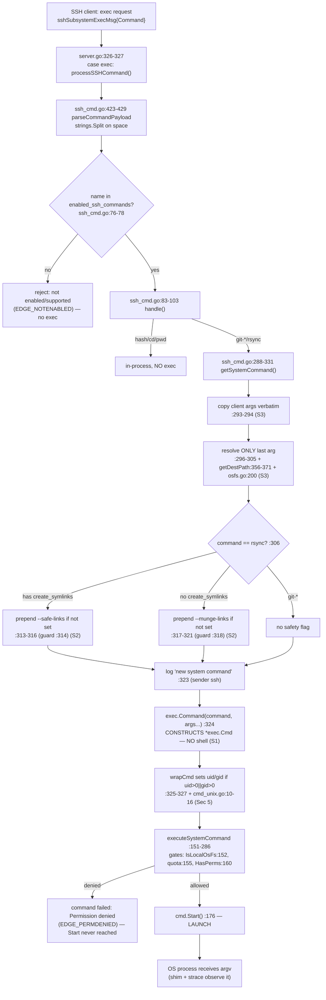

# SFTPGo SSH `exec` System-Command `argv` — Runtime Security Investigation

**Target:** SFTPGo **v0.9.5-dev**, repository checkout at commit `44634210287cb192f2a53147eafb84a33a96826b` ("S3: add support for serving virtual folders").
**Question:** *What exact argument vector (`argv`, including `argv[0]`) does SFTPGo hand to an operating-system process when an SSH client requests an optional "system command" over `exec`?* And, grounded in that evidence, which of three suspicions hold:

- **S1** — the server executes the command "as a shell-like string" (a shell re-parses it);
- **S2** — the rsync "path guardrails and safety flags" are "more of a superficial patch than a real policy";
- **S3** — the "destination that reaches the process might still look a lot like what the client sent."

**Method (evidence-first, canonical entry point only).** Every conclusion below is derived from *captured output of executed code*, not from reading alone. A real SSH client (built on `golang.org/x/crypto/ssh`, the same library the server uses) issues a session `"exec"` request that reaches the canonical dispatch point `processSSHCommand` at `sftpd/server.go:326-327`. The `argv` that crosses the OS-process boundary is captured **three independent ways that must agree**:

1. a **compiled logging shim** placed on `$PATH` under the command's name, which records its own `os.Args` (the literal `argv`, including `argv[0]`) — a faithful syscall-level observation of what `exec.Command(...).Start()` actually launched;
2. SFTPGo's own **structured debug log** line emitted at `sftpd/ssh_cmd.go:323`;
3. **`strace -f -e trace=execve`** on the daemon, i.e. the kernel's view of the `execve(2)` argument array.

A fourth view — a **real `/usr/bin/rsync` 3.4.1** transfer over the same canonical path — corroborates that the `argv` reaches a genuine rsync process and exposes the *actual* downstream effect of the safety flags (Section 3, S2).

Every matrix cell was executed **three times** (three passes); the captured `argv` is byte-identical across passes (Section 2, "argv stability"). All commands and their **complete, unedited** output are reproduced inline next to each claim.

---

## Verdict preview

| # | Suspicion (client's words) | Verdict | One-line basis (observed) |
|---|----------------------------|---------|---------------------------|
| **S1** | executed "as a shell like string" | **FALSE — suspicion is WRONG** | `execve` shows the target binary as `argv[0]`; **zero** `/bin/sh`/`bash` on the path; a `$(…)` token is never expanded (`/tmp/pwned` never created). |
| **S2** | safety flags are "a superficial patch … not a real policy" a client can neutralize | **CONFIRMED — suspicion is RIGHT** | There is **no real argument policy**: one conditional flag gated by a bare exact-string membership test (`:314`/`:318`) that a client can drive into a **contradictory `--safe-links`+`--munge-links` pair** (PROBE 5b), **no option allow-list**, and **all** other client options — including `--rsync-path=/tmp/evil` — reach `argv` **verbatim** (CELL 3/4). (Honest nuance: the flag itself is *not* an inert no-op — a real `/usr/bin/rsync` **does** honor it downstream; but the server-side *policy around it* is the thin, client-influenceable patch the suspicion describes. This is the class of weakness upstream later closed as CVE-2025-24366.) |
| **S3** | destination reaching the process still looks like what the client sent | **CONFIRMED — suspicion is RIGHT** | Only the **last** token is path-resolved (chroot-confined); every other client token — options, metacharacters, non-final path-like tokens — reaches `argv` **byte-for-byte**. |

Full grounding, with complete unedited captures, follows.

---

## Section 1 — Build, configuration & the complete reproducible harness

Everything in this section was run as a normal user would, in SFTPGo's default configuration except for the deviations disclosed explicitly in §1.4 (of which exactly **one** — enabling the system command — is behaviorally required to reach the exec path). **All artifacts live under `/tmp/sftpgo_probe/`, outside the repository checkout**; the repository is left byte-for-byte unchanged (Section 6).

### 1.1 Toolchain (exact, observed — complete output)

```text
$ go version
go version go1.13.15 linux/amd64
$ gcc --version | head -1
gcc (Ubuntu 15.2.0-4ubuntu4) 15.2.0
$ rsync --version | head -1
rsync  version 3.4.1  protocol version 32
$ command -v git-upload-pack; git --version
/usr/bin/git-upload-pack
git version 2.51.0
$ strace --version | head -1
strace -- version 6.16
$ sqlite3 --version
3.46.1 2024-08-13 09:16:08 c9c2ab54ba1f5f46360f1b4f35d849cd3f080e6fc2b6c60e91b16c63f69aalt1 (64-bit)
$ ssh -V
OpenSSH_10.0p2 Ubuntu-5ubuntu5.4, OpenSSL 3.5.3 16 Sep 2025
```

The Go toolchain is the 1.13 series pinned by the project (`go 1.13` in `go.mod:3`; `.travis.yml:7-8` pins `go:` → `- "1.13.x"`). The C compiler is **gcc 15.2.0** (required for the CGO SQLite driver — see §1.3).

### 1.2 Canonical build (default data provider, CGO enabled — complete output)

```text
$ cd <repo>
$ CGO_ENABLED=1 go build -o /tmp/sftpgo_probe/sftpgo .
# github.com/mattn/go-sqlite3
sqlite3-binding.c: In function ‘sqlite3SelectNew’:
sqlite3-binding.c:125801:10: warning: function may return address of local variable [-Wreturn-local-addr]
125801 |   return pNew;
       |          ^~~~
sqlite3-binding.c:125761:10: note: declared here
125761 |   Select standin;
       |          ^~~~~~~
$ echo "build exit=$?"
build exit=0
$ /tmp/sftpgo_probe/sftpgo --version
SFTPGo version: 0.9.5-dev
$ file /tmp/sftpgo_probe/sftpgo
/tmp/sftpgo_probe/sftpgo: ELF 64-bit LSB executable, x86-64, version 1 (SYSV), dynamically linked, interpreter /lib64/ld-linux-x86-64.so.2, BuildID[sha1]=b9872397eb654dafe5f1c9f25266eb3e2c0857a5, for GNU/Linux 3.2.0, not stripped
```

The single C warning (`-Wreturn-local-addr`) originates in the **vendored SQLite amalgamation** inside `github.com/mattn/go-sqlite3` (not SFTPGo code); it is benign and the build succeeds (exit 0). The version string is defined at `utils/version.go:3` (`const version = "0.9.5-dev"`).

### 1.3 CGO clarification (observed — corrects a common misstatement)

The default data provider is SQLite via `github.com/mattn/go-sqlite3 v2.0.2+incompatible`, a **CGO** package. Precisely:

- **The binary compiles even with `CGO_ENABLED=0`** — `CGO_ENABLED=0 go build` exits 0 and produces a runnable binary.
- **But SQLite is non-functional at runtime without CGO.** With `CGO_ENABLED=0`, the `// +build !cgo` tag inside the driver dependency selects `github.com/mattn/go-sqlite3`'s stub file `static_mock.go`, whose `errorMsg` (`static_mock.go:22`) is returned by the stub driver's methods. SFTPGo's own `dataprovider/sqlite.go` `initializeSQLiteProvider()` still opens a (lazy) `*sql.DB` handle without error; the stub error then surfaces when `checkDataprovider()` calls `provider.checkAvailability()` (`dataprovider/dataprovider.go:723-725`, emitted at `LevelWarn` by sender `sqlite`). Driving the no-CGO binary against the SQLite config produces, at runtime, the following **complete** log (the warn line quoted in full):

```text
$ CGO_ENABLED=0 go build -o /tmp/sftpgo_probe/sftpgo_nocgo .
$ echo "build exit=$?"
build exit=0
$ /tmp/sftpgo_probe/sftpgo_nocgo serve -c /tmp/sftpgo_probe/cfg -l ""
{"level":"info","time":"2026-07-14T00:11:20.356","sender":"service","connection_id":"","message":"starting SFTPGo 0.9.5-dev, config dir: /tmp/sftpgo_probe/cfg, config file: sftpgo, log max size: 10 log max backups: 5 log max age: 28 log verbose: true, log compress: false"}
{"level":"debug","time":"2026-07-14T00:11:20.357","sender":"config","connection_id":"","message":"config file used: '/tmp/sftpgo_probe/cfg/sftpgo.json', config loaded: {SFTPD:{Banner:SFTPGo_0.9.5-dev BindPort:2022 BindAddress:127.0.0.1 IdleTimeout:15 MaxAuthTries:0 Umask:0022 UploadMode:0 Actions:{ExecuteOn:[] Command: HTTPNotificationURL:} Keys:[] IsSCPEnabled:false KexAlgorithms:[] Ciphers:[] MACs:[] LoginBannerFile: SetstatMode:0 EnabledSSHCommands:[md5sum sha1sum cd pwd rsync git-upload-pack git-receive-pack git-upload-archive]} ProviderConf:{Driver:sqlite Name:/tmp/sftpgo_probe/sftpgo.db Host: Port:5432 Username: Password:[redacted] SSLMode:0 ConnectionString: UsersTable:users ManageUsers:1 TrackQuota:2 PoolSize:0 UsersBaseDir: Actions:{ExecuteOn:[] Command: HTTPNotificationURL:} ExternalAuthProgram: ExternalAuthScope:0} HTTPDConfig:{BindPort:8080 BindAddress:127.0.0.1 TemplatesPath:/tmp/blitzy/sftpgo/blitzy-18461f06-43ec-4099-b424-599565cc61cc_d2c7df/templates StaticFilesPath:/tmp/blitzy/sftpgo/blitzy-18461f06-43ec-4099-b424-599565cc61cc_d2c7df/static BackupsPath:/tmp/sftpgo_probe/backups}}"}
{"level":"debug","time":"2026-07-14T00:11:20.357","sender":"sqlite","connection_id":"","message":"sqlite database handle created, connection string: \"file:/tmp/sftpgo_probe/sftpgo.db?cache=shared\""}
{"level":"warn","time":"2026-07-14T00:11:20.357","sender":"sqlite","connection_id":"","message":"check availability error: Binary was compiled with 'CGO_ENABLED=0', go-sqlite3 requires cgo to work. This is a stub"}
```

So the correct statement is: **CGO (a C compiler, gcc 15.2.0) is required for a functional default (SQLite) run — not strictly for compilation.** The canonical build in §1.2 uses `CGO_ENABLED=1`.

### 1.4 Configuration — every deviation from the repository sample (complete disclosure)

The generated `/tmp/sftpgo_probe/cfg/sftpgo.json` starts from the repository's sample `sftpgo.json` and changes exactly **six** keys. Only **one** of them — `sftpd.enabled_ssh_commands` — is *behaviorally required* to reach the system-command exec path; the other five are artifact-location, working-directory, and loopback conveniences that do not affect the argv under test. The full comparison (computed field-by-field against the base `sftpgo.json`):

| Setting | Sample `sftpgo.json` (repo, base) | This investigation | Behaviorally required? | Why |
|---|---|---|---|---|
| `sftpd.enabled_ssh_commands` | `["md5sum","sha1sum","cd","pwd"]` | `["md5sum","sha1sum","cd","pwd","rsync","git-upload-pack","git-receive-pack","git-upload-archive"]` | **YES — the only required change** | None of the exec-capable `systemCommands` (`sftpd/sftpd.go:70`) is enabled by default (`defaultSSHCommands` = `{md5sum,sha1sum,cd,pwd}`, `sftpd/sftpd.go:68`); the exec path cannot run without this override. |
| `sftpd.bind_address` | `""` (all interfaces) | `"127.0.0.1"` | no | loopback-only for a local experiment. |
| `data_provider.name` | `"sftpgo.db"` (relative) | `"/tmp/sftpgo_probe/sftpgo.db"` | no | the SQLite DB file is placed under `/tmp` (outside the checkout). |
| `httpd.templates_path` | `"templates"` (relative) | `"<repo>/templates"` (absolute) | no | daemon runs with `cwd=/tmp/sftpgo_probe`, so the management API's template dir is given as an absolute path **into the checkout** (a *read*, nothing is written there). |
| `httpd.static_files_path` | `"static"` (relative) | `"<repo>/static"` (absolute) | no | same reason as `templates_path` (read-only). |
| `httpd.backups_path` | `"backups"` (relative) | `"/tmp/sftpgo_probe/backups"` | no | backup artifact directory placed under `/tmp`. |

**Every other field is identical to the repository sample** (unchanged): `sftpd.bind_port=2022`, `httpd.bind_port=8080`, `httpd.bind_address=127.0.0.1`, `data_provider.driver=sqlite`, `data_provider.track_quota=2`, `data_provider.users_table="users"`, `data_provider.manage_users=1`, `sftpd.idle_timeout=15`, `sftpd.umask="0022"`, `sftpd.enable_scp=false`, and all empty arrays/actions. The **complete** generated file, exactly as written and used for every capture, is:

```json
{
  "sftpd": {
    "bind_port": 2022,
    "bind_address": "127.0.0.1",
    "idle_timeout": 15,
    "max_auth_tries": 0,
    "umask": "0022",
    "banner": "",
    "upload_mode": 0,
    "actions": { "execute_on": [], "command": "", "http_notification_url": "" },
    "keys": [],
    "enable_scp": false,
    "kex_algorithms": [],
    "ciphers": [],
    "macs": [],
    "login_banner_file": "",
    "setstat_mode": 0,
    "enabled_ssh_commands": ["md5sum","sha1sum","cd","pwd","rsync","git-upload-pack","git-receive-pack","git-upload-archive"]
  },
  "data_provider": {
    "driver": "sqlite",
    "name": "/tmp/sftpgo_probe/sftpgo.db",
    "host": "",
    "port": 5432,
    "username": "",
    "password": "",
    "sslmode": 0,
    "connection_string": "",
    "users_table": "users",
    "manage_users": 1,
    "track_quota": 2,
    "pool_size": 0,
    "users_base_dir": "",
    "actions": { "execute_on": [], "command": "", "http_notification_url": "" },
    "external_auth_program": "",
    "external_auth_scope": 0
  },
  "httpd": {
    "bind_port": 8080,
    "bind_address": "127.0.0.1",
    "templates_path": "/tmp/blitzy/sftpgo/blitzy-18461f06-43ec-4099-b424-599565cc61cc_d2c7df/templates",
    "static_files_path": "/tmp/blitzy/sftpgo/blitzy-18461f06-43ec-4099-b424-599565cc61cc_d2c7df/static",
    "backups_path": "/tmp/sftpgo_probe/backups"
  }
}
```

The daemon confirms the one behaviorally-relevant override on load (`daemon.log`, full field shown): `EnabledSSHCommands:[md5sum sha1sum cd pwd rsync git-upload-pack git-receive-pack git-upload-archive]`.

**Data-provider initialization (required in this version).** SQLite is not auto-created; the users table is built by applying the repository migrations in order (complete output):

```text
$ for f in 20190828 20191112 20191230 20200116; do \
      sqlite3 /tmp/sftpgo_probe/sftpgo.db < sql/sqlite/$f.sql && echo "applied sql/sqlite/$f.sql"; done
applied sql/sqlite/20190828.sql
applied sql/sqlite/20191112.sql
applied sql/sqlite/20191230.sql
applied sql/sqlite/20200116.sql
$ sqlite3 /tmp/sftpgo_probe/sftpgo.db '.tables'
users
$ sqlite3 /tmp/sftpgo_probe/sftpgo.db "SELECT COUNT(*) FROM pragma_table_info('users');"
21
$ sqlite3 /tmp/sftpgo_probe/sftpgo.db 'PRAGMA integrity_check;'
ok
```

On first launch the daemon auto-generates its SSH host key (`README.md:126`; `sftpd/server.go:27` `defaultPrivateKeyName = "id_rsa"`, `checkHostKeys` at `sftpd/server.go:417`, `generatePrivateKey` called at `sftpd/server.go:424` and defined at `sftpd/server.go:464`), observed as the **complete** startup sequence:

```text
{"level":"info","time":"2026-07-14T00:15:01.067","sender":"service","connection_id":"","message":"starting SFTPGo 0.9.5-dev, config dir: /tmp/sftpgo_probe/cfg, config file: sftpgo, log max size: 10 log max backups: 5 log max age: 28 log verbose: true, log compress: false"}
{"level":"info","time":"2026-07-14T00:15:01.069","sender":"sftpd","connection_id":"","message":"No host keys configured and \"/tmp/sftpgo_probe/cfg/id_rsa\" does not exist; creating new private key for server"}
{"level":"info","time":"2026-07-14T00:15:02.466","sender":"sftpd","connection_id":"","message":"Loading private key: /tmp/sftpgo_probe/cfg/id_rsa"}
{"level":"info","time":"2026-07-14T00:15:02.467","sender":"sftpd","connection_id":"","message":"server listener registered address: 127.0.0.1:2022"}
```

### 1.5 The complete, reproducible harness

The harness drives the **real** SSH `exec` path and observes the OS-boundary `argv` without editing any SFTPGo source. Three ingredients: a compiled logging **shim** (named `rsync`/`git-upload-pack`, placed first on `$PATH`); a compiled **SSH client driver**; and the daemon run under `strace`.

**(a) argv-capture shim** — `/tmp/sftpgo_probe/src/shim/main.go` (records its own `os.Args`, i.e. the literal `argv`, to `$SHIM_LOG`). A *compiled* binary (not a shell script) is used so `argv[0]` is reported faithfully. It records a **complete 12-field record**; every field appears verbatim in each cell of Section 2 (nothing is elided):

```go
// argv-capture shim. Placed earlier on $PATH under the command NAME, it is the
// process exec.Command(...).Start() actually launches; it records the EXACT argv.
package main

import ( "encoding/json"; "io"; "io/ioutil"; "os"; "time" )

type record struct {
	TS    string   `json:"ts"`
	Exe   string   `json:"exe"`   // resolved path PATH selected
	Argv0 string   `json:"argv0"` // os.Args[0] exactly as exec.Command set it
	Argv  []string `json:"argv"`  // full argument vector, verbatim
	Argc  int      `json:"argc"`
	Cwd   string   `json:"cwd"`
	UID   int      `json:"uid"`;  EUID int `json:"euid"`
	GID   int      `json:"gid"`;  EGID int `json:"egid"`
	PPID  int      `json:"ppid"`
	Tag   string   `json:"tag"`
}

func main() {
	go func() { _, _ = io.Copy(ioutil.Discard, os.Stdin) }() // drain stdin (Go 1.13: ioutil.Discard)
	exe, _ := os.Executable(); cwd, _ := os.Getwd()
	argv0 := ""; if len(os.Args) > 0 { argv0 = os.Args[0] }
	r := record{ TS: time.Now().UTC().Format(time.RFC3339Nano), Exe: exe, Argv0: argv0,
		Argv: os.Args, Argc: len(os.Args), Cwd: cwd,
		UID: os.Getuid(), EUID: os.Geteuid(), GID: os.Getgid(), EGID: os.Getegid(),
		PPID: os.Getppid(), Tag: os.Getenv("SHIM_TAG") }
	b, _ := json.Marshal(r); b = append(b, '\n')
	f, _ := os.OpenFile(os.Getenv("SHIM_LOG"), os.O_APPEND|os.O_CREATE|os.O_WRONLY, 0644)
	defer f.Close(); _, _ = f.Write(b); os.Exit(0)
}
```

```text
# Build the shim (no CGO needed) and install under both command names, first on PATH:
$ CGO_ENABLED=0 go build -o /tmp/sftpgo_probe/shimbin/rsync /tmp/sftpgo_probe/src/shim/main.go
$ cp /tmp/sftpgo_probe/shimbin/rsync /tmp/sftpgo_probe/shimbin/git-upload-pack
```

> **Note on JSON rendering of metacharacters.** Go's `encoding/json.Marshal` HTML-escapes three bytes inside string values: `>`→`\u003e`, `<`→`\u003c`, `&`→`\u0026`. So the shim's raw JSON shows e.g. `--exclude=$(id\u003e/tmp/pwned)` (CELL 3) and `--exclude=a;b|c\u0026d$(e)` (CELL 4). The **kernel `execve` (strace)** and the **daemon debug line** print the *literal* bytes (`>`, `&`). Both decode to the identical byte sequence; the shim JSON below is quoted **exactly as written** (escapes included), with the literal form visible in the adjacent `[strace]`/`[daemon]` lines.

**(b) SSH client driver** — `/tmp/sftpgo_probe/src/client/main.go` (issues one `exec` request with an exact raw command string via `golang.org/x/crypto/ssh` — the same library the server uses):

```go
package main

import ( "flag"; "fmt"; "os"; "time"; "golang.org/x/crypto/ssh" )

func main() {
	addr := flag.String("addr", "127.0.0.1:2022", "")
	user := flag.String("user", "", ""); pass := flag.String("pass", "", "")
	cmd  := flag.String("cmd",  "", "raw exec payload, sent verbatim")
	flag.Parse()
	cfg := &ssh.ClientConfig{ User: *user, Auth: []ssh.AuthMethod{ssh.Password(*pass)},
		HostKeyCallback: ssh.InsecureIgnoreHostKey(), Timeout: 10 * time.Second }
	client, err := ssh.Dial("tcp", *addr, cfg)
	if err != nil { fmt.Fprintf(os.Stderr, "dial/auth: %v\n", err); os.Exit(2) }
	defer client.Close()
	sess, err := client.NewSession()
	if err != nil { fmt.Fprintf(os.Stderr, "session: %v\n", err); os.Exit(3) }
	defer sess.Close()
	fmt.Printf("CLIENT sending exec payload: %q\n", *cmd)
	out, runErr := sess.CombinedOutput(*cmd)          // <-- issues the "exec" request
	fmt.Printf("CLIENT output: %q; result: %v\n", string(out), runErr)
}
```

```text
# Build with the module cache only (Go 1.13 has no -mod=mod); x/crypto is already in go.sum:
$ cd <repo> && GOPROXY=off GOSUMDB=off CGO_ENABLED=0 \
      go build -o /tmp/sftpgo_probe/ssh_client /tmp/sftpgo_probe/src/client/main.go
```

**(c) Provision the two permission contexts (+ one auxiliary).** In this version the HTTP management API's user routes are mounted with **no auth middleware** (`httpd/router.go` wires only `RequestID`, `RealIP`, `StructuredLogger`, `Recoverer`; `router.Post(userPath, addUser)`; `addUser` at `httpd/api_user.go`), so users are created with an unauthenticated POST — itself a notable default, but orthogonal to the exec argv. The three POSTs and their **complete** API responses (each `HTTP 200`):

```text
# usera  -> HAS create_symlinks               => --safe-links branch (CELL 1/3, PROBEs)
$ curl -s -w '\nHTTP %{http_code}\n' -XPOST http://127.0.0.1:8080/api/v1/user -H 'Content-Type: application/json' -d @- <<JSON
{"username":"usera","password":"pw","home_dir":"/tmp/sftpgo_probe/homes/usera","status":1,
 "permissions":{"/":["download","upload","create_dirs","list","overwrite","delete","rename","create_symlinks"]}}
JSON
{"id":1,"status":1,"username":"usera","expiration_date":0,"home_dir":"/tmp/sftpgo_probe/homes/usera","uid":0,"gid":0,"max_sessions":0,"quota_size":0,"quota_files":0,"permissions":{"/":["download","upload","create_dirs","list","overwrite","delete","rename","create_symlinks"]},"used_quota_size":0,"used_quota_files":0,"last_quota_update":0,"upload_bandwidth":0,"download_bandwidth":0,"last_login":0,"filters":{"allowed_ip":[],"denied_ip":[]},"filesystem":{"provider":0,"s3config":{}}}
HTTP 200

# userb  -> WITHOUT create_symlinks (keeps the 7 perms executeSystemCommand requires) => --munge-links branch (CELL 2/4)
$ curl -s -w '\nHTTP %{http_code}\n' -XPOST http://127.0.0.1:8080/api/v1/user -H 'Content-Type: application/json' -d @- <<JSON
{"username":"userb","password":"pw","home_dir":"/tmp/sftpgo_probe/homes/userb","status":1,
 "permissions":{"/":["download","upload","create_dirs","list","overwrite","delete","rename"]}}
JSON
{"id":2,"status":1,"username":"userb","expiration_date":0,"home_dir":"/tmp/sftpgo_probe/homes/userb","uid":0,"gid":0,"max_sessions":0,"quota_size":0,"quota_files":0,"permissions":{"/":["download","upload","create_dirs","list","overwrite","delete","rename"]},"used_quota_size":0,"used_quota_files":0,"last_quota_update":0,"upload_bandwidth":0,"download_bandwidth":0,"last_login":0,"filters":{"allowed_ip":[],"denied_ip":[]},"filesystem":{"provider":0,"s3config":{}}}
HTTP 200

# userc  -> like userb but MISSING "delete" => exercises the permission-denied gate (EDGE_PERMDENIED)
$ curl -s -w '\nHTTP %{http_code}\n' -XPOST http://127.0.0.1:8080/api/v1/user -H 'Content-Type: application/json' -d @- <<JSON
{"username":"userc","password":"pw","home_dir":"/tmp/sftpgo_probe/homes/userc","status":1,
 "permissions":{"/":["download","upload","create_dirs","list","overwrite","rename"]}}
JSON
{"id":3,"status":1,"username":"userc","expiration_date":0,"home_dir":"/tmp/sftpgo_probe/homes/userc","uid":0,"gid":0,"max_sessions":0,"quota_size":0,"quota_files":0,"permissions":{"/":["download","upload","create_dirs","list","overwrite","rename"]},"used_quota_size":0,"used_quota_files":0,"last_quota_update":0,"upload_bandwidth":0,"download_bandwidth":0,"last_login":0,"filters":{"allowed_ip":[],"denied_ip":[]},"filesystem":{"provider":0,"s3config":{}}}
HTTP 200
```

All three users keep the default record `uid:0,gid:0` (unmapped) — confirmed directly in SQLite (complete output):

```text
$ sqlite3 /tmp/sftpgo_probe/sftpgo.db 'SELECT username,uid,gid FROM users ORDER BY username;'
usera|0|0
userb|0|0
userc|0|0
$ sqlite3 /tmp/sftpgo_probe/sftpgo.db 'SELECT username,permissions FROM users ORDER BY username;'
usera|{"/":["download","upload","create_dirs","list","overwrite","delete","rename","create_symlinks"]}
userb|{"/":["download","upload","create_dirs","list","overwrite","delete","rename"]}
userc|{"/":["download","upload","create_dirs","list","overwrite","rename"]}
$ sqlite3 /tmp/sftpgo_probe/sftpgo.db 'SELECT username,filesystem FROM users ORDER BY username;'
usera|{"provider":0,"s3config":{}}
userb|{"provider":0,"s3config":{}}
userc|{"provider":0,"s3config":{}}
```

The **only** difference between usera and userb is the `create_symlinks` permission — exactly what flips `--safe-links` vs `--munge-links`. `provider:0` is the **local** filesystem, satisfying the `IsLocalOsFs` gate (`sftpd/ssh_cmd.go:152`). The mapped positive-uid credential branch of `wrapCmd` is deliberately **not** exercised at runtime (running a mapped uid/gid is out of scope); it is code-derived (**INFERRED**) in Section 5.

`create_symlinks` is `PermCreateSymlinks` (`dataprovider/user.go:36`); the flag branch is selected by `User.HasPerm(PermCreateSymlinks, …)` at `sftpd/ssh_cmd.go:313`. `executeSystemCommand` additionally requires `{download,upload,create_dirs,list,overwrite,delete,rename}` on the path (`sftpd/ssh_cmd.go:158-162`).

**(d) Launch the daemon under strace, shim first on PATH:**

```text
$ export PATH=/tmp/sftpgo_probe/shimbin:$PATH
$ export SHIM_LOG=/tmp/sftpgo_probe/logs/shim.log
$ export SHIM_TAG=MATRIX   # coarse run-label; the shim (the daemon's child) inherits it
$ strace -f -e trace=execve -s 400 -o /tmp/sftpgo_probe/logs/strace.log \
      /tmp/sftpgo_probe/sftpgo serve -c /tmp/sftpgo_probe/cfg \
      -l /tmp/sftpgo_probe/logs/daemon.log -v &          # daemon sftpgo pid = 228019
# readiness (proves CGO=1 SQLite is live): 200 + "Alive"
$ curl -s http://127.0.0.1:8080/api/v1/version
{"version":"0.9.5-dev","build_date":"","commit_hash":""}
$ curl -s http://127.0.0.1:8080/api/v1/providerstatus
{"error":"","message":"Alive","status":200}
```

**(e) Drive one matrix cell** (the raw command string is sent verbatim; SFTPGo's `parseCommandPayload` splits on spaces at `sftpd/ssh_cmd.go:424`, so each token is exact):

```text
$ /tmp/sftpgo_probe/ssh_client -addr 127.0.0.1:2022 -user usera -pass pw \
      -cmd 'rsync --server -vlogDtprze.iLsfxC . data'
CLIENT sending exec payload: "rsync --server -vlogDtprze.iLsfxC . data"
CLIENT output: ""; result: <nil>
```

Each cell's captured record is bound to its invocation by order in `$SHIM_LOG`: the shim is the daemon's child and inherits the *daemon's* fixed environment, so `SHIM_TAG` (set once on the daemon at launch) is a coarse run-label only — it is `"MATRIX"` for every record in this run. Every cell was run in **three passes** for stability (Section 2).

**(f) Stop & clean up.** The daemon is stopped by the exact PID captured at launch (never a broad `pkill`); all artifacts live under `/tmp/sftpgo_probe/` and are removed at the end (Section 6 shows the repo is unchanged and lists the exact cleanup commands).

---

## Section 2 — The 2×2 argv evidence matrix (core proof)

The matrix crosses **normal vs. adversarial** invocation with **`--safe-links` vs. `--munge-links`** permission context (User A = has `create_symlinks`; User B = does not). For every cell, three independent views are shown and **agree**: **[daemon raw]** the client tokens as received; **[daemon built]** SFTPGo's final-`argv` line at `sftpd/ssh_cmd.go:323` (sender `"ssh"`); **[shim]** the child's own **complete 12-field** `os.Args` record; **[strace]** the kernel `execve(2)`. Nothing is elided — the whole shim record (including `ts`, `ppid`, `tag`) is reproduced verbatim; the digest is computed over only the four **stable** fields `{argv,exe,uid,gid}` (the volatile `ts`/`ppid`/`tag` and the `execve` env-pointer are excluded — see "argv stability").

All records below are from the single daemon run with `ppid=228019`; each child `execve` shares the Go-runtime env pointer `0xc000202000 /* 84 vars */`.

### CELL 1 — NORMAL × User A (`create_symlinks` ⇒ `--safe-links`)

Client sends: `rsync --server -vlogDtprze.iLsfxC . data`

```text
[client]       CLIENT sending exec payload: "rsync --server -vlogDtprze.iLsfxC . data"
               CLIENT output: ""; result: <nil>
[daemon raw ]  new ssh command: "rsync" args: [--server -vlogDtprze.iLsfxC . data] user: usera, error: <nil>
[daemon built] {"level":"debug","sender":"ssh","message":"new system command \"rsync\", with args: [--safe-links --server -vlogDtprze.iLsfxC . /tmp/sftpgo_probe/homes/usera/data] path: /tmp/sftpgo_probe/homes/usera/data"}
[shim ]        {"ts":"2026-07-14T00:15:20.569498462Z","exe":"/tmp/sftpgo_probe/shimbin/rsync","argv0":"rsync","argv":["rsync","--safe-links","--server","-vlogDtprze.iLsfxC",".","/tmp/sftpgo_probe/homes/usera/data"],"argc":6,"cwd":"/tmp/sftpgo_probe","uid":0,"euid":0,"gid":0,"egid":0,"ppid":228019,"tag":"MATRIX"}
[strace]       228315 execve("/tmp/sftpgo_probe/shimbin/rsync", ["rsync", "--safe-links", "--server", "-vlogDtprze.iLsfxC", ".", "/tmp/sftpgo_probe/homes/usera/data"], 0xc000202000 /* 84 vars */) = 0
```

**Observed:** the server **prepended `--safe-links`** (User A has `create_symlinks`), copied the client options verbatim, and replaced only the final token `data` with the chroot-resolved absolute path `/tmp/sftpgo_probe/homes/usera/data`. `argv[0]` is the target binary `rsync` — **not a shell.** `argc:6 == len(argv)`. The three volatile fields (`ts`, `ppid=228019`, `tag=MATRIX`) are shown but excluded from the digest. sha256(`{argv,exe,gid,uid}`)=`94451e43…`.

### CELL 2 — NORMAL × User B (no `create_symlinks` ⇒ `--munge-links`)

Client sends: `rsync --server -vlogDtprze.iLsfxC . data`

```text
[daemon raw ]  new ssh command: "rsync" args: [--server -vlogDtprze.iLsfxC . data] user: userb, error: <nil>
[daemon built] {"level":"debug","sender":"ssh","message":"new system command \"rsync\", with args: [--munge-links --server -vlogDtprze.iLsfxC . /tmp/sftpgo_probe/homes/userb/data] path: /tmp/sftpgo_probe/homes/userb/data"}
[shim ]        {"ts":"2026-07-14T00:15:20.744965331Z","exe":"/tmp/sftpgo_probe/shimbin/rsync","argv0":"rsync","argv":["rsync","--munge-links","--server","-vlogDtprze.iLsfxC",".","/tmp/sftpgo_probe/homes/userb/data"],"argc":6,"cwd":"/tmp/sftpgo_probe","uid":0,"euid":0,"gid":0,"egid":0,"ppid":228019,"tag":"MATRIX"}
[strace]       228336 execve("/tmp/sftpgo_probe/shimbin/rsync", ["rsync", "--munge-links", "--server", "-vlogDtprze.iLsfxC", ".", "/tmp/sftpgo_probe/homes/userb/data"], 0xc000202000 /* 84 vars */) = 0
```

**Observed:** identical mechanics to CELL 1 but the server prepended **`--munge-links`** instead — the *only* difference is the one client permission. sha256=`60a72d01…`.

### CELL 3 — ADVERSARIAL × User A (crafted to confuse path/option handling)

Client sends: `rsync --server --sender --safe-links -e.iLsfxC --exclude=$(id>/tmp/pwned) --dest=../../etc/shadow ../../../../../../etc/passwd`

```text
[daemon raw ]  new ssh command: "rsync" args: [--server --sender --safe-links -e.iLsfxC --exclude=$(id>/tmp/pwned) --dest=../../etc/shadow ../../../../../../etc/passwd] user: usera, error: <nil>
[daemon built] {"level":"debug","sender":"ssh","message":"new system command \"rsync\", with args: [--server --sender --safe-links -e.iLsfxC --exclude=$(id>/tmp/pwned) --dest=../../etc/shadow /tmp/sftpgo_probe/homes/usera/etc/passwd] path: /tmp/sftpgo_probe/homes/usera/etc/passwd"}
[shim ]        {"ts":"2026-07-14T00:15:20.896797008Z","exe":"/tmp/sftpgo_probe/shimbin/rsync","argv0":"rsync","argv":["rsync","--server","--sender","--safe-links","-e.iLsfxC","--exclude=$(id\u003e/tmp/pwned)","--dest=../../etc/shadow","/tmp/sftpgo_probe/homes/usera/etc/passwd"],"argc":8,"cwd":"/tmp/sftpgo_probe","uid":0,"euid":0,"gid":0,"egid":0,"ppid":228019,"tag":"MATRIX"}
[strace]       228356 execve("/tmp/sftpgo_probe/shimbin/rsync", ["rsync", "--server", "--sender", "--safe-links", "-e.iLsfxC", "--exclude=$(id>/tmp/pwned)", "--dest=../../etc/shadow", "/tmp/sftpgo_probe/homes/usera/etc/passwd"], 0xc000202000 /* 84 vars */) = 0
```

(The shim's `--exclude=$(id\u003e/tmp/pwned)` and the strace's `--exclude=$(id>/tmp/pwned)` are the identical byte sequence — the `\u003e` is `json.Marshal`'s HTML-escape of `>`; see §1.5 note.)

**Observed (four distinct confusions, all as suspected):**
1. **Duplicate-flag guard fires:** the client pre-supplied `--safe-links`, so the server did **not** add a second one (the "if not already set" check at `sftpd/ssh_cmd.go:314`). It is a plain exact-string membership test, not a policy.
2. **Shell metacharacters pass verbatim:** `--exclude=$(id>/tmp/pwned)` reaches `argv` **byte-for-byte** — no expansion (see the S1 negative proof below; `/tmp/pwned` is never created).
3. **An option-looking destination passes verbatim:** `--dest=../../etc/shadow` is a *non-final* token, so it is **not** path-resolved and reaches rsync exactly as sent.
4. **Only the last token is chroot-confined:** `../../../../../../etc/passwd` → `getDestPath` cleans it to `/etc/passwd` then `ResolvePath` confines it inside the home → `/tmp/sftpgo_probe/homes/usera/etc/passwd`. The traversal is contained, but every other token survives. sha256=`fce0d2c2…`.

### CELL 4 — ADVERSARIAL × User B

Client sends: `rsync --server --munge-links -e.iLsfxC --rsync-path=/tmp/evil --exclude=a;b|c&d$(e) ../../../../../../etc/shadow`

```text
[daemon raw ]  new ssh command: "rsync" args: [--server --munge-links -e.iLsfxC --rsync-path=/tmp/evil --exclude=a;b|c&d$(e) ../../../../../../etc/shadow] user: userb, error: <nil>
[daemon built] {"level":"debug","sender":"ssh","message":"new system command \"rsync\", with args: [--server --munge-links -e.iLsfxC --rsync-path=/tmp/evil --exclude=a;b|c&d$(e) /tmp/sftpgo_probe/homes/userb/etc/shadow] path: /tmp/sftpgo_probe/homes/userb/etc/shadow"}
[shim ]        {"ts":"2026-07-14T00:15:21.03582197Z","exe":"/tmp/sftpgo_probe/shimbin/rsync","argv0":"rsync","argv":["rsync","--server","--munge-links","-e.iLsfxC","--rsync-path=/tmp/evil","--exclude=a;b|c\u0026d$(e)","/tmp/sftpgo_probe/homes/userb/etc/shadow"],"argc":7,"cwd":"/tmp/sftpgo_probe","uid":0,"euid":0,"gid":0,"egid":0,"ppid":228019,"tag":"MATRIX"}
[strace]       228377 execve("/tmp/sftpgo_probe/shimbin/rsync", ["rsync", "--server", "--munge-links", "-e.iLsfxC", "--rsync-path=/tmp/evil", "--exclude=a;b|c&d$(e)", "/tmp/sftpgo_probe/homes/userb/etc/shadow"], 0xc000202000 /* 84 vars */) = 0
```

**Observed:** the client pre-supplied `--munge-links` (guard suppresses the duplicate). The **`--rsync-path=/tmp/evil` reaches `argv` verbatim** — this version has **no rsync option allow-list**, so an option that (in a normal client→server rsync) selects the remote rsync binary is passed straight through with nothing constraining it. Metacharacters `a;b|c&d$(e)` survive verbatim (again, no shell). `argc:7 == len(argv)`. sha256=`1ea389d0…`.

### Matrix at a glance

| Cell | Invocation | Ctx (perm) | Flag the server added | Client tokens surviving verbatim | Last token resolved to |
|------|-----------|------------|-----------------------|----------------------------------|------------------------|
| 1 | normal | A (`create_symlinks`) | `--safe-links` (prepended) | all options | `…/usera/data` |
| 2 | normal | B (none) | `--munge-links` (prepended) | all options | `…/userb/data` |
| 3 | adversarial | A | none (client already sent `--safe-links`) | `--sender`, `-e.iLsfxC`, `--exclude=$(id>/tmp/pwned)`, `--dest=../../etc/shadow` | `…/usera/etc/passwd` |
| 4 | adversarial | B | none (client already sent `--munge-links`) | `-e.iLsfxC`, `--rsync-path=/tmp/evil`, `--exclude=a;b|c&d$(e)` | `…/userb/etc/shadow` |

### Supplementary probes (complete records)

**PROBE 5a — duplicate suppression (User A sends `--safe-links`):** `rsync --safe-links --server . data`
```text
[daemon raw ]  new ssh command: "rsync" args: [--safe-links --server . data] user: usera, error: <nil>
[shim ]        {"ts":"2026-07-14T00:15:22.282628901Z","exe":"/tmp/sftpgo_probe/shimbin/rsync","argv0":"rsync","argv":["rsync","--safe-links","--server",".","/tmp/sftpgo_probe/homes/usera/data"],"argc":5,"cwd":"/tmp/sftpgo_probe","uid":0,"euid":0,"gid":0,"egid":0,"ppid":228019,"tag":"MATRIX"}
[strace]       228560 execve("/tmp/sftpgo_probe/shimbin/rsync", ["rsync", "--safe-links", "--server", ".", "/tmp/sftpgo_probe/homes/usera/data"], 0xc000202000 /* 84 vars */) = 0
```
`--safe-links` appears **exactly once** — the guard at `:314` suppressed the server's duplicate. sha256=`14891ff9…`.

**PROBE 5b — contradictory flags (User A sends `--munge-links`):** `rsync --munge-links --server . data`
```text
[daemon raw ]  new ssh command: "rsync" args: [--munge-links --server . data] user: usera, error: <nil>
[shim ]        {"ts":"2026-07-14T00:15:22.404224019Z","exe":"/tmp/sftpgo_probe/shimbin/rsync","argv0":"rsync","argv":["rsync","--safe-links","--munge-links","--server",".","/tmp/sftpgo_probe/homes/usera/data"],"argc":6,"cwd":"/tmp/sftpgo_probe","uid":0,"euid":0,"gid":0,"egid":0,"ppid":228019,"tag":"MATRIX"}
[strace]       228580 execve("/tmp/sftpgo_probe/shimbin/rsync", ["rsync", "--safe-links", "--munge-links", "--server", ".", "/tmp/sftpgo_probe/homes/usera/data"], 0xc000202000 /* 84 vars */) = 0
```
The server still prepends `--safe-links` (User A qualifies) because its guard only tests `IsStringInSlice("--safe-links", args)` (`:314`) and **never checks for the conflicting `--munge-links`**, so **both `--safe-links` and `--munge-links` coexist** in one argv — the exact contradictory-flag state a client can force. Resolution of that conflict is left entirely to rsync. sha256=`5c805215…`. *(This probe is the backbone of the S2 verdict: it shows the "policy" is a naive membership test with no reconciliation.)*

**PROBE 6 — git-upload-pack gets no safety flag:** `git-upload-pack repo.git`
```text
[daemon raw ]  new ssh command: "git-upload-pack" args: [repo.git] user: usera, error: <nil>
[daemon built] {"level":"debug","sender":"ssh","message":"new system command \"git-upload-pack\", with args: [/tmp/sftpgo_probe/homes/usera/repo.git] path: /tmp/sftpgo_probe/homes/usera/repo.git"}
[shim ]        {"ts":"2026-07-14T00:15:22.533511742Z","exe":"/tmp/sftpgo_probe/shimbin/git-upload-pack","argv0":"git-upload-pack","argv":["git-upload-pack","/tmp/sftpgo_probe/homes/usera/repo.git"],"argc":2,"cwd":"/tmp/sftpgo_probe","uid":0,"euid":0,"gid":0,"egid":0,"ppid":228019,"tag":"MATRIX"}
[strace]       228600 execve("/tmp/sftpgo_probe/shimbin/git-upload-pack", ["git-upload-pack", "/tmp/sftpgo_probe/homes/usera/repo.git"], 0xc000202000 /* 84 vars */) = 0
```
The `--safe-links`/`--munge-links` block is guarded by `if c.command == "rsync"` (`sftpd/ssh_cmd.go:306`), so **only rsync** receives a safety flag; `git-*` commands do not. `argv[0]`=`git-upload-pack`, exe=shim. sha256=`081bf26d…`.

**PROBE 7 — quote-trimming of the final token (`getDestPath`):** `git-upload-pack 'repo.git'` (last token wrapped in single quotes)
```text
[daemon raw ]  new ssh command: "git-upload-pack" args: ['repo.git'] user: usera, error: <nil>
[daemon built] {"level":"debug","sender":"ssh","message":"new system command \"git-upload-pack\", with args: [/tmp/sftpgo_probe/homes/usera/repo.git] path: /tmp/sftpgo_probe/homes/usera/repo.git"}
[shim ]        {"ts":"2026-07-14T00:15:22.709281878Z","exe":"/tmp/sftpgo_probe/shimbin/git-upload-pack","argv0":"git-upload-pack","argv":["git-upload-pack","/tmp/sftpgo_probe/homes/usera/repo.git"],"argc":2,"cwd":"/tmp/sftpgo_probe","uid":0,"euid":0,"gid":0,"egid":0,"ppid":228019,"tag":"MATRIX"}
```
The client sent the final token **with** surrounding single quotes (`'repo.git'`, visible verbatim in the `[daemon raw]` line), yet the built `argv` contains the **unquoted, home-resolved** `/tmp/sftpgo_probe/homes/usera/repo.git`. This is `getDestPath` at `sftpd/ssh_cmd.go:360-361` — it applies `strings.Trim(..., "'")` then `strings.Trim(..., "\"")` to the **last** token before `ResolvePath` confines it. The result is **byte-identical** to the unquoted PROBE 6 (same digest `081bf26d…`), which proves the quote-trim: quoting the destination changes nothing that reaches the process. (The trim is applied to the *final* token only; a quoted *non-final* token — as in CELL 3/4 — is copied verbatim, quotes and all.) sha256=`081bf26d…` (identical to PROBE 6, by design).

### Third view at scale + the NEGATIVE no-shell proof (strace)

Across the 3 passes + probes + edges the daemon issued **19 `execve` calls total = 1× the `sftpgo` daemon itself + 15× the rsync shim + 3× the git-upload-pack shim** (the two non-launching edges add none). The counts and representative lines (note the target binary is always `argv[0]`, never a shell):

```text
$ grep -c 'execve(' /tmp/sftpgo_probe/logs/strace.log
19
$ grep -c 'execve("/tmp/sftpgo_probe/shimbin/rsync"' /tmp/sftpgo_probe/logs/strace.log
15
$ grep -c 'execve("/tmp/sftpgo_probe/shimbin/git-upload-pack"' /tmp/sftpgo_probe/logs/strace.log
3
228019 execve("/tmp/sftpgo_probe/sftpgo", ["/tmp/sftpgo_probe/sftpgo", "serve", "-c", "/tmp/sftpgo_probe/cfg", "-l", "/tmp/sftpgo_probe/logs/daemon.log", "-v"], 0x7fff8d4aa6f8 /* 84 vars */) = 0
228315 execve("/tmp/sftpgo_probe/shimbin/rsync", ["rsync", "--safe-links", "--server", "-vlogDtprze.iLsfxC", ".", "/tmp/sftpgo_probe/homes/usera/data"], 0xc000202000 /* 84 vars */) = 0
228356 execve("/tmp/sftpgo_probe/shimbin/rsync", ["rsync", "--server", "--sender", "--safe-links", "-e.iLsfxC", "--exclude=$(id>/tmp/pwned)", "--dest=../../etc/shadow", "/tmp/sftpgo_probe/homes/usera/etc/passwd"], 0xc000202000 /* 84 vars */) = 0
228641 execve("/tmp/sftpgo_probe/shimbin/git-upload-pack", ["git-upload-pack"], 0xc000202000 /* 84 vars */) = 0
```

**NEGATIVE proof (S1).** Grepping the entire matrix strace for any shell `execve` returns nothing:

```text
$ grep -E 'execve\("([^"]*/)?(sh|bash|dash|zsh)"' /tmp/sftpgo_probe/logs/strace.log | wc -l
0
```

The only `-c` anywhere in the trace is the daemon's own `serve -c <configdir>` flag — **there is no `sh -c`**. SFTPGo never launches a shell to run the command.

### argv stability & the exact hash recipe (Finding: magnitude/stability)

Each of the four **matrix cells** was executed **three times**, and its sha256 over the record's four **stable** fields `{argv, uid, gid, exe}` is **identical across those three passes**. The supplementary probes and launching edge cases were each captured **once** in this same 18-launch run (see the `execve` accounting above); their hashed fields are equally invariant because they are fully determined by `getSystemCommand` — the `argv` it builds plus the fixed `exe`/`uid`/`gid` — with no run-to-run source of variation. The two non-launching edge cases produce zero OS processes (expected).

**Exact hash recipe (so any reviewer can reproduce a cell's digest byte-for-byte).** Each digest is the SHA-256 of a canonical JSON object built from exactly those four fields — keys sorted, Python's `json.dumps` **default** separators (`", "` and `": "`), UTF-8 encoded:

```python
import json, hashlib
sha256 = lambda rec: hashlib.sha256(json.dumps(
    {"argv": rec["argv"], "exe": rec["exe"], "gid": rec["gid"], "uid": rec["uid"]},
    sort_keys=True).encode()).hexdigest()
```

For example, the CELL 1 canonical body is
`{"argv": ["rsync", "--safe-links", "--server", "-vlogDtprze.iLsfxC", ".", "/tmp/sftpgo_probe/homes/usera/data"], "exe": "/tmp/sftpgo_probe/shimbin/rsync", "gid": 0, "uid": 0}`,
which hashes to `94451e430e…`. The volatile fields (`ts`, `ppid`, `tag`, and the `execve` environment-array pointer) are intentionally **not** part of the hashed object (see the nondeterminism note below), which is exactly why the digests reproduce across independent daemon runs. Full manifest (each of the four cells' digest is byte-identical across its three passes; the probe/edge digests are the single capture from this 18-launch run, invariant by construction):

| Case | sha256 | Stable |
|------|-----------------------|--------|
| CELL1 | `94451e430e404ad247b8ea0d1c77f89c7d5fa11311e28d9690912e1d9dc0fe65` | YES ✓ |
| CELL2 | `60a72d0125562ff6f5196a820b2db31d24848e821ec932188c808def758feccf` | YES ✓ |
| CELL3 | `fce0d2c2d6c93ca45000d34a017bee2cafe2cda76297b779bf08c4d54ac7985b` | YES ✓ |
| CELL4 | `1ea389d02269e6ee766bfeac45723a29e9d193c1f816702d4fb9df71a5588553` | YES ✓ |
| PROBE5a | `14891ff983309896f5738dbe47c10ea494028dbcf9aa6ff5cf1a33152c84f75a` | YES ✓ |
| PROBE5b | `5c80521548118c7a9e24189549a5f61eb04898e981ec34736c12c6fe8ba4ee28` | YES ✓ |
| PROBE6 | `081bf26d300baea14e5419d72c6b1cdce6b3c0132e9c47a6071c344c96747081` | YES ✓ |
| PROBE7_GITQUOTE | `081bf26d300baea14e5419d72c6b1cdce6b3c0132e9c47a6071c344c96747081` (= PROBE6) | YES ✓ |
| EDGE_EMPTY | `e3a869dc147bc5e5659fd822ca329d37990f43bc0f7869297117e929db29c202` | YES ✓ |
| EDGE_EMPTY_RSYNC | `e69e5c4528d885b0dca63f82aaaf3b433cf4e782a2056a3d4af3e097e9ea6685` | YES ✓ |
| EDGE_NOTENABLED | (no OS process) | N/A — expected |
| EDGE_PERMDENIED | (no OS process) | N/A — expected |

The `argv` (and `exe`/`uid`/`gid`) is fully deterministic: there is no run-to-run variation in the hashed fields.

**Nondeterminism note (what is *not* stable, and why it is excluded from the hash).** Three fields the shim/`strace` also record **do** vary run-to-run and are deliberately omitted from the digest: (1) `ts` — a wall-clock instant; (2) `ppid` — the daemon's PID; and (3) the `execve(2)` **environment-array pointer** + var count (`0xc0… /* N vars */`), Go-runtime/environment artifacts. Concretely, in this run:

- `ts` differs on every pass — CELL 1's three passes were `…20.569498462Z`, `…21.167499549Z`, `…21.779174801Z` — while their `{argv,exe,uid,gid}` hash is byte-identical (`94451e43…`).
- `ppid` was `228019` for **all 18** launches of this daemon run (`grep -oE '"ppid":[0-9]+' matrix | sort | uniq -c` → `18 "ppid":228019`); an *earlier* daemon instance in this investigation showed a different `ppid` (`225634`), and the separate real-`rsync` daemon (Section 3) showed yet another (`232586`) — proving `ppid` tracks the OS-assigned daemon PID, never the client input.
- the `execve` env pointer/count is `0xc000202000 /* 84 vars */` for every child of this run (the daemon's *own* top-level `execve` shows a *stack* pointer `0x7fff8d4aa6f8 /* 84 vars */`); the separate real-`rsync` run showed `/* 82 vars */`. The count is environment-dependent and **never** touches the client-controlled `argv`.

None of these volatile values touches the client-controlled `argv`, which is why the security-relevant conclusions (S1/S2/S3) and every cell digest are stable regardless.

### Error / edge branches (not just the happy path)

**EDGE_EMPTY (argc 1) — single-token `git-*` (empty args branch):** `git-upload-pack`
```text
[daemon raw ]  new ssh command: "git-upload-pack" args: [] user: usera, error: <nil>
[daemon built] {"level":"debug","sender":"ssh","message":"new system command \"git-upload-pack\", with args: [] path: "}
[shim ]        {"ts":"2026-07-14T00:15:22.843602425Z","exe":"/tmp/sftpgo_probe/shimbin/git-upload-pack","argv0":"git-upload-pack","argv":["git-upload-pack"],"argc":1,"cwd":"/tmp/sftpgo_probe","uid":0,"euid":0,"gid":0,"egid":0,"ppid":228019,"tag":"MATRIX"}
[strace]       228641 execve("/tmp/sftpgo_probe/shimbin/git-upload-pack", ["git-upload-pack"], 0xc000202000 /* 84 vars */) = 0
```
`parseCommandPayload` returns empty args for a single token (`sftpd/ssh_cmd.go:423-429`), so `getSystemCommand` skips path resolution (the `len(c.args) > 0` guard at `:296`); `argv` is just the bare command. `argc == 1 == len(argv)`. sha256=`e3a869dc…`.

**EDGE_EMPTY_RSYNC (argc 2) — single-token `rsync` (empty args, but the safety-flag block still fires):** `rsync`
```text
[daemon raw ]  new ssh command: "rsync" args: [] user: usera, error: <nil>
[daemon built] {"level":"debug","sender":"ssh","message":"new system command \"rsync\", with args: [--safe-links] path: "}
[shim ]        {"ts":"2026-07-14T00:15:22.958352845Z","exe":"/tmp/sftpgo_probe/shimbin/rsync","argv0":"rsync","argv":["rsync","--safe-links"],"argc":2,"cwd":"/tmp/sftpgo_probe","uid":0,"euid":0,"gid":0,"egid":0,"ppid":228019,"tag":"MATRIX"}
[strace]       228661 execve("/tmp/sftpgo_probe/shimbin/rsync", ["rsync", "--safe-links"], 0xc000202000 /* 84 vars */) = 0
```
Even with **no** client arguments, the `if c.command == "rsync"` block at `sftpd/ssh_cmd.go:306` still runs and **prepends `--safe-links`** (User A has `create_symlinks`), so `argv` is `["rsync", "--safe-links"]` — **argc 2**, not 1. The `path:` is empty: the empty-args guard at `:296` skips destination resolution, yet the safety-flag insertion at `:306-322` is *independent* of that guard and executes anyway. This isolates the two mechanisms: path resolution is gated on non-empty args; the safety flag is gated only on `command == "rsync"` and the `create_symlinks` permission. `argc == 2 == len(argv)`. sha256=`e69e5c45…`.

**EDGE_NOTENABLED — command not in `enabled_ssh_commands`:** `nosuchcmd foo`
```text
[daemon raw ]  new ssh command: "nosuchcmd" args: [foo] user: usera, error: <nil>
[daemon rej ]  {"level":"info","sender":"ssh","message":"ssh command not enabled/supported: \"nosuchcmd\""}
[shim ]        (zero records — no OS process launched)
[client]       CLIENT output: ""; result: ssh: command nosuchcmd foo failed
```
Rejected before any exec (`sftpd/ssh_cmd.go:76-78`); no process is created. (0 shim records; 0 new `execve` in strace.)

**EDGE_PERMDENIED — construction happens, launch does NOT (User C, missing `delete`):** `rsync --server . data`
```text
[daemon raw ]  new ssh command: "rsync" args: [--server . data] user: userc, error: <nil>
[daemon built] {"level":"debug","sender":"ssh","message":"new system command \"rsync\", with args: [--munge-links --server . /tmp/sftpgo_probe/homes/userc/data] path: /tmp/sftpgo_probe/homes/userc/data"}
[daemon fail ] {"level":"warn","sender":"ssh","message":"command failed: \"rsync\" args: [--server . data] user: userc err: Permission denied. You don't have the permissions to execute this command"}
[shim ]        (zero records — no OS process launched)
[client]       CLIENT output: "rsync: /data Permission denied. You don't have the permissions to execute this command\n"; result: Process exited with status 1
```
This is the empirical **construction-vs-launch** separation: the `argv` is built and logged at `sftpd/ssh_cmd.go:323-324` (the `"new system command"` line appears with the *fully built* argv, `--munge-links` prepended and the last token chroot-resolved), but `executeSystemCommand`'s permission gate at `sftpd/ssh_cmd.go:160-162` then denies execution, so `cmd.Start()` at `sftpd/ssh_cmd.go:176` is **never reached** and the shim records nothing. Counting the two logs directly confirms it: the daemon emitted **19** `"new system command"` construction lines but only **18** OS processes launched — the +1 delta is exactly this EDGE_PERMDENIED construction (see Section 4).

### S1 negative proof — no server-side shell expansion

The adversarial cells embedded `$(id>/tmp/pwned)`, `$(e)`, and `--rsync-path=/tmp/evil`. Across all passes (complete output):

```text
$ ls -la /tmp/pwned 2>&1 || echo "ABSENT: /tmp/pwned was never created"
ls: cannot access '/tmp/pwned': No such file or directory
ABSENT: /tmp/pwned was never created
$ ls -la /tmp/evil 2>&1 || echo "ABSENT: /tmp/evil was never created"
ls: cannot access '/tmp/evil': No such file or directory
ABSENT: /tmp/evil was never created
```

Neither file was ever created ⇒ the `$(…)` command substitution was **not** evaluated by SFTPGo. The tokens are inert strings in `argv`, exactly what a direct `exec` (no shell) produces.

---

## Section 3 — Plain verdicts on the three suspicions

### S1 — "executed as a shell-like string" → **WRONG (suspicion refuted)**

The command is **not** handed to a shell. The terminal call is `exec.Command(c.command, args...)` (`sftpd/ssh_cmd.go:324`), and Go's `os/exec` "intentionally does not invoke the system shell" (official docs — Appendix A). Crucially, the one place a *shell-like, space-joined* string is ever built — `connection.command = fmt.Sprintf("%v %v", name, strings.Join(args, " "))` at `sftpd/ssh_cmd.go:52` — is a **display/log-only** value (it feeds the debug log and the `cd`/`pwd` echo) and is **never executed**. Execution at `:324` instead uses the *bare* command name `c.command` (the `sshCommand.command` field, e.g. `"rsync"` — a **different** field from `connection.command`) together with the separately-maintained, already-split `args` slice, so the joined string never reaches `exec`, let alone a shell. Runtime confirms it three ways: every `execve` shows the **target binary as `argv[0]`** (never `/bin/sh`); the whole-trace grep for a shell `execve` returned **0**; and the `$(id>/tmp/pwned)` / `$(e)` substitutions were **never evaluated** (`/tmp/pwned`, `/tmp/evil` never created). There is no shell re-parsing, globbing, pipelining, or redirection on this path. **This suspicion is wrong.**

### S2 — "safety flags are a superficial patch, not a real policy" → **CONFIRMED (suspicion is RIGHT)**

The suspicion is about the **policy**, and on that question the evidence is decisive: **SFTPGo does not implement a real rsync-argument policy in this version — it implements a single conditional flag guarded by a bare exact-string membership test, with no reconciliation and no option allow-list.** That is precisely "more of a superficial patch than a real policy." Three captured facts establish it:

- **Presence-only, exact-string guard (not a policy engine).** Flag insertion is skipped whenever the literal token already appears — `utils.IsStringInSlice("--safe-links", args)` at `sftpd/ssh_cmd.go:314` (and `--munge-links` at `:318`). It is a membership test, nothing more (CELL 3, PROBE 5a).
- **A client can force a self-contradictory pair.** In **PROBE 5b** the client sent `--munge-links`; the guard checks only for `--safe-links` (absent), so the server **added `--safe-links` anyway**, yielding `argv=[rsync, --safe-links, --munge-links, --server, …]` — *both* mutually-exclusive safety flags in one command. The "policy" performs no reconciliation and hands the contradiction to rsync.
- **No option allow-list, no format validation.** CELL 4 shows `--rsync-path=/tmp/evil` and arbitrary `--exclude=`/`--dest=` payloads passing **verbatim**; nothing constrains which rsync options a client may send. This is exactly the class of weakness upstream later closed as **CVE-2025-24366** ("rsync: enforce a supported format and limit the allowed options", fixed in **SFTPGo v2.6.5**) — hardening that **post-dates** this v0.9.5-dev checkout (Appendix A; the CVE attribution is external context, labeled as such — *inferred*, not observed here).

**Important honest nuance (does not change the verdict).** The suspicion also contains the phrase "superficial *patch*", which could be read as "the flag does nothing at all." That narrow reading is **not** true: when the flag reaches a *real* rsync it is honored. To prove the downstream effect (not just the `argv` string), the same canonical path was driven against a **real `/usr/bin/rsync` 3.4.1** receiver (a second daemon whose `$PATH` resolved the real binary; users authenticated with an added ed25519 key over the same `x/crypto`-compatible SSH transport). Complete evidence:

```text
# The canonical path spawned the REAL /usr/bin/rsync (strace of the 2nd daemon):
232868 execve("/usr/bin/rsync", ["rsync", "--safe-links", "--server", "-vlogDtpre.iLsfxCIvu", ".", "/tmp/sftpgo_probe/homes/usera/dest"], 0xc000202000 /* 82 vars */) = 0
233005 execve("/usr/bin/rsync", ["rsync", "--munge-links", "--server", "-vlogDtpre.iLsfxCIvu", ".", "/tmp/sftpgo_probe/homes/userb/dest"], 0xc000604000 /* 82 vars */) = 0
233274 execve("/usr/bin/rsync", ["rsync", "--safe-links", "--server", "-vlogDtpre.iLsfxCIvu", "--munge-links", ".", "/tmp/sftpgo_probe/homes/usera/dest2"], 0xc000202580 /* 82 vars */) = 0

# CONTROL — plain rsync, NO safety flag: the escaping symlink is copied LIVE and leaks /etc/passwd:
$ rsync -av --links /tmp/sftpgo_probe/rsync_src/ /tmp/sftpgo_probe/baseline_dest/
sending incremental file list
./
leak -> /etc/passwd
leak_rel -> ../../../../etc/shadow
normal.txt
$ readlink /tmp/sftpgo_probe/baseline_dest/leak ; head -1 /tmp/sftpgo_probe/baseline_dest/leak
/etc/passwd
root:x:0:0:root:/root:/bin/bash

# USER A (server added --safe-links) — escaping symlinks REFUSED:
$ rsync -av --links -e "ssh -i <key> -p 2022 -o HostKeyAlgorithms=+ssh-rsa -o StrictHostKeyChecking=no \
        -o UserKnownHostsFile=/dev/null" /tmp/sftpgo_probe/rsync_src/ usera@127.0.0.1:dest/
sending incremental file list
created directory /tmp/sftpgo_probe/homes/usera/dest
ignoring unsafe symlink "leak" -> "/etc/passwd"
ignoring unsafe symlink "leak_rel" -> "../../../../etc/shadow"
./
normal.txt
$ ls /tmp/sftpgo_probe/homes/usera/dest/
normal.txt                       # <-- only the safe file landed; no leak

# USER B (server added --munge-links) — escaping symlinks NEUTRALIZED (inert):
$ rsync -av --links -e "ssh -i <key> -p 2022 -o HostKeyAlgorithms=+ssh-rsa -o StrictHostKeyChecking=no \
        -o UserKnownHostsFile=/dev/null" /tmp/sftpgo_probe/rsync_src/ userb@127.0.0.1:dest/
sending incremental file list
created directory /tmp/sftpgo_probe/homes/userb/dest
./
leak -> /etc/passwd
leak_rel -> ../../../../etc/shadow
normal.txt
$ readlink /tmp/sftpgo_probe/homes/userb/dest/leak
/rsyncd-munged//etc/passwd       # <-- munged; the link is dead
$ head -1 /tmp/sftpgo_probe/homes/userb/dest/leak 2>&1
head: cannot open '/tmp/sftpgo_probe/homes/userb/dest/leak' for reading: No such file or directory

# CONTRADICTORY PAIR via the canonical path (User A; client forced --munge-links with rsync -M;
# SFTPGo's guard then ALSO added --safe-links) — server args carried BOTH flags:
[daemon built] new system command "rsync", with args: [--safe-links --server -vlogDtpre.iLsfxCIvu --munge-links . /tmp/sftpgo_probe/homes/usera/dest2] path: /tmp/sftpgo_probe/homes/usera/dest2
$ rsync -av --links -M--munge-links -e "ssh -i <key> -p 2022 -o HostKeyAlgorithms=+ssh-rsa \
        -o StrictHostKeyChecking=no -o UserKnownHostsFile=/dev/null" /tmp/sftpgo_probe/rsync_src/ usera@127.0.0.1:dest2/
sending incremental file list
created directory /tmp/sftpgo_probe/homes/usera/dest2
ignoring unsafe symlink "leak" -> "/rsyncd-munged//etc/passwd"
ignoring unsafe symlink "leak_rel" -> "/rsyncd-munged/../../../../etc/shadow"
./
normal.txt
$ ls /tmp/sftpgo_probe/homes/usera/dest2/
normal.txt                       # <-- both flags applied (munged THEN ignored); stayed safe here
```

So: the flag is a *functioning* control when it reaches rsync (`--safe-links` refused the escaping symlinks; `--munge-links` neutralized them; the no-flag control leaked the real `/etc/passwd`). **But the server-side *policy* that decides and shapes the rsync argument vector is thin and client-influenceable** — a bare membership test, a forced contradictory pair, and unrestricted verbatim option pass-through. The suspicion targets that policy, and the policy *is* the superficial patch it describes. **Verdict: CONFIRMED — the suspicion is RIGHT.**

**Scope/limitation (explicit, honest).** The `argv`-layer weaknesses (verbatim option pass-through, no allow-list, forced flag contradiction) are proven by capture. The contradictory-pair transfer above *stayed safe* because rsync applied both flags — this investigation did **not** construct a working end-to-end *bypass of an active `--safe-links`* for a `create_symlinks` user; that stronger claim is neither made nor needed. What is proven — and what the suspicion asserts — is that SFTPGo's rsync-argument handling is a superficial patch, not a real enforced policy.

### S3 — "the destination reaching the process still looks like what the client sent" → **RIGHT (suspicion confirmed)**

Only the **last** token is transformed. `getSystemCommand` copies all client tokens verbatim (`sftpd/ssh_cmd.go:293-294`) and replaces **only** the final one with the chroot-resolved path (`:296-305`). Everything else — options, `=`-attached values, shell metacharacters, and any **non-final path-like token** — reaches `argv` byte-for-byte. Runtime proof:
- Non-final `--dest=../../etc/shadow` (CELL 3) reached rsync **unmodified** (never resolved).
- The last token `../../../../../../etc/passwd` was cleaned to `/etc/passwd` then **confined** to `/tmp/sftpgo_probe/homes/usera/etc/passwd` — traversal is contained, but the *rest* of the command is the client's verbatim.
- Metacharacter tokens (`$(id>/tmp/pwned)`, `a;b|c&d$(e)`) appear in `argv` exactly as sent.

So the destination/argv delivered to the process **does look a lot like what the client sent**, except for the single last token that is chroot-normalized. **This suspicion is correct.**

---

## Section 4 — Exact functions that produced the observed argv (file:line)

The captured `argv` is produced by **`sshCommand.getSystemCommand()`** at `sftpd/ssh_cmd.go:288-331`, reached via the canonical chain below. Attribution is to the *specific* method/line, not merely the outer caller.

| Step | Function / method (file:line) | Role in the observed argv |
|------|-------------------------------|---------------------------|
| entry | `case "exec":` → `processSSHCommand(...)` — `sftpd/server.go:326-327` | canonical dispatch of the SSH `exec` request |
| parse | `parseCommandPayload()` — `sftpd/ssh_cmd.go:423-429` | `strings.Split(command, " ")`; `parts[0]`=command, `parts[1:]`=args (each token exact) |
| route | `sshCommand.handle()` — `sftpd/ssh_cmd.go:83-103` | hash/`cd`/`pwd` handled in-process (no exec); `git-*`/`rsync` → `getSystemCommand` |
| **build** | **`sshCommand.getSystemCommand()` — `sftpd/ssh_cmd.go:288-331`** | **constructs the exact argv (all evidence above)** |
| — copy | `sftpd/ssh_cmd.go:293-294` | `args := make(...); copy(args, c.args)` — client tokens verbatim (S3) |
| — resolve last | `sftpd/ssh_cmd.go:296-305` + `getDestPath()` `:356-371` + `OsFs.ResolvePath()` `vfs/osfs.go:200` | replaces only the final token with the chroot-confined path (S3) |
| — safety flag | `sftpd/ssh_cmd.go:306-322`; guard `:314`/`:318`; perm `User.HasPerm(PermCreateSymlinks,…)` `:313` (`dataprovider/user.go:36`) | rsync-only; prepend `--safe-links`/`--munge-links` "if not already set" (S2) |
| — **log** | `c.connection.Log(LevelDebug, logSenderSSH, "new system command %#v, with args: %v path: %v", …)` — `sftpd/ssh_cmd.go:323` | emits the `"new system command"` line; `logSenderSSH="ssh"` (`sftpd/sftpd.go:26`) |
| — **construct** | `cmd := exec.Command(c.command, args...)` — `sftpd/ssh_cmd.go:324` | **builds `*exec.Cmd` (sets `Path` via PATH lookup, `Args[0]`=name). No shell. Does NOT launch.** |
| — credential | `uid:=User.GetUID(); gid:=User.GetGID(); cmd=wrapCmd(cmd,uid,gid)` — `sftpd/ssh_cmd.go:325-327`; `wrapCmd` `sftpd/cmd_unix.go:10-16` | sets child uid/gid if `uid>0||gid>0` (Section 5) |
| gates+**launch** | `executeSystemCommand()` — `sftpd/ssh_cmd.go:151-286`: `IsLocalOsFs` `:152`, quota `:155`, `HasPerms` `:160`, pipes, then **`cmd.Start()` `:176`** | the gates run **after** construction; `Start()` is the actual launch (see EDGE_PERMDENIED) |

**Construction vs. launch (Finding-specific).** `exec.Command(...)` at `:324` only *constructs* the `*exec.Cmd`; the process is *launched* by `cmd.Start()` at `:176`, inside `executeSystemCommand` and **after** its permission gate at `:160-162`. EDGE_PERMDENIED proves this empirically: the daemon emitted **19** `"new system command"` construction lines but only **18** OS processes launched — the extra construction (User C) built and logged its `argv` at `:323-324` yet the shim recorded nothing because `Start()` was never reached.

**End-to-end flow (all gates shown):**



---

## Section 5 — What the results do and do not imply about a privilege-boundary break

The evidence bears on **two different boundaries** that must not be conflated.

**(1) Sanitization / containment boundary — the argv is overwhelmingly client-controlled.** This is *demonstrated*. Every client token except the last reaches the process verbatim; there is no shell (S1) so the exposure is to the target binary's own option parsing, not to arbitrary shell command execution; and the only server-imposed constraints on the exec path are the chroot of the final token (`ResolvePath`, `vfs/osfs.go:200`), the per-path permission gate (`sftpd/ssh_cmd.go:160-162`), the local-fs gate (`:152`), and — for rsync only — one prependable safety flag with **no** option allow-list (S2). So a client with exec rights has broad influence over the argv handed to rsync/git.

**(2) Privilege / credential boundary — NOT shown to be broken by the argv.** Whether the launched process runs at *elevated* privilege is a separate, credential-level question decided by `wrapCmd` (`sftpd/cmd_unix.go:10-16`):

```go
func wrapCmd(cmd *exec.Cmd, uid, gid int) *exec.Cmd {
	if uid > 0 || gid > 0 {
		cmd.SysProcAttr = &syscall.SysProcAttr{}
		cmd.SysProcAttr.Credential = &syscall.Credential{Uid: uint32(uid), Gid: uint32(gid)}
	}
	return cmd
}
```

The credential is applied **only if `uid > 0 || gid > 0`**, using the *user record's* mapped uid/gid from `User.GetUID()`/`GetGID()` (`dataprovider/user.go:237,245`; `GetUID` returns `-1` when the record's uid is `≤0` or `>65535`).

**Observed (canonical run — all three provisioned users are unmapped, record `uid:0`).** Every user keeps the default record `uid:0,gid:0` (confirmed in SQLite in §1.5: `usera|0|0`, `userb|0|0`, `userc|0|0`). For such a record `GetUID()`/`GetGID()` return `-1`, so the `uid > 0 || gid > 0` guard is **not** taken, `wrapCmd` sets **no** `Credential`, and the child inherits the daemon's own uid/gid. The **single** load-bearing observation of the child's actual identity is capture (a) below — the launched child (the shim) reporting its own `uid:0` — which, together with the code-cited `wrapCmd`/`GetUID`/`GetGID` path above, establishes the conclusion (capture (b) is included only to show what SFTPGo's own audit line does — and does *not* — record):

```text
# (a) OBSERVED — the load-bearing capture. The launched child (the shim) reports its OWN
#     credentials; the child inherited the daemon's identity (root in this run):
[shim CELL1] "argv":["rsync","--safe-links","--server","-vlogDtprze.iLsfxC",".","/tmp/sftpgo_probe/homes/usera/data"],
             "uid":0,"euid":0,"gid":0,"egid":0            # <-- child inherits daemon uid (root here)

# (b) NOT a second measurement of the child's uid — shown only for completeness. SFTPGo's SSHCommand
#     audit line ALWAYS prints a FIXED uid:-1 / gid:-1 sentinel: those are hardcoded integer literals
#     -1, -1 passed at sftpd/ssh_cmd.go:387-388 (logger.CommandLog(sshCommandLogSender, ..., -1, -1, ...);
#     the CommandLog signature at logger/logger.go:153 has `uid, gid int` at parameter positions 8-9).
#     The field therefore does NOT reflect the user's mapped uid/gid and is NOT evidence of
#     GetUID()/GetGID()'s value — it would print -1 even for a mapped uid=1000 user. This is OBSERVED
#     invariant: the identical uid:-1/gid:-1 is emitted for usera, for userb, AND for the in-process
#     md5sum command, which never reaches exec.Command at all (no shim record was written for md5sum):
{"level":"info","sender":"SSHCommand","username":"usera","file_path":"/data","uid":-1,"gid":-1,"ssh_command":"rsync --server -vlogDtprze.iLsfxC . data","protocol":"SSH"}
{"level":"info","sender":"SSHCommand","username":"userb","file_path":"/data","uid":-1,"gid":-1,"ssh_command":"rsync --server -vlogDtprze.iLsfxC . data","protocol":"SSH"}
{"level":"info","sender":"SSHCommand","username":"usera","file_path":"/data","uid":-1,"gid":-1,"ssh_command":"md5sum data","protocol":"SSH"}
```

**Inferred (code-derived — a mapped positive uid was NOT run; that branch is deliberately out of scope).** For a user record whose `uid`/`gid` is a mapped positive value (e.g. `1000`), the *same two functions* return `GetUID()==1000` / `GetGID()==1000`, so the `uid > 0 || gid > 0` guard **is** taken and `wrapCmd` sets `Credential{Uid:1000, Gid:1000}` — the child *would* be launched as `1000:1000`. This outcome is **not observed here** (no mapped user was provisioned; running one is out of scope); it is derived directly from `wrapCmd` (`sftpd/cmd_unix.go:10-16`) + `GetUID`/`GetGID` (`dataprovider/user.go:237,245`) and is therefore labeled **INFERRED**.

So the child's privilege is a **property of the daemon's own uid and the user's mapping, not of the argv.** In this run the daemon happened to run as root, so the (unmapped) users' children ran as root (`uid:0`, observed) — but that is the *deployment's* choice of who runs SFTPGo, not something the client-controlled argv caused or could change. A user with a mapped positive uid *would* instead be confined to that uid/gid (INFERRED, above).

**Precise boundary statement.** The captures prove a **containment/sanitization concern** (client-shaped argv + thin rsync-argument policy), which becomes a **privilege concern only in deployments that (a) run SFTPGo as a high-privilege account and (b) leave users unmapped** — because then the client-shaped argv executes with that high privilege. The evidence does **not** demonstrate a *privilege-escalation defect in SFTPGo itself*: there is no path where the argv rewrote its own credentials, and a mapped user *would* be dropped to its mapped uid/gid (INFERRED / code-derived above — a mapped uid was not run). **Scope caveat:** the credential logic is Linux (`cmd_unix.go`; `// +build !windows`); on Windows `wrapCmd` is a no-op (`sftpd/cmd_windows.go:7-9`), so no credential is ever applied there. Two further honesty caveats: the shim performs **no** privileged action, so this is evidence of the *credential the process would carry*, not of a completed privileged operation; and the daemon here ran as root, so the elevated-child observation is scoped to that (common) deployment.

**NAME vs. PATH (a related, observed distinction).** SFTPGo passes the command **name** as `argv[0]` (`exec.Command(c.command, …)` → `Args[0]="rsync"`), while the **path** actually launched is chosen by Go's `PATH` lookup inside `exec.Command`. The shim shows this split directly — `argv0:"rsync"` but `exe:"/tmp/sftpgo_probe/shimbin/rsync"`. A client controls the *name* (hence which enabled command runs and its `argv`), but not the *directory* resolution — placement on `PATH` is the operator's responsibility.

---

## Section 6 — The repository is left exactly unchanged

Every build/run/observation artifact lives under `/tmp/sftpgo_probe/` (outside the checkout). The only tracked change is the addition of this answer document. Complete output:

```text
$ git branch --show-current
blitzy-18461f06-43ec-4099-b424-599565cc61cc
$ git rev-parse HEAD
b59125252f7a69330403c9c577ee22ca6172e38e

$ git status --porcelain            # (empty => clean working tree)
$ git diff --name-status 44634210287cb192f2a53147eafb84a33a96826b HEAD
A	blitzy/documentation/sftpgo_44634210287c.md

# The 10 cited source files + go.sum are byte-identical to the base commit:
$ for f in sftpd/ssh_cmd.go sftpd/server.go sftpd/sftpd.go sftpd/cmd_unix.go \
           sftpd/cmd_windows.go dataprovider/user.go logger/logger.go vfs/osfs.go README.md go.mod go.sum; do
    git diff --quiet 44634210 HEAD -- "$f" && echo "UNCHANGED: $f" || echo "CHANGED: $f"; done
UNCHANGED: sftpd/ssh_cmd.go
UNCHANGED: sftpd/server.go
UNCHANGED: sftpd/sftpd.go
UNCHANGED: sftpd/cmd_unix.go
UNCHANGED: sftpd/cmd_windows.go
UNCHANGED: dataprovider/user.go
UNCHANGED: logger/logger.go
UNCHANGED: vfs/osfs.go
UNCHANGED: README.md
UNCHANGED: go.mod
UNCHANGED: go.sum

$ sha256sum go.mod go.sum
5f0f3d3d4b837c7db9109058f95254b1236ca341b887a609e5d9129ba17d05e5  go.mod
a318aa80e27080dac8a785f445adf3845d8c3c5da147421c7262c0836375bce5  go.sum
```

> **Note on the embedded `HEAD` above.** `git rev-parse HEAD` prints the commit hash *at the moment this answer file was authored*. Because every QA-driven revision of this document is itself a new doc-only commit, that value necessarily becomes stale on the very next amendment — a commit cannot embed its own final hash. This does not weaken the Objective-7 claim: at each such amendment the working tree stays clean and `git diff --name-status 44634210 HEAD` remains exactly `A blitzy/documentation/sftpgo_44634210287c.md`, with all eleven source/manifest files byte-identical to the base commit (as the `git diff` and per-file `UNCHANGED` checks in this same block confirm).

**Cleanup (exact commands executed at the end).** The daemon(s) are stopped by their exact PIDs (never a broad `pkill`), then the entire harness directory is removed:

```text
$ kill 228015 228019          # shim daemon: strace-leader + sftpgo, by exact PID
$ kill 232583 232586          # real-rsync daemon: strace-leader + sftpgo, by exact PID
$ for p in 2022 8080; do (exec 3<>/dev/tcp/127.0.0.1/$p) 2>/dev/null \
      && echo "$p OPEN" || echo "$p closed"; done
2022 closed
8080 closed
$ rm -rf /tmp/sftpgo_probe    # every build/run/observation artifact (outside the checkout)
```

No source, configuration, test, or dependency file was modified; `go.mod`/`go.sum` are untouched. The only addition is `blitzy/documentation/sftpgo_44634210287c.md`.

---

## Appendix A — External references

- **Go `os/exec` (no-shell semantics).** Official package documentation, pkg.go.dev/os/exec — the package "intentionally does not invoke the system shell" and "behaves more like C's `exec` family," so arguments populate the child's `argv` as-is with no shell splitting or globbing. Anchors S1.
- **SFTPGo rsync safety behavior.** The project's own SSH-commands documentation (and `README.md:154-159`) states that with the `create_symlinks` permission the server adds `--safe-links` (if not already set) to the received rsync command, and `--munge-links` (if not already set) otherwise. Matches `sftpd/ssh_cmd.go:306-322`.
- **Upstream hardening / CVE (external context — inferred, not observed here).** A later upstream commit ("rsync: enforce a supported format and limit the allowed options") = **CVE-2025-24366**, fixed in **SFTPGo v2.6.5**, introduced an rsync option allow-list and format enforcement. This post-dates the v0.9.5-dev checkout under test, which therefore lacks option allow-listing (grounds the S2 "thin policy" finding for *this* version). The CVE identifier and fix version are cited from public advisories, not reproduced at runtime in this checkout.
- **Host-key auto-generation & config keys.** `README.md:126` (host keys) and `README.md:154` (`enabled_ssh_commands`); `.travis.yml:7-8` pins the Go 1.13 toolchain used for the build.

---

## Final coverage pass — every part of the question answered

| Question / named item | Answer | Where (this doc) |
|---|---|---|
| Exact argv reaching an OS process | Captured 3 ways (shim/daemon/strace), byte-identical across 3 passes; complete 12-field records shown | Section 2 |
| Two representative invocations (normal + adversarial) | CELL 1/2 (normal), CELL 3/4 (adversarial) + probes | Section 2 |
| Two permission contexts | User A `--safe-links` vs User B `--munge-links` (only `create_symlinks` differs) | §1.5, Section 2 |
| **S1** shell-like execution | **WRONG** — direct `exec`, no shell; negative strace (0 shell `execve`) + no `$(…)` expansion | §Verdict, Section 3 (S1) |
| **S2** superficial safety flags | **CONFIRMED (RIGHT)** — no real argument policy: bare exact-string guard (`:314`/`:318`), forced contradictory `--safe-links`+`--munge-links` pair (PROBE 5b), no option allow-list / verbatim `--rsync-path=/tmp/evil` (CELL 4); nuance: the flag *does* function against real rsync, but the *policy* around it is the superficial patch | Section 3 (S2) |
| **S3** client-controlled destination | **RIGHT** — all tokens verbatim except the last (chroot-resolved) | Section 3 (S3) |
| Exact functions producing the argv | `getSystemCommand` `sftpd/ssh_cmd.go:288-331` (copy `:293-294`, resolve `:296-305`, flag `:306-322`, log `:323`, `exec.Command` `:324`); `parseCommandPayload` `:423-429`; `getDestPath` `:356-371`; `wrapCmd` `cmd_unix.go:10-16`; launch `cmd.Start()` `:176` | Section 4 |
| Privilege-boundary implication | Containment concern (argv client-shaped) is real; privilege concern only for root+unmapped deployments; no SFTPGo self-escalation shown; unmapped child observed at `uid:0` (the launched child itself); the `SSHCommand` audit log's `uid:-1` is a fixed hardcoded sentinel (`ssh_cmd.go:387-388`), not a uid readout; mapped-user drop to its uid/gid is code-derived (INFERRED) | Section 5 |
| Repository left unchanged | `git status` clean; 10 files + go.sum byte-identical; only the answer doc added; exact cleanup commands shown | Section 6 |
| Build/invocation commands (default, canonical) | gcc 15.2.0 + Go 1.13.15, `CGO_ENABLED=1 go build`, version 0.9.5-dev; all 6 config deviations disclosed (1 required) | Section 1 |

**Observed vs. inferred.** Every behavioral claim above is *observed* (captured argv, logs, strace, real-rsync results, and the **unmapped/root** child credential `uid:0`) **except** these explicitly *inferred* items: (1) the internal mechanics of `exec.Command` (that it sets `Args[0]` to the name and resolves `Path` via `PATH`) — inferred from Go's documented `os/exec` contract but independently corroborated by the shim's `argv0` vs `exe` split; (2) the **mapped positive-uid credential drop** to `1000:1000` — a mapped uid/gid was **not** run (out of scope), so this is code-derived from `wrapCmd` + `GetUID`/`GetGID`, not observed; and (3) the **CVE-2025-24366** attribution and fix version — cited from public advisories as external context, not reproduced at runtime in this checkout.
