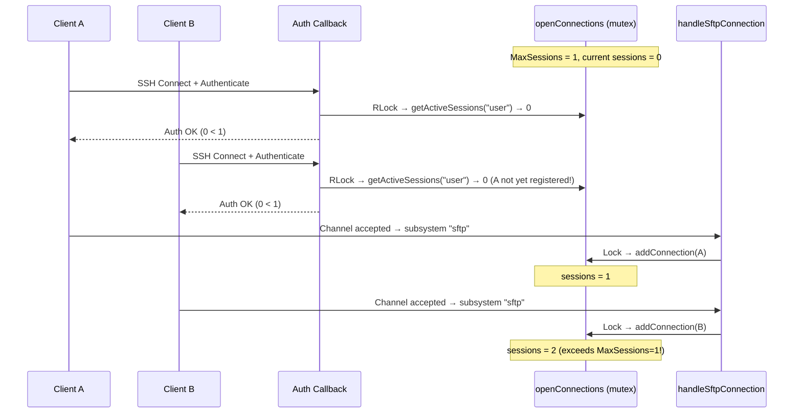
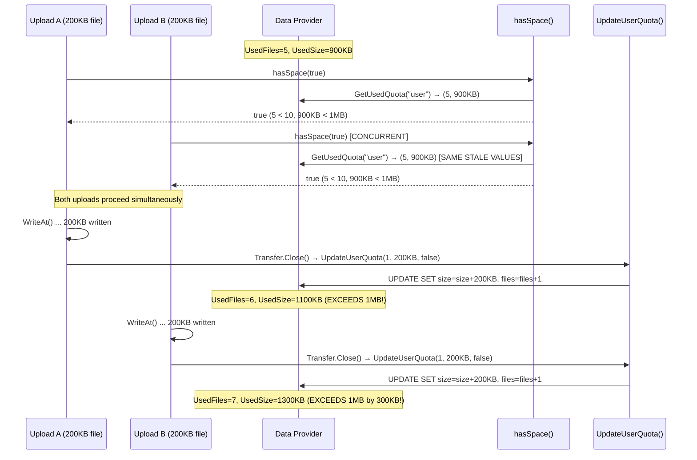

# SFTPGo Concurrency Model: Behavioral Analysis

> **Purpose**: This document provides a deep-dive analysis of SFTPGo's concurrent connection handling, quota enforcement, and atomic upload mechanisms, based entirely on source code inspection. It is designed as an onboarding reference for engineers entering the codebase and answers specific behavioral questions about how the server behaves under realistic concurrent stress. Every conclusion is grounded in specific code references — no assumptions are made beyond what the code explicitly implements.

---

## Table of Contents

- [Architectural Context](#architectural-context)
- [1. Concurrent Session Limiting Under Load](#1-concurrent-session-limiting-under-load)
- [2. Quota Enforcement Under Concurrent Uploads](#2-quota-enforcement-under-concurrent-uploads)
- [3. Idle Connection Monitoring Interaction](#3-idle-connection-monitoring-interaction)
- [4. Atomic Upload Cleanup on Abnormal Termination](#4-atomic-upload-cleanup-on-abnormal-termination)
- [5. Observable Evidence Catalog](#5-observable-evidence-catalog)
- [6. Gap Analysis: Race Conditions and Accounting Inconsistencies](#6-gap-analysis-race-conditions-and-accounting-inconsistencies)
- [7. SFTP vs SCP Upload Path Comparison](#7-sftp-vs-scp-upload-path-comparison)
- [8. Default Configuration Reference](#8-default-configuration-reference)

---

## Architectural Context

Before tracing individual scenarios, it is essential to understand the foundational shared-state architecture that governs all concurrent behavior in SFTPGo's SFTP server.

### Shared Registries

All connection tracking, transfer tracking, and quota scan tracking are managed through three package-level variables in `sftpd/sftpd.go`, protected by a **single** `sync.RWMutex`:

| Registry | Type | Line | Purpose |
|----------|------|------|---------|
| `openConnections` | `map[string]Connection` | `sftpd/sftpd.go`, line 57 | Maps connection IDs to active `Connection` structs |
| `activeTransfers` | `[]*Transfer` | `sftpd/sftpd.go`, line 58 | Slice of all in-flight upload and download transfers |
| `activeQuotaScans` | `[]ActiveQuotaScan` | `sftpd/sftpd.go`, line 61 | Slice of users with active quota scans in progress |

The single shared mutex is declared at `sftpd/sftpd.go`, line 56:

```go
var (
    mutex                sync.RWMutex
    openConnections      map[string]Connection
    activeTransfers      []*Transfer
    // ...
    activeQuotaScans     []ActiveQuotaScan
)
```

**Rationale for a single mutex**: The design choice to use one `sync.RWMutex` for all three registries means that any write operation to *any* registry (adding/removing a connection, transfer, or quota scan) exclusively locks *all* registries. This simplifies consistency guarantees within a single lock acquisition but creates broader contention. Read operations (counting sessions, checking idle connections, listing stats) use `RLock` and can proceed concurrently.

### The `Connection` Struct

Defined in `sftpd/handler.go`, lines 21–39:

```go
type Connection struct {
    ID            string
    User          dataprovider.User
    ClientVersion string
    RemoteAddr    net.Addr
    StartTime     time.Time
    lastActivity  time.Time        // line 33 — tracks last request time
    protocol      string
    netConn       net.Conn
    channel       ssh.Channel
    command       string
    fs            vfs.Fs
}
```

The `lastActivity` field (line 33) is critical for idle connection detection. It is updated under the shared write lock via `updateConnectionActivity()` (`sftpd/sftpd.go`, lines 405–412) at the start of each SFTP request dispatch.

### The `Transfer` Struct

Defined in `sftpd/transfer.go`, lines 28–48:

```go
type Transfer struct {
    file           *os.File
    writerAt       *pipeat.PipeWriterAt
    readerAt       *pipeat.PipeReaderAt
    cancelFn       func()
    path           string
    start          time.Time
    bytesSent      int64
    bytesReceived  int64
    user           dataprovider.User
    connectionID   string
    transferType   int
    lastActivity   time.Time       // line 40 — tracks last I/O time
    isNewFile      bool
    protocol       string
    transferError  error
    isFinished     bool
    minWriteOffset int64
    expectedSize   int64
    lock           *sync.Mutex     // line 47 — per-transfer lock
}
```

Each `Transfer` has its own `sync.Mutex` (`lock`, line 47) that protects byte counters (`bytesSent`, `bytesReceived`), `transferError`, and `isFinished`. Notably, the `lastActivity` field is written **without** this lock (see `WriteAt`, line 92 and `ReadAt`, line 70), which is discussed in the gap analysis.

### Upload Mode Constants

Defined in `sftpd/sftpd.go`, lines 49–53:

```go
const (
    uploadModeStandard         = iota  // 0
    uploadModeAtomic                   // 1
    uploadModeAtomicWithResume         // 2
)
```

- **Standard (0)**: Files are written directly to the target path. Partial uploads leave partial files.
- **Atomic (1)**: Files are written to a temporary path and renamed on success. On error, the temporary file is deleted.
- **Atomic with Resume (2)**: Like atomic, but on error the temporary file is renamed to the target path (preserving partial data for client-side resume).

### Initialization

The `init()` function in `sftpd/sftpd.go`, lines 130–133, initializes the connection map and the idle connection ticker:

```go
func init() {
    openConnections = make(map[string]Connection)
    idleConnectionTicker = time.NewTicker(5 * time.Minute)
}
```

The 5-minute ticker interval is hardcoded and independent of the configurable `IdleTimeout` value. The ticker fires every 5 minutes; the `IdleTimeout` determines how long a connection must be idle before it is closed.

---

## 1. Concurrent Session Limiting Under Load

### Question

What happens when a user whose `MaxSessions` is set close to the limit attempts to open multiple sessions concurrently while uploads are in flight?

### Code Path Trace

#### Step 1: Authentication Callback Invokes `loginUser()`

When a client connects, the SSH library invokes either the `PasswordCallback` or `PublicKeyCallback` registered in `Configuration.Initialize()` (`sftpd/server.go`, lines 128–143). These callbacks call `validatePasswordCredentials()` (line 448) or `validatePublicKeyCredentials()` (line 432), which in turn call `loginUser()` (lines 365–394).

#### Step 2: `loginUser()` Checks Session Count

At `sftpd/server.go`, line 371, the function checks if `MaxSessions` is configured:

```go
if user.MaxSessions > 0 {
    activeSessions := getActiveSessions(user.Username)  // line 372
    if activeSessions >= user.MaxSessions {              // line 373
        logger.Debug(logSender, "", "authentication refused for user: %#v, too many open sessions: %v/%v",
            user.Username, activeSessions, user.MaxSessions)  // lines 374–375
        return nil, fmt.Errorf("too many open sessions: %v", activeSessions)  // line 376
    }
}
```

#### Step 3: `getActiveSessions()` Reads Under RLock

At `sftpd/sftpd.go`, lines 200–210:

```go
func getActiveSessions(username string) int {
    mutex.RLock()               // line 201
    defer mutex.RUnlock()       // line 202
    numSessions := 0
    for _, c := range openConnections {
        if c.User.Username == username {
            numSessions++
        }
    }
    return numSessions
}
```

This acquires a **read lock** (`RLock`) on the shared mutex. Multiple concurrent authentication callbacks can all read the session count simultaneously.

#### Step 4: Connection Registration Occurs Later

If authentication succeeds, `loginUser()` returns successfully and the SSH handshake continues. The sequence then proceeds through:

1. Channel acceptance (`sftpd/server.go`, lines 306–310)
2. Subsystem request detection (`sftpd/server.go`, line 320)
3. `handleSftpConnection()` called in a **new goroutine** (`sftpd/server.go`, line 324)
4. Inside `handleSftpConnection()`, `addConnection(connection)` is called (`sftpd/server.go`, line 336)

`addConnection()` at `sftpd/sftpd.go`, lines 354–360, acquires a **write lock**:

```go
func addConnection(c Connection) {
    mutex.Lock()                // line 355
    defer mutex.Unlock()        // line 356
    openConnections[c.ID] = c   // line 357
    metrics.UpdateActiveConnectionsSize(len(openConnections))  // line 358
    c.Log(logger.LevelDebug, logSender, "connection added, num open connections: %v", len(openConnections))  // line 359
}
```

### The Race Window

The critical observation is that **there is a time gap between `getActiveSessions()` (read lock during auth callback) and `addConnection()` (write lock during SFTP subsystem setup)**. During this gap:

1. `getActiveSessions()` returns a count that is immediately stale
2. The SSH handshake completes
3. The channel is accepted
4. The subsystem request is processed
5. A new goroutine is spawned
6. Only then does `addConnection()` register the connection

**This gap allows the following race:**



### Practical Implications

**Thinking and rationale**: The race exists because the session count check and the session registration are performed as two separate operations under different lock acquisitions, separated by multiple asynchronous steps (SSH handshake completion, channel acceptance, subsystem negotiation, goroutine spawn). There is no atomic "check-and-register" operation.

With `MaxSessions = N`, up to `N + (K - 1)` sessions can be admitted in a single burst, where K is the number of concurrent authentication attempts that all read the session count before any of them reaches `addConnection()`.

**Bounding factors**:
- SSH handshakes involve network round-trips (key exchange, authentication challenge/response), which naturally serialize clients to some degree
- The window between `getActiveSessions()` and `addConnection()` involves channel acceptance and subsystem request parsing, typically taking milliseconds to low hundreds of milliseconds
- Under normal operation with clients connecting sequentially, this race is not observable

**The race is non-zero and exploitable under high concurrency** — for example, a load test tool spawning many parallel SSH connections against the same user could consistently exceed `MaxSessions` by several connections.

---

## 2. Quota Enforcement Under Concurrent Uploads

### Question

How do two or more simultaneous uploads from the same user interact with the quota system? What is the TOCTOU (time-of-check-to-time-of-use) window?

### Code Path Trace

#### Step 1: Quota Check at Upload Initiation

When an SFTP upload begins, `Filewrite()` (`sftpd/handler.go`, line 98) dispatches to either:
- `handleSFTPUploadToNewFile()` (line 412) for new files — calls `hasSpace(true)` at line 413
- `handleSFTPUploadToExistingFile()` (line 450) for existing files — calls `hasSpace(false)` at line 453

For SCP uploads, `handleUploadFile()` (`sftpd/scp.go`, line 184) calls `hasSpace(true)` at line 185.

#### Step 2: `hasSpace()` Reads Stored Quota

At `sftpd/handler.go`, lines 515–534:

```go
func (c Connection) hasSpace(checkFiles bool) bool {
    if (checkFiles && c.User.QuotaFiles > 0) || c.User.QuotaSize > 0 {
        numFile, size, err := dataprovider.GetUsedQuota(dataProvider, c.User.Username)  // line 517
        if err != nil {
            if _, ok := err.(*dataprovider.MethodDisabledError); ok {
                c.Log(logger.LevelWarn, logSender, "quota enforcement not possible for user %#v: %v",
                    c.User.Username, err)
                return true  // fail-open if quota tracking disabled
            }
            c.Log(logger.LevelWarn, logSender, "error getting used quota for %#v: %v", c.User.Username, err)
            return false
        }
        if (checkFiles && c.User.QuotaFiles > 0 && numFile >= c.User.QuotaFiles) ||
            (c.User.QuotaSize > 0 && size >= c.User.QuotaSize) {  // lines 526–527
            c.Log(logger.LevelDebug, logSender, "quota exceed for user %#v, num files: %v/%v, size: %v/%v check files: %v",
                c.User.Username, numFile, c.User.QuotaFiles, size, c.User.QuotaSize, checkFiles)  // lines 528–529
            return false
        }
    }
    return true
}
```

The critical call is at line 517: `dataprovider.GetUsedQuota()` reads the **persisted** (stored) quota values from the database — not any in-flight or pending values.

#### Step 3: `GetUsedQuota()` Delegates to Provider

At `dataprovider/dataprovider.go`, lines 326–331:

```go
func GetUsedQuota(p Provider, username string) (int, int64, error) {
    if config.TrackQuota == 0 {
        return 0, 0, &MethodDisabledError{err: trackQuotaDisabledError}
    }
    return p.getUsedQuota(username)
}
```

#### Provider-Specific Quota Read Atomicity

| Provider | Implementation | Atomicity |
|----------|---------------|-----------|
| **SQL** (SQLite/PostgreSQL/MySQL) | `sqlCommonGetUsedQuota()` at `dataprovider/sqlcommon.go`, lines 109–126: executes `SELECT used_quota_size, used_quota_files FROM <table> WHERE username = ?` | Point-in-time snapshot of the database row |
| **BoltDB** | `BoltProvider.getUsedQuota()` at `dataprovider/bolt.go`, lines 211–218: reads user from bucket within `bolt.View` (read-only transaction) | Point-in-time snapshot within the BoltDB read transaction |
| **Memory** | `MemoryProvider.getUsedQuota()` at `dataprovider/memory.go`, lines 142–154: acquires `p.dbHandle.lock.Lock()`, reads from in-memory map | Serialized with updates via mutex |

#### Step 4: Quota Update Occurs Only at Transfer Completion

Quota is updated in `Transfer.Close()` (`sftpd/transfer.go`, lines 121–170). The quota update happens at lines 166–167:

```go
if t.transferType == transferUpload && (numFiles != 0 || t.bytesReceived > 0) {  // line 166
    dataprovider.UpdateUserQuota(dataProvider, t.user, numFiles, t.bytesReceived, false)  // line 167
}
```

This calls `UpdateUserQuota()` (`dataprovider/dataprovider.go`, lines 312–322) with `reset=false`, indicating an **incremental** update.

#### Provider-Specific Quota Update Atomicity

| Provider | Implementation | Atomicity |
|----------|---------------|-----------|
| **SQL** | `sqlCommonUpdateQuota()` at `dataprovider/sqlcommon.go`, lines 74–90, using `getUpdateQuotaQuery(false)` at `dataprovider/sqlqueries.go`, lines 47–49: generates `UPDATE <table> SET used_quota_size = used_quota_size + ?, used_quota_files = used_quota_files + ?, last_quota_update = ? WHERE username = ?` | Atomic at the SQL row level — concurrent UPDATEs serialize at the DB row lock |
| **BoltDB** | `BoltProvider.updateQuota()` at `dataprovider/bolt.go`, lines 180–209: executes within `p.dbHandle.Update(func(tx *bolt.Tx) error { ... })` with explicit read-modify-write | Fully serialized — BoltDB is single-writer |
| **Memory** | `MemoryProvider.updateQuota()` at `dataprovider/memory.go`, lines 119–140: acquires `p.dbHandle.lock.Lock()`, performs `user.UsedQuotaSize += sizeAdd` and `user.UsedQuotaFiles += filesAdd` | Fully serialized via mutex |

### The TOCTOU Race

**Thinking and rationale**: The `hasSpace()` function reads the *persisted* quota from the data provider. Between this read and the eventual `UpdateUserQuota()` call in `Transfer.Close()`, there is **no locking, reservation, or coordination mechanism**. The quota system has no concept of "in-flight bytes" or "pending quota." This creates a classic TOCTOU vulnerability.

**Concrete Example:**

Consider a user with `QuotaFiles = 10` and `QuotaSize = 1MB (1048576 bytes)`, currently at `UsedQuotaFiles = 5` and `UsedQuotaSize = 900KB`:



### Key Findings

1. **No reservation mechanism**: There is no "pending bytes" or "in-flight quota" tracking anywhere in the codebase. The `hasSpace()` check at upload initiation is the only enforcement point, and it reads values that may already be stale.

2. **The excess is bounded**: The maximum quota overshoot equals the sum of bytes uploaded by all concurrent transfers that passed the `hasSpace()` check before any of them completed. Once the first upload completes and calls `UpdateUserQuota()`, subsequent `hasSpace()` checks from new uploads will see the updated values.

3. **Cross-protocol applicability**: Both SFTP (`sftpd/handler.go`, lines 413, 453) and SCP (`sftpd/scp.go`, line 185) use the **same** `hasSpace()` function. A user uploading via SFTP and SCP simultaneously doubles the race window.

4. **SQL incremental updates are row-level atomic**: The SQL query `used_quota_size = used_quota_size + ?` (`dataprovider/sqlqueries.go`, line 48) ensures that concurrent `UpdateUserQuota()` calls from two completing transfers will not lose updates — they serialize at the database row lock. The race is in the **check**, not in the **update**.

### Quota Scan Interaction

The `doQuotaScan()` function in `httpd/api_quota.go` (lines 36–51) recalculates quota from the filesystem:

```go
numFiles, size, err := fs.ScanRootDirContents()              // line 43
err = dataprovider.UpdateUserQuota(dataProvider, user, numFiles, size, true)  // line 47
```

The `reset=true` parameter causes the SQL backend to use `UPDATE SET used_quota_size = ?, used_quota_files = ?` (absolute values, not incremental — `dataprovider/sqlqueries.go`, lines 44–46). If an upload completes between the filesystem scan and the quota reset, the scan's values may overwrite the upload's incremental update, causing the uploaded file's bytes to be "forgotten" in the quota. Conversely, if the scan counted files still being written, the quota may be temporarily inflated.

The single-flight guard `AddQuotaScan()` (`sftpd/sftpd.go`, lines 221–236) prevents concurrent scans for the **same user**, but does **not** prevent scans during active uploads for that user.

---

## 3. Idle Connection Monitoring Interaction

### Question

What happens when the idle connection ticker fires while a connection has an active atomic upload in progress?

### Code Path Trace

#### Step 1: Idle Timer Startup

When `IdleTimeout > 0` in the configuration, `Configuration.Initialize()` calls `startIdleTimer()` at `sftpd/server.go`, line 189. This function is defined at `sftpd/sftpd.go`, lines 320–328:

```go
func startIdleTimer(maxIdleTime time.Duration) {
    idleTimeout = maxIdleTime           // line 321
    go func() {
        for t := range idleConnectionTicker.C {     // 5-minute interval, line 132
            logger.Debug(logSender, "", "idle connections check ticker %v", t)  // line 324
            CheckIdleConnections()       // line 325
        }
    }()
}
```

#### Step 2: `CheckIdleConnections()` Scans All Connections

At `sftpd/sftpd.go`, lines 331–352:

```go
func CheckIdleConnections() {
    mutex.RLock()                                    // line 332
    defer mutex.RUnlock()                            // line 333
    for _, c := range openConnections {              // line 334
        idleTime := time.Since(c.lastActivity)       // line 335
        for _, t := range activeTransfers {           // line 336
            if t.connectionID == c.ID {               // line 337
                transferIdleTime := time.Since(t.lastActivity)  // line 338
                if transferIdleTime < idleTime {      // line 339
                    c.Log(logger.LevelDebug, logSender, "idle time: %v setted to transfer idle time: %v",
                        idleTime, transferIdleTime)   // lines 340–341
                    idleTime = transferIdleTime        // line 342
                }
            }
        }
        if idleTime > idleTimeout {                   // line 346
            err := c.close()                          // line 347
            c.Log(logger.LevelInfo, logSender, "close idle connection, idle time: %v, close error: %v",
                idleTime, err)                        // line 348
        }
    }
    logger.Debug(logSender, "", "check idle connections ended")  // line 351
}
```

**Key logic**: For each connection, the checker:
1. Starts with the connection-level `idleTime` from `c.lastActivity` (line 335)
2. Iterates **all** active transfers to find ones belonging to this connection (line 337)
3. For each matching transfer, computes `transferIdleTime` from `t.lastActivity` (line 338)
4. If the transfer's idle time is **less** than the connection's idle time, replaces the connection idle time with the transfer idle time (line 342)
5. After checking all transfers, if the effective `idleTime` exceeds `idleTimeout`, closes the connection (line 347)

#### Step 3: How `lastActivity` Is Updated

**Transfer-level** (`sftpd/transfer.go`):
- `WriteAt()`, line 92: `t.lastActivity = time.Now()` — updated on **every** write chunk
- `ReadAt()`, line 70: `t.lastActivity = time.Now()` — updated on **every** read chunk

**Connection-level** (`sftpd/sftpd.go`, lines 405–412):
```go
func updateConnectionActivity(id string) {
    mutex.Lock()                    // line 406
    defer mutex.Unlock()            // line 407
    if c, ok := openConnections[id]; ok {
        c.lastActivity = time.Now() // line 409
        openConnections[id] = c     // line 410
    }
}
```

This is called at the beginning of each SFTP request handler — for example, at `sftpd/handler.go`, line 99 in `Filewrite()`, and line 48 in `Fileread()`.

### Scenario Analysis: Active Upload During Idle Check

**Thinking and rationale**: When an upload is actively streaming data, every `WriteAt()` call updates `t.lastActivity` to `time.Now()`. The idle checker fires every 5 minutes and reads `t.lastActivity` under `RLock`. Since the transfer is active:

1. `t.lastActivity` was updated milliseconds ago (on the last `WriteAt()` call)
2. `transferIdleTime = time.Since(t.lastActivity)` is **very small** (milliseconds)
3. This small `transferIdleTime` replaces `c.lastActivity`'s idle time via line 342
4. `idleTime << idleTimeout` → the comparison at line 346 fails → **connection is NOT closed**

**Result: Active transfers are safe from idle disconnection.** The idle checker correctly accounts for transfer-level activity, preventing premature disconnection of connections with active uploads or downloads.

### Edge Case: Stalled Transfer

If a transfer stalls (client stops sending data but the TCP connection remains open), `t.lastActivity` stops being updated. After `idleTimeout` passes:

1. The idle checker sees `time.Since(t.lastActivity) > idleTimeout`
2. The `transferIdleTime` does **not** reduce `idleTime` below `idleTimeout`
3. The connection is closed via `c.close()` (line 347)
4. This triggers `Transfer.Close()` with `transferError` set, following the error cleanup path described in Section 4

### Edge Case: Connection With No Active Transfer

If a connection has no active transfers (e.g., a session sitting idle after completing uploads), the inner loop at line 336 finds no matching transfers, and `idleTime` remains equal to `time.Since(c.lastActivity)`. If this exceeds `idleTimeout`, the connection is closed.

---

## 4. Atomic Upload Cleanup on Abnormal Termination

### Question

What happens to the temporary file and quota accounting when a connection is forcefully closed mid-upload in each upload mode?

### Atomic Upload Path Generation

Before tracing the cleanup, it is important to understand how atomic upload paths are created:

1. `isAtomicUploadEnabled()` at `sftpd/sftpd.go`, lines 414–416: returns `true` if `uploadMode == uploadModeAtomic || uploadMode == uploadModeAtomicWithResume`
2. `OsFs.IsAtomicUploadSupported()` at `vfs/osfs.go`, lines 122–125: returns `true` for local filesystem
3. `S3Fs.IsAtomicUploadSupported()` returns `false` — **S3 backends are NOT affected by atomic upload scenarios**
4. `OsFs.GetAtomicUploadPath()` at `vfs/osfs.go`, lines 175–179:

```go
func (OsFs) GetAtomicUploadPath(name string) string {
    dir := filepath.Dir(name)
    guid := xid.New().String()
    return filepath.Join(dir, ".sftpgo-upload."+guid+"."+filepath.Base(name))
}
```

This generates paths like: `<dir>/.sftpgo-upload.bq0v9kd1234abcde.myfile.txt`

### `Transfer.Close()` Branching Logic

The core cleanup logic is in `Transfer.Close()` (`sftpd/transfer.go`, lines 121–170). The relevant section for atomic uploads is lines 134–148:

```go
if t.transferType == transferUpload && t.file != nil && t.file.Name() != t.path {  // line 134
    if t.transferError == nil || uploadMode == uploadModeAtomicWithResume {          // line 135
        err = os.Rename(t.file.Name(), t.path)                                      // line 136
        logger.Debug(logSender, t.connectionID, "atomic upload completed, rename: %#v -> %#v, error: %v",
            t.file.Name(), t.path, err)                                             // lines 137–138
    } else {
        err = os.Remove(t.file.Name())                                              // line 140
        logger.Warn(logSender, t.connectionID, "atomic upload completed with error: \"%v\", delete temporary file: %#v, "+
            "deletion error: %v", t.transferError, t.file.Name(), err)              // lines 141–142
        if err == nil {                                                              // line 143
            numFiles--                                                               // line 144
            t.bytesReceived = 0                                                      // line 145
        }
    }
}
```

**Line 134 condition analysis**: `t.file.Name() != t.path` is true **only** in atomic modes, where the file was opened at the temporary path (e.g., `.sftpgo-upload.<guid>.<name>`) but `t.path` points to the final destination. In standard mode (0), `t.file.Name() == t.path` because the file was opened directly at the target path.

### Behavior by Upload Mode on Forceful Connection Close

#### Upload Mode 0 — Standard

- **Condition**: `t.file.Name() == t.path` → line 134 is **FALSE** → entire atomic block skipped
- **File-system result**: The partial file **remains** at the target path with incomplete content
- **Quota accounting**: `numFiles` stays at 1 (new file) or 0 (overwrite), `bytesReceived` retains the partial bytes written. Line 166 condition evaluates to `true` → `UpdateUserQuota()` is called with partial bytes
- **Artifact**: Partial file at target path
- **Quota**: Incremented by the partial bytes received

#### Upload Mode 1 — Atomic

- **Condition**: `t.file.Name() != t.path` → line 134 is **TRUE**
- **Error state**: Connection drop → SFTP library invokes `TransferError()` → `t.transferError` is set (non-nil)
- **Line 135**: `t.transferError == nil` is **FALSE**, `uploadMode == uploadModeAtomicWithResume` is **FALSE** → falls to `else` block
- **Line 140**: `os.Remove(t.file.Name())` — deletes the temporary file
- **Line 143**: If removal succeeds (`err == nil`):
  - Line 144: `numFiles--` (becomes 0 for new file, -1 for overwrite)
  - Line 145: `t.bytesReceived = 0`
- **Line 166**: With `numFiles == 0` and `bytesReceived == 0`, the condition `numFiles != 0 || t.bytesReceived > 0` is **FALSE** → `UpdateUserQuota()` is **NOT called** → quota is clean
- **Artifact**: Temp file deleted; target file never created (or retains previous version if overwrite)
- **Quota**: No change — correctly reversed

#### Upload Mode 2 — Atomic With Resume

- **Condition**: `t.file.Name() != t.path` → line 134 is **TRUE**
- **Error state**: `t.transferError` is set (non-nil)
- **Line 135**: `uploadMode == uploadModeAtomicWithResume` is **TRUE** → enters the `if` block (success/resume branch)
- **Line 136**: `os.Rename(t.file.Name(), t.path)` — moves the partial file to the target path
- **Quota accounting**: `numFiles` and `bytesReceived` retain their original values → `UpdateUserQuota()` **IS called** with partial bytes
- **Artifact**: Partial file at target path (intentional — for client-side resume)
- **Quota**: Incremented by partial bytes (intentional — to track the on-disk partial file)

### Chain of Events on Forceful Connection Close

The complete chain of events when a connection is forcefully closed (network drop, client crash, or idle timeout):

1. **Connection close initiated**: `c.close()` in `sftpd/handler.go`, lines 536–542:
   - Line 538: `c.channel.Close()` — closes the SSH channel
   - Line 539: Logs `"channel close, err: %v"`
   - Line 541: `c.netConn.Close()` — closes the underlying TCP connection

2. **SFTP server Serve() returns**: The SFTP request server's `Serve()` method detects the closed channel and returns an error (or `io.EOF`)

3. **`handleSftpConnection()` cleanup**: At `sftpd/server.go`, lines 335–353:
   - Line 337: `defer removeConnection(connection)` was registered at function entry
   - The SFTP library internally cleans up open request handlers

4. **Transfer cleanup**: The SFTP library invokes `Transfer.Close()` on any active transfers for this connection:
   - `TransferError()` (`sftpd/transfer.go`, lines 52–65) is called first, setting `t.transferError`
   - `Transfer.Close()` executes the branching logic described above

5. **Transfer registry cleanup**: `removeTransfer(t)` is called at `sftpd/transfer.go`, line 165, removing the transfer from the `activeTransfers` slice under the shared write lock

6. **Connection registry cleanup**: `removeConnection(connection)` executes (deferred), removing the connection from `openConnections` under the shared write lock (`sftpd/sftpd.go`, lines 362–376)

---

## 5. Observable Evidence Catalog

### Log Messages by Scenario

The following table catalogs the exact log messages that appear in each scenario, derived from the source code. All format strings are character-for-character from the source.

#### Connection Lifecycle Logs

| Scenario | Log Level | Sender | Format String | Source Location |
|----------|-----------|--------|---------------|-----------------|
| Successful login | `Info` | `"sftpd"` | `"User id: %d, logged in with: %#v, username: %#v, home_dir: %#v remote addr: %#v"` | `sftpd/server.go`, lines 291–292 |
| Session rejection (MaxSessions) | `Debug` | `"sftpd"` | `"authentication refused for user: %#v, too many open sessions: %v/%v"` | `sftpd/server.go`, lines 374–375 |
| Connection added | `Debug` | `"sftpd"` | `"connection added, num open connections: %v"` | `sftpd/sftpd.go`, line 359 |
| Connection removed | `Debug` | `"sftpd"` | `"connection removed, num open connections: %v"` | `sftpd/sftpd.go`, line 375 |
| Idle connection closed | `Info` | `"sftpd"` | `"close idle connection, idle time: %v, close error: %v"` | `sftpd/sftpd.go`, line 348 |
| Channel close | `Info` | `"sftpd"` | `"channel close, err: %v"` | `sftpd/handler.go`, line 539 |

#### Quota Enforcement Logs

| Scenario | Log Level | Sender | Format String | Source Location |
|----------|-----------|--------|---------------|-----------------|
| Quota rejection (SFTP new file) | `Info` | `"sftpd"` | `"denying file write due to space limit"` | `sftpd/handler.go`, line 414 |
| Quota rejection (SFTP existing file) | `Info` | `"sftpd"` | `"denying file write due to space limit"` | `sftpd/handler.go`, line 454 |
| Quota exceeded detail | `Debug` | `"sftpd"` | `"quota exceed for user %#v, num files: %v/%v, size: %v/%v check files: %v"` | `sftpd/handler.go`, lines 528–529 |
| Quota rejection (SCP) | `Warn` | `"scp"` | `"error uploading file: %#v, err: %v"` | `sftpd/scp.go`, line 187 |

#### Transfer Lifecycle Logs

| Scenario | Log Level | Sender | Format String | Source Location |
|----------|-----------|--------|---------------|-----------------|
| Successful upload | `TransferLog` | `"Upload"` | *(structured transfer log)* | `sftpd/transfer.go`, line 155 |
| Successful download | `TransferLog` | `"Download"` | *(structured transfer log)* | `sftpd/transfer.go`, line 152 |
| Atomic upload success (rename) | `Debug` | `"sftpd"` | `"atomic upload completed, rename: %#v -> %#v, error: %v"` | `sftpd/transfer.go`, lines 137–138 |
| Atomic upload failure (delete temp) | `Warn` | `"sftpd"` | `"atomic upload completed with error: \"%v\", delete temporary file: %#v, deletion error: %v"` | `sftpd/transfer.go`, lines 141–142 |
| Transfer error | `Warn` | `"sftpd"` | `"Unexpected error for transfer, path: %#v, error: \"%v\" bytes sent: %v, bytes received: %v transfer running since %v ms"` | `sftpd/transfer.go`, lines 63–64 |
| Transfer close error | `Warn` | `"sftpd"` | `"transfer error: %v, path: %#v"` | `sftpd/transfer.go`, line 159 |

### File-System Artifacts by Scenario

| Scenario | Temp File Exists? | Target File Exists? | Target Content | Notes |
|----------|-------------------|---------------------|----------------|-------|
| Standard mode (0) — success | No temp file used | Yes | Complete | File written directly to target |
| Standard mode (0) — error | No temp file used | Yes | **Partial** | Partial data remains at target |
| Atomic mode (1) — success | No (renamed to target) | Yes | Complete | Temp renamed to target via `os.Rename` |
| Atomic mode (1) — error | **No** (deleted) | No (new) / Previous (overwrite) | N/A or previous version | Temp deleted; target untouched |
| Atomic+resume mode (2) — success | No (renamed to target) | Yes | Complete | Temp renamed to target via `os.Rename` |
| Atomic+resume mode (2) — error | **No** (renamed to target) | Yes | **Partial** | Partial file moved to target for resume |

### Quota State by Scenario

| Scenario | numFiles Δ | bytesReceived Δ | `UpdateUserQuota` Called? | Notes |
|----------|-----------|-----------------|---------------------------|-------|
| Standard (0) — success | +1 (new) or 0 (overwrite) | +actual bytes | Yes | Normal update |
| Standard (0) — error | +1 or 0 | +partial bytes | Yes | Partial bytes counted |
| Atomic (1) — success | +1 or 0 | +actual bytes | Yes | Normal update |
| Atomic (1) — error, temp deleted OK | 0 | 0 | **No** (line 166 condition false) | **Clean reversal** |
| Atomic (1) — error, temp delete fails | +1 or 0 | +partial bytes | Yes | **Temp file leaked + quota inconsistency** |
| Atomic+resume (2) — error | +1 or 0 | +partial bytes | Yes | Intentional for resume support |

---

## 6. Gap Analysis: Race Conditions and Accounting Inconsistencies

### Gap 1: Session Count Race

**Root Cause**: `getActiveSessions()` acquires `RLock` to count sessions (`sftpd/sftpd.go`, lines 200–210), but `addConnection()` acquires `Lock` to register a new session (`sftpd/sftpd.go`, lines 354–360). Between these two operations lies the entire SSH channel acceptance and subsystem negotiation flow.

**Code References**:
- Read: `sftpd/server.go`, line 372 → `sftpd/sftpd.go`, lines 200–210
- Write: `sftpd/server.go`, line 336 → `sftpd/sftpd.go`, lines 354–360

**Impact**: `MaxSessions` can be exceeded by up to `(concurrent_authenticating_clients - 1)`. With `MaxSessions = N`, up to `N + K - 1` sessions can be admitted if K clients authenticate simultaneously.

**Severity**: **Low-Medium**. The window is bounded by the time to complete SSH handshake, channel acceptance, and subsystem negotiation (typically milliseconds to low hundreds of milliseconds). SSH handshakes are partially serialized by network round-trip latency. In practice, exceeding `MaxSessions` by more than 1–2 sessions requires a coordinated burst of simultaneous connection attempts.

---

### Gap 2: Quota TOCTOU Race

**Root Cause**: `hasSpace()` reads persisted quota values from the data provider (`sftpd/handler.go`, lines 515–534), but `UpdateUserQuota()` writes only when `Transfer.Close()` is called (`sftpd/transfer.go`, line 167). There is no in-flight reservation, pending-bytes tracking, or transactional coordination between the check and the update.

**Code References**:
- Read: `sftpd/handler.go`, line 517 → `dataprovider/dataprovider.go`, lines 326–331
- Write: `sftpd/transfer.go`, line 167 → `dataprovider/dataprovider.go`, lines 312–322

**Impact**: Quota limits can be exceeded by the aggregate size of all concurrent uploads that passed `hasSpace()` before any of them completed. For example, with 10 concurrent 100KB uploads against a 1MB quota with 950KB used, all 10 could pass the check and collectively add 1000KB, overshooting the limit by 950KB.

**Severity**: **Medium-High**. Unlike the session race, this window spans the entire duration of an upload (seconds to minutes), not just a brief authentication gap. The overshoot is proportional to the number of concurrent uploads and their sizes, making it significantly exploitable under concurrent upload stress.

---

### Gap 3: Mixed-Protocol Quota Double Window

**Root Cause**: Both SFTP (`sftpd/handler.go`, lines 413 and 453) and SCP (`sftpd/scp.go`, line 185) independently call `hasSpace()` and subsequently `UpdateUserQuota()` via `Transfer.Close()`. There is no cross-protocol coordination, shared in-flight tracking, or protocol-aware quota reservation.

**Code References**:
- SFTP new file: `sftpd/handler.go`, line 413
- SFTP existing file: `sftpd/handler.go`, line 453
- SCP: `sftpd/scp.go`, line 185

**Impact**: A user uploading via both SFTP and SCP simultaneously doubles the effective race window, because both protocol paths independently read the same stale quota values.

**Severity**: **Medium**. Requires the user to have both SFTP and SCP access, and to be actively uploading via both protocols simultaneously.

---

### Gap 4: Quota Scan vs Active Upload Race

**Root Cause**: `doQuotaScan()` in `httpd/api_quota.go` (line 47) calls `UpdateUserQuota(dataProvider, user, numFiles, size, true)` with `reset=true`, which **replaces** the quota values with filesystem-scanned totals rather than incrementing them. The filesystem scan at line 43 (`fs.ScanRootDirContents()`) and the quota update at line 47 are not atomic with respect to concurrent `Transfer.Close()` operations.

**Code References**:
- Scan: `httpd/api_quota.go`, line 43 (`fs.ScanRootDirContents()`)
- Reset: `httpd/api_quota.go`, line 47 (`UpdateUserQuota(..., true)`)
- Single-flight guard: `sftpd/sftpd.go`, lines 221–236 (`AddQuotaScan()`)

**Interaction Scenarios**:
- **Upload completes BETWEEN scan and reset**: The incremental update from `Transfer.Close()` may be applied to the DB, then immediately overwritten by the reset. If the scan already counted the newly uploaded file on disk, the quota is correct. If it didn't (file arrived after the scan but before the reset), the file's bytes are lost from quota tracking.
- **Upload completes AFTER the reset**: The incremental update is correctly applied on top of the scan's reset values.

**Severity**: **Low-Medium**. The `AddQuotaScan()` single-flight guard prevents concurrent scans for the same user, limiting the race to the window between `ScanRootDirContents()` and `UpdateUserQuota()`. Periodic quota scans (manual via REST API) are infrequent.

---

### Gap 5: Atomic Upload Temp File Leak on `os.Remove` Failure

**Root Cause**: In `Transfer.Close()` at `sftpd/transfer.go`, line 140, if `os.Remove(t.file.Name())` fails (e.g., due to a permission error, filesystem full, or NFS stale file handle), the error is non-nil at line 143. The quota reversal at lines 144–145 (`numFiles--`, `t.bytesReceived = 0`) is **only executed if removal succeeds**. When removal fails:

- The temporary file (`.sftpgo-upload.<xid>.<name>`) remains on disk
- `numFiles` and `bytesReceived` retain their non-zero values
- `UpdateUserQuota()` at line 167 IS called with partial bytes
- The quota now accounts for a file that exists only as a temporary artifact at a path the user never requested

**Code References**: `sftpd/transfer.go`, lines 140–147

**Impact**: Both a file-system leak (orphaned temp file) and a quota inconsistency (quota incremented for a non-target file). A quota scan via the REST API would not count these temp files if they are in unexpected directories, potentially creating a permanent quota discrepancy.

**Severity**: **Low**. Requires `os.Remove` to fail on a temporary file, which is an uncommon failure mode under normal filesystem conditions. However, on network-attached storage (NFS, CIFS), stale handle errors are more plausible.

---

### Gap 6: `lastActivity` Write Without Lock

**Root Cause**: `Transfer.WriteAt()` at line 92 and `Transfer.ReadAt()` at line 70 (`sftpd/transfer.go`) write `t.lastActivity = time.Now()` **without** holding the transfer's `lock` mutex. `CheckIdleConnections()` reads `t.lastActivity` at `sftpd/sftpd.go`, line 338 under the shared `RLock`.

**Technical Detail**: `time.Time` in Go is a struct containing two fields (`wall uint64` and `ext int64` plus a `loc *Location`). Writing a multi-word struct without synchronization can theoretically result in a torn read on certain architectures, where the reader sees a partially-updated value.

**Code References**:
- Writes: `sftpd/transfer.go`, lines 70, 92
- Read: `sftpd/sftpd.go`, line 338

**Practical Impact**: Minimal. Even if a torn read occurs, it would result in a slightly inaccurate idle time calculation for a single 5-minute tick. The next tick (5 minutes later) would read a consistent value and make the correct decision. The worst case is a single false idle-timeout on an active transfer, or a single missed idle-timeout on an inactive one, both self-correcting within one tick interval.

**Severity**: **Very Low**. Theoretical data race with negligible practical impact.

---

## 7. SFTP vs SCP Upload Path Comparison

### Upload Call Chain Comparison

| Step | SFTP Path | SCP Path |
|------|-----------|----------|
| Entry point | `Filewrite()` → `sftpd/handler.go`, line 98 | `handleUpload()` → `sftpd/scp.go`, line 226 |
| Path resolution | `c.fs.ResolvePath()` at handler.go, line 100 | `c.connection.fs.ResolvePath()` at scp.go, line 231 |
| Atomic path | `c.fs.GetAtomicUploadPath(p)` at handler.go, line 107 | `c.connection.fs.GetAtomicUploadPath(p)` at scp.go, line 239 |
| New file dispatch | `handleSFTPUploadToNewFile()` at handler.go, line 115 | `handleUploadFile(..., true)` at scp.go, line 249 |
| Existing file dispatch | `handleSFTPUploadToExistingFile()` at handler.go, line 133 | `handleUploadFile(..., false)` at scp.go, line 284 |
| Quota check | `hasSpace()` at handler.go, lines 413/453 | `hasSpace()` at scp.go, line 185 |
| Transfer creation | `Transfer{}` struct, `addTransfer()` at handler.go, lines 426–447/491–512 | `Transfer{}` struct, `addTransfer()` at scp.go, lines 201–222 |
| Transfer completion | `Transfer.Close()` at transfer.go, lines 121–170 | `Transfer.Close()` at transfer.go, lines 121–170 |
| Quota update | `dataprovider.UpdateUserQuota()` at transfer.go, line 167 | Same path via `Transfer.Close()` |

### Shared Components

Both SFTP and SCP paths use:
- The **same** `hasSpace()` function (`sftpd/handler.go`, lines 515–534)
- The **same** `Transfer` struct and `Transfer.Close()` logic
- The **same** `addTransfer()` / `removeTransfer()` registry operations
- The **same** `dataprovider.UpdateUserQuota()` call chain

### Notable Differences

1. **Existing file size deduction**: Both paths deduct the existing file's size before starting the overwrite upload:
   - **SFTP**: `dataprovider.UpdateUserQuota(dataProvider, c.User, 0, -fileSize, false)` at `sftpd/handler.go`, line 486
   - **SCP**: `dataprovider.UpdateUserQuota(dataProvider, c.connection.User, 0, -stat.Size(), false)` at `sftpd/scp.go`, line 282

2. **Atomic overwrite handling for SCP**: SCP renames the existing file TO the atomic path first (`c.connection.fs.Rename(p, filePath)` at `sftpd/scp.go`, line 273), then uploads to that path. This means the atomic path contains the **old** file content initially, which gets overwritten by the upload. SFTP similarly renames the existing file to the atomic path (`c.fs.Rename(requestPath, filePath)` at `sftpd/handler.go`, line 468).

3. **Data transfer mechanism**: SFTP uses `io.WriterAt` interface (random-access writes via `WriteAt`), while SCP uses sequential stream copying in `getUploadFileData()` (`sftpd/scp.go`, lines 141–182).

---

## 8. Default Configuration Reference

The default configuration from `sftpgo.json` at the repository root:

| Setting | Default Value | Meaning |
|---------|--------------|---------|
| `sftpd.bind_port` | `2022` | SSH/SFTP listening port |
| `sftpd.idle_timeout` | `15` | Minutes before an idle connection is closed |
| `sftpd.upload_mode` | `0` | Standard mode — no atomic uploads |
| `sftpd.max_auth_tries` | `0` | 0 means use default (6 attempts) |
| `data_provider.driver` | `"sqlite"` | SQLite database backend |
| `data_provider.track_quota` | `2` | Track quota only for users with quota restrictions (per `dataprovider/dataprovider.go`, line 315) |
| `data_provider.manage_users` | `1` | User management enabled |

### Implications of Default Settings

With the default `upload_mode = 0` (standard):
- **Atomic upload race conditions do NOT apply** — files are written directly to the target path
- **Partial files persist at the target path** on interrupted uploads
- **Only the quota TOCTOU race (Gap 2) is relevant** for concurrent upload scenarios

With the default `track_quota = 2`:
- Quota tracking is enabled for users who have `QuotaFiles > 0` or `QuotaSize > 0` (`dataprovider/dataprovider.go`, line 315: `config.TrackQuota == 2 && !reset && !user.HasQuotaRestrictions()`)
- Users without quota restrictions do not have quota tracked on uploads (saves database writes)
- The `HasQuotaRestrictions()` method (`dataprovider/user.go`, lines 258–259) returns `true` if `QuotaFiles > 0 || QuotaSize > 0`

With the default `idle_timeout = 15`:
- The idle checker runs on a 5-minute ticker (`sftpd/sftpd.go`, line 132)
- Connections idle for more than 15 minutes are closed
- Active transfers prevent idle disconnection via `lastActivity` comparison (see Section 3)
