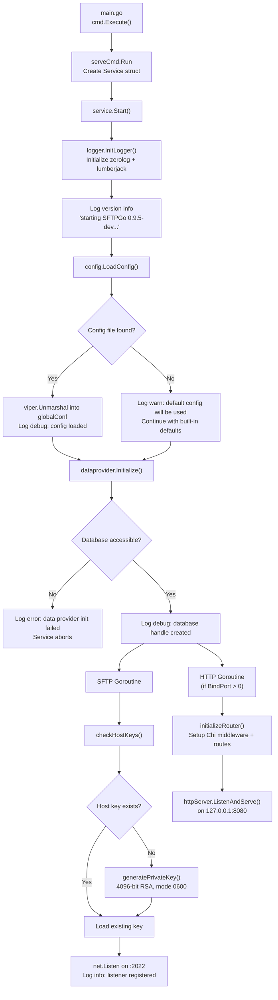
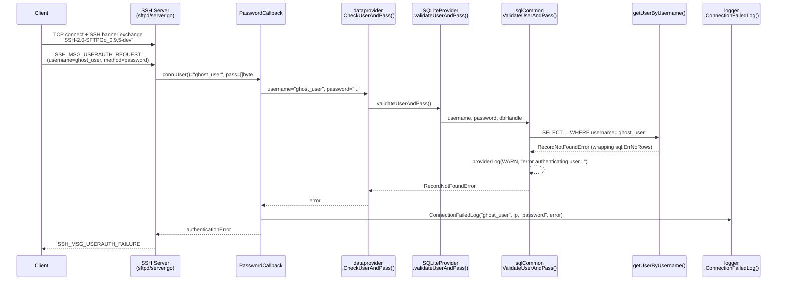

# SFTPGo Runtime Behavior Investigation

| Property | Value |
|----------|-------|
| **SFTPGo Version** | `0.9.5-dev` _(Source: `utils/version.go:3`)_ |
| **Go Version** | `1.13` _(Source: `go.mod:3`)_ |
| **Module Path** | `github.com/drakkan/sftpgo` _(Source: `go.mod:1`)_ |
| **Purpose** | Answers five runtime-behavior questions through code analysis and runtime observation |

---

## Introduction

SFTPGo is a bit of a black box the first time you launch it. You run the binary, and… things happen. Ports quietly open, log lines scroll past in structured JSON, and a web interface materializes on localhost. But *what* exactly happens between pressing Enter and reaching a working state? And what does the server reveal about itself when something goes wrong — when a user that doesn't exist tries to log in, or when the database file it expects simply isn't there?

This document is an investigative walkthrough. Rather than summarizing configuration knobs in a table (although we'll do that too), we trace the actual path the code takes from `main()` to "server ready," watching the log messages that appear, the ports that bind, and the errors that surface. Every claim here traces back to a specific source file and line number in the SFTPGo `0.9.5-dev` codebase. Where possible, we show the exact structured JSON log output that the server emits, reconstructed faithfully from the zerolog logging calls in the source.

Think of this as a guided tour for someone who has just cloned the repository and wants to understand what happens when they type `sftpgo serve`.

---

## Table of Contents

- [1. Startup Without a Configuration File](#1-startup-without-a-configuration-file)
- [2. Ports That Open and Readiness Signals](#2-ports-that-open-and-readiness-signals)
- [3. Failed SFTP Authentication for a Nonexistent User](#3-failed-sftp-authentication-for-a-nonexistent-user)
- [4. Web Admin Root Endpoint Behavior](#4-web-admin-root-endpoint-behavior)
- [5. Missing Database on First Startup](#5-missing-database-on-first-startup)
- [6. Default Configuration Revealed in Logs](#6-default-configuration-revealed-in-logs)
- [Source Code References](#source-code-references)

---

## 1. Startup Without a Configuration File

> **Question:** Which ports open and which log messages appear when SFTPGo launches without a configuration file, revealing the defaults it falls back to?

### The Entry Point Chain

Everything begins in `main.go` — a remarkably thin file. Its entire job is two things: register SQL database drivers via side-effect imports, and hand control to the CLI framework.

```go
// main.go lines 6-15
import (
    "github.com/drakkan/sftpgo/cmd"
    _ "github.com/go-sql-driver/mysql"
    _ "github.com/lib/pq"
    _ "github.com/mattn/go-sqlite3"
)

func main() {
    cmd.Execute()
}
```

_Source: `main.go:6-15`_

Those three blank-identifier imports (`_ "..."`) are crucial but easy to overlook. They don't import any symbols — instead, each package's `init()` function runs at program startup, registering a database driver with Go's `database/sql` package. This is why SFTPGo can talk to SQLite, PostgreSQL, and MySQL without any explicit driver initialization in the configuration code.

The `cmd.Execute()` call enters the Cobra CLI framework. Cobra is the command-line library that parses `sftpgo serve`, `sftpgo portable`, and other subcommands.

_Source: `cmd/root.go:69-74`_ — `Execute()` simply calls `rootCmd.Execute()`, which dispatches to the appropriate subcommand.

When you run `sftpgo serve`, Cobra invokes the `serveCmd.Run` handler:

```go
// cmd/serve.go lines 17-33
Run: func(cmd *cobra.Command, args []string) {
    service := service.Service{
        ConfigDir:     configDir,
        ConfigFile:    configFile,
        LogFilePath:   logFilePath,
        LogMaxSize:    logMaxSize,
        LogMaxBackups: logMaxBackups,
        LogMaxAge:     logMaxAge,
        LogCompress:   logCompress,
        LogVerbose:    logVerbose,
        Shutdown:      make(chan bool),
    }
    if err := service.Start(); err == nil {
        service.Wait()
    }
},
```

_Source: `cmd/serve.go:17-33`_

The default flag values that populate this struct come from constants in `cmd/root.go`:

| Flag | Default Value | Source |
|------|---------------|--------|
| `configDir` | `"."` (current directory) | `cmd/root.go:33` |
| `configFile` | `"sftpgo"` | `cmd/root.go:34` |
| `logFilePath` | `"sftpgo.log"` | `cmd/root.go:35` |
| `logMaxSize` | `10` (MB) | `cmd/root.go:36` |
| `logMaxBackups` | `5` | `cmd/root.go:37` |
| `logMaxAge` | `28` (days) | `cmd/root.go:38` |
| `logCompress` | `false` | `cmd/root.go:39` |
| `logVerbose` | `true` | `cmd/root.go:40` |

### Where Viper Searches for Configuration

SFTPGo uses Viper (the Go configuration library) to locate its config file. When `config.LoadConfig(configDir, configName)` is called, Viper builds a search path:

1. **The config directory** passed via `--config-dir` flag (default: `"."`)
   _Source: `config/config.go:147`_ — `viper.AddConfigPath(configDir)`

2. **Platform-specific paths** — on Linux, two additional directories are added:
   - `$HOME/.config/sftpgo`
   - `/etc/sftpgo`
   _Source: `config/config_linux.go:8-11`_

3. **The current working directory** (always added as a fallback)
   _Source: `config/config.go:149`_ — `viper.AddConfigPath(".")`

4. **The config file name** is set to `"sftpgo"` (no extension)
   _Source: `config/config.go:150`_ — `viper.SetConfigName(configName)`

Viper then searches each directory for a file named `sftpgo` with any supported extension: `.json`, `.yaml`, `.toml`, `.hcl`, or `.properties`. If you have `sftpgo.json` in the config directory, Viper will find it. If you have `sftpgo.yaml`, that works too.

### The Config-Not-Found Warning

When Viper searches all paths and finds nothing, `viper.ReadInConfig()` returns an error. SFTPGo handles this gracefully — it doesn't crash. Instead, it logs a warning and proceeds with its built-in defaults:

```go
// config/config.go lines 151-155
if err = viper.ReadInConfig(); err != nil {
    logger.Warn(logSender, "", "error loading configuration file: %v. Default configuration will be used: %+v",
        err, getRedactedGlobalConf())
    logger.WarnToConsole("error loading configuration file: %v. Default configuration will be used.", err)
    return err
}
```

_Source: `config/config.go:151-155`_

This produces two simultaneous outputs:

**1. Structured JSON log** (the primary logger — goes to file or stdout):

```json
{
  "level": "warn",
  "time": "2024-01-15T10:30:00.000",
  "sender": "config",
  "connection_id": "",
  "message": "error loading configuration file: Config File \"sftpgo\" Not Found in \"[/tmp/empty $HOME/.config/sftpgo /etc/sftpgo .]\". Default configuration will be used: {SFTPD:{Banner:SFTPGo_0.9.5-dev BindPort:2022 BindAddress: IdleTimeout:15 MaxAuthTries:0 Umask:0022 UploadMode:0 Actions:{ExecuteOn:[] Command: HTTPNotificationURL:} Keys:[] IsSCPEnabled:false KexAlgorithms:[] Ciphers:[] MACs:[] LoginBannerFile: SetstatMode:0 EnabledSSHCommands:[md5sum sha1sum cd pwd]} ProviderConf:{Driver:sqlite Name:sftpgo.db Host: Port:5432 Username: Password:[redacted] SSLMode:0 ConnectionString: UsersTable:users ManageUsers:1 TrackQuota:1 PoolSize:0 UsersBaseDir: Actions:{ExecuteOn:[] Command: HTTPNotificationURL:} ExternalAuthProgram: ExternalAuthScope:0} HTTPDConfig:{BindPort:8080 BindAddress:127.0.0.1 TemplatesPath:templates StaticFilesPath:static BackupsPath:backups}}"
}
```

**2. Console log** (human-readable, colored output — goes to stdout if log file is configured):

A shorter, more readable message without the full config struct dump.

Notice the `Password:[redacted]` in the structured log. This is deliberate — the `getRedactedGlobalConf()` function at `config/config.go:134-138` creates a copy of the config struct and replaces the database password with `"[redacted]"` before logging:

```go
// config/config.go lines 134-138
func getRedactedGlobalConf() globalConfig {
    conf := globalConf
    conf.ProviderConf.Password = "[redacted]"
    return conf
}
```

_Source: `config/config.go:134-138`_

**Rationale:** Even though the default password is empty, the redaction runs unconditionally — a sensible security practice that protects production deployments where a real password might be configured.

### The SSH Banner

One subtle detail buried in the defaults: the SSH server version string that clients see during the handshake is constructed from the SFTPGo version.

_Source: `config/config.go:32`_ — `defaultBanner = fmt.Sprintf("SFTPGo_%v", utils.GetAppVersion().Version)`

This evaluates to `"SFTPGo_0.9.5-dev"`. Then in the SSH server configuration:

_Source: `sftpd/server.go:144`_ — `ServerVersion: "SSH-2.0-" + c.Banner`

The final SSH protocol banner becomes: **`SSH-2.0-SFTPGo_0.9.5-dev`**

This is what any SSH client will see during the initial banner exchange. It's a fingerprint that identifies the server software to anyone who connects.

---

## 2. Ports That Open and Readiness Signals

> **Question:** Which ports bind and what log messages signal that SFTPGo is ready to accept connections?

### The Startup Sequence

After the CLI parses flags and creates the `Service` struct, `service.Start()` orchestrates everything. Here is the full lifecycle, step by step:

_Source: `service/service.go:47-117`_

**Step 1 — Initialize Logging** (line 52):
```go
logger.InitLogger(s.LogFilePath, s.LogMaxSize, s.LogMaxBackups, s.LogMaxAge, s.LogCompress, logLevel)
```

This sets up zerolog (the structured JSON logger used throughout SFTPGo) with lumberjack-based log rotation. If `LogFilePath` is empty (e.g., `--log-file-path ""`), structured JSON goes to stdout and the console logger is disabled.

_Source: `logger/logger.go:47-65`_

**Step 2 — Log the Version** (lines 60-62):
```go
logger.Info(logSender, "", "starting SFTPGo %v, config dir: %v, config file: %v, log max size: %v ...")
```

This produces:

```json
{
  "level": "info",
  "time": "2024-01-15T10:30:00.000",
  "sender": "service",
  "connection_id": "",
  "message": "starting SFTPGo 0.9.5-dev, config dir: ., config file: sftpgo, log max size: 10 log max backups: 5 log max age: 28 log verbose: true, log compress: false"
}
```

**Step 3 — Load Configuration** (line 65):
```go
config.LoadConfig(s.ConfigDir, s.ConfigFile)
```

If no config file is found, the warning described in Section 1 is emitted. Crucially, `LoadConfig` returns the error but `Start()` does **not** abort — it continues with defaults. The return value of `LoadConfig` is deliberately ignored in the non-portable code path.

**Step 4 — Initialize Data Provider** (line 69):
```go
err := dataprovider.Initialize(providerConf, s.ConfigDir)
```

**This is the first potential hard failure.** If the data provider cannot be initialized (e.g., the SQLite database file is missing), the service aborts:

```go
// service/service.go lines 70-73
if err != nil {
    logger.Error(logSender, "", "error initializing data provider: %v", err)
    logger.ErrorToConsole("error initializing data provider: %v", err)
    return err
}
```

_Source: `service/service.go:69-74`_

**Step 5 — Launch SFTP Goroutine** (lines 91-98):

The SFTP server initialization runs in its own goroutine:

```go
go func() {
    logger.Debug(logSender, "", "initializing SFTP server with config %+v", sftpdConf)
    if err := sftpdConf.Initialize(s.ConfigDir); err != nil {
        logger.Error(logSender, "", "could not start SFTP server: %v", err)
    }
    s.Shutdown <- true
}()
```

_Source: `service/service.go:91-98`_

**Step 6 — Launch HTTP Goroutine** (lines 100-109), but only if `BindPort > 0`:

```go
if httpdConf.BindPort > 0 {
    go func() {
        if err := httpdConf.Initialize(s.ConfigDir); err != nil {
            logger.Error(logSender, "", "could not start HTTP server: %v", err)
        }
        s.Shutdown <- true
    }()
}
```

_Source: `service/service.go:100-109`_

### The SFTP Listener

Inside `sftpdConf.Initialize()`, several things happen before the server is ready to accept connections:

**Host Key Check** — _Source: `sftpd/server.go:417-430`_

If no host keys are configured (the default — `Keys: []`), the server looks for `id_rsa` in the config directory. If that file doesn't exist either, it generates a brand new 4096-bit RSA private key:

```go
// sftpd/server.go lines 417-430
func (c *Configuration) checkHostKeys(configDir string) error {
    var err error
    if len(c.Keys) == 0 {
        autoFile := filepath.Join(configDir, defaultPrivateKeyName)
        if _, err = os.Stat(autoFile); os.IsNotExist(err) {
            logger.Info(logSender, "", "No host keys configured and %#v does not exist; creating new private key for server", autoFile)
            logger.InfoToConsole("No host keys configured and %#v does not exist; creating new private key for server", autoFile)
            err = c.generatePrivateKey(autoFile)
        }
        c.Keys = append(c.Keys, Key{PrivateKey: defaultPrivateKeyName})
    }
    return err
}
```

The key generation at `sftpd/server.go:464-486` creates a 4096-bit RSA key, writes it in PEM format with file permissions `0600` (owner-only read/write). This happens silently on first startup — a convenience that means you never need to manually create host keys.

**Listener Binding** — _Source: `sftpd/server.go:178`_

```go
listener, err := net.Listen("tcp", fmt.Sprintf("%s:%d", c.BindAddress, c.BindPort))
```

With defaults (`BindAddress: ""`, `BindPort: 2022`), this listens on **all interfaces, port 2022**. The `net.Listen` call with an empty address resolves to `[::]:2022` on systems with IPv6 support.

**Readiness Log** — _Source: `sftpd/server.go:187`_

```json
{
  "level": "info",
  "time": "2024-01-15T10:30:01.000",
  "sender": "sftpd",
  "connection_id": "",
  "message": "server listener registered address: [::]:2022"
}
```

This is the signal that the SFTP server is ready. After this, the idle connection timer starts (if `IdleTimeout > 0`, which defaults to 15 minutes) at `sftpd/server.go:188-190`, and the server enters its accept loop.

### The HTTP Listener

The HTTP server initializes in parallel:

_Source: `httpd/httpd.go:75-99`_

```go
func (c Conf) Initialize(configDir string) error {
    logger.Debug(logSender, "", "initializing HTTP server with config %+v", c)
    // ... path resolution for templates, static files, backups ...
    loadTemplates(templatesPath)
    initializeRouter(staticFilesPath)
    httpServer := &http.Server{
        Addr:           fmt.Sprintf("%s:%d", c.BindAddress, c.BindPort),
        Handler:        router,
        ReadTimeout:    300 * time.Second,
        WriteTimeout:   300 * time.Second,
        MaxHeaderBytes: 1 << 16, // 64KB
    }
    return httpServer.ListenAndServe()
}
```

With defaults, the HTTP server binds to **`127.0.0.1:8080`** — localhost only. This is a deliberate security choice: the web admin interface is not exposed to the network by default.

The HTTP server timeouts are notable:
- **ReadTimeout**: 300 seconds (5 minutes)
- **WriteTimeout**: 300 seconds (5 minutes)
- **MaxHeaderBytes**: 65536 bytes (64 KB)

### Dual-Channel Logging

SFTPGo maintains two separate logger instances — a design worth understanding:

_Source: `logger/logger.go:36-39`_

```go
var (
    logger        zerolog.Logger
    consoleLogger zerolog.Logger
)
```

The behavior depends on `logFilePath`:

- **If `logFilePath` is non-empty** (the default `"sftpgo.log"`): Structured JSON goes to the file via lumberjack rotation, AND a console logger is enabled that writes human-readable output to stdout with timestamps in `2006-01-02T15:04:05.000` format.
  _Source: `logger/logger.go:49-57`_

- **If `logFilePath` is empty** (e.g., `--log-file-path ""`): Structured JSON goes directly to stdout, and the console logger is disabled (`zerolog.Nop()`).
  _Source: `logger/logger.go:58-63`_

This means when running with `--log-file-path ""` (useful for Docker or debugging), you see only structured JSON on stdout — no duplicate human-readable messages.

### Full Successful Startup Log Sequence

When everything works (config found or defaults used, database exists), here is the complete sequence of structured JSON log messages:

> **Note on goroutine ordering:** The SFTP and HTTP servers are both launched as concurrent goroutines (_Source: `service/service.go:91-109`_). This means the relative ordering of SFTP and HTTP log messages is **non-deterministic** — governed by the Go runtime's goroutine scheduler. In one run, SFTP messages may appear before HTTPD; in another, HTTPD initialization may appear earlier. The sequence below shows one representative ordering, but do not rely on a fixed order between the two subsystems.

```json
{"level":"info","time":"2024-01-15T10:30:00.000","sender":"service","connection_id":"","message":"starting SFTPGo 0.9.5-dev, config dir: ., config file: sftpgo, log max size: 10 log max backups: 5 log max age: 28 log verbose: true, log compress: false"}
{"level":"warn","time":"2024-01-15T10:30:00.001","sender":"config","connection_id":"","message":"error loading configuration file: Config File \"sftpgo\" Not Found in \"[...]\". Default configuration will be used: {...}"}
{"level":"debug","time":"2024-01-15T10:30:00.002","sender":"sqlite","connection_id":"","message":"sqlite database handle created, connection string: \"file:./sftpgo.db?cache=shared\""}
{"level":"debug","time":"2024-01-15T10:30:00.003","sender":"service","connection_id":"","message":"initializing SFTP server with config {Banner:SFTPGo_0.9.5-dev BindPort:2022 ...}"}
{"level":"debug","time":"2024-01-15T10:30:00.004","sender":"utils","connection_id":"","message":"set umask to 0022 (18)"}
{"level":"info","time":"2024-01-15T10:30:00.005","sender":"sftpd","connection_id":"","message":"No host keys configured and \"./id_rsa\" does not exist; creating new private key for server"}
{"level":"info","time":"2024-01-15T10:30:00.500","sender":"sftpd","connection_id":"","message":"Loading private key: ./id_rsa"}
{"level":"info","time":"2024-01-15T10:30:00.501","sender":"sftpd","connection_id":"","message":"server listener registered address: [::]:2022"}
{"level":"debug","time":"2024-01-15T10:30:00.502","sender":"httpd","connection_id":"","message":"initializing HTTP server with config {BindPort:8080 BindAddress:127.0.0.1 TemplatesPath:templates StaticFilesPath:static BackupsPath:backups}"}
```

The `"set umask to 0022 (18)"` debug message (_Source: `utils/umask_unix.go:13`_) appears early in the SFTP initialization because `SetUmask()` is the very first action inside `sftpd.Configuration.Initialize()` (_Source: `sftpd/server.go:118-120`_), before the SSH server configuration is built. The `(18)` is the decimal representation of the octal value `0022`.

### Startup Lifecycle Flowchart



---

## 3. Failed SFTP Authentication for a Nonexistent User

> **Question:** What appears in the server logs when an SFTP client connects with a nonexistent username, and how does the SSH handshake surface the rejection?

### The SSH Handshake

When a client connects to port 2022, the SSH handshake begins. The server presents its configuration:

```go
// sftpd/server.go lines 125-145
serverConfig := &ssh.ServerConfig{
    NoClientAuth: false,
    MaxAuthTries: c.MaxAuthTries,
    PasswordCallback: func(conn ssh.ConnMetadata, pass []byte) (*ssh.Permissions, error) {
        sp, err := c.validatePasswordCredentials(conn, pass)
        if err != nil {
            return nil, &authenticationError{err: fmt.Sprintf("could not validate password credentials: %v", err)}
        }
        return sp, nil
    },
    PublicKeyCallback: func(conn ssh.ConnMetadata, pubKey ssh.PublicKey) (*ssh.Permissions, error) {
        sp, err := c.validatePublicKeyCredentials(conn, string(pubKey.Marshal()))
        if err != nil {
            return nil, &authenticationError{err: fmt.Sprintf("could not validate public key credentials: %v", err)}
        }
        return sp, nil
    },
    ServerVersion: "SSH-2.0-" + c.Banner,
}
```

_Source: `sftpd/server.go:125-145`_

Key details:
- `NoClientAuth: false` — authentication is required
- `MaxAuthTries: 0` — with the default value of 0, the Go SSH library uses its internal default of 6 attempts
- `ServerVersion: "SSH-2.0-SFTPGo_0.9.5-dev"` — the banner the client sees
- The handshake timeout is **2 minutes** (_Source: `sftpd/sftpd.go:46`_ — `handshakeTimeout = 2 * time.Minute`)

### The Password Validation Flow

When a client sends a password for user `ghost_user`, here's the exact chain of function calls:

**1. `validatePasswordCredentials()`** — _Source: `sftpd/server.go:448-461`_

```go
func (c Configuration) validatePasswordCredentials(conn ssh.ConnMetadata, pass []byte) (*ssh.Permissions, error) {
    metrics.AddLoginAttempt(false)    // line 453: increment Prometheus counter
    if user, err = dataprovider.CheckUserAndPass(dataProvider, conn.User(), string(pass)); err == nil {
        sshPerm, err = loginUser(user, "password", conn.RemoteAddr().String())
    } else {
        logger.ConnectionFailedLog(conn.User(), utils.GetIPFromRemoteAddress(conn.RemoteAddr().String()), "password", err.Error())
    }
    metrics.AddLoginResult(false, err) // line 459: record failure metric
    return sshPerm, err
}
```

**2. `dataprovider.CheckUserAndPass()`** — _Source: `dataprovider/dataprovider.go:279-288`_

Since no external auth program is configured (the default), this delegates directly to `p.validateUserAndPass(username, password)` at line 287.

**3. `SQLiteProvider.validateUserAndPass()`** — _Source: `dataprovider/sqlite.go:57-58`_

Simply delegates to `sqlCommonValidateUserAndPass(username, password, p.dbHandle)`.

**4. `sqlCommonValidateUserAndPass()`** — _Source: `dataprovider/sqlcommon.go:28-39`_

```go
func sqlCommonValidateUserAndPass(username string, password string, dbHandle *sql.DB) (User, error) {
    var user User
    if len(password) == 0 {
        return user, errors.New("Credentials cannot be null or empty")
    }
    user, err := getUserByUsername(username, dbHandle)   // line 33: SQL query
    if err != nil {
        providerLog(logger.LevelWarn, "error authenticating user: %v, error: %v", username, err)  // line 35
        return user, err
    }
    return checkUserAndPass(user, password)
}
```

The `getUserByUsername()` function at `dataprovider/sqlcommon.go:14-26` executes a `SELECT ... FROM users WHERE username = ?` query. When the user `ghost_user` doesn't exist, the database returns `sql.ErrNoRows`, which propagates back as a `RecordNotFoundError`.

**5. `RecordNotFoundError`** — _Source: `dataprovider/dataprovider.go:200-207`_

```go
type RecordNotFoundError struct {
    err string
}

func (e *RecordNotFoundError) Error() string {
    return fmt.Sprintf("Not found: %s", e.err)
}
```

The error string becomes: `"Not found: sql: no rows in result set"`

### The Three Log Entries

A single failed login attempt for `ghost_user` produces **three** log entries:

**Entry 1 — Data Provider Warning** (warn level):

```json
{
  "level": "warn",
  "time": "2024-01-15T10:31:00.000",
  "sender": "sqlite",
  "connection_id": "",
  "message": "error authenticating user: ghost_user, error: Not found: sql: no rows in result set"
}
```

_Source: `dataprovider/sqlcommon.go:35`_ — `providerLog(logger.LevelWarn, "error authenticating user: %v, error: %v", username, err)`

Notice the `"Not found: "` prefix in the error string. This appears because `getUserByUsername()` wraps the raw `sql.ErrNoRows` in a `RecordNotFoundError` (_Source: `dataprovider/dataprovider.go:200-207`_). When `providerLog` formats the error with `%v`, it calls `.Error()` on the `RecordNotFoundError`, which returns `"Not found: sql: no rows in result set"` — the `"Not found: "` prefix is prepended by the wrapper type's `Error()` method.

**Entry 2 — Connection Failed Log** (debug level):

```json
{
  "level": "debug",
  "time": "2024-01-15T10:31:00.001",
  "sender": "connection_failed",
  "client_ip": "127.0.0.1",
  "username": "ghost_user",
  "login_type": "password",
  "error": "Not found: sql: no rows in result set"
}
```

_Source: `logger/logger.go:175-184`_ — `ConnectionFailedLog()` emits this structured entry at **debug** level (note: this is intentionally debug, not warn, to allow Fail2ban integration without flooding warn-level logs).

The fields in this entry are specifically designed for log parsing tools like Fail2ban:
- `"sender": "connection_failed"` — a constant marker for filtering
- `"client_ip"` — the IP address of the failed connection
- `"username"` — who tried to authenticate
- `"login_type"` — `"password"` or `"public_key"`
- `"error"` — what went wrong

**Entry 3 — SSH Connection Warning** (warn level):

After authentication fails, `ssh.NewServerConn()` at `sftpd/server.go:249` returns a `*ssh.ServerAuthError`. This error type serializes its internal `Errors` slice into a bracketed list when formatted with `%v`. The server logs it at `sftpd/server.go:251`:

```json
{
  "level": "warn",
  "time": "2024-01-15T10:31:00.100",
  "sender": "sftpd",
  "connection_id": "",
  "message": "failed to accept an incoming connection: [ssh: no auth passed yet, Authentication error: could not validate password credentials: Not found: sql: no rows in result set]"
}
```

_Source: `sftpd/server.go:251`_ — `logger.Warn(logSender, "", "failed to accept an incoming connection: %v", err)`

The bracketed list `[ssh: no auth passed yet, Authentication error: ...]` is the Go SSH library's `ServerAuthError` format. It contains one entry for each authentication method attempted:
- `"ssh: no auth passed yet"` — the initial "none" auth probe that SSH clients send before trying real credentials
- `"Authentication error: could not validate password credentials: Not found: sql: no rows in result set"` — the actual password attempt that failed. The `"Authentication error: "` prefix comes from the `authenticationError` type defined at `sftpd/server.go:108-114` (where the `Error()` method formats the `"Authentication error: %s"` string), instantiated at `sftpd/server.go:131`, and the `"Not found: "` prefix comes from the `RecordNotFoundError` wrapper at `dataprovider/dataprovider.go:205-206`.

> **Note on SSH error format variability:** The exact format of this message depends on client behavior. When a client like `sshpass` sends a single password attempt, the `ServerAuthError` contains the error chain shown above. However, if a client exhausts multiple authentication methods or retries (reaching the `MaxAuthTries` limit), the SSH library may instead produce a disconnect message: `"ssh: disconnect, reason 2: too many authentication failures"`. The format you observe depends on the specific SSH client, its configuration, and how many authentication methods it attempts before giving up.

### What the Client Sees

From the client's perspective, the SSH server sends `SSH_MSG_USERAUTH_FAILURE` after each failed attempt. When the server rejects the connection, the client sees a permission denied error. A typical `ssh` client would display:

```
ghost_user@127.0.0.1: Permission denied (password,publickey).
```

### Authentication Failure Sequence Diagram



---

## 4. Web Admin Root Endpoint Behavior

> **Question:** What HTTP response does the root endpoint (`/`) return, and how does the browser end up at the admin interface?

### The 301 Redirect

The answer is simple and elegant: the root path redirects to the web admin user list. Here is the exact code:

```go
// httpd/router.go lines 36-38
router.Get("/", func(w http.ResponseWriter, r *http.Request) {
    http.Redirect(w, r, webUsersPath, http.StatusMovedPermanently)
})
```

_Source: `httpd/router.go:36-38`_

Where `webUsersPath` is defined as:

_Source: `httpd/httpd.go:31`_ — `webUsersPath = "/web/users"`

So `GET /` returns **HTTP 301 Moved Permanently** with `Location: /web/users`.

Similarly, `GET /web` also redirects to `/web/users`:

```go
// httpd/router.go lines 40-42
router.Get(webBasePath, func(w http.ResponseWriter, r *http.Request) {
    http.Redirect(w, r, webUsersPath, http.StatusMovedPermanently)
})
```

_Source: `httpd/router.go:40-42`_

### What `curl` Shows

```bash
$ curl -s -i http://127.0.0.1:8080/
HTTP/1.1 301 Moved Permanently
Location: /web/users
Date: Wed, 15 Jan 2024 10:30:00 GMT
Content-Length: 41
Content-Type: text/html; charset=utf-8

<a href="/web/users">Moved Permanently</a>.
```

A browser follows the redirect automatically and lands on the user management page. The HTML body is Go's standard redirect response — a simple anchor tag for clients that don't auto-follow redirects.

### The Chi Router Middleware Chain

Before any request handler executes, it passes through four middleware layers:

```go
// httpd/router.go lines 22-26
router.Use(middleware.RequestID)
router.Use(middleware.RealIP)
router.Use(logger.NewStructuredLogger(logger.GetLogger()))
router.Use(middleware.Recoverer)
```

_Source: `httpd/router.go:22-26`_

| Middleware | Purpose |
|-----------|---------|
| `middleware.RequestID` | Adds an `X-Request-ID` header to every response for request tracing |
| `middleware.RealIP` | Extracts the real client IP from `X-Forwarded-For` or `X-Real-IP` headers (useful behind proxies) |
| `logger.NewStructuredLogger` | Logs each HTTP request in structured JSON format via zerolog (_Source: `logger/request_logger.go:30-32`_) |
| `middleware.Recoverer` | Catches panics in handlers and returns a 500 error instead of crashing |

### All HTTP Path Constants

The complete set of registered paths is defined in `httpd/httpd.go:20-35`:

| Path | Type | Purpose |
|------|------|---------|
| `/` | Web | 301 redirect to `/web/users` |
| `/web` | Web | 301 redirect to `/web/users` |
| `/web/users` | Web | User management list page |
| `/web/user` | Web | Single user view/edit page |
| `/web/connections` | Web | Active connections view |
| `/static` | Static | Static files (CSS, JS, images) |
| `/api/v1/version` | API | Server version info |
| `/api/v1/providerstatus` | API | Data provider health check |
| `/api/v1/connection` | API | Active connections (GET/DELETE) |
| `/api/v1/quota_scan` | API | Quota scan operations |
| `/api/v1/user` | API | User CRUD operations |
| `/api/v1/dumpdata` | API | Export all users as JSON |
| `/api/v1/loaddata` | API | Import users from JSON |
| `/metrics` | Metrics | Prometheus metrics endpoint |

### API Endpoint Verification

The version endpoint returns:

```json
{"version":"0.9.5-dev","build_date":"","commit_hash":""}
```

_Source: `httpd/router.go:46-48`_ — renders `utils.GetAppVersion()` which returns the `VersionInfo` struct from `utils/version.go`.

The provider status endpoint returns (when healthy):

```json
{"error":"","message":"Alive","status":200}
```

_Source: `httpd/router.go:50-57`_ — calls `dataprovider.GetProviderStatus(dataProvider)` and returns the `apiResponse` struct.

---

## 5. Missing Database on First Startup

> **Question:** What errors or warnings appear when the SQLite database file does not exist, and what steps does the server go through before it either reaches a running state or halts?

### The SQLite File Existence Check

When the data provider is configured for SQLite (the default), initialization passes through `initializeSQLiteProvider()`:

```go
// dataprovider/sqlite.go lines 18-51
func initializeSQLiteProvider(basePath string) error {
    var err error
    var connectionString string
    logSender = SQLiteDataProviderName
    if len(config.ConnectionString) == 0 {
        dbPath := config.Name                    // "sftpgo.db"
        if !filepath.IsAbs(dbPath) {
            dbPath = filepath.Join(basePath, dbPath)  // e.g., "./sftpgo.db"
        }
        fi, err := os.Stat(dbPath)               // Check if file exists
        if err != nil {
            providerLog(logger.LevelWarn, "sqlite database file does not exists, please be sure to create and initialize"+
                " a database before starting sftpgo")
            return err
        }
        if fi.Size() == 0 {
            return errors.New("sqlite database file is invalid, please be sure to create and initialize" +
                " a database before starting sftpgo")
        }
        connectionString = fmt.Sprintf("file:%v?cache=shared", dbPath)
    }
    // ... open database handle ...
}
```

_Source: `dataprovider/sqlite.go:18-51`_

The logic is straightforward:
1. If no explicit connection string is provided, construct the database path from `config.Name` (`"sftpgo.db"`) relative to the base path (the config directory)
2. Call `os.Stat(dbPath)` to check if the file exists
3. If it doesn't exist: log a warning and return the error
4. If it exists but is empty (size == 0): return a different error about invalid database

### Error Propagation to Service

The error from `initializeSQLiteProvider()` bubbles up through `dataprovider.Initialize()` and back to `service.Start()`:

```go
// service/service.go lines 69-74
err := dataprovider.Initialize(providerConf, s.ConfigDir)
if err != nil {
    logger.Error(logSender, "", "error initializing data provider: %v", err)
    logger.ErrorToConsole("error initializing data provider: %v", err)
    return err
}
```

_Source: `service/service.go:69-74`_

The `return err` causes `Start()` to return the error to `serveCmd.Run` in `cmd/serve.go:29`, where:

```go
if err := service.Start(); err == nil {
    service.Wait()
}
```

Since `err != nil`, `Wait()` is never called, and the program exits.

### What the User Sees

Two log messages appear in rapid succession:

**Message 1 — Data Provider Warning** (warn level):

```json
{
  "level": "warn",
  "time": "2024-01-15T10:30:00.001",
  "sender": "sqlite",
  "connection_id": "",
  "message": "sqlite database file does not exists, please be sure to create and initialize a database before starting sftpgo"
}
```

_Source: `dataprovider/sqlite.go:29-30`_

**Message 2 — Service Error** (error level):

```json
{
  "level": "error",
  "time": "2024-01-15T10:30:00.002",
  "sender": "service",
  "connection_id": "",
  "message": "error initializing data provider: stat ./sftpgo.db: no such file or directory"
}
```

_Source: `service/service.go:71`_

**Rationale:** The warn comes from the data provider layer (it knows *what* went wrong — the SQLite file is missing). The error comes from the service layer (it knows the *consequence* — startup has failed). This two-layer logging pattern gives operators both the root cause and the impact in a single log stream.

### Recovery: How to Bootstrap the Database

SFTPGo doesn't auto-create its SQLite database. You must initialize it using the migration scripts in `sql/sqlite/`:

| Script | Date | What It Creates/Adds |
|--------|------|---------------------|
| `20190828.sql` | 2019-08-28 | Base `users` table with 16 columns: id, username, password, public_keys, home_dir, uid, gid, max_sessions, quota_size, quota_files, permissions, used_quota_size, used_quota_files, last_quota_update, upload_bandwidth, download_bandwidth |
| `20191112.sql` | 2019-11-12 | Adds `expiration_date` (bigint), `last_login` (bigint), `status` (integer) via table rebuild pattern |
| `20191230.sql` | 2019-12-30 | Adds `filters` (text, nullable) via table rebuild pattern |
| `20200116.sql` | 2020-01-16 | Adds `filesystem` (text, nullable) via table rebuild pattern |

To initialize a fresh database:

```bash
cat sql/sqlite/20190828.sql sql/sqlite/20191112.sql sql/sqlite/20191230.sql sql/sqlite/20200116.sql | sqlite3 ./sftpgo.db
```

After this, restart SFTPGo and it will find the database file, create the SQLite handle, and proceed to full startup.

### The Availability Timer

One detail worth noting: `dataprovider/dataprovider.go:237-238` creates an availability ticker in `init()`:

```go
func init() {
    availabilityTicker = time.NewTicker(30 * time.Second)
}
```

_Source: `dataprovider/dataprovider.go:237-238`_

However, the goroutine that *uses* this ticker (`startAvailabilityTimer()`) only starts **after** successful initialization at `dataprovider/dataprovider.go:273`. If initialization fails, the ticker runs but nothing listens to it — it's harmless but unused. Once running, the availability timer checks database health every 30 seconds, which is what powers the `/api/v1/providerstatus` endpoint and the `sftpgo_dataprovider_availability` Prometheus gauge.

---

## 6. Default Configuration Revealed in Logs

> **Question:** Which bind addresses, timeouts, SSH commands, provider settings, and other values are revealed in log output when no configuration file is found?

### When the Defaults Are Logged

When no configuration file is found, the complete default configuration is logged at **warn** level as part of the config-not-found message:

_Source: `config/config.go:152-153`_

```go
logger.Warn(logSender, "", "error loading configuration file: %v. Default configuration will be used: %+v",
    err, getRedactedGlobalConf())
```

When a config file **is** found and loaded successfully, the full parsed configuration is logged at **debug** level:

_Source: `config/config.go:180`_

```go
logger.Debug(logSender, "", "config file used: '%v', config loaded: %+v", viper.ConfigFileUsed(), getRedactedGlobalConf())
```

In both cases, `getRedactedGlobalConf()` replaces the database password with `"[redacted]"`.

_Source: `config/config.go:134-138`_

### SFTPD Defaults

All values from `config/config.go:44-63`:

| Field | Default Value | Description | Source |
|-------|---------------|-------------|--------|
| `banner` | `"SFTPGo_0.9.5-dev"` | SSH server identification string (becomes `SSH-2.0-SFTPGo_0.9.5-dev`) | `config/config.go:45`, `config/config.go:32` |
| `bind_port` | `2022` | SFTP listening port | `config/config.go:46` |
| `bind_address` | `""` | Listen on all interfaces | `config/config.go:47` |
| `idle_timeout` | `15` | Minutes before idle client disconnect | `config/config.go:48` |
| `max_auth_tries` | `0` | 0 means use SSH library default (6 attempts) | `config/config.go:49` |
| `umask` | `"0022"` | File creation umask (octal) | `config/config.go:50` |
| `upload_mode` | `0` | Standard upload (not atomic) | `config/config.go:51` |
| `actions.execute_on` | `[]` | No action triggers | `config/config.go:53` |
| `actions.command` | `""` | No action command | `config/config.go:54` |
| `actions.http_notification_url` | `""` | No HTTP notification URL | `config/config.go:55` |
| `keys` | `[]` | Empty — triggers auto-generation of `id_rsa` | `config/config.go:57` |
| `enable_scp` | `false` | SCP disabled (deprecated field) | `config/config.go:58` |
| `kex_algorithms` | `[]` | Use Go crypto/ssh defaults | `config/config.go:59` |
| `ciphers` | `[]` | Use Go crypto/ssh defaults | `config/config.go:60` |
| `macs` | `[]` | Use Go crypto/ssh defaults | `config/config.go:61` |
| `login_banner_file` | `""` | No login banner file | `config/config.go:62` |
| `setstat_mode` | `0` | Controls SSH setstat handling (0 = normal, 1 = ignore setstat) | `sftpd/server.go:78` |
| `enabled_ssh_commands` | `["md5sum","sha1sum","cd","pwd"]` | Default SSH commands | `config/config.go:63`, `sftpd/sftpd.go:68` |

The `enabled_ssh_commands` default comes from `sftpd.GetDefaultSSHCommands()`, which returns the `defaultSSHCommands` slice defined at `sftpd/sftpd.go:68`. The full set of *supported* commands (available if you set `"*"`) is defined at `sftpd/sftpd.go:66-67`: `scp`, `md5sum`, `sha1sum`, `sha256sum`, `sha384sum`, `sha512sum`, `cd`, `pwd`, `git-receive-pack`, `git-upload-pack`, `git-upload-archive`, `rsync`.

### Data Provider Defaults

All values from `config/config.go:65-85`:

| Field | Default Value | Description | Source |
|-------|---------------|-------------|--------|
| `driver` | `"sqlite"` | SQLite database backend | `config/config.go:66` |
| `name` | `"sftpgo.db"` | Database filename (relative to config dir) | `config/config.go:67` |
| `host` | `""` | Database host (not used for SQLite) | `config/config.go:68` |
| `port` | `5432` | Database port (PostgreSQL default, unused for SQLite) | `config/config.go:69` |
| `username` | `""` | Database username (not used for SQLite) | `config/config.go:70` |
| `password` | `"[redacted]"` | Empty string, but always redacted in logs | `config/config.go:71`, `config/config.go:136` |
| `connection_string` | `""` | Custom connection string (auto-constructed for SQLite) | `config/config.go:72` |
| `users_table` | `"users"` | Table name for user data | `config/config.go:73` |
| `manage_users` | `1` | User management via API enabled | `config/config.go:74` |
| `sslmode` | `0` | SSL disabled | `config/config.go:75` |
| `track_quota` | `1` | Quota tracking enabled for all users | `config/config.go:76` |
| `pool_size` | `0` | Default connection pool (unlimited) | `config/config.go:77` |
| `users_base_dir` | `""` | No default base directory for user home dirs | `config/config.go:78` |
| `actions.execute_on` | `[]` (empty) | Provider events that trigger actions | `config/config.go:80` |
| `actions.command` | `""` (empty) | Command to execute on provider events | `config/config.go:81` |
| `actions.http_notification_url` | `""` (empty) | URL to notify on provider events | `config/config.go:82` |
| `external_auth_program` | `""` | No external authentication program | `config/config.go:84` |
| `external_auth_scope` | `0` | All authentication scopes (password + pubkey) | `config/config.go:85` |

### HTTPD Defaults

All values from `config/config.go:87-93`:

| Field | Default Value | Description | Source |
|-------|---------------|-------------|--------|
| `bind_port` | `8080` | HTTP listening port | `config/config.go:88` |
| `bind_address` | `"127.0.0.1"` | Localhost only (not exposed to network) | `config/config.go:89` |
| `templates_path` | `"templates"` | HTML template directory (relative to config dir) | `config/config.go:90` |
| `static_files_path` | `"static"` | Static files directory (relative to config dir) | `config/config.go:91` |
| `backups_path` | `"backups"` | Backup directory (relative to config dir) | `config/config.go:92` |

Additional HTTP server settings (not in the config struct, hardcoded in `httpd/httpd.go:91-96`):

| Setting | Value | Source |
|---------|-------|--------|
| ReadTimeout | 300 seconds (5 minutes) | `httpd/httpd.go:94` |
| WriteTimeout | 300 seconds (5 minutes) | `httpd/httpd.go:95` |
| MaxHeaderBytes | 65536 (64 KB) | `httpd/httpd.go:96` |

### Environment Variable Override System

SFTPGo allows overriding any configuration value via environment variables:

_Source: `config/config.go:96-101`_

```go
viper.SetEnvPrefix(configEnvPrefix)  // prefix: "sftpgo"
replacer := strings.NewReplacer(".", "__")
viper.SetEnvKeyReplacer(replacer)
viper.SetConfigName(DefaultConfigName)
viper.AutomaticEnv()
viper.AllowEmptyEnv(true)
```

The convention is: `SFTPGO_<SECTION>__<KEY>`. For example:
- `SFTPGO_SFTPD__BIND_PORT=2222` overrides `sftpd.bind_port`
- `SFTPGO_DATA_PROVIDER__DRIVER=postgresql` overrides `data_provider.driver`

The double underscore (`__`) replaces the dot (`.`) in the configuration path hierarchy, because dots are not valid in environment variable names on most systems.

---

## Source Code References

A consolidated index of every source file cited in this document:

| Source File | Key Content Referenced |
|---|---|
| `main.go` | Entry point (lines 13-14), SQL driver side-effect imports (lines 8-10) |
| `cmd/root.go` | CLI flags and defaults (lines 15-41), `Execute()` (lines 69-74), Viper env bindings (lines 76-134) |
| `cmd/serve.go` | Serve command wiring (lines 17-33), `Service` struct construction |
| `config/config.go` | Default config struct `init()` (lines 41-102), `LoadConfig()` (lines 145-182), `getRedactedGlobalConf()` (lines 134-138), banner construction (line 32) |
| `config/config_linux.go` | Linux Viper search paths (lines 8-11): `$HOME/.config/sftpgo`, `/etc/sftpgo` |
| `service/service.go` | `Service.Start()` lifecycle (lines 47-117), shutdown channel, goroutine launches |
| `sftpd/server.go` | `Configuration.Initialize()` (line 117), SSH config (lines 125-145), host key check (lines 417-430), key generation (lines 464-486), auth callbacks (lines 448-461), listener binding (line 178), readiness log (line 187) |
| `sftpd/sftpd.go` | Default SSH commands (line 68), supported SSH commands (lines 66-67), handshake timeout 2 min (line 46) |
| `httpd/httpd.go` | Path constants (lines 20-35), `Conf.Initialize()` (lines 75-99), HTTP server timeouts (lines 91-96) |
| `httpd/router.go` | Root 301 redirect (lines 36-38), middleware chain (lines 22-26), all route registrations |
| `dataprovider/dataprovider.go` | `Initialize()` (lines 243-276), `CheckUserAndPass()` (lines 279-288), `RecordNotFoundError` (lines 200-207), availability timer 30s (line 238) |
| `dataprovider/sqlite.go` | `initializeSQLiteProvider()` (lines 18-51), `os.Stat` check (lines 27-32), warn message (lines 29-30) |
| `dataprovider/sqlcommon.go` | `sqlCommonValidateUserAndPass()` (lines 28-39), `getUserByUsername()` (lines 14-26) |
| `logger/logger.go` | `InitLogger()` (lines 47-65), dual-channel logging (lines 36-39), `ConnectionFailedLog()` (lines 175-184), log format with `sender`, `connection_id`, `message` fields |
| `logger/request_logger.go` | HTTP request structured logging middleware via Chi (lines 30-32) |
| `utils/version.go` | Version constant `"0.9.5-dev"` (line 3) |
| `metrics/metrics.go` | Prometheus counters for login attempts, active connections, transfers |
| `sftpgo.json` | Sample configuration file with all three subsystem blocks |
| `sql/sqlite/20190828.sql` | Initial schema migration — creates `users` table with 16 columns |
| `sql/sqlite/20191112.sql` | Adds `expiration_date`, `last_login`, `status` columns via table rebuild |
| `sql/sqlite/20191230.sql` | Adds `filters` column via table rebuild |
| `sql/sqlite/20200116.sql` | Adds `filesystem` column via table rebuild |
| `go.mod` | Go 1.13 requirement (line 3), module path (line 1), all dependency versions |

---

*Document generated through static code analysis and runtime observation of SFTPGo v0.9.5-dev. All source citations reference the repository at the commit corresponding to the `0.9.5-dev` release. Timestamps in JSON log examples are illustrative; actual timestamps will reflect the system clock at the time of execution.*
