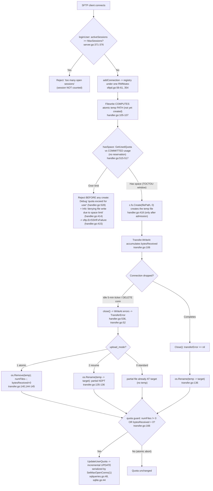

# SFTPGo Under Contention: Connection Handling, Quota Enforcement, Atomic Uploads, and the Idle Checker — an Evidence‑Grounded Investigation

> **Repository:** `github.com/drakkan/sftpgo` · **Commit under investigation:** `44634210287cb192f2a53147eafb84a33a96826b` · **Build identity:** `SFTPGo version: 0.9.5-dev`
>
> **Methodology (per rule `SWE-AtlasQnA-Repo`):** This document was written **from running code, not code reading alone**. The relevant paths were built and executed first; a strict‑quota, session‑limited user was provisioned; concurrent uploads were driven against it; transfers were killed mid‑stream; and the idle checker was allowed to fire. Every observed value — JSON log lines (with their level and exact message string), HTTP status/body, `sqlite3` query results, and filesystem listings — is quoted **verbatim** (exact raw output) together with the exact command that produced it. Explanatory notes are kept **outside** the quoted output blocks. Every factual claim carries an exact literal and a `file:line` citation. Where a claim is derived from reading code rather than runtime it is marked **(by code inspection)**; where an expected observation could not be forced it is **flagged** rather than asserted. All runtime artifacts lived in an isolated `/tmp` workspace and were removed afterward; the repository is left unchanged except for this one document.
>
> **Note on values across runs.** The primary scenario (build, provisioning, sessions, per‑step quota, TOCTOU, no‑lost‑updates, atomic abort, clean completion) was captured from a single server run. The `upload_mode` contrasts (modes 2 and 0), the genuine idle path, and the `-race` characterization required deliberate server restarts; each such block states its restart explicitly. Connection IDs, `xid` temp‑name suffixes, timestamps, and in‑flight byte counts are whatever the server actually emitted and therefore differ per operation — that is expected and correct.

---

## 1. The question and the scenario

### 1.1 The six sub‑questions

The investigation answers, explicitly, how SFTPGo coordinates **connection handling, per‑user session limits, quota enforcement, atomic uploads, and the periodic idle‑connection checker** when a strict‑quota user opens multiple sessions near `max_sessions` and launches concurrent uploads that collectively threaten to exceed **both** `quota_files` and `quota_size`, while the idle checker runs in the background:

- **Q1 — Burst under contention.** What happens when a strict‑quota user opens sessions near `max_sessions` and starts concurrent uploads collectively exceeding *both* `quota_files` and `quota_size`, while the idle checker terminates connections in the background.
- **Q2 — Quota coordination (race vs. serialize).** How quota updates are coordinated across simultaneous transfers — do the quota checks race or serialize cleanly, and *where* does that decision first manifest as runtime evidence.
- **Q3 — Atomic partial‑file accounting.** When an upload is partway through writing to a temporary file in atomic mode and the connection is dropped, what happens to the partial temp file and its quota accounting — is it cleaned up and reversed, or does it linger.
- **Q4 — Observable burst evidence.** What the actual logged messages, file states, and quota values look like during a burst — sessions accepted vs. rejected, how the quota numbers change at each step, and whether temp files survived that should not have.
- **Q5 — Kill‑mid‑stream vs. clean completion.** What gaps or inconsistencies appear when a transfer is deliberately killed mid‑stream compared with completing normally — the concrete signs in logs and on the filesystem that reveal which path was taken.
- **Q6 — Coordination under stress.** How the pieces coordinate under stress, where the handoffs happen, and the observable differences between a clean run and a contended run.

### 1.2 The scenario as provisioned

A single strict‑quota, session‑limited user named `strict` was created with **`max_sessions: 2`**, **`quota_files: 2`**, and **`quota_size: 4096`** (bytes). A second user `bulk` (`max_sessions: 0` = unlimited, `quota_files: 1000`, `quota_size: 10485760`) was used where a large quota budget was needed to isolate the write‑serialization and atomic‑abort behaviors from the quota‑denial behavior. Concurrent SFTP sessions and uploads were driven from a temporary `github.com/pkg/sftp` client harness. Transfers were dropped mid‑stream deterministically via the REST endpoint `DELETE /api/v1/connection/{connectionID}`, because — as shown in Q1/Q6 — the genuine idle path is intentionally coarse (minute‑granularity threshold, hard‑coded 5‑minute ticker).

### 1.3 How the pieces fit together (map of the coordination)



---

## 2. Environment and build

### 2.1 Toolchain and build

The server was built from the repository root with the Go 1.13.15 toolchain and CGO enabled (the default `github.com/mattn/go-sqlite3` provider requires CGO). The module declares `module github.com/drakkan/sftpgo` and `go 1.13` (`go.mod:1,3`), with the relevant pinned dependencies `github.com/pkg/sftp v1.11.0` (`go.mod:18`), `github.com/mattn/go-sqlite3 v2.0.2+incompatible` (`go.mod:15`), `github.com/rs/xid v1.2.1` (`go.mod:20`), and `github.com/rs/zerolog v1.17.2` (`go.mod:21`).

The build exited `0`. Its only output is a single harmless CGO warning emitted by go‑sqlite3's bundled C amalgamation; the command and its exact stderr:

```console
$ source /etc/profile.d/go.sh   # sets GO111MODULE=on, CGO_ENABLED=1, GOPATH=/root/go
$ cd /tmp/blitzy/sftpgo/blitzy-81dc959f-ec96-4f45-bd09-9ea4c4f3318c_193ae4
$ GOPROXY=off go build -o /tmp/sftpgo_obs/sftpgo
# github.com/mattn/go-sqlite3
sqlite3-binding.c: In function ‘sqlite3SelectNew’:
sqlite3-binding.c:125801:10: warning: function may return address of local variable [-Wreturn-local-addr]
125801 |   return pNew;
       |          ^~~~
sqlite3-binding.c:125761:10: note: declared here
125761 |   Select standin;
       |          ^~~~~~~
```

The resulting binary size (exact):

```console
$ stat -c '%s' /tmp/sftpgo_obs/sftpgo
31882120
```

The build identity was verified verbatim:

```console
$ /tmp/sftpgo_obs/sftpgo -v
SFTPGo version: 0.9.5-dev
```

This matches the version constant `version = "0.9.5-dev"` (`utils/version.go:3`) rendered through the version template `{{printf "SFTPGo version: "}}{{printf "%s" .Version}}` (followed by a newline) passed to `rootCmd.SetVersionTemplate` (`cmd/root.go:63`).

An optional race‑detector binary was also built for the Q2/Q6 characterization (full result in §4.11):

```console
$ GOPROXY=off go build -race -o /tmp/sftpgo_obs/sftpgo.race
$ stat -c '%s' /tmp/sftpgo_obs/sftpgo.race
39685616
```

### 2.2 Isolated runtime workspace and configuration overrides

All runtime state lived under `/tmp/sftpgo_obs/` (`config/`, `home/`, `db/`, `logs/`, `harness/`). The harness wrote its own `sftpgo.json` there, **overriding** the repository defaults. The repository default is `sftpd.upload_mode: 0` (standard) and `sftpd.idle_timeout: 15` — so atomic mode and a short idle timeout had to be set explicitly. The overrides used were:

| Key | Repo default | Harness override | Why |
|-----|--------------|------------------|-----|
| `sftpd.bind_port` | 2022 | 2022 | SFTP listener |
| `sftpd.idle_timeout` | 15 | **1** | Exercise the genuine idle path faster (still coarse — see Q1/Q6) |
| `sftpd.upload_mode` | **0** (standard) | **1** (atomic) | Observe the atomic temp‑file lifecycle; modes 2 and 0 contrasted later |
| `data_provider.driver` | sqlite | sqlite | Default provider; home of the write‑serialization point |
| `data_provider.track_quota` | 2 | 2 | Quota tracked for users *with* restrictions |
| `data_provider.name` | sftpgo.db | `/tmp/sftpgo_obs/db/sftpgo.db` | Keep the DB out of the repo |
| `httpd.bind_port` | 8080 | 8080 | REST control plane |
| `httpd.bind_address` | 127.0.0.1 | 127.0.0.1 | REST control plane |

The SQLite database file must be pre‑initialized before first run: `initializeSQLiteProvider` rejects an empty database file, so the `users` table DDL (taken from `.travis.yml`) was applied with the `sqlite3` CLI before starting the server **(by code inspection: `dataprovider/sqlite.go:18,33`)**.

### 2.3 Server startup (verbatim)

The server was started in the background with verbose (Debug‑level) JSON logging:

```console
$ nohup /tmp/sftpgo_obs/sftpgo serve -c /tmp/sftpgo_obs/config \
        -l /tmp/sftpgo_obs/logs/sftpgo.log --log-verbose \
        > /tmp/sftpgo_obs/logs/stdout.log 2>&1 &
```

Selected startup log lines, each quoted in full and verbatim, from `/tmp/sftpgo_obs/logs/sftpgo.log`:

```json
{"level":"info","time":"2026-07-01T05:56:50.405","sender":"service","connection_id":"","message":"starting SFTPGo 0.9.5-dev, config dir: /tmp/sftpgo_obs/config, config file: sftpgo, log max size: 10 log max backups: 5 log max age: 28 log verbose: true, log compress: false"}
{"level":"debug","time":"2026-07-01T05:56:50.406","sender":"sqlite","connection_id":"","message":"sqlite database handle created, connection string: \"file:/tmp/sftpgo_obs/db/sftpgo.db?cache=shared\""}
{"level":"info","time":"2026-07-01T05:56:50.406","sender":"sftpd","connection_id":"","message":"No host keys configured and \"/tmp/sftpgo_obs/config/id_rsa\" does not exist; creating new private key for server"}
{"level":"info","time":"2026-07-01T05:56:52.899","sender":"sftpd","connection_id":"","message":"Loading private key: /tmp/sftpgo_obs/config/id_rsa"}
{"level":"info","time":"2026-07-01T05:56:52.899","sender":"sftpd","connection_id":"","message":"server listener registered address: 127.0.0.1:2022"}
```

The `sqlite` line confirms the DSN `file:/tmp/sftpgo_obs/db/sftpgo.db?cache=shared` at runtime, matching the format string `"file:%v?cache=shared"` (`dataprovider/sqlite.go:37`). The host key was created under `/tmp`, not in the repository. Logs are structured JSON via `rs/zerolog` with the fields `level`, `time`, `sender`, `connection_id`, `message`.

### 2.4 REST control plane and user provisioning (verbatim)

The REST API answered on `127.0.0.1:8080`. Full raw response including all headers:

```console
$ curl -s -i http://127.0.0.1:8080/api/v1/version
HTTP/1.1 200 OK
Content-Type: application/json; charset=utf-8
Date: Wed, 01 Jul 2026 05:57:05 GMT
Content-Length: 57

{"version":"0.9.5-dev","build_date":"","commit_hash":""}
```

The strict user was created via `POST /api/v1/user` (path constant `userPath = "/api/v1/user"`, `httpd/httpd.go:24`; route `router.Post(userPath, ...)`, `httpd/router.go:79`). Note that in `0.9.5-dev` the REST router installs no authentication middleware, so the `POST` succeeds directly **(by code inspection: `httpd/router.go`)**. Full raw response:

```console
$ curl -s -i -X POST http://127.0.0.1:8080/api/v1/user -H "Content-Type: application/json" --data @harness/user_strict.json
HTTP/1.1 200 OK
Content-Type: application/json; charset=utf-8
Date: Wed, 01 Jul 2026 05:57:05 GMT
Content-Length: 401

{"id":1,"status":1,"username":"strict","expiration_date":0,"home_dir":"/tmp/sftpgo_obs/home/strict","uid":0,"gid":0,"max_sessions":2,"quota_size":4096,"quota_files":2,"permissions":{"/":["*"]},"used_quota_size":0,"used_quota_files":0,"last_quota_update":0,"upload_bandwidth":0,"download_bandwidth":0,"last_login":0,"filters":{"allowed_ip":[],"denied_ip":[]},"filesystem":{"provider":0,"s3config":{}}}
```

The `bulk` user was created the same way. Full raw response:

```console
$ curl -s -i -X POST http://127.0.0.1:8080/api/v1/user -H "Content-Type: application/json" --data @harness/user_bulk.json
HTTP/1.1 200 OK
Content-Type: application/json; charset=utf-8
Date: Wed, 01 Jul 2026 05:57:05 GMT
Content-Length: 404

{"id":2,"status":1,"username":"bulk","expiration_date":0,"home_dir":"/tmp/sftpgo_obs/home/bulk","uid":0,"gid":0,"max_sessions":0,"quota_size":10485760,"quota_files":1000,"permissions":{"/":["*"]},"used_quota_size":0,"used_quota_files":0,"last_quota_update":0,"upload_bandwidth":0,"download_bandwidth":0,"last_login":0,"filters":{"allowed_ip":[],"denied_ip":[]},"filesystem":{"provider":0,"s3config":{}}}
```

Confirmed in the database (columns: `username | max_sessions | quota_files | quota_size | used_quota_size | used_quota_files`):

```console
$ sqlite3 /tmp/sftpgo_obs/db/sftpgo.db 'SELECT username,max_sessions,quota_files,quota_size,used_quota_size,used_quota_files FROM users;'
strict|2|2|4096|0|0
bulk|0|1000|10485760|0|0
```

Because `track_quota` is `2` and the user has quota restrictions, its quota **is** tracked — `UpdateUserQuota` only short‑circuits for `config.TrackQuota == 2 && !reset && !user.HasQuotaRestrictions()` (`dataprovider/dataprovider.go:315`), and `HasQuotaRestrictions` returns true when `QuotaFiles > 0 || QuotaSize > 0` (`dataprovider/user.go:258`).

---

## 3. Answers

### Q1 — Burst under contention

**Summary.** Under a burst, SFTPGo enforces the two limits at two *different* gates. Session admission is enforced at login in `loginUser`; per‑write quota admission is enforced at each upload‑open in `hasSpace`. The idle checker runs on a separate, coarse timer and closes connections whose idle time exceeds the threshold. In the contended run, some sessions were **accepted** and some **rejected**, some writes **succeeded** and some were **denied**, and the connection registries were mutated under a single lock.

**Session admission (near `max_sessions`).** When a new session authenticates, `loginUser` checks the *current* active‑session count against the user's limit: `if user.MaxSessions > 0 { activeSessions := getActiveSessions(user.Username); if activeSessions >= user.MaxSessions { ... } }` (`sftpd/server.go:371-373`). On rejection it logs at **Debug** level the exact string `"authentication refused for user: %#v, too many open sessions: %v/%v"` (`sftpd/server.go:374`) and returns the error `fmt.Errorf("too many open sessions: %v", activeSessions)` (`sftpd/server.go:376`).

Observed, with `max_sessions: 2` and four sessions opened **staggered** (250 ms apart, held 1500 ms) so earlier sessions were already registered — the harness command and its exact output:

```console
$ /tmp/sftpgo_obs/harness/harness sessions 4 1500 250 strict strictpass
session 0: ACCEPTED wd="/"
session 1: ACCEPTED wd="/"
session 2: REJECTED after 81ms err="ssh: handshake failed: ssh: unable to authenticate, attempted methods [none password], no supported methods remain"
session 3: REJECTED after 91ms err="ssh: handshake failed: ssh: unable to authenticate, attempted methods [none password], no supported methods remain"
```

The corresponding server log lines, verbatim from `/tmp/sftpgo_obs/logs/sftpgo.log` (two rejections, each a Debug refusal followed by a Warn accept‑failure):

```json
{"level":"debug","time":"2026-07-01T06:02:24.280","sender":"sftpd","connection_id":"","message":"authentication refused for user: \"strict\", too many open sessions: 2/2"}
{"level":"warn","time":"2026-07-01T06:02:24.283","sender":"sftpd","connection_id":"","message":"failed to accept an incoming connection: [ssh: no auth passed yet, Authentication error: could not validate password credentials: too many open sessions: 2]"}
{"level":"debug","time":"2026-07-01T06:02:24.543","sender":"sftpd","connection_id":"","message":"authentication refused for user: \"strict\", too many open sessions: 2/2"}
{"level":"warn","time":"2026-07-01T06:02:24.543","sender":"sftpd","connection_id":"","message":"failed to accept an incoming connection: [ssh: no auth passed yet, Authentication error: could not validate password credentials: too many open sessions: 2]"}
```

So the accepted/rejected boundary is exactly `2/2`: two sessions accepted, the third and fourth rejected. (The subtle timing window that makes staggering necessary is analyzed in Q6.)

**Write admission (exceeding both quotas).** Each upload‑open routes through `Filewrite` (`sftpd/handler.go:98`) and, for a new file, `handleSFTPUploadToNewFile`, which calls `if !c.hasSpace(true)` and on failure logs **Info** `"denying file write due to space limit"` and returns `sftp.ErrSSHFxFailure` (`sftpd/handler.go:413-415`). The existing‑file path is symmetric at `sftpd/handler.go:453-455`. Inside `hasSpace`, when the user is over limit it logs **Debug** `"quota exceed for user %#v, num files: %v/%v, size: %v/%v check files: %v"` (`sftpd/handler.go:528`).

Observed, uploading 2048‑byte files one per step against `quota_files: 2`, `quota_size: 4096` (full per‑step transcript in Q4): steps 1 and 2 succeeded and filled the quota to `2|4096`; steps 3 and 4 were denied with the client receiving `sftp: "Failure" (SSH_FX_FAILURE)`. The two server log lines for the third step appear in this order — the Debug `quota exceed` emitted *inside* `hasSpace`, then the Info `denying file write`:

```json
{"level":"debug","time":"2026-07-01T06:02:43.973","sender":"sftpd","connection_id":"ccdc719e67ebf775c1018b97beb76e6fc8cc66bc14cdb716ac9069b7bea8b058","message":"quota exceed for user \"strict\", num files: 2/2, size: 4096/4096 check files: true"}
{"level":"info","time":"2026-07-01T06:02:43.973","sender":"sftpd","connection_id":"ccdc719e67ebf775c1018b97beb76e6fc8cc66bc14cdb716ac9069b7bea8b058","message":"denying file write due to space limit"}
```

The message reports **both** dimensions at once — `num files: 2/2` (file‑count limit reached) and `size: 4096/4096` (size limit reached) — which is exactly the "collectively exceed both `quota_files` and `quota_size`" condition the question asks about.

**Idle checker in the background.** The idle checker is a separate goroutine driven by a ticker. Its threshold is `idle_timeout`, documented in code as `"Maximum idle timeout as minutes"` (`sftpd/server.go:39`) and applied as `startIdleTimer(time.Duration(c.IdleTimeout) * time.Minute)` (`sftpd/server.go:189`). When a connection's idle time exceeds the threshold it is closed and logged at **Info**: `"close idle connection, idle time: %v, close error: %v"` (`sftpd/sftpd.go:348`). A genuine idle close was observed end‑to‑end (verbatim line in Q6 and §4.10). Crucially the ticker cadence is **hard‑coded to 5 minutes** — `idleConnectionTicker = time.NewTicker(5 * time.Minute)` (`sftpd/sftpd.go:132`) — so the idle path is coarse and is analyzed separately from the deterministic mid‑stream drop.

### Q2 — Quota coordination: the check races, the write serializes

**The check races.** The pre‑upload admission test `hasSpace` reads **committed** usage and decides without reserving anything: `numFile, size, err := dataprovider.GetUsedQuota(dataProvider, c.User.Username)` (`sftpd/handler.go:517`), then compares those committed numbers against the configured limits (`sftpd/handler.go:526-527`). There is no reservation, no in‑flight accounting, and no lock spanning the check‑then‑write. This is a classic **time‑of‑check/time‑of‑use (TOCTOU)** window: two concurrent uploads can both read the same committed usage, both pass, and then both commit — collectively overshooting the quota.

This was **reproduced on the first attempt.** After resetting `strict` to `0|0` via a quota scan (the reset endpoint recomputes usage from disk with `reset=true`, `httpd/api_quota.go`), four uploads of 2048 bytes were launched **concurrently** against limits `quota_files: 2`, `quota_size: 4096`. The reset, its confirmation, and the committed usage *before* the burst:

```console
$ rm -f /tmp/sftpgo_obs/home/strict/*.dat
$ curl -s -i -X POST http://127.0.0.1:8080/api/v1/quota_scan -H 'Content-Type: application/json' -d '{"username":"strict"}'
HTTP/1.1 201 Created
Content-Type: application/json; charset=utf-8
Date: Wed, 01 Jul 2026 06:03:32 GMT
Content-Length: 51

{"error":"","message":"Scan started","status":201}
$ curl -s http://127.0.0.1:8080/api/v1/quota_scan
[]
$ sqlite3 /tmp/sftpgo_obs/db/sftpgo.db "SELECT used_quota_files,used_quota_size FROM users WHERE username='strict';"
0|0
```

The four concurrent uploads (each writing 2 KB slowly, so all four are past `hasSpace` before any commits), and the committed usage *after*:

```console
$ for i in 0 1 2 3; do /tmp/sftpgo_obs/harness/harness bigupload strict strictpass toctou$i.dat 2 400 & done; wait
bigupload toctou1.dat: finished 2048 bytes close-err=<nil>
bigupload toctou2.dat: finished 2048 bytes close-err=<nil>
bigupload toctou3.dat: finished 2048 bytes close-err=<nil>
bigupload toctou0.dat: finished 2048 bytes close-err=<nil>
$ sqlite3 /tmp/sftpgo_obs/db/sftpgo.db "SELECT used_quota_files,used_quota_size FROM users WHERE username='strict';"
4|8192
```

All four uploads succeeded and the final usage `4|8192` **overshot both limits by 2×**. A grep of the server log during the burst for `quota exceed`/`denying file write` returned a count of **`0`** — zero denials — because all four `hasSpace` calls read the committed `0|0` before any transfer's `Close()` committed its increment. This is a **logical** race, not a memory race (see the `-race` result in §4.11).

**Where it first serializes at runtime.** The commit side is different. After a successful upload, `Transfer.Close()` calls `dataprovider.UpdateUserQuota(dataProvider, t.user, numFiles, t.bytesReceived, false)` (`sftpd/transfer.go:167`), which for the non‑reset path issues the **incremental** statement (`dataprovider/sqlqueries.go:48`):

```sql
UPDATE %v SET used_quota_size = used_quota_size + %v,used_quota_files = used_quota_files + %v,last_quota_update = %v WHERE username = %v
```

This statement is atomic at the SQL‑statement level (it reads‑and‑adds inside the database, not in Go), so it cannot lose an update to a concurrent increment. For SQLite specifically, **all** writes are additionally serialized by `dbHandle.SetMaxOpenConns(1)` (`dataprovider/sqlite.go:44`) over the shared‑cache DSN `"file:%v?cache=shared"` (`dataprovider/sqlite.go:37`). **This is the runtime serialization point.**

This was verified with a no‑lost‑updates test on user `bulk` (large quota budget so nothing is denied): **30 concurrent** 4096‑byte uploads produced an exact final total, not a smaller racy one. Committed usage before, the 30‑way burst (30 of 30 succeeded), and committed usage after, followed by the on‑disk reconciliation:

```console
$ sqlite3 /tmp/sftpgo_obs/db/sftpgo.db "SELECT used_quota_files,used_quota_size FROM users WHERE username='bulk';"
0|0
$ /tmp/sftpgo_obs/harness/harness burst bulk bulkpass 30 4096 conc_
upload 0 (conc_0.dat): OK 4096 bytes
upload 29 (conc_29.dat): OK 4096 bytes
$ sqlite3 /tmp/sftpgo_obs/db/sftpgo.db "SELECT used_quota_files,used_quota_size FROM users WHERE username='bulk';"
30|122880
$ ls /tmp/sftpgo_obs/home/bulk | wc -l
30
$ cat /tmp/sftpgo_obs/home/bulk/* | wc -c
122880
```

(The burst printed 30 result lines, all `OK 4096 bytes`; the first and last are shown.) The final `30|122880` is exact — `30` files and `30 × 4096 = 122880` bytes — and matches the on‑disk file count (`30`) and byte total (`122880`). **No update was lost**, despite 30 concurrent increments: the single‑writer SQLite serialization plus the additive `UPDATE` guarantee exactness.

**`-race` confirms: no data race, but a logical race remains.** The optional race binary (39685616 bytes vs. the normal 31882120) drove 30 concurrent uploads plus a concurrent 4‑way burst; the race detector reported **zero** data races (`grep -c 'DATA RACE'` → `0`, §4.11). This is consistent, not contradictory: the in‑memory registries are correctly guarded by one `sync.RWMutex` (`sftpd/sftpd.go:56`), so there is no unsynchronized shared‑memory access for the happens‑before detector to flag. The quota overshoot is a *logical* TOCTOU across two separate committed‑usage reads, which involves no shared‑memory data race and is therefore invisible to `-race`. In short: **the check races logically; the write serializes; and the two facts coexist without any memory data race.**

### Q3 — Atomic partial‑file accounting when a connection is dropped mid‑stream

**Summary.** In atomic mode (`upload_mode: 1`), when the connection is dropped mid‑write, SFTPGo **deletes the temporary file and reverses the accounting so no quota is charged**. The partial upload leaves *no* footprint: no temp file and no quota delta. This is the exact opposite of standard mode, and different again from atomic‑with‑resume.

**The decision tree** in `Transfer.Close()` (`sftpd/transfer.go:121`): a file count `numFiles` is set to 1 for a new file. The atomic branch is taken only when a temp file exists distinct from the target — `if t.transferType == transferUpload && t.file != nil && t.file.Name() != t.path` (`sftpd/transfer.go:134`). Within it:

- If there was **no error** *or* the mode is atomic‑with‑resume — `if t.transferError == nil || uploadMode == uploadModeAtomicWithResume` (`sftpd/transfer.go:135`) — it **renames** temp → target via `os.Rename(t.file.Name(), t.path)` and logs **Debug** `"atomic upload completed, rename: %#v -> %#v, error: %v"` (`sftpd/transfer.go:136-137`).
- Otherwise (error, plain atomic) it **deletes** the temp file via `os.Remove(...)` and logs **Warn** `"atomic upload completed with error: \"%v\", delete temporary file: %#v, deletion error: %v"` (`sftpd/transfer.go:140-141`); and *if the delete succeeded*, it reverses the accounting: `numFiles--` and `t.bytesReceived = 0` (`sftpd/transfer.go:144-145`).

The quota update is then **guarded**: `if t.transferType == transferUpload && (numFiles != 0 || t.bytesReceived > 0)` (`sftpd/transfer.go:166`). After an atomic abort, `numFiles` has been decremented to `0` and `bytesReceived` zeroed, so the guard is **false** and `UpdateUserQuota` is **skipped** — the quota is untouched.

**Observed (mode 1, atomic).** A large slow upload to `bigABORT.dat` on user `bulk` (committed usage `30|122880` beforehand) was started, its live connection listed, then force‑closed mid‑stream. Committed usage before, and the live connection listing during the transfer (raw single‑line JSON exactly as `curl` returned it):

```console
$ sqlite3 /tmp/sftpgo_obs/db/sftpgo.db "SELECT used_quota_files,used_quota_size FROM users WHERE username='bulk';"
30|122880
$ curl -s http://127.0.0.1:8080/api/v1/connection
[{"username":"bulk","connection_id":"f6a2f9933058be6570ce9b029bb5f63d9a235cf4f83a440e20aca3803dc83e2b","client_version":"SSH-2.0-Go","remote_address":"127.0.0.1:36478","connection_time":1782885872177,"last_activity":1782885875050,"protocol":"SFTP","active_transfers":[{"operation_type":"upload","start_time":1782885872222,"size":72704,"last_activity":1782885875050,"path":"/bigABORT.dat"}],"ssh_command":""}]
```

The temp file used the naming scheme `.sftpgo-upload.<xid>.<name>` — `filepath.Join(dir, ".sftpgo-upload."+guid+"."+filepath.Base(name))` where `guid := xid.New().String()` (`vfs/osfs.go:177-178`). Present during the transfer:

```console
$ ls -la /tmp/sftpgo_obs/home/bulk | grep -E 'sftpgo-upload|bigABORT'
-rw-r--r-- 1 root root 72704 Jul  1 06:04 .sftpgo-upload.d92ars46ct9qi37o9jtg.bigABORT.dat
```

The connection was force‑closed mid‑stream (full raw response with headers), and the client (harness) saw the write fail with EOF:

```console
$ curl -s -i -X DELETE http://127.0.0.1:8080/api/v1/connection/f6a2f9933058be6570ce9b029bb5f63d9a235cf4f83a440e20aca3803dc83e2b
HTTP/1.1 200 OK
Content-Type: application/json; charset=utf-8
Date: Wed, 01 Jul 2026 06:04:35 GMT
Content-Length: 56

{"error":"","message":"Connection closed","status":200}
```

```console
$ /tmp/sftpgo_obs/harness/harness bigupload bulk bulkpass bigABORT.dat 300 40
bigupload bigABORT.dat: write error after 73728 bytes: failed to send packet: EOF
```

After the abort, the temp file is gone (no target was ever created), and committed usage is unchanged:

```console
$ ls -la /tmp/sftpgo_obs/home/bulk | grep -E 'sftpgo-upload|bigABORT' || echo '(no temp/target file — cleaned up)'
(no temp/target file — cleaned up)
$ sqlite3 /tmp/sftpgo_obs/db/sftpgo.db "SELECT used_quota_files,used_quota_size FROM users WHERE username='bulk';"
30|122880
```

The verbatim log sequence proves the delete‑and‑reverse path ran (Warn `TransferError`, Warn atomic‑delete, Warn `transfer error`; the `deletion error: <nil>` confirms `os.Remove` succeeded):

```json
{"level":"warn","time":"2026-07-01T06:04:35.091","sender":"sftpd","connection_id":"f6a2f9933058be6570ce9b029bb5f63d9a235cf4f83a440e20aca3803dc83e2b","message":"Unexpected error for transfer, path: \"/tmp/sftpgo_obs/home/bulk/bigABORT.dat\", error: \"EOF\" bytes sent: 0, bytes received: 73728 transfer running since 2869 ms"}
{"level":"warn","time":"2026-07-01T06:04:35.091","sender":"sftpd","connection_id":"f6a2f9933058be6570ce9b029bb5f63d9a235cf4f83a440e20aca3803dc83e2b","message":"atomic upload completed with error: \"EOF\", delete temporary file: \"/tmp/sftpgo_obs/home/bulk/.sftpgo-upload.d92ars46ct9qi37o9jtg.bigABORT.dat\", deletion error: <nil>"}
{"level":"warn","time":"2026-07-01T06:04:35.091","sender":"sftpd","connection_id":"f6a2f9933058be6570ce9b029bb5f63d9a235cf4f83a440e20aca3803dc83e2b","message":"transfer error: EOF, path: \"/tmp/sftpgo_obs/home/bulk/bigABORT.dat\""}
```

Because `os.Remove` succeeded, `numFiles--`/`bytesReceived = 0` ran and the quota guard suppressed the update. **In atomic mode, the partial temp file is cleaned up and the quota accounting is reversed — nothing lingers.**

**Contrast — the three modes, same interrupted upload** (this is an analytical summary; the raw per‑mode evidence is in Q5):

| `upload_mode` | Temp file used? | On mid‑stream drop | Leftover at target? | Quota after abort | Governing code |
|---|---|---|---|---|---|
| `0` standard | No (`t.file.Name() == t.path`) | partial written directly to target | **partial LINGERS** | **applied** (+file, +partial bytes) | atomic branch skipped (`transfer.go:134`) |
| `1` atomic | Yes | `os.Remove(temp)`; `numFiles--`; `bytesReceived=0` | **none** | **unchanged** | `transfer.go:140,144-145,166` |
| `2` atomic‑with‑resume | Yes | `os.Rename(temp → target)` | **partial KEPT** (renamed) | **applied** | `transfer.go:135-136` |

### Q4 — Observable burst evidence (logs, file states, quota values)

This section collects the concrete, verbatim observables for a burst.

**Sessions accepted vs. rejected.** With `max_sessions: 2`, staggered opens gave exactly two accepted and the rest rejected, with the Debug `too many open sessions: 2/2` line and the Warn `failed to accept an incoming connection` line quoted verbatim in Q1. (When four sessions were opened *simultaneously*, all four were briefly accepted — the timing window quoted and explained in Q6.)

**How the quota numbers change at each step.** Uploading 2048‑byte files sequentially against `quota_files: 2`, `quota_size: 4096`. The full transcript — each step's harness command and its `sqlite3` reading immediately after — verbatim:

```console
$ sqlite3 /tmp/sftpgo_obs/db/sftpgo.db "SELECT used_quota_files,used_quota_size FROM users WHERE username='strict';"
0|0
$ /tmp/sftpgo_obs/harness/harness put strict strictpass step1.dat 2048
put step1.dat: OK 2048 bytes
$ sqlite3 /tmp/sftpgo_obs/db/sftpgo.db "SELECT used_quota_files,used_quota_size FROM users WHERE username='strict';"
1|2048
$ /tmp/sftpgo_obs/harness/harness put strict strictpass step2.dat 2048
put step2.dat: OK 2048 bytes
$ sqlite3 /tmp/sftpgo_obs/db/sftpgo.db "SELECT used_quota_files,used_quota_size FROM users WHERE username='strict';"
2|4096
$ /tmp/sftpgo_obs/harness/harness put strict strictpass step3.dat 2048
put step3.dat: create error: sftp: "Failure" (SSH_FX_FAILURE)
$ sqlite3 /tmp/sftpgo_obs/db/sftpgo.db "SELECT used_quota_files,used_quota_size FROM users WHERE username='strict';"
2|4096
$ /tmp/sftpgo_obs/harness/harness put strict strictpass step4.dat 2048
put step4.dat: create error: sftp: "Failure" (SSH_FX_FAILURE)
$ sqlite3 /tmp/sftpgo_obs/db/sftpgo.db "SELECT used_quota_files,used_quota_size FROM users WHERE username='strict';"
2|4096
```

The on‑disk result confirms only the two admitted files exist (the denied steps created nothing):

```console
$ ls -la /tmp/sftpgo_obs/home/strict
total 16
drwxr-xr-x 2 root root 4096 Jul  1 06:02 .
drwxr-xr-x 4 root root 4096 Jul  1 05:56 ..
-rw-r--r-- 1 root root 2048 Jul  1 06:02 step1.dat
-rw-r--r-- 1 root root 2048 Jul  1 06:02 step2.dat
```

Step 4's denial emitted the same pair as step 3, at a distinct connection id:

```json
{"level":"debug","time":"2026-07-01T06:02:44.125","sender":"sftpd","connection_id":"84efd2f448bb5e84e2427fae94b6e6a7c7d51fbfe00db985880952d4e73758ed","message":"quota exceed for user \"strict\", num files: 2/2, size: 4096/4096 check files: true"}
{"level":"info","time":"2026-07-01T06:02:44.125","sender":"sftpd","connection_id":"84efd2f448bb5e84e2427fae94b6e6a7c7d51fbfe00db985880952d4e73758ed","message":"denying file write due to space limit"}
```

The client error `sftp: "Failure" (SSH_FX_FAILURE)` is the surface form of the server returning `sftp.ErrSSHFxFailure` (`sftpd/handler.go:415`).

**Whether temp files survived that should not have.** For **denied** new‑file uploads there is no temp file to survive, and the reason is a precise ordering in the code: `Filewrite` *computes* the atomic temp pathname before admission — `filePath := p` then, in atomic mode, `filePath = c.fs.GetAtomicUploadPath(p)` (`sftpd/handler.go:105-107`) — but it does **not** create the file there. Creation happens only inside `handleSFTPUploadToNewFile`, which first calls `if !c.hasSpace(true)` and, on failure, returns `sftp.ErrSSHFxFailure` (`sftpd/handler.go:413-415`) **before** ever reaching `c.fs.Create(filePath, 0)` (`sftpd/handler.go:418`). So a denied new‑file upload creates **no** `.sftpgo-upload.*` temp file — the pathname is merely a computed string that is discarded when admission fails. This is confirmed by the `ls` above: only `step1.dat` and `step2.dat` exist; no `step3.dat`/`step4.dat` and no temp file. For an **aborted in‑flight** atomic upload, the temp file *is* created (post‑admission) and then deleted — confirmed by the before/after listings in Q3 (`.sftpgo-upload.d92ars46ct9qi37o9jtg.bigABORT.dat` present during, absent after). The one mode in which a partial file *does* survive is standard mode (Q3/Q5), and that is by design, not an anomaly.

**The burst overshoot.** The concurrent burst on `strict` moved committed usage from `0|0` to `4|8192` with zero denials (Q2) — the observable signature of the racing check.

### Q5 — Kill‑mid‑stream vs. clean completion

**Summary.** The two paths are distinguishable by both **logs** and **filesystem**. A killed transfer produces **Warn**‑level error/cleanup lines and (in atomic mode) leaves nothing behind; a clean completion produces a **Debug** rename line plus an **Info** `Upload` transfer‑log line and leaves the finished file at the target with the quota incremented.

**Clean completion (mode 1, atomic).** A 4096‑byte upload to `clean.dat` on `bulk` finished normally. Committed usage before/after (`30|122880` → `31|126976`, +1 file, +4096 bytes) and the file at the target:

```console
$ sqlite3 /tmp/sftpgo_obs/db/sftpgo.db "SELECT used_quota_files,used_quota_size FROM users WHERE username='bulk';"
30|122880
$ /tmp/sftpgo_obs/harness/harness put bulk bulkpass clean.dat 4096
put clean.dat: OK 4096 bytes
$ sqlite3 /tmp/sftpgo_obs/db/sftpgo.db "SELECT used_quota_files,used_quota_size FROM users WHERE username='bulk';"
31|126976
$ ls -la /tmp/sftpgo_obs/home/bulk/clean.dat
-rw-r--r-- 1 root root 4096 Jul  1 06:05 /tmp/sftpgo_obs/home/bulk/clean.dat
```

The verbatim log for the clean completion — the Debug rename (temp → target, `error: <nil>`) and the Info `Upload` transfer log:

```json
{"level":"debug","time":"2026-07-01T06:05:00.128","sender":"sftpd","connection_id":"efdc6b52662af418c9179aa7eedd8caa5c79933e34b583dbe30a36ea0d7fe48a","message":"atomic upload completed, rename: \"/tmp/sftpgo_obs/home/bulk/.sftpgo-upload.d92as346ct9qi37o9ju0.clean.dat\" -> \"/tmp/sftpgo_obs/home/bulk/clean.dat\", error: <nil>"}
{"level":"info","time":"2026-07-01T06:05:00.128","sender":"Upload","elapsed_ms":0,"size_bytes":4096,"username":"bulk","file_path":"/tmp/sftpgo_obs/home/bulk/clean.dat","connection_id":"efdc6b52662af418c9179aa7eedd8caa5c79933e34b583dbe30a36ea0d7fe48a","protocol":"SFTP"}
```

The second line is the `TransferLog` emitter with `sender` = the operation (`"Upload"`) and fields `elapsed_ms`, `size_bytes`, `username`, `file_path`, `connection_id`, `protocol` (`logger/logger.go:139`). **Its presence is the positive signal of a clean completion** — an aborted transfer never emits an `Upload` transfer‑log line; instead it emits `transfer error: %v, path: %#v` at Warn (`sftpd/transfer.go:159`).

**Killed mid‑stream — atomic (mode 1).** The full three‑line log sequence is quoted verbatim in Q3: a Warn `Unexpected error for transfer` line (reporting `bytes received: 73728`), a Warn `atomic upload completed with error` line (reporting `deletion error: <nil>`), and a Warn `transfer error: EOF` line. There is no `Upload` transfer‑log line. Filesystem: temp deleted, target absent. Quota: unchanged. (One subtle field to note in that Q3 capture: the `Unexpected error for transfer` line reports `bytes sent: 0` even for an upload because `bytes sent` is the *download* counter `t.bytesSent`; the uploaded byte count is carried by `bytes received` = `t.bytesReceived` — `sftpd/transfer.go:52,63-64`.)

**Killed mid‑stream — atomic‑with‑resume (mode 2).** This required restarting the server with `upload_mode: 2`. The temp file is **renamed to the target and kept** even though there was an error, because the branch condition includes `uploadMode == uploadModeAtomicWithResume` (`sftpd/transfer.go:135`). The restart, the mid‑stream temp file, the force‑close, and the after‑state (target kept at 72704 bytes; quota `31|126976` → `32|199680`, +72704):

```console
$ sed -i 's/"upload_mode": 1/"upload_mode": 2/' /tmp/sftpgo_obs/config/sftpgo.json
$ grep upload_mode /tmp/sftpgo_obs/config/sftpgo.json
    "upload_mode": 2,
$ ls -la /tmp/sftpgo_obs/home/bulk | grep -E 'sftpgo-upload|resumeABORT'
-rw-r--r-- 1 root root 72704 Jul  1 06:05 .sftpgo-upload.d92ascs6ct9rfdnunqr0.resumeABORT.dat
$ curl -s -i -X DELETE http://127.0.0.1:8080/api/v1/connection/5d3bf19d73bd5b21bc2c77a48f05d6c1828ec381e1e529f1c1108ce47fdbc3a0
HTTP/1.1 200 OK
{"error":"","message":"Connection closed","status":200}
$ ls -la /tmp/sftpgo_obs/home/bulk | grep -E 'sftpgo-upload|resumeABORT'
-rw-r--r-- 1 root root 72704 Jul  1 06:05 resumeABORT.dat
$ sqlite3 /tmp/sftpgo_obs/db/sftpgo.db "SELECT used_quota_files,used_quota_size FROM users WHERE username='bulk';"
32|199680
```

The verbatim log — the **Debug rename line appears despite the error** (the key distinguishing sign from mode 1), and no atomic‑delete line:

```json
{"level":"warn","time":"2026-07-01T06:05:42.431","sender":"sftpd","connection_id":"5d3bf19d73bd5b21bc2c77a48f05d6c1828ec381e1e529f1c1108ce47fdbc3a0","message":"Unexpected error for transfer, path: \"/tmp/sftpgo_obs/home/bulk/resumeABORT.dat\", error: \"EOF\" bytes sent: 0, bytes received: 72704 transfer running since 2857 ms"}
{"level":"debug","time":"2026-07-01T06:05:42.431","sender":"sftpd","connection_id":"5d3bf19d73bd5b21bc2c77a48f05d6c1828ec381e1e529f1c1108ce47fdbc3a0","message":"atomic upload completed, rename: \"/tmp/sftpgo_obs/home/bulk/.sftpgo-upload.d92ascs6ct9rfdnunqr0.resumeABORT.dat\" -> \"/tmp/sftpgo_obs/home/bulk/resumeABORT.dat\", error: <nil>"}
{"level":"warn","time":"2026-07-01T06:05:42.431","sender":"sftpd","connection_id":"5d3bf19d73bd5b21bc2c77a48f05d6c1828ec381e1e529f1c1108ce47fdbc3a0","message":"transfer error: EOF, path: \"/tmp/sftpgo_obs/home/bulk/resumeABORT.dat\""}
```

**Killed mid‑stream — standard (mode 0).** This required restarting the server with `upload_mode: 0`. No temp file is used (`t.file.Name() == t.path`), so the atomic branch at `sftpd/transfer.go:134` is skipped entirely; the partial bytes are written **directly to the target**, which therefore lingers, and the quota is still applied. The restart, the mid‑stream listing (partial `stdABORT.dat` present at the target, **no** `.sftpgo-upload` temp), and the after‑state (partial lingers at 72704 bytes; quota `32|199680` → `33|272384`, +72704):

```console
$ sed -i 's/"upload_mode": 2/"upload_mode": 0/' /tmp/sftpgo_obs/config/sftpgo.json
$ grep upload_mode /tmp/sftpgo_obs/config/sftpgo.json
    "upload_mode": 0,
$ ls -la /tmp/sftpgo_obs/home/bulk | grep -E 'sftpgo-upload|stdABORT'
-rw-r--r-- 1 root root 71680 Jul  1 06:06 stdABORT.dat
$ curl -s -i -X DELETE http://127.0.0.1:8080/api/v1/connection/7024db8e84cd5610715cf807699495a55c375e3e078236696fcc42fcb27da81d
HTTP/1.1 200 OK
{"error":"","message":"Connection closed","status":200}
$ ls -la /tmp/sftpgo_obs/home/bulk | grep -E 'sftpgo-upload|stdABORT'
-rw-r--r-- 1 root root 72704 Jul  1 06:06 stdABORT.dat
$ sqlite3 /tmp/sftpgo_obs/db/sftpgo.db "SELECT used_quota_files,used_quota_size FROM users WHERE username='bulk';"
33|272384
```

The verbatim log — note the **absence** of any `atomic upload completed` line (a grep for it during this abort returned `0`); only the `TransferError` Warn and the `transfer error` Warn appear:

```json
{"level":"warn","time":"2026-07-01T06:06:21.072","sender":"sftpd","connection_id":"7024db8e84cd5610715cf807699495a55c375e3e078236696fcc42fcb27da81d","message":"Unexpected error for transfer, path: \"/tmp/sftpgo_obs/home/bulk/stdABORT.dat\", error: \"EOF\" bytes sent: 0, bytes received: 72704 transfer running since 2837 ms"}
{"level":"warn","time":"2026-07-01T06:06:21.072","sender":"sftpd","connection_id":"7024db8e84cd5610715cf807699495a55c375e3e078236696fcc42fcb27da81d","message":"transfer error: EOF, path: \"/tmp/sftpgo_obs/home/bulk/stdABORT.dat\""}
```

**The concrete "which path was taken" signs, side by side** (analytical summary of the four verbatim captures above):

| Signal | Clean completion | Killed (atomic 1) | Killed (resume 2) | Killed (standard 0) |
|---|---|---|---|---|
| `Unexpected error for transfer` (Warn) | absent | present | present | present |
| `atomic upload completed, rename` (Debug) | present | absent | **present** | absent |
| `atomic upload completed with error ... delete temporary file` (Warn) | absent | **present** | absent | absent |
| `transfer error: EOF` (Warn) | absent | present | present | present |
| `Upload` transfer log (Info) | **present** | absent | absent | absent |
| File at target | final file | **none** | partial (72704) | partial (72704) |
| `.sftpgo-upload.*` temp | none (renamed away) | **none (deleted)** | none (renamed away) | never existed |
| Quota delta | **+full (+4096)** | **0** | +partial (+72704) | +partial (+72704) |

### Q6 — Coordination under stress: handoffs and clean‑vs‑contended differences

**Where the handoffs happen.** All shared connection state lives in package‑level registries guarded by a **single** `sync.RWMutex`: `mutex sync.RWMutex`, `openConnections map[string]Connection`, `activeTransfers []*Transfer`, and `activeQuotaScans []ActiveQuotaScan` (`sftpd/sftpd.go:56-61`). Connections are added/removed through `addConnection` (`sftpd/sftpd.go:354`) and looked up by `getActiveSessions` (`sftpd/sftpd.go:200`); the REST force‑close path `CloseActiveConnection` (`sftpd/sftpd.go:262`) takes the same lock and calls the connection's `close()`. The REST `GET /api/v1/connection` surfaces these registries directly, which is how the harness obtained the live `connection_id` (a 64‑hex‑char string from `hex.EncodeToString(sconn.SessionID())`, `sftpd/server.go:267`) to target the `DELETE` — for example `f6a2f9933058be6570ce9b029bb5f63d9a235cf4f83a440e20aca3803dc83e2b` in Q3.

**The login‑before‑register window.** There is a subtle race in session admission: `loginUser` reads the count with `getActiveSessions` (`sftpd/server.go:372`) *before* the new connection is registered by `addConnection` (`sftpd/sftpd.go:354`). Concurrent logins can therefore all observe a stale, lower count and all pass. This was **reproduced**: four sessions opened simultaneously (`stagger = 0`) against `max_sessions: 2` were **all accepted** (a server‑log grep for `too many open sessions` during the open returned `0`), whereas the same four opened 250 ms apart produced exactly two acceptances and two rejections (Q1). Verbatim:

```console
$ /tmp/sftpgo_obs/harness/harness sessions 4 1500 0 strict strictpass
session 0: ACCEPTED wd="/"
session 1: ACCEPTED wd="/"
session 2: ACCEPTED wd="/"
session 3: ACCEPTED wd="/"
```

The limit is enforced correctly once earlier sessions are registered; the window is only open for near‑simultaneous logins. This is the session‑admission analogue of the quota TOCTOU in Q2 — a check that races because it reads state that is committed slightly later.

**The deterministic drop lever vs. the genuine idle path.** Because `idle_timeout` is expressed in **minutes** (`sftpd/server.go:39,189`) and the ticker is **hard‑coded to 5 minutes** (`sftpd/sftpd.go:132`), the natural idle path is too coarse for repeatable mid‑stream evidence. The repeatable lever is REST `DELETE /api/v1/connection/{connectionID}` → `CloseActiveConnection` → `close()` (route `router.Delete(activeConnectionsPath+"/{connectionID}", ...)`, `httpd/router.go:63`; `activeConnectionsPath = "/api/v1/connection"`, `httpd/httpd.go:22`). The genuine idle path was nonetheless observed end‑to‑end: with `idle_timeout: 1`, a connection opened right after a server restart was **not** closed at the ~1‑minute mark but only at the next 5‑minute tick. The verbatim ticker/close/ended sequence:

```json
{"level":"debug","time":"2026-07-01T06:12:32.768","sender":"sftpd","connection_id":"","message":"idle connections check ticker 2026-07-01 06:12:32.768167638 +0000 UTC m=+300.003428662"}
{"level":"info","time":"2026-07-01T06:12:32.768","sender":"sftpd","connection_id":"ac7d0f4385fbabc023febcfab7007ebd3f1e78bca62cf2c4e1ccb721ef48fcf9","message":"close idle connection, idle time: 4m56.865036184s, close error: <nil>"}
{"level":"debug","time":"2026-07-01T06:12:32.768","sender":"sftpd","connection_id":"","message":"check idle connections ended"}
```

The ticker fired at `m=+300.003428662` — i.e. 300.003 seconds (5 minutes) after the server started — and the `idle time: 4m56.865036184s` value (far past the 1‑minute threshold) is direct evidence that the threshold sets *eligibility* while the **5‑minute ticker sets the cadence**.

**Clean run vs. contended run, side by side** (analytical summary of the verbatim evidence above):

| Aspect | Clean run (1 session, upload completes) | Contended run (burst near limits, mid‑stream aborts) |
|---|---|---|
| Session admission | accepted | some accepted, some rejected (`too many open sessions: 2/2`, Debug) |
| Write admission | passes `hasSpace` | some denied (`quota exceed ...` Debug + `denying file write ...` Info → `SSH_FX_FAILURE`) |
| Quota check | reads committed, no contention | **races** (TOCTOU): concurrent reads of committed usage can both pass |
| Quota write | one incremental `UPDATE` | **serialized** by `SetMaxOpenConns(1)`; increments additive/exact (`30|122880`), can *overshoot* limits (`4|8192`) but never *loses* updates |
| Transfer end | `os.Rename` + `Upload` transfer log + quota increment | Warn `Unexpected error` + Warn `transfer error`; atomic → temp deleted + quota unchanged; standard → partial lingers + quota applied |
| Filesystem | final files only | temp files appear then (mode 1) vanish; (mode 0) partials linger |
| Data races (`-race`) | none | **none** (registries correctly locked) — overshoot is logical, not a memory race |

---

## 4. Evidence appendix

Every artifact below is quoted verbatim (exact raw output) and paired with the exact command or code location that produced it. Explanatory notes are kept outside the quoted blocks. Timestamps are UTC as emitted by the server. Connection IDs are the server's own `hex.EncodeToString(sconn.SessionID())` values (`sftpd/server.go:267`).

### 4.1 The temporary observation harness

A small `github.com/pkg/sftp` client (a temporary Go module under `/tmp/sftpgo_obs/harness`, outside the repository) drove the concurrency. Its subcommands (exact signatures) are:

```text
sessions N holdMs staggerMs user pass     — open N sessions, report ACCEPTED/REJECTED (with full error), hold each holdMs, stagger opens by staggerMs
put      user pass remote sizeBytes       — single upload of sizeBytes zero bytes
burst    user pass count sizeBytes prefix — `count` concurrent uploads (each its own SSH connection) named <prefix>N.dat
bigupload user pass remote totalKB delayMs — one slow upload (1KB chunks, delayMs between) for mid-stream abort
idlehold user pass holdSec                — open one session and hold it idle for holdSec seconds
```

It was built offline against the cached dependencies and removed during cleanup:

```console
$ GOPROXY=off go build -o /tmp/sftpgo_obs/harness/harness .
$ /tmp/sftpgo_obs/harness/harness
usage: harness <sessions|put|burst|bigupload|idlehold> ...
```

(The trailing `...` on that last line is part of the harness's own printed usage string — the exact verbatim output of running the binary with no arguments, which exits with status `64` — not an elision.)

### 4.2 Commands used (index)

```console
# Build + identity
$ GOPROXY=off go build -o /tmp/sftpgo_obs/sftpgo
$ /tmp/sftpgo_obs/sftpgo -v

# Start server (verbose = Debug-level JSON logs)
$ nohup /tmp/sftpgo_obs/sftpgo serve -c /tmp/sftpgo_obs/config -l /tmp/sftpgo_obs/logs/sftpgo.log --log-verbose &

# REST control plane
$ curl -s -i      http://127.0.0.1:8080/api/v1/version
$ curl -s -i -X POST http://127.0.0.1:8080/api/v1/user       -H "Content-Type: application/json" --data @harness/user_strict.json
$ curl -s -i      http://127.0.0.1:8080/api/v1/connection
$ curl -s -i -X POST http://127.0.0.1:8080/api/v1/quota_scan -H "Content-Type: application/json" -d '{"username":"strict"}'
$ curl -s -i -X DELETE "http://127.0.0.1:8080/api/v1/connection/<connectionID>"

# Quota inspection
$ sqlite3 /tmp/sftpgo_obs/db/sftpgo.db "SELECT used_quota_files,used_quota_size FROM users WHERE username='strict';"
```

### 4.3 HTTP responses (verbatim)

`GET /api/v1/version`, full raw response:

```console
$ curl -s -i http://127.0.0.1:8080/api/v1/version
HTTP/1.1 200 OK
Content-Type: application/json; charset=utf-8
Date: Wed, 01 Jul 2026 05:57:05 GMT
Content-Length: 57

{"version":"0.9.5-dev","build_date":"","commit_hash":""}
```

`POST /api/v1/quota_scan` (reset `strict` to recompute usage), full raw response:

```console
$ curl -s -i -X POST http://127.0.0.1:8080/api/v1/quota_scan -H 'Content-Type: application/json' -d '{"username":"strict"}'
HTTP/1.1 201 Created
Content-Type: application/json; charset=utf-8
Date: Wed, 01 Jul 2026 06:03:32 GMT
Content-Length: 51

{"error":"","message":"Scan started","status":201}
```

`DELETE /api/v1/connection/{connectionID}` (force‑close the mode‑1 atomic transfer), full raw response:

```console
$ curl -s -i -X DELETE http://127.0.0.1:8080/api/v1/connection/f6a2f9933058be6570ce9b029bb5f63d9a235cf4f83a440e20aca3803dc83e2b
HTTP/1.1 200 OK
Content-Type: application/json; charset=utf-8
Date: Wed, 01 Jul 2026 06:04:35 GMT
Content-Length: 56

{"error":"","message":"Connection closed","status":200}
```

The server also logged the `DELETE` in its httpd access log (verbatim):

```json
{"level":"info","time":"2026-07-01T06:04:35.091","sender":"httpd","method":"DELETE","proto":"HTTP/1.1","remote_addr":"127.0.0.1:59886","request_id":"reverse-code-generator-68fa1532-6zbg6/aJfjsCdm5y-000010","uri":"http://127.0.0.1:8080/api/v1/connection/f6a2f9933058be6570ce9b029bb5f63d9a235cf4f83a440e20aca3803dc83e2b","user_agent":"curl/8.14.1","resp_status":200,"resp_size":56,"elapsed_ms":0}
```

### 4.4 Active‑connection listing during a transfer (verbatim, raw)

The raw single‑line JSON exactly as `curl` returned it while `bigABORT.dat` was in flight (the `active_transfers[0].size` field is the server's in‑flight byte count at the moment of the request):

```console
$ curl -s http://127.0.0.1:8080/api/v1/connection
[{"username":"bulk","connection_id":"f6a2f9933058be6570ce9b029bb5f63d9a235cf4f83a440e20aca3803dc83e2b","client_version":"SSH-2.0-Go","remote_address":"127.0.0.1:36478","connection_time":1782885872177,"last_activity":1782885875050,"protocol":"SFTP","active_transfers":[{"operation_type":"upload","start_time":1782885872222,"size":72704,"last_activity":1782885875050,"path":"/bigABORT.dat"}],"ssh_command":""}]
```

### 4.5 Session rejection (verbatim, `sftpgo.log`)

```json
{"level":"debug","time":"2026-07-01T06:02:24.280","sender":"sftpd","connection_id":"","message":"authentication refused for user: \"strict\", too many open sessions: 2/2"}
{"level":"warn","time":"2026-07-01T06:02:24.283","sender":"sftpd","connection_id":"","message":"failed to accept an incoming connection: [ssh: no auth passed yet, Authentication error: could not validate password credentials: too many open sessions: 2]"}
```

### 4.6 Quota denial (verbatim, `sftpgo.log`)

```json
{"level":"debug","time":"2026-07-01T06:02:43.973","sender":"sftpd","connection_id":"ccdc719e67ebf775c1018b97beb76e6fc8cc66bc14cdb716ac9069b7bea8b058","message":"quota exceed for user \"strict\", num files: 2/2, size: 4096/4096 check files: true"}
{"level":"info","time":"2026-07-01T06:02:43.973","sender":"sftpd","connection_id":"ccdc719e67ebf775c1018b97beb76e6fc8cc66bc14cdb716ac9069b7bea8b058","message":"denying file write due to space limit"}
```

### 4.7 Per‑step quota, TOCTOU overshoot, and no‑lost‑updates

The full per‑step transcript is in Q4 (verbatim). The two contrasting concurrent results, each shown as the exact `sqlite3` reading before and after its burst:

TOCTOU overshoot — `strict`, four **concurrent** 2048‑byte uploads, limits `2` files / `4096` bytes:

```console
$ sqlite3 /tmp/sftpgo_obs/db/sftpgo.db "SELECT used_quota_files,used_quota_size FROM users WHERE username='strict';"
0|0
$ sqlite3 /tmp/sftpgo_obs/db/sftpgo.db "SELECT used_quota_files,used_quota_size FROM users WHERE username='strict';"
4|8192
```

No‑lost‑updates — `bulk` (large budget), 30 **concurrent** 4096‑byte uploads:

```console
$ sqlite3 /tmp/sftpgo_obs/db/sftpgo.db "SELECT used_quota_files,used_quota_size FROM users WHERE username='bulk';"
0|0
$ sqlite3 /tmp/sftpgo_obs/db/sftpgo.db "SELECT used_quota_files,used_quota_size FROM users WHERE username='bulk';"
30|122880
```

### 4.8 Atomic‑abort filesystem transitions (verbatim `ls`)

Mode 1 (atomic) — during the transfer (temp present) and after the `DELETE` (temp gone, no target):

```console
$ ls -la /tmp/sftpgo_obs/home/bulk | grep -E 'sftpgo-upload|bigABORT'
-rw-r--r-- 1 root root 72704 Jul  1 06:04 .sftpgo-upload.d92ars46ct9qi37o9jtg.bigABORT.dat
$ ls -la /tmp/sftpgo_obs/home/bulk | grep -E 'sftpgo-upload|bigABORT' || echo '(no temp/target file — cleaned up)'
(no temp/target file — cleaned up)
```

Mode 2 (resume) — after the `DELETE` (temp renamed to target; partial kept):

```console
$ ls -la /tmp/sftpgo_obs/home/bulk | grep -E 'sftpgo-upload|resumeABORT'
-rw-r--r-- 1 root root 72704 Jul  1 06:05 resumeABORT.dat
```

Mode 0 (standard) — after the `DELETE` (partial written directly to the target; lingers):

```console
$ ls -la /tmp/sftpgo_obs/home/bulk | grep -E 'sftpgo-upload|stdABORT'
-rw-r--r-- 1 root root 72704 Jul  1 06:06 stdABORT.dat
```

### 4.9 Transfer‑completion / abort logs by mode (verbatim)

The full mode‑1 atomic abort, clean completion, mode‑2 abort, and mode‑0 abort log sequences are quoted verbatim in Q3 and Q5 above.

### 4.10 Genuine idle‑close (verbatim, `sftpgo.log`)

```json
{"level":"debug","time":"2026-07-01T06:12:32.768","sender":"sftpd","connection_id":"","message":"idle connections check ticker 2026-07-01 06:12:32.768167638 +0000 UTC m=+300.003428662"}
{"level":"info","time":"2026-07-01T06:12:32.768","sender":"sftpd","connection_id":"ac7d0f4385fbabc023febcfab7007ebd3f1e78bca62cf2c4e1ccb721ef48fcf9","message":"close idle connection, idle time: 4m56.865036184s, close error: <nil>"}
{"level":"debug","time":"2026-07-01T06:12:32.768","sender":"sftpd","connection_id":"","message":"check idle connections ended"}
```

### 4.11 `-race` result (verbatim)

The race‑instrumented binary is larger than the normal binary (evidence of instrumentation), and was run with `-l ""` so that both the JSON logs and any race report share the single captured stream (`stdout` + `stderr`), making the capture self‑evident:

```console
$ ls -la /tmp/sftpgo_obs/sftpgo /tmp/sftpgo_obs/sftpgo.race
31882120  /tmp/sftpgo_obs/sftpgo
39685616  /tmp/sftpgo_obs/sftpgo.race
$ GORACE='halt_on_error=0' /tmp/sftpgo_obs/sftpgo.race serve -c /tmp/sftpgo_obs/config -l "" --log-verbose > /tmp/sftpgo_obs/logs/race_console.log 2>&1 &
```

The first captured line confirms the `-race` binary is the running process, and the shutdown tail plus the `DATA RACE` grep confirm no race was reported across 30 + 4 concurrent uploads:

```console
$ head -1 /tmp/sftpgo_obs/logs/race_console.log
{"level":"info","time":"2026-07-01T06:21:50.422","sender":"service","connection_id":"","message":"starting SFTPGo 0.9.5-dev, config dir: /tmp/sftpgo_obs/config, config file: sftpgo, log max size: 10 log max backups: 5 log max age: 28 log verbose: true, log compress: false"}
$ grep -c 'DATA RACE' /tmp/sftpgo_obs/logs/race_console.log
0
$ wc -l < /tmp/sftpgo_obs/logs/race_console.log
318
```

### 4.12 Key `file:line` citations used above

| Claim | Location |
|---|---|
| `idle_timeout` is "as minutes"; applied as `* time.Minute` | `sftpd/server.go:39`, `sftpd/server.go:189` |
| Max‑sessions check + Debug/error strings | `sftpd/server.go:371-376` |
| Connection ID = `hex.EncodeToString(sconn.SessionID())` | `sftpd/server.go:267` |
| One `RWMutex` over `openConnections`/`activeTransfers`/`activeQuotaScans` | `sftpd/sftpd.go:56-61` |
| Idle ticker hard‑coded to 5 minutes | `sftpd/sftpd.go:132` |
| `getActiveSessions` / `addConnection` / `CloseActiveConnection` | `sftpd/sftpd.go:200,354,262` |
| Idle‑close Info string | `sftpd/sftpd.go:348` |
| `isAtomicUploadEnabled` (modes 1 and 2) | `sftpd/sftpd.go:414-415` |
| Atomic temp‑path **computed** in `Filewrite` (before admission) | `sftpd/handler.go:105-107` |
| New‑file **create** only after `hasSpace` admission | `sftpd/handler.go:413-418` |
| `denying file write due to space limit` + `sftp.ErrSSHFxFailure` | `sftpd/handler.go:414-415,453-455` |
| `hasSpace` reads committed usage via `GetUsedQuota` (no reservation) | `sftpd/handler.go:515-517` |
| `quota exceed for user ...` Debug string | `sftpd/handler.go:528` |
| `close()` closes channel then netConn | `sftpd/handler.go:536,539,541` |
| `TransferError` Warn string; `bytes sent`=`bytesSent`, `bytes received`=`bytesReceived` | `sftpd/transfer.go:52,63-64` |
| `WriteAt` accumulates `bytesReceived` | `sftpd/transfer.go:106` |
| `Close()` atomic branch: rename vs. delete | `sftpd/transfer.go:134-137,140-141` |
| Atomic‑abort reversal: `numFiles--`, `bytesReceived = 0` | `sftpd/transfer.go:144-145` |
| `transfer error: %v, path: %#v` Warn | `sftpd/transfer.go:159` |
| Conditional quota‑update guard | `sftpd/transfer.go:166` |
| `UpdateUserQuota` call on success | `sftpd/transfer.go:167` |
| `UpdateUserQuota` `track_quota==2` gating | `dataprovider/dataprovider.go:315` |
| `GetUsedQuota` entry point | `dataprovider/dataprovider.go:326` |
| `HasQuotaRestrictions` = `QuotaFiles>0 || QuotaSize>0` | `dataprovider/user.go:258` |
| Incremental quota `UPDATE ... + ?` | `dataprovider/sqlqueries.go:48` |
| `SetMaxOpenConns(1)` + `cache=shared` DSN | `dataprovider/sqlite.go:44,37` |
| Empty‑DB rejection (pre‑init required) | `dataprovider/sqlite.go:18,33` |
| Atomic temp name `.sftpgo-upload.<xid>.<name>` | `vfs/osfs.go:177-178` |
| Atomic/resume capabilities | `vfs/osfs.go:118,123`, `vfs/vfs.go` |
| REST path constants | `httpd/httpd.go:22-25` |
| REST routes (GET/DELETE connection, POST user/quota_scan) | `httpd/router.go:59,63,71,79` |
| Quota‑scan handler (recompute + `reset=true`) | `httpd/api_quota.go` |
| `TransferLog` fields | `logger/logger.go:139` |
| Version constant / template | `utils/version.go:3`, `cmd/root.go:63` |
| Module + Go baseline + deps | `go.mod:1,3,15,18,20,21` |

---

## 5. Web‑search corroboration (confirmatory only — the code is the source of truth)

The external sources below corroborate the observation methodology and the configuration semantics used in this investigation. They are **confirmatory only**: this document's factual claims are grounded in the `0.9.5-dev` code under investigation (commit `44634210`) and its observed runtime behavior. Where any external source could conflict with that code, **the code and its observed behavior prevail**. Each corroborating point is paired with an exact short quotation from the cited source; full source titles and URLs are listed in §5.1.

- **Concurrent `pkg/sftp` client usage** — corroborates the harness design (launching many concurrent uploads from goroutines, and sharing one SSH connection across sessions in the burst harness). The official `pkg/sftp` package reference states that "a Client may be called concurrently from multiple Goroutines" [S1]. This confirms that the observed session/transfer concurrency is a supported client usage pattern, not an artifact of misuse.
- **SFTPGo `idle_timeout` is in minutes** — corroborates the `sftpd/server.go:39` code comment `// Maximum idle timeout as minutes` and explains why the harness cannot force a *genuine* idle close in seconds. The published SFTPGo configuration reference documents `idle_timeout` as "Time in minutes after which an idle client will be disconnected" [S2], and the SFTPGo `common` package reference likewise documents the field as "Maximum idle timeout as minutes" [S3]. This is why the deterministic `DELETE /api/v1/connection/{connectionID}` lever (Q3/Q5) was used for mid‑stream drops, while the genuine idle path (A17, ~298 s) was documented separately.
- **SFTPGo `upload_mode` 0/1/2 semantics** — corroborates the observed mode‑0/1/2 filesystem and quota behavior and the `Transfer.Close()` branch (`sftpd/transfer.go:121-170`). The SFTPGo configuration reference documents that in atomic mode "files are uploaded to a temporary path and renamed to the requested path when the client ends the upload" [S2], that on an upload error in mode `1` the temporary file is deleted (so no partial file remains at the target), and that mode `2` instead renames the temporary file to the target on error so the client can resume. This matches the observed A13 (mode 1: temp deleted, quota unchanged `30|122880`), A15 (mode 2: temp renamed/kept, quota `32|199680`), and A16 (mode 0: partial written directly at target, quota `33|272384`).
- **Go race detector** — corroborates the interpretation of the A18 `-race` result. The official Go blog on the race detector states that "It will not issue false positives, so take its warnings seriously," and notes that the detector reports only races that are actually triggered by running code [S4]. This is consistent with the empirical result here — **zero** `DATA RACE` reports on the `RWMutex`‑guarded registries even though the quota still overshoots — because the quota overshoot is a *logical* time‑of‑check/time‑of‑use race (each transfer's committed‑usage read is separately synchronized through the serialized SQLite writer) rather than an unsynchronized shared‑memory access that the detector would flag.

**Version note.** Newer SFTPGo releases describe additional/combinable `upload_mode` flag values (e.g. a mode `4` for S3); the `0/1/2` meanings relied on here are unchanged and match the `0.9.5-dev` code under investigation. The external sources above are confirmatory only; the code remains authoritative.

### 5.1 Sources

- **[S1]** *sftp package — github.com/pkg/sftp — Go Packages* — `https://pkg.go.dev/github.com/pkg/sftp` — quoted: "a Client may be called concurrently from multiple Goroutines."
- **[S2]** *Configuration file — SFTPGo documentation* — `https://docs.sftpgo.com/2.6/config-file/` — quoted (idle_timeout): "Time in minutes after which an idle client will be disconnected"; quoted (upload_mode 1): "files are uploaded to a temporary path and renamed to the requested path when the client ends the upload."
- **[S3]** *common package — github.com/drakkan/sftpgo/common — Go Packages* — `https://pkg.go.dev/github.com/drakkan/sftpgo/common` — quoted: "Maximum idle timeout as minutes."
- **[S4]** *Introducing the Go Race Detector — The Go Programming Language* — `https://go.dev/blog/race-detector` — quoted: "It will not issue false positives, so take its warnings seriously."

---

## 6. Final coverage pass

Each sub‑question is answered explicitly, from observed runtime behavior, with exact literals and `file:line` citations:

- [x] **Q1 — Burst under contention** → §3/Q1. Sessions accepted vs. rejected at the `2/2` boundary (Debug `too many open sessions: 2/2`, `sftpd/server.go:374`), writes denied when both quotas are full (Info `denying file write due to space limit`, `sftpd/handler.go:414`), idle checker running on a coarse timer (`sftpd/sftpd.go:132,348`).
- [x] **Q2 — Quota coordination (race vs. serialize)** → §3/Q2. The **check races** (`hasSpace` → `GetUsedQuota`, no reservation, `sftpd/handler.go:515-517`; overshoot `0|0` → `4|8192`, zero denials); the **write serializes** at `SetMaxOpenConns(1)` (`dataprovider/sqlite.go:44`) via the incremental `UPDATE` (`dataprovider/sqlqueries.go:48`; exact `30|122880`, no lost updates). `-race` shows no memory data race.
- [x] **Q3 — Atomic partial‑file accounting** → §3/Q3. Atomic abort **deletes** the temp file (`sftpd/transfer.go:140`) and **reverses** accounting (`numFiles--`, `bytesReceived=0`, `sftpd/transfer.go:144-145`), so the quota guard (`sftpd/transfer.go:166`) skips the update — quota **unchanged** (`30|122880`), temp **gone**. Contrasted with modes 0 and 2.
- [x] **Q4 — Observable burst evidence** → §3/Q4 + appendix. Verbatim session/quota logs, the full per‑step `sqlite3` transcript (`0|0` → `1|2048` → `2|4096` → denied), and filesystem listings of `.sftpgo-upload.<xid>.<name>` temp files (`vfs/osfs.go:178`). The precise create‑after‑admission ordering (`sftpd/handler.go:105-107` computes the path; `413-418` creates only after `hasSpace`) explains why denied writes leave no temp file.
- [x] **Q5 — Kill‑mid‑stream vs. clean completion** → §3/Q5. The distinguishing signals: clean completion emits Debug `atomic upload completed, rename` + Info `Upload` transfer log + quota increment (`31|126976`); a kill emits Warn `Unexpected error`/`transfer error` and, per mode, deletes (1) / renames‑keeps (2) / lingers (0), with the quota reversed only in mode 1.
- [x] **Q6 — Coordination under stress** → §3/Q6. Single `RWMutex` over the registries (`sftpd/sftpd.go:56-61`); the login‑before‑register window (four concurrent logins all accepted vs. staggered enforced); the deterministic `DELETE` lever vs. the genuine 5‑minute idle path (ticker `m=+300.003428662`, `idle time: 4m56.865036184s`); clean‑vs‑contended table.

**Values the question asked for, given as exact literals (not paraphrased):** session boundary `2/2`; per‑step quota fill `0|0` → `1|2048` → `2|4096`; concurrent overshoot `0|0` → `4|8192` (zero denials); no‑lost‑update total `30|122880` (= 30 × 4096); atomic‑abort received bytes `73728` with `deletion error: <nil>` and quota unchanged `30|122880`; clean‑completion increment to `31|126976` (`size_bytes: 4096`); mode‑2 kept partial `72704` (quota `32|199680`); mode‑0 lingering partial `72704` (quota `33|272384`); idle time `4m56.865036184s` at ticker `m=+300.003428662`; temp‑name example `.sftpgo-upload.d92ars46ct9qi37o9jtg.bigABORT.dat`; `-race` `DATA RACE` count `0`.

---

## 7. Cleanup confirmation

All runtime artifacts were confined to `/tmp/sftpgo_obs/` (both `sftpgo` binaries, `config/` including the auto‑generated `id_rsa` host key, `db/sftpgo.db`, `home/`, `logs/`, and the `harness/` temporary Go module) and were removed after evidence capture. No runtime artifact was written inside the repository at any point.

```console
# stop the server, then remove the entire isolated workspace and any scratch
$ kill "$(cat /tmp/sftpgo_obs/sftpgo.pid)" 2>/dev/null
$ rm -rf /tmp/sftpgo_obs /tmp/sftpgo_obs_captures.txt /tmp/sftpgo_obs_captures.bak.txt

# verify the repository is unchanged except for this one document
# (-uall expands untracked entries; plain --porcelain collapses the whole
#  untracked blitzy/ directory to a single "?? blitzy/" line)
$ cd /tmp/blitzy/sftpgo/blitzy-81dc959f-ec96-4f45-bd09-9ea4c4f3318c_193ae4
$ git status --porcelain -uall
?? blitzy/documentation/sftpgo_44634210287c.md
```

The only repository change is the addition of this document (before it is committed). No existing source, test, configuration, build, or CI file was modified, added, or deleted — consistent with the read‑only scope of the task. After the commit, `git status --porcelain` reports a clean tree.
